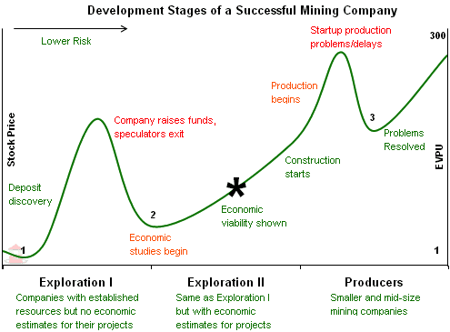

## Table of Contents

## What are mining stocks and why might someone invest in them?

Mining stocks are shares in companies that mine for metals and minerals like gold, silver, copper, and coal. These companies can be big or small and they work all over the world. When you buy a mining stock, you own a little piece of that company. The price of the stock can go up or down based on how well the company is doing and the price of the metals or minerals they mine.

People might invest in mining stocks for a few reasons. One reason is to make money. If the price of the metal or mineral goes up, the stock price might go up too, and then the investor can sell the stock for more than they paid. Another reason is to protect their money from inflation. Inflation is when prices go up over time, and the value of money goes down. Some metals, like gold, often go up in price when there is inflation, so investing in mining stocks can help keep the value of an investor's money steady.

## How do mining stocks differ from other types of stocks?

Mining stocks are different from other types of stocks because they are tied to the prices of metals and minerals. When you buy a mining stock, you are investing in a company that digs up things like gold, silver, or coal from the ground. The value of these stocks can go up or down based on how much people are willing to pay for these materials. For example, if the price of gold goes up, mining companies that produce gold might see their stock prices rise too. This is different from, say, a tech company stock, where the price might depend more on new products or how well the company is run.

Another way mining stocks differ is that they can be riskier. Mining is a tough business. It can be expensive to start a mine, and there are a lot of things that can go wrong, like accidents or problems with the environment. Also, the price of metals and minerals can change a lot, which can make the stock prices go up and down a lot too. This is different from stocks in more stable industries, like utilities or consumer goods, where the prices might not change as much. So, while mining stocks can offer big rewards if things go well, they can also lead to big losses if things go badly.

## What are the different types of minerals and metals that mining companies extract?

Mining companies dig up many different kinds of minerals and metals from the earth. Some of the most common ones are gold and silver. Gold is often used for jewelry and as a way to store value, while silver is used in things like electronics and also for jewelry. Another important metal is copper, which is used a lot in electrical wiring and building things. Iron ore is also very important because it's used to make steel, which is used in construction and making cars.

There are also other metals like zinc, which is used to protect other metals from rusting, and nickel, which is used in batteries and making stainless steel. Aluminum is another metal that's very light and used in things like airplanes and soda cans. Besides metals, mining companies also extract minerals like coal, which is used to make electricity, and potash, which is used in fertilizers to help plants grow. Each of these minerals and metals has its own uses and can affect the value of the mining companies that dig them up.

## How can a beginner start investing in mining stocks?

If you're new to investing and want to start with mining stocks, the first thing you need to do is open a brokerage account. A brokerage account is like a special bank account where you can buy and sell stocks. You can find many online brokers that let you open an account easily. Once your account is set up, you'll need to put some money into it. This money is what you'll use to buy the mining stocks.

After you have your account ready and some money in it, you can start looking for mining stocks to buy. You can do this by searching for mining companies on your broker's website or using a stock market app. It's a good idea to learn a bit about the companies you're interested in. Look at what minerals or metals they mine, how well they're doing, and what other people think about them. Once you've picked a company, you can buy their stock by telling your broker how many shares you want. Remember, investing in mining stocks can be risky, so it's smart to start small and learn as you go.

## What are the key factors to consider when evaluating a mining company's stock?

When you're thinking about buying a mining company's stock, one of the first things to look at is the price of the minerals or metals they mine. If the price of gold, silver, or copper is going up, the company's stock might go up too. But if the price of those minerals goes down, the stock could go down as well. It's also important to check how much it costs the company to mine these minerals. If it costs a lot to dig them up, the company might not make much money even if the mineral prices are high.

Another thing to consider is how well the company is run. A good mining company will have smart leaders who know how to keep costs down and make the most of their mines. You should also look at the company's financial health. This means checking if they have a lot of debt or if they're making good profits. Finally, think about where the company is mining. Some places might be risky because of political problems or strict rules about the environment. All these things can affect how well the company does and how much their stock is worth.

## What are the risks associated with investing in mining stocks?

Investing in mining stocks can be risky because the prices of metals and minerals can change a lot. If the price of gold or copper goes down, the mining company might not make as much money, and their stock price could drop too. This can happen because of things like too much supply of the metal or not enough people wanting to buy it. Also, mining is a tough business. It can cost a lot of money to start a mine and keep it running. If the company finds less metal than they expected or if it costs more to dig it up, they might lose money, and their stock price could go down.

Another risk is that mining companies often have to deal with problems in the places where they mine. Some countries might have political issues or strict rules about the environment that can make it hard for the company to work. If the government changes the rules or if there's a problem with the local people, the company might have to stop mining, which can hurt their profits and stock price. Also, mining can be dangerous, and accidents can happen. If there's a big accident, it can cost the company a lot of money and make their stock price drop. So, while mining stocks can offer big rewards, they also come with a lot of risks that investors need to think about.

## How does the global market influence mining stock prices?

The global market plays a big role in how much mining stocks are worth. When people around the world want more of a certain metal or mineral, like gold or copper, the price of that metal goes up. This can make mining companies that produce those metals more profitable, and their stock prices can go up too. On the other hand, if there's not as much demand for a metal, or if there's too much of it being produced, the price can go down. This can make it harder for mining companies to make money, and their stock prices might drop.

Also, what happens in different countries can affect mining stocks. For example, if a big country like China starts using more copper for building things, the demand for copper can go up, which can be good for mining companies that produce copper. But if there are problems in a country where a mining company operates, like political issues or new laws about the environment, it can be hard for the company to keep mining. This can hurt their profits and make their stock prices go down. So, the global market and what happens in different countries can really influence how mining stocks do.

## What role do geopolitical factors play in mining investments?

Geopolitical factors can have a big impact on mining investments. When a mining company works in a different country, the rules and politics of that place can affect how well the company does. If the government changes the laws about mining or puts new taxes on the company, it can cost more to mine the minerals. Also, if there are political problems or fighting in the country, it can be hard for the company to keep working. This can make the company lose money and cause their stock price to go down.

Another way geopolitical factors matter is through trade and international relations. If countries put up barriers to stop minerals from being sold to other places, it can lower the demand for those minerals. This can hurt the mining companies that produce them. On the other hand, if countries work together and make it easier to trade, it can help mining companies sell more and make more money. So, what happens in the world's politics can really change how good or bad an investment in mining stocks turns out to be.

## How can investors use technical analysis to make decisions about mining stocks?

Technical analysis is a way to look at stock prices and see patterns that can help you decide when to buy or sell mining stocks. It uses charts and graphs to show how the stock has moved in the past. By looking at these charts, you can see things like trends, where the stock price is going up or down over time, and support and resistance levels, which are points where the price often stops going down or up. If you see that a mining stock's price has been going up and it keeps bouncing off a certain support level, you might think it's a good time to buy because the price could keep going up.

Another part of technical analysis is looking at indicators, which are special calculations that can give you more clues about what the stock might do next. For example, the moving average is a line on the chart that shows the average price of the stock over a certain time. If the stock price goes above its moving average, it might mean the stock is starting to go up, which could be a good time to buy. On the other hand, if the stock price goes below the moving average, it might be starting to go down, and you might want to sell. By using technical analysis, you can make smarter choices about when to buy or sell mining stocks based on what the charts and indicators are telling you.

## What are some advanced strategies for managing a portfolio of mining stocks?

One advanced strategy for managing a portfolio of mining stocks is diversification. This means not putting all your money into just one or two mining companies. Instead, you can spread your money across different companies that mine different metals and minerals. This way, if the price of one metal goes down and hurts one company's stock, the other companies in your portfolio might still do well. You can also diversify by investing in mining companies that work in different countries. This can help protect your money from problems in any one place.

Another strategy is to use stop-loss orders. A stop-loss order is a way to tell your broker to sell a stock if it drops to a certain price. This can help you limit how much money you lose if a mining stock's price goes down a lot. It's also smart to keep an eye on the global market and geopolitical news. If you see that something big is happening that could affect the price of metals or the places where mining companies work, you can make changes to your portfolio before it's too late. By using these strategies, you can manage your mining stocks better and maybe make more money while keeping your risks lower.

## How do environmental, social, and governance (ESG) factors impact mining stock investments?

Environmental, social, and governance ([ESG](/wiki/esg-investing)) factors can really change how well mining stocks do. Mining can be hard on the environment because it can pollute water, destroy land, and make a lot of waste. If a mining company doesn't take care of the environment, it might get in trouble with the law and have to pay big fines. This can make the company lose money and hurt its stock price. Also, more and more people want companies to be good to the environment, so if a mining company does a good job with this, more people might want to buy its stock.

Social factors are about how a mining company treats the people who work for it and the people who live near its mines. If a company doesn't treat its workers well or doesn't help the local community, it can have problems. Workers might go on strike, or local people might protest against the mine. This can make it hard for the company to keep working and can hurt its profits. On the other hand, if a company is good to its workers and the community, it might have an easier time and make more money, which can be good for its stock price.

Governance is about how the company is run and if it's honest and fair. If a mining company has bad leaders who don't follow the rules or who don't care about the company's future, it can get into trouble. This can scare away investors and make the stock price go down. But if the company has good leaders who make smart choices and care about the company's future, it can do better and its stock price might go up. So, ESG factors are really important for anyone investing in mining stocks to think about.

## What are the future trends and technologies that could affect the mining industry and its stocks?

The mining industry is changing because of new technology and ideas about the future. One big trend is using more automation and robots in mining. This can make mining safer and cheaper because machines can do dangerous jobs that people used to do. Also, new ways of finding minerals, like using drones and satellites, can help mining companies find new places to dig. This can be good for their stocks because they might find more minerals to sell. Another trend is using renewable energy, like solar and wind power, to run mines. This can help the environment and might make people want to buy the company's stock more because they care about the earth.

Another future trend is the growing demand for certain metals, like lithium and cobalt, which are used in batteries for electric cars and other green technology. If more people start using electric cars, the demand for these metals could go up a lot, which can be good for mining companies that produce them. Their stocks might go up too. But there are also challenges. New rules about the environment and how to treat workers might make it harder and more expensive for mining companies to work. This can hurt their profits and their stock prices. So, keeping an eye on these trends and technologies can help investors make better choices about mining stocks.

## References & Further Reading

[1]: Bergstra, J., Bardenet, R., Bengio, Y., & Kégl, B. (2011). ["Algorithms for Hyper-Parameter Optimization."](https://papers.nips.cc/paper/4443-algorithms-for-hyper-parameter-optimization) Advances in Neural Information Processing Systems 24.

[2]: ["Advances in Financial Machine Learning"](https://www.amazon.com/Advances-Financial-Machine-Learning-Marcos/dp/1119482089) by Marcos Lopez de Prado

[3]: ["Evidence-Based Technical Analysis: Applying the Scientific Method and Statistical Inference to Trading Signals"](https://www.amazon.com/Evidence-Based-Technical-Analysis-Scientific-Statistical/dp/0470008741) by David Aronson

[4]: ["Machine Learning for Algorithmic Trading"](https://github.com/stefan-jansen/machine-learning-for-trading) by Stefan Jansen

[5]: ["Quantitative Trading: How to Build Your Own Algorithmic Trading Business"](https://www.amazon.com/Quantitative-Trading-Build-Algorithmic-Business/dp/1119800064) by Ernest P. Chan