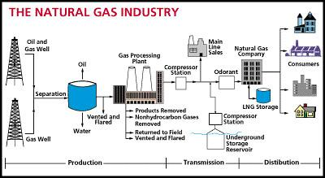

## Table of Contents

## What is natural gas?

Natural gas is a type of fuel that comes from deep under the ground. It is made up mostly of a gas called methane, but it can also have other gases mixed in. People find natural gas by drilling into the earth, often in places where there used to be a lot of plants and animals that turned into gas over millions of years.

We use natural gas for many things. It can heat our homes, cook our food, and even make electricity. It is popular because it burns cleaner than other fuels like coal or oil, which means it is better for the environment. But, it is important to use it carefully because it can be dangerous if it leaks or is not handled properly.

## How is natural gas formed?

Natural gas is formed from the remains of tiny plants and animals that lived in the ocean millions of years ago. When these tiny creatures died, they sank to the bottom of the ocean and got buried under layers of sand and mud. Over time, more and more layers piled up, and the pressure and heat from these layers turned the remains into natural gas. This process took millions of years.

The natural gas then got trapped in rocks deep under the ground. These rocks are called "reservoirs." Sometimes, the gas stays in the same place for a long time, and other times it moves around until it finds a spot where it can't go any further. When people drill into these reservoirs, they can bring the natural gas up to the surface and use it for energy.

## Where is natural gas found?

Natural gas is found deep under the ground all around the world. It is often located in places where there used to be oceans, because it comes from the remains of tiny plants and animals that lived there long ago. Countries like the United States, Russia, and Iran have a lot of natural gas. In the United States, you can find it in states like Texas, Pennsylvania, and Louisiana.

Sometimes, natural gas is found near oil because they can form in similar ways. When people look for oil, they might find natural gas too. This gas can be in big underground spaces called reservoirs. To get the gas out, people drill deep holes into the ground and use special tools to bring it up to the surface. This is how we get natural gas to use in our homes and businesses.

## What are the main uses of natural gas?

Natural gas is used in many ways. One of the biggest uses is to heat homes and buildings. When it's cold outside, people turn on their furnaces, which burn natural gas to make heat. It's also used to cook food. Many kitchens have stoves that run on natural gas because it heats up quickly and can be controlled easily.

Another important use of natural gas is to make electricity. Power plants burn natural gas to turn big machines called turbines. These turbines create electricity that goes to our homes and businesses. Natural gas is also used in factories to make things like plastics, fertilizers, and other chemicals. It's a very useful resource that helps us in many parts of our daily lives.

## How is natural gas extracted from the earth?

Natural gas is extracted from the earth by drilling deep holes into the ground. People use big machines called drilling rigs to make these holes. They drill down until they reach the underground rock layers where the gas is trapped. Once they hit the right spot, they use special tools to bring the gas up to the surface. This process can take a long time and needs a lot of careful planning.

Sometimes, the natural gas is stuck in the rock and doesn't come out easily. In those cases, people use a method called hydraulic fracturing, or "fracking," to get it out. They pump water, sand, and chemicals into the ground at high pressure. This breaks the rock and lets the gas flow out. After the gas comes up, it is cleaned and sent through pipelines to homes, businesses, and power plants where it can be used.

## What is the process of natural gas purification?

After natural gas is extracted from the ground, it needs to be cleaned before it can be used. This process is called purification. When the gas comes out of the ground, it has a lot of other things mixed in with it, like water, dirt, and other gases. The first step in purification is to remove these unwanted things. This is done by passing the gas through special equipment that separates the natural gas from the other stuff.

Once the main impurities are removed, the gas goes through more steps to make it even cleaner. One important step is to take out any leftover water, because water can cause problems in pipelines and equipment. Another step is to remove any harmful gases, like hydrogen sulfide, which can be dangerous. After all these steps, the natural gas is clean and ready to be sent through pipelines to homes, businesses, and power plants where it can be used safely and efficiently.

## How is natural gas transported and stored?

Natural gas is transported through a network of pipelines that stretch across countries and even continents. These pipelines are like big tubes that [carry](/wiki/carry-trading) the gas from where it is extracted to where it is needed. The gas is pushed through the pipelines using special stations that keep the pressure high enough to keep it moving. Sometimes, if the gas needs to go over oceans or very long distances, it is cooled down until it turns into a liquid. This liquid natural gas, or LNG, can be shipped in special tankers to places far away.

Storing natural gas can be done in a few different ways. One way is to keep it in underground storage facilities, like old oil and gas fields or salt caverns. These places can hold a lot of gas and are used to store extra gas that can be used when people need more, like during cold winters. Another way to store natural gas is as LNG. When it is turned into a liquid, it takes up much less space, so it can be kept in special tanks until it is needed. This makes it easier to store and transport natural gas to places where pipelines can't reach.

## What are the environmental impacts of using natural gas?

Using natural gas has both good and bad effects on the environment. On the good side, natural gas is cleaner than other fossil fuels like coal and oil. When it burns, it makes less pollution and fewer harmful gases that can make the air dirty and cause health problems. It also makes less carbon dioxide, which is a gas that can make the earth warmer. So, using natural gas instead of other fuels can help slow down climate change.

But there are also some bad effects to think about. When people drill for natural gas, it can harm the land and water. Sometimes, chemicals used in drilling can leak into the ground and make the water dirty. Also, if natural gas leaks out before it is burned, it can go into the air and make the earth warmer even more than carbon dioxide. So, while natural gas is cleaner than some other fuels, it is still important to use it carefully and find ways to make it even better for the environment.

## How does natural gas compare to other fossil fuels in terms of efficiency and emissions?

Natural gas is often more efficient than other fossil fuels like coal and oil. When you burn natural gas to make electricity, you can get more energy out of it than you can from the same amount of coal or oil. This means that power plants that use natural gas can make electricity more easily and with less waste. Also, natural gas can be turned on and off quickly, which makes it good for times when people need more electricity fast.

When it comes to emissions, natural gas is cleaner than coal and oil. When you burn natural gas, it makes less pollution and fewer harmful gases that can make the air dirty and cause health problems. It also makes less carbon dioxide, which is a gas that can make the earth warmer. But, natural gas is not perfect. If it leaks out before it is burned, it can go into the air and make the earth warmer even more than carbon dioxide. So, while natural gas is better than coal and oil for the environment, it is still important to use it carefully and find ways to make it even better.

## What are the current technologies for natural gas exploration and production?

People use many new technologies to find and get natural gas out of the ground. One important technology is called seismic imaging. This is when people use sound waves to look deep into the earth. They send sound waves down and listen to the echoes that come back. By studying these echoes, they can see where the natural gas might be hiding. Another technology is called horizontal drilling. This lets people drill down and then go sideways to reach more gas. It's like digging a tunnel that goes in different directions to find more gas.

Once the gas is found, people use other technologies to get it out. One common method is hydraulic fracturing, or "fracking." This is when people pump water, sand, and chemicals into the ground at high pressure. This breaks the rock and lets the gas flow out. Another technology is called enhanced recovery. This is when people use different methods to get more gas out of the ground after the easy-to-reach gas is gone. They might use more water, heat, or even other gases to push the natural gas out. These technologies help people find and use natural gas more efficiently.

## What role does natural gas play in the global energy market?

Natural gas is a big part of the global energy market. It is used all over the world to make electricity, heat homes, and cook food. Many countries, like the United States, Russia, and Iran, have a lot of natural gas and they sell it to other countries. This makes natural gas a very important resource in the world's energy supply. People like using natural gas because it is cleaner than other fuels like coal and oil, so it helps make the air less dirty and slows down climate change.

Even though natural gas is cleaner, it is still a fossil fuel, and people are trying to find other ways to make energy that are even better for the environment. But right now, natural gas is still very important. It helps countries meet their energy needs and keeps the lights on and homes warm. As new technologies are developed, natural gas might be used in new ways or be replaced by other energy sources. But for now, it plays a big role in keeping the world running.

## What are the future prospects and challenges for natural gas as an energy source?

Natural gas is likely to stay important in the future because it is cleaner than other fossil fuels like coal and oil. Many countries are using more natural gas to make electricity and heat homes because it makes less pollution. New technologies like fracking and better ways to find gas underground are helping people get more natural gas out of the ground. This means there could be more natural gas available in the future. Also, natural gas can be turned into a liquid and shipped around the world, which makes it easier to use in places that don't have their own gas.

But there are also challenges with using natural gas. One big challenge is that it is still a fossil fuel, and burning it makes carbon dioxide, which can make the earth warmer. People are trying to find ways to use less fossil fuels and more renewable energy like wind and solar power. Another challenge is that getting natural gas out of the ground can harm the environment. Drilling and fracking can make the water dirty and cause other problems. So, while natural gas is helpful now, people need to find ways to use it more safely and think about using other energy sources in the future.

## References & Further Reading

[1]: ["Advances in Financial Machine Learning"](https://www.amazon.com/Advances-Financial-Machine-Learning-Marcos/dp/1119482089) by Marcos Lopez de Prado

[2]: ["Evidence-Based Technical Analysis: Applying the Scientific Method and Statistical Inference to Trading Signals"](https://www.amazon.com/Evidence-Based-Technical-Analysis-Scientific-Statistical/dp/0470008741) by David Aronson

[3]: ["Machine Learning for Algorithmic Trading"](https://github.com/stefan-jansen/machine-learning-for-trading) by Stefan Jansen

[4]: ["Quantitative Trading: How to Build Your Own Algorithmic Trading Business"](https://www.amazon.com/Quantitative-Trading-Build-Algorithmic-Business/dp/1119800064) by Ernest P. Chan

[5]: International Energy Agency. (2020). ["Switching from Coal to Gas Reduces Energy-Related CO2 Emissions."](https://www.iea.org/reports/world-energy-outlook-2020) 

[6]: U.S. Energy Information Administration. (2021). ["Natural Gas Explained."](https://www.eia.gov/energyexplained/natural-gas/) 

[7]: Geman, H. (2005). ["Commodities and Commodity Derivatives: Modeling and Pricing for Agriculturals, Metals and Energy."](https://download.e-bookshelf.de/download/0000/5675/90/L-G-0000567590-0015270354.pdf) John Wiley & Sons.