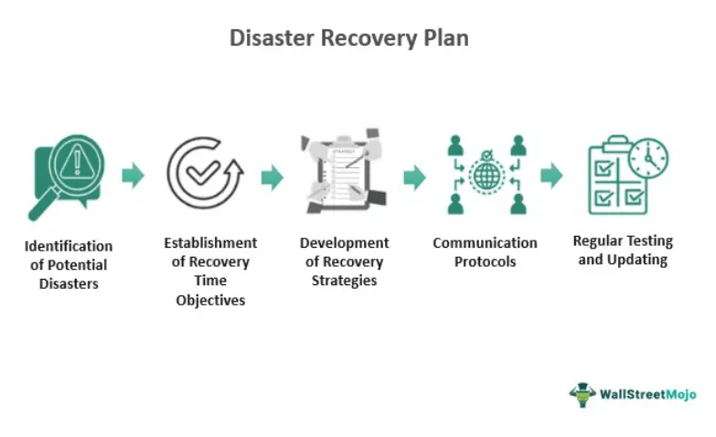

Natural gas, a fossil fuel recognized for its relatively cleaner-burning characteristics compared to coal and oil, plays a vital role in the global energy economy. As a versatile energy source, it is integral to electricity generation, industrial applications, and domestic heating, supporting a myriad of services that drive modern life. The advantages of natural gas include its abundance, efficiency, and lower emissions profile, which make it an attractive option in the transition toward more sustainable energy systems.

In recent years, the natural gas market has experienced a significant transformation driven by the advent of algorithmic trading. This technological advancement has equipped traders with sophisticated tools to handle the complexities of a volatile market, optimize price discovery, and enhance trading efficiency. Algorithmic trading systems utilize high-frequency trading and advanced algorithms to process vast amounts of data rapidly, offering traders the capability to respond to market signals with increased precision and speed.



The intricate relationship between natural gas as a critical energy resource and its status within the fossil fuel sector underscores the importance of understanding the implications of algorithmic trading in this market. As such, this article aims to provide insights into its role as an energy resource, the dynamics of its market interactions, and the transformative impact that algorithmic trading continues to have on natural gas pricing and market behaviors. These elements collectively highlight the evolving nature of the natural gas market and the strategic considerations for investors and policymakers aiming to harness its potential within a balanced energy portfolio.

## Table of Contents

## Understanding Natural Gas as an Energy Resource

Natural gas serves as a critical and versatile energy resource in modern society, primarily utilized for heating, electricity generation, and as a feedstock in various industrial processes. Its intrinsic properties make it an attractive option compared to other fossil fuels. Natural gas is predominantly composed of methane (CH₄), though it may contain other hydrocarbons, which combust with comparatively lower emissions of carbon dioxide (CO₂), nitrogen oxides (NOₓ), sulfur oxides (SOₓ), and particulate matter. This makes natural gas one of the cleaner-burning fossil fuels, contributing to its reputation as an environmentally preferable choice.

The dynamics of the energy market significantly influence natural gas utilization. These dynamics are shaped by several factors, including supply chain efficiency, geopolitical stability, and technological advancements. Supply chain efficiency encompasses the processes of extraction, transportation, and distribution. Improvements in technologies such as hydraulic fracturing and horizontal drilling have enhanced extraction efficiency, making previously inaccessible reserves viable and thus influencing supply stability and pricing.

Geopolitical stability also plays a crucial role in the availability and pricing of natural gas. Countries rich in natural gas reserves often use this resource as leverage in geopolitical negotiations, impacting global supply chains. For instance, disruptions in regions with significant natural gas production can lead to supply shortages and increased prices worldwide.

Technological advancements continue to transform the natural gas industry. Innovations in liquefied natural gas (LNG) technology have expanded global markets by enabling the overseas transportation of natural gas, which was formerly constrained by the limitations of pipeline infrastructure. Additionally, smart grid technologies and improved storage solutions contribute to more efficient energy distribution and usage.

In comparison to other fossil fuels such as coal and oil, natural gas's lower carbon footprint enhances its role in energy transition strategies aiming for sustainability. According to the U.S. Energy Information Administration, natural gas combustion emits about 50% less CO₂ than coal for each unit of energy produced, fostering its appeal as a bridging fuel to future renewable energy sources.

Overall, the strategic value of natural gas in contemporary energy markets is underscored by its environmental benefits, efficiency enhancements, and the broader global push towards cleaner energy solutions. As a critical juncture in the transition towards less carbon-intensive energy sources, natural gas continues to play a pivotal role.

## The Role of Natural Gas in Fossil Fuel Markets

Natural gas is increasingly recognized as a pivotal transitional energy source, aiding the shift from high-emission fossil fuels such as coal and oil to cleaner, renewable energy alternatives. Its comparatively lower carbon dioxide emissions make it a preferred choice in efforts to achieve more sustainable energy systems. This transitional role is supported by natural gas's ability to complement intermittent renewable sources like wind and solar power, providing a more stable energy supply.

The competitive dynamics between natural gas, coal, and oil significantly influence its pricing and market demand. Natural gas often competes with coal in electricity generation due to its efficiency and environmental advantages. According to the International Energy Agency (IEA), switching from coal to natural gas can cut emissions by up to 50% for electricity generation (International Energy Agency, 2020). This competition is further intensified by regulatory policies aimed at reducing greenhouse gas emissions, which can lead to increased natural gas demand as a cleaner substitute.

Additionally, oil and natural gas often share overlapping applications in residential heating and industrial processes, impacting each other's market positioning. As global markets shift towards decarbonization, natural gas is strategically positioned due to its lower emissions and cost-effectiveness.

For investors and policymakers, understanding natural gas's place within the larger fossil fuel framework is essential for crafting sustainable energy strategies. Regulatory incentives, carbon pricing, and advances in carbon capture and storage technologies all play critical roles in shaping natural gas's future. These factors not only determine its market positioning relative to other fossil fuels but also its integration with renewable energy systems.

As countries around the world prioritize energy security and climate goals, natural gas is likely to remain a significant player in energy portfolios. The balancing act between its role as a bridge fuel and the ongoing expansion of renewable energy infrastructure will determine its long-term utilization and market behavior.

## Algorithmic Trading in Natural Gas Markets

Algorithmic trading, frequently referred to as algo trading, utilizes sophisticated automated systems to execute trades with remarkable speed and precision. In natural gas markets, the adoption of [algorithmic trading](/wiki/algorithmic-trading) has streamlined the handling of extensive data volumes, facilitated the prediction of price movements, and allowed for the exploitation of market inefficiencies. The deployment of algos enables traders to process and analyze data that would be cumbersome and time-consuming to evaluate manually, thus optimizing decision-making processes.

Traders in natural gas markets leverage both technical and [fundamental analysis](/wiki/fundamental-analysis) through algorithms. Technical analysis involves the use of statistical indicators derived from historical price and [volume](/wiki/volume-trading-strategy) data to predict future market patterns. Fundamental analysis, on the other hand, assesses variables like supply-demand dynamics, geopolitical factors, and economic indicators that can influence natural gas prices.

Here is a simplified example of a basic algorithmic trading strategy in Python that might be used in such contexts:

```python
import numpy as np
import pandas as pd

# Load historical price data for natural gas
price_data = pd.read_csv('natural_gas_prices.csv')

# Simple Moving Average (SMA) strategy
window_short = 20
window_long = 50

# Calculate short and long moving averages
price_data['SMA_Short'] = price_data['Close'].rolling(window=window_short).mean()
price_data['SMA_Long'] = price_data['Close'].rolling(window=window_long).mean()

# Generate trading signals
price_data['Signal'] = np.where(price_data['SMA_Short'] > price_data['SMA_Long'], 1, 0)

# Create positions
price_data['Position'] = price_data['Signal'].diff()

# Output the DataFrame with signals and positions
print(price_data.tail())
```

This Python script demonstrates a basic moving average crossover strategy. Such strategies are foundational in algorithmic trading, where short-term and long-term moving averages are used to generate buy and sell signals depending on their crossovers.

Furthermore, algo trading systems in natural gas markets can be designed to react to real-time news feeds, leverage advanced [machine learning](/wiki/machine-learning) algorithms to predict future price changes, or apply quantitative models that incorporate macroeconomic data. For instance, machine learning models can be used to predict natural gas demand patterns by analyzing datasets containing weather forecasts, industrial usage [statistics](/wiki/bayesian-statistics), and economic growth indicators.

The versatility and adaptability of algorithmic trading systems enable traders to formulate strategies that respond dynamically to ever-changing market conditions. By automating analysis and decision-making, these systems enhance the trader's ability to capitalize on fleeting opportunities, minimizing latency and maximizing the execution efficiency of trades.

## Impact of Algo Trading on Natural Gas Pricing and Market Behavior

Algorithmic trading, commonly known as algo trading, has significantly altered the landscape of natural gas markets by introducing increased [liquidity](/wiki/liquidity-risk-premium) and [volatility](/wiki/volatility-trading-strategies). This trading method employs computer-generated algorithms to execute trades that are based on pre-defined criteria, allowing for rapid execution and precision. In doing so, algorithmic trading has enabled market participants to react swiftly to price fluctuations and exploit [arbitrage](/wiki/arbitrage) opportunities across different market venues.

While the automation and speed intrinsic to algo trading facilitate enhanced market participation and the narrowing of bid-ask spreads, they can also amplify price swings. The rapid execution of large volumes of trades can lead to abrupt movements in natural gas prices, especially in situations where market sentiment shifts rapidly or unexpected news impacts the market. This heightened volatility, although sometimes advantageous for traders capitalizing on short-term price movements, has implications for market stability.

A key concern associated with algo trading is the potential for reduced market transparency and increased susceptibility to market manipulation. Algorithms, particularly those used in high-frequency trading ([HFT](/wiki/high-frequency-trading-strategies)), can execute thousands of trades in fractions of a second, making it challenging to pinpoint the underlying reasons for specific price changes or trading patterns. This opacity can lead to situations where market behavior is manipulated by sophisticated algorithms designed to exploit lesser-known market inefficiencies.

In response to these challenges, regulatory bodies have intensified their scrutiny of algo trading activities to preserve market integrity and stability. For instance, trading practices that are deemed manipulative, such as spoofing—where orders are placed with the intent of canceling them before execution—are under regulatory watch. Revisions to trading rules and the imposition of penalties for unethical trading practices are steps being taken to mitigate potential risks associated with algorithmic trading.

The regulatory focus is not solely on punitive measures but also on ensuring that markets remain fair and accessible to all participants. Market regulators are working towards improving market transparency by enhancing surveillance mechanisms that can better monitor and analyze trading data for signs of manipulation or unethical practices. Efforts also include promoting best practices in the development and deployment of trading algorithms to ensure they adhere to the principles of market fairness.

In conclusion, while algorithmic trading offers considerable advantages in trading efficiency and price discovery, it also poses challenges to market behavior and regulatory frameworks. The evolving nature of trading technologies necessitates a dynamic approach to regulation, with an emphasis on maintaining fair and stable trading environments in natural gas markets.

## Advantages and Challenges of Algo Trading in Natural Gas

Algorithmic trading, commonly referred to as algo trading, has become an integral aspect of the natural gas markets, offering a multitude of advantages coupled with notable challenges. By leveraging advanced computational techniques and data analytics, traders and investors can navigate complex market scenarios with enhanced precision.

**Advantages**

One of the primary advantages is increased trading efficiency. Automated systems allow for rapid execution of trades, minimizing human error and reducing the time lag between decision-making and execution. This capability is crucial in natural gas markets where prices can be highly volatile. Algorithms can swiftly analyze market data, identify trends, and execute trades, thereby capitalizing on fleeting market opportunities.

Improved risk management is another significant advantage. Real-time analytics enable the continuous monitoring of market conditions and portfolio performance. By quickly adapting to changing market dynamics, traders can mitigate risks more effectively. For instance, algorithms can set stop-loss orders and automate hedging strategies to protect against adverse price movements.

Additionally, algo trading facilitates the [backtesting](/wiki/backtesting) of strategies. Traders can simulate their trading strategies against historical data to evaluate their effectiveness before deploying them in live markets. This process helps in refining strategies and optimizing them for better performance.

**Challenges**

Despite its benefits, algo trading in natural gas markets poses several challenges. The development and maintenance of sophisticated algorithms require substantial expertise in programming, mathematics, and market dynamics. Creating robust algorithms necessitates a comprehensive understanding of both the natural gas market's intricacies and the broader economic variables influencing it.

Cybersecurity threats represent a significant challenge. As trading systems become more reliant on technology, they become susceptible to cyberattacks, posing risks to financial assets and market integrity. Ensuring robust cybersecurity measures is crucial to protect sensitive data and avert potential disruptions.

Another critical challenge is the risk associated with algorithmic errors. Programming mistakes or unanticipated market conditions can lead to significant financial losses. For example, an erroneous algorithm could initiate large-scale trades based on faulty logic or outdated data, exacerbating market instability. Consequently, rigorous testing and validation of algorithms are necessary to minimize such risks.

In summary, while algorithmic trading provides substantial efficiencies and risk management advantages in natural gas markets, it also necessitates careful consideration of potential vulnerabilities. Traders and firms must balance leveraging advanced technologies with strategies to address the inherent challenges associated with algo trading.

## Future Trends in Natural Gas Trading and Algo Trading

As technology continues to progress, natural gas trading platforms are poised to incorporate enhanced data analytics and machine learning capabilities to optimize trading strategies. These advancements promise to transform trading decisions by processing vast amounts of data more efficiently and generating insights that were previously unattainable. Machine learning, in particular, offers the ability to identify patterns and trends in market data that can inform more accurate predictions of price movements and demand fluctuations.

The shift towards greener energy sources, driven by environmental concerns and regulatory pressures, is anticipated to influence the natural gas market significantly. As the world transitions to renewable energy, natural gas—often seen as a bridge fuel—faces new challenges and opportunities. Algorithmic trading strategies could adapt to these shifts by incorporating factors related to environmental regulations, carbon pricing, and changes in consumer preferences towards cleaner energy solutions. This integration might involve considering the environmental impact of natural gas extraction and consumption patterns in market analyses.

For traders aiming to capitalize on these emerging opportunities, staying abreast of technological and market paradigm shifts is crucial. This requires an adaptive approach, embracing continuous learning and leveraging the latest technological tools to gain a competitive edge. With natural gas playing a pivotal role in a transitioning energy landscape, those who effectively harness advanced data analytics and machine learning can potentially drive more strategic decisions in a rapidly evolving market.

## Conclusion

Natural gas continues to be an essential element of the global energy infrastructure. As technology progresses, the methodologies and tools associated with natural gas trading are expected to continuously advance. Algorithmic trading, in particular, contributes significantly to the efficiency and speed of trades, enabling the processing of vast datasets and the rapid adaptation to market conditions. This techno-financial innovation, while offering tremendous advantages like enhanced market liquidity and improved risk management, also requires careful monitoring to prevent possible risks related to market integrity.

Effective navigation of the natural gas market's complexities hinges on the trader's ability to remain adaptable and well-informed. The dynamic interplay of natural gas pricing, market demands, geopolitical factors, and technical advancements requires traders to maintain a proactive stance. As the energy landscape shifts toward greener alternatives, staying abreast of current trends and leveraging technological advancements in trading will position traders and investors to capitalize on opportunities while mitigating potential challenges. Such vigilance is necessary to sustain both the profitability and the stability of investments in this evolving market.

## References & Further Reading

[1]: ["Advances in Financial Machine Learning"](https://www.amazon.com/Advances-Financial-Machine-Learning-Marcos/dp/1119482089) by Marcos Lopez de Prado

[2]: ["Evidence-Based Technical Analysis: Applying the Scientific Method and Statistical Inference to Trading Signals"](https://www.amazon.com/Evidence-Based-Technical-Analysis-Scientific-Statistical/dp/0470008741) by David Aronson

[3]: ["Machine Learning for Algorithmic Trading"](https://github.com/stefan-jansen/machine-learning-for-trading) by Stefan Jansen

[4]: ["Quantitative Trading: How to Build Your Own Algorithmic Trading Business"](https://www.amazon.com/Quantitative-Trading-Build-Algorithmic-Business/dp/1119800064) by Ernest P. Chan

[5]: International Energy Agency. (2020). ["Switching from Coal to Gas Reduces Energy-Related CO2 Emissions."](https://www.iea.org/reports/world-energy-outlook-2020) 

[6]: U.S. Energy Information Administration. (2021). ["Natural Gas Explained."](https://www.eia.gov/energyexplained/natural-gas/) 

[7]: Geman, H. (2005). ["Commodities and Commodity Derivatives: Modeling and Pricing for Agriculturals, Metals and Energy."](https://download.e-bookshelf.de/download/0000/5675/90/L-G-0000567590-0015270354.pdf) John Wiley & Sons.