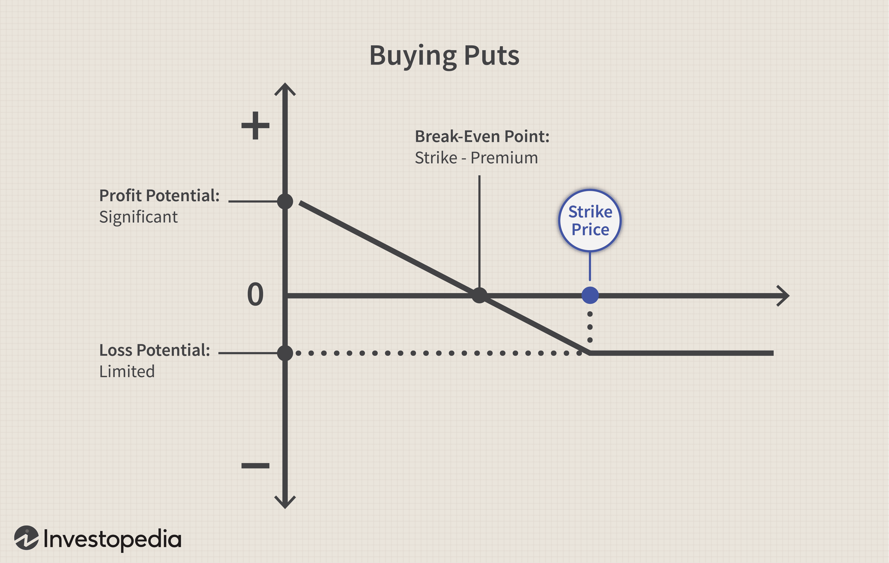

In the ever-evolving landscape of finance, investment strategies have advanced beyond traditional methods. Options trading, financial derivatives, and algorithmic trading are pivotal areas that have transformed the way investors manage their portfolios. This article aims to explore these sophisticated investment strategies, providing insights into their workings and potential benefits.

Options trading and derivatives offer a versatile mechanism to manage risk and optimize investment returns. Options, by granting the right but not the obligation to buy or sell assets, allow investors to tailor their exposure to market conditions and potential volatility. Similarly, derivatives, as financial instruments whose value is linked to underlying assets, enable sophisticated hedging strategies to safeguard against price fluctuations in various markets.



Algorithmic trading serves to introduce a new level of efficiency and precision by employing complex algorithms to execute trades at high speed. This innovative approach minimizes human error and emotional bias, fostering a more systematic method of trading. It leverages quantitative models and computational power to analyze market data, identify trends, and execute trades with speed and accuracy unparalleled by traditional trading methods.

With a clear understanding of these strategies, investors can make informed decisions to optimize their portfolios for better risk-adjusted returns. The integration of options trading, derivatives, and algorithmic trading strategies enhances the capacity to construct robust financial solutions. As technology continues to drive advancements in trading systems, these strategies intersect to create new opportunities for both institutional and retail investors.

## Table of Contents

## Understanding Financial Derivatives

Financial derivatives are financial instruments that derive their value from underlying assets, such as stocks, bonds, currencies, interest rates, or market indices. These instruments are pivotal in the modern financial landscape for risk management, speculation, arbitrage, and enhancing liquidity. The primary types of derivatives include futures, options, and swaps, each catering to different investment goals and strategies.

Futures contracts are standardized agreements to buy or sell an asset at a predetermined price at a specified date in the future. These contracts are commonly utilized in commodities markets to hedge against price fluctuations. For example, a farmer might use futures to lock in the sale price for their crop months before the actual harvest. This ensures the farmer receives a guaranteed price, protecting against the risk of market price decline.

Options grant the holder the right, but not the obligation, to buy or sell an underlying asset at a specified price within a set period. The two fundamental types of options are call options, which allow the purchase of an asset, and put options, which provide the right to sell it. These instruments offer significant flexibility in hedging and investment strategies, as they enable investors to benefit from anticipated price movements without the compulsion to complete the transaction.

Swaps entail the exchange of cash flows between two parties, commonly based on differing financial instruments. The most prevalent swaps are [interest rate](/wiki/interest-rate-trading-strategies) swaps, where parties exchange fixed interest rate payments for floating rate payments. These are primarily used for managing exposure to fluctuations in interest rates, optimizing the cost of funds, or achieving desired financial structures.

It is essential to recognize that, while derivatives offer significant opportunities for managing risks and enhancing returns, they also entail complex risks themselves. Market, counterparty, and pricing risks are inherent in derivatives due to their leveraged nature and dependency on the underlying asset's value fluctuations. Consequently, accurate valuation and prudent risk management are critical elements in the effective utilization of financial derivatives.

## Options Strategies in Investment

Options strategies provide investors with the ability to engage the market in various sophisticated ways, offering potential returns and risk management tailored to specific expectations and market conditions. These strategies enable speculating on market directions, hedging risks, or generating income, thus providing a flexible approach to portfolio management.

One common options strategy is the **covered call**, which involves owning the underlying stock and simultaneously selling a call option on the same asset. This strategy aims to generate additional income from the option premium received, which can help offset potential declines in the stock's price. However, if the stock's price surpasses the option's strike price, the upside potential is capped since the stock may be called away.

Another popular strategy is the **straddle**, which capitalizes on price [volatility](/wiki/volatility-trading-strategies). By purchasing both a call and a put option with the same strike price and expiration date, investors position themselves to benefit from significant price movements in either direction. This strategy is particularly useful when anticipating high volatility but uncertain direction, allowing profit from large swings in the underlying asset's price.

For environments characterized by lower volatility, the **iron condor** strategy is frequently employed. This involves creating a combination of call and put credit spreads at different strike prices but with the same expiration date. An iron condor profits when the stock price remains within a predetermined range, thus capitalizing on the premiums collected while limiting both upside and downside risk through the offsets created by the spreads.

Effective options strategies require careful tailoring to align with prevailing market conditions. By selecting strategies that match their market outlook, investors can enhance portfolio performance. For example, in bullish markets, writing puts may offer advantages; conversely, call spreads could be advantageous when anticipating modest upward movements.

These techniques leverage the flexibility of options, allowing investors to customize exposure, hedge against uncertainties, and seek various income opportunities. Understanding and applying these strategies can yield significant benefits in structured portfolio management.

## Algorithmic Trading: Revolutionizing Investment Approaches

Algorithmic trading utilizes computer algorithms to execute trades based on predefined parameters. These algorithms can process vast amounts of data rapidly and make trades at speeds impossible for human traders, thereby enhancing efficiency. This method of trading effectively minimizes human error, sidesteps emotional decision-making biases, and leverages computational power to capitalize on market opportunities.

Various strategies exist within [algorithmic trading](/wiki/algorithmic-trading), each designed to exploit specific market dynamics. Arbitrage, for example, seeks to profit from price discrepancies across different markets or exchanges, often requiring swift execution to be successful before the discrepancy disappears. A simple example of an [arbitrage](/wiki/arbitrage) strategy can be implemented in Python:

```python
def arbitrage_opportunity(price_a, price_b, transaction_cost):
    if price_a < price_b - transaction_cost:
        return "Buy at market A and sell at market B"
    elif price_b < price_a - transaction_cost:
        return "Buy at market B and sell at market A"
    else:
        return "No arbitrage opportunity"

print(arbitrage_opportunity(100, 105, 2))
```

Other popular strategies include [trend following](/wiki/trend-following), where algorithms identify and exploit upward or downward trends in asset prices, and mean reversion, which assumes that asset prices will revert to their historical mean over time. These strategies are data-driven, relying on the analysis of historical price data, [volume](/wiki/volume-trading-strategy), and other indices to forecast future movements.

Algorithmic trading significantly impacts market [liquidity](/wiki/liquidity-risk-premium) and volatility. By facilitating a high volume of trades, it enhances liquidity, which often stabilizes prices but can also increase short-term volatility, especially when many algos react to market events simultaneously.

One of the major advantages for investors using algorithmic trading is the reduction in transaction costs. High-frequency trades executed with precision lower the costs associated with human-driven trading, such as errors or delayed decisions. Furthermore, the precision and speed of algorithmic trading allow for optimized order execution, capturing favorable prices efficiently.

The evolution of algorithmic trading has transformed traditional trading paradigms, making high-speed, data-intensive strategies accessible to a broader range of market participants. This transformation underscores the need for continuous innovation and adaptation in financial markets to leverage these technological advancements fully.

## Integrating Derivatives, Options, and Algo Trading

The integration of derivatives, options, and algorithmic trading has opened new vistas for sophisticated investment strategies, allowing for greater dynamism and precision in portfolio management. Institutional investors, leveraging advancements in technology, often employ strategies such as delta-hedging to manage their exposure dynamically. Delta-hedging involves adjusting the positions in options and derivatives to ensure that the portfolio remains balanced with respect to the underlying asset price movements. This is achieved by maintaining the portfolio's delta—an options Greek symbolizing the sensitivity of an option's price to changes in the underlying asset's price—at a target level, typically zero. The following Python code snippet illustrates a basic way to calculate and adjust a portfolio’s delta:

```python
# Assume we have a portfolio of call options and their deltas
call_options = [{'delta': 0.5, 'quantity': 100},
                {'delta': 0.6, 'quantity': 50}]

# Calculate the total portfolio delta
portfolio_delta = sum([option['delta'] * option['quantity'] for option in call_options])

# Calculate required position for perfect delta hedging
# In this case, assume hedging with the underlying asset
underlying_position = -portfolio_delta

print("Total Portfolio Delta:", portfolio_delta)
print("Position in Underlying for Hedging:", underlying_position)
```

Retail investors are increasingly gaining access to complex trading platforms that were once the exclusive domain of institutional investors, thus democratizing the deployment of advanced trading strategies. These platforms often incorporate user-friendly interfaces and algorithmic capabilities that enable individual investors to execute complex trades with similar sophistication to institutional participants.

Technological advancements have facilitated the seamless execution and management of these intricate financial strategies. High-frequency trading ([HFT](/wiki/high-frequency-trading-strategies)) and electronic communication networks (ECNs) provide critical infrastructure for instant trade execution. Additionally, advanced analytics and real-time data processing allow investors to make informed decisions based on the latest market developments.

However, alongside these advantages, there are inherent risks that require careful management. The precision with which strategy models must operate leaves them susceptible to inaccuracies, while unexpected market volatility can exacerbate potential losses. Models may be based on historical data, leading to potential failures when market dynamics shift. Therefore, effective risk management practices such as stress testing, scenario analysis, and continuous model evaluation are crucial to counteract these risks.

The integration of these trading components reflects a broader evolution in financial markets, emphasizing the need for investors to remain vigilant and adaptable in rapidly changing environments.

## Risks and Challenges in Derivatives and Algo Trading

The use of financial derivatives and algorithmic trading strategies introduces considerable risks alongside their potential for high returns. One core challenge associated with derivatives is their inherent complexity, which results in several types of risks.

Derivatives [carry](/wiki/carry-trading) significant market risk due to their sensitivity to changes in the prices of their underlying assets. The leverage embedded in derivatives can amplify both gains and losses, thus exposing investors to substantial financial damage if market movements are unfavorable. Counterparty risk is another significant concern, arising from the possibility that one party involved in the derivative transaction may default. This risk is particularly pertinent in over-the-counter (OTC) derivatives markets, where transactions are not centralized.

Pricing risk is also evident due to the sophisticated models required to value derivatives accurately. Mispricing can occur due to incorrect assumptions or data input errors, leading to erroneous valuations and potential financial losses.

Algorithmic trading, while enhancing efficiency and precision, introduces its own set of risks primarily due to technological and operational factors. Technical malfunctions, such as system outages or network connectivity issues, can disrupt trading activities and result in missed opportunities or erroneous trades. Algorithm errors, often stemming from flawed logic or incorrect parameter settings, can execute large volumes of trades, leading to substantial losses before they are detected and corrected.

The regulatory landscape, shaped by frameworks like the Dodd-Frank Act in the United States and the Markets in Financial Instruments Directive (MiFID II) in the European Union, imposes strict transparency and risk management requirements. These regulations mandate firms to adhere to robust risk management practices, including maintaining adequate capital reserves and ensuring the traceability of algorithmic decisions.

To effectively manage these risks, comprehensive risk management strategies must be employed. Diversification remains a fundamental tactic, spreading exposures across various instruments and asset classes to mitigate market-specific risks. Stress testing, through scenario analysis and simulation, assesses potential vulnerabilities and prepares firms for adverse conditions.

Compliance with regulatory requirements is non-negotiable, necessitating continuous monitoring and updating of systems and processes to align with evolving legal standards. Furthermore, adopting advanced risk management technologies can bolster firms' ability to detect and respond to emerging threats promptly. By integrating these measures, investors and firms can navigate the complexities of derivatives and algorithmic trading more securely and sustainably.

## Future Trends and Developments

The landscape of financial trading is constantly evolving, particularly with the advancements in technology and data analytics. A significant emerging trend is the integration of Artificial Intelligence (AI) and Machine Learning (ML) to enhance algorithmic trading and financial analytics. AI algorithms can process vast amounts of data far beyond human capabilities, leading to more accurate predictions and the ability to identify patterns that are not immediately obvious. Machine learning models, in particular, can adapt to new data inputs over time, continuously improving their precision and effectiveness in decision-making processes.

Regulatory frameworks continue to adapt to accommodate these technological advancements, impacting transparency and market operations. As regulators seek to mitigate risks associated with high-frequency trading and algorithmic decisions, standards like the European Union's Markets in Financial Instruments Directive II (MiFID II) impose stricter reporting and monitoring requirements. These regulations aim to ensure fair trading practices and protect market integrity, requiring firms to adapt by investing in compliance technologies and methodologies.

Investors are increasingly becoming more tech-savvy, leveraging sophisticated tools and platforms to develop and execute strategies. This trend is driven in part by the democratic nature of technology, which now allows retail investors access to complex trading instruments and platforms previously reserved for institutional investors. Online platforms equipped with user-friendly interfaces, advanced analytics, and real-time data analytics empower investors to make informed and timely decisions.

Machine learning and data science have the potential to transform trading efficiency and accuracy significantly. For example, algorithms can predict price movements by analyzing historical data and market trends, adjusting strategies dynamically to optimize returns. Here's a simple example of a Python script that uses [machine learning](/wiki/machine-learning) to predict stock prices:

```python
import numpy as np
import pandas as pd
from sklearn.model_selection import train_test_split
from sklearn.ensemble import RandomForestRegressor
from sklearn.metrics import mean_absolute_error

# Load historical stock data
data = pd.read_csv('historical_stock_data.csv')
features = data.drop('Stock Price', axis=1)
targets = data['Stock Price']

# Split the data into training and testing sets
X_train, X_test, y_train, y_test = train_test_split(features, targets, test_size=0.2, random_state=42)

# Initialize and fit the RandomForest model
model = RandomForestRegressor(n_estimators=100, random_state=42)
model.fit(X_train, y_train)

# Predict on the test set
predictions = model.predict(X_test)

# Evaluate the model
print(f'Mean Absolute Error: {mean_absolute_error(y_test, predictions)}')
```

The ongoing development of trading technologies ensures that market strategies and investor engagement will continue to evolve. The proliferation of robust computational tools and platforms is paralleled by advancements in network capabilities, such as 5G and beyond, which facilitate faster data transmission and processing. These innovations promise heightened efficiency and refined engagement for stakeholders across the financial ecosystem, fostering an environment of continual evolution and innovation. As these trends coalesce with automation and data-driven decision-making, the future of trading strategies will be shaped by technology-driven solutions, enhancing the potential for returns while managing risks effectively.

## Conclusion

Financial derivatives, options strategies, and algorithmic trading synergize to enhance investment potential significantly. Individually, these components address different facets of investment management—risk mitigation, market prediction, and trade execution efficiency. Together, they create sophisticated financial solutions capable of optimizing both risk management and return.

Derivatives, with their inherent capability to hedge against potential market downturns or to leverage positions, provide investors with versatile tools for managing risk and capitalizing on market movements. Options strategies offer flexibility; they allow investors to structure trades that align precisely with market predictions and risk appetite. For instance, strategies such as protective puts and covered calls enable investors to hedge and generate additional income concurrently.

Algorithmic trading elevates the efficiency of these strategies by removing emotional biases and executing trades based on data-driven insights. Algorithms embedded with complex mathematical models can react to market changes in microseconds, exploiting arbitrage opportunities and following trends with precision that human traders cannot achieve.

Modern investors must comprehend the complexities of these strategies and their interconnections to harness their full potential. A thorough understanding aids in identifying optimal entry and [exit](/wiki/exit-strategy) points and in constructing diversified portfolios that withstand market volatility. Adaptability in this context means staying updated with regulatory changes, such as those introduced by Dodd-Frank or MiFID II, which aim to increase transparency and reduce systemic risk.

Regulatory and technological evolution requires investors to continuously learn and refine their approach. New advancements like AI and machine learning further enhance the analytical capabilities of algorithms, potentially revolutionizing investment strategies.

In conclusion, a thoughtful application of financial derivatives, options strategies, and algorithmic trading can provide investors with a robust framework for navigating the complexities of modern financial markets. By integrating these elements effectively, investors can strategically position themselves to capitalize on opportunities while mitigating potential risks, thus achieving a competitive advantage in the dynamic landscape of investment.

## References & Further Reading

For a detailed understanding of financial derivatives and options strategies, "Options, Futures, and Other Derivatives" by J.C. Hull is an essential resource. This book offers a comprehensive look at various derivative instruments and the strategic implementation of options in investment portfolios. 

To gain insights into algorithmic trading, "Advances in Financial Machine Learning" by M.L. de Prado is invaluable. It addresses how machine learning algorithms can be applied to enhance trading strategies and manage the vast amounts of financial data available today.

For those interested in building algorithmic trading systems, "Quantitative Trading: How to Build Your Own Algorithmic Trading Business" by E. Chan provides practical guidance. This work outlines the steps necessary to create effective trading algorithms, covering topics from strategy development to implementation.

Additionally, "Machine Learning for Algorithmic Trading" by S. Jansen serves as an introductory text for leveraging machine learning in trading applications. This guide illustrates the process of integrating machine learning techniques to improve trading accuracy and efficiency.

These publications offer a solid foundation for navigating the complexities of financial derivatives, options strategies, and algorithmic trading, making them indispensable for both novice and experienced investors aiming to optimize their investment approaches.

