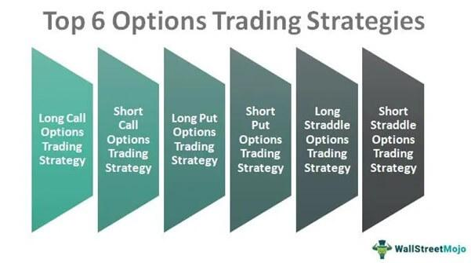

## Table of Contents

## What are options and how do they work in trading?

Options are financial contracts that give the buyer the right, but not the obligation, to buy or sell an asset at a specific price before a certain date. These assets can be stocks, commodities, or other financial instruments. There are two main types of options: calls and puts. A call option gives you the right to buy an asset, while a put option gives you the right to sell it. The price at which you can buy or sell the asset is called the strike price, and the date by which you must decide is called the expiration date.

When trading options, you pay a premium for the right to use the option. This premium is the cost of the option contract. If you think the price of the asset will go up, you might buy a call option. If the price does go up above the strike price before the expiration date, you can buy the asset at the lower strike price and then sell it at the higher market price, making a profit. If you think the price will go down, you might buy a put option. If the price does go down below the strike price, you can sell the asset at the higher strike price, again making a profit. If the price doesn't move in the direction you expected, you can let the option expire worthless, and your loss is limited to the premium you paid.

## What are the basic types of options: calls and puts?

A call option is like a ticket that lets you buy something at a set price before a certain date. Imagine you want to buy a toy that costs $10, but you think the price might go up. You can buy a call option for that toy at $10. If the toy's price goes up to $15 before the date on your ticket, you can use your call option to buy the toy for $10 and then sell it for $15, making a profit. If the price stays the same or goes down, you don't have to buy the toy, and you only lose the money you paid for the ticket.

A put option is the opposite. It's like a ticket that lets you sell something at a set price before a certain date. Let's say you have a toy that you bought for $10, but you think the price might go down. You can buy a put option to sell that toy at $10. If the toy's price drops to $5 before the date on your ticket, you can use your put option to sell the toy for $10, even though it's only worth $5 now, making a profit. If the price stays the same or goes up, you don't have to sell the toy, and you only lose the money you paid for the ticket.

## How can beginners start with options trading?

If you're new to options trading, start by learning the basics. Options are contracts that give you the right to buy or sell things like stocks at a set price before a certain date. There are two types: calls, which let you buy, and puts, which let you sell. You'll need to understand terms like strike price (the set price you can buy or sell at) and expiration date (when the option ends). It's also important to know about the premium, which is what you pay for the option. There are many online resources, [books](/wiki/algo-trading-books), and courses that can help you learn more about options and how they work.

Once you feel ready, you can open a brokerage account that allows options trading. Many brokers offer practice accounts where you can trade with fake money to get a feel for how it works without risking real money. Start small and only use money you can afford to lose. It's a good idea to begin with simple strategies like buying calls or puts before moving on to more complex ones. Always keep learning and stay updated on market trends and news, as they can affect your options. Remember, options trading can be risky, so take your time and don't rush into big trades right away.

## What are the key terms and concepts every options trader should know?

Options trading involves some key terms and concepts that every trader should know. The first is the strike price, which is the set price at which you can buy or sell the asset if you choose to use your option. The expiration date is another important term; it's the last day you can use your option before it becomes worthless. The premium is the price you pay to buy the option, and it's influenced by factors like the time until expiration and how much the asset's price is expected to move. Understanding these terms helps you make better decisions when trading options.

Another key concept is the difference between call and put options. A call option gives you the right to buy an asset at the strike price, which is useful if you think the price will go up. A put option, on the other hand, gives you the right to sell an asset at the strike price, which is helpful if you think the price will go down. It's also important to know about the underlying asset, which is the stock or commodity that the option is based on. Lastly, options can be either in-the-money, at-the-money, or out-of-the-money, depending on how the current price of the asset compares to the strike price. Knowing these concepts will help you navigate the world of options trading more effectively.

## What are the most common options trading strategies for beginners?

For beginners, one of the simplest and most common options trading strategies is buying call options. This strategy is useful if you think the price of a stock will go up. You buy a call option, which gives you the right to buy the stock at a set price, called the strike price, before a certain date. If the stock's price goes above the strike price, you can buy the stock at the lower strike price and then sell it at the higher market price, making a profit. If the stock's price doesn't go up, you can let the option expire and only lose the money you paid for the option, called the premium.

Another common strategy for beginners is buying put options. This is helpful if you think the price of a stock will go down. You buy a put option, which gives you the right to sell the stock at the strike price before the expiration date. If the stock's price drops below the strike price, you can buy the stock at the lower market price and then sell it at the higher strike price, making a profit. If the stock's price doesn't go down, you can let the option expire and only lose the premium you paid. Both of these strategies are straightforward and help beginners get started with options trading without too much risk.

## How does risk management play a role in options trading?

Risk management is really important in options trading because it helps you protect your money. When you trade options, you are trying to make money, but there's always a chance you could lose it too. That's why you need to think about how much you're willing to lose before you start trading. One way to manage risk is to only use money you can afford to lose. This means if you lose it all, it won't hurt your everyday life. Another way is to set limits on how much you'll lose on each trade. This is called a stop-loss order, and it automatically sells your option if it loses a certain amount of money, helping you avoid bigger losses.

Another part of risk management is understanding the options you're trading. You should know things like the strike price and expiration date, and how they affect your risk. For example, options that are closer to expiring can be riskier because there's less time for the stock price to move in your favor. Also, you can use different strategies to manage risk. For example, you could buy both a call and a put option on the same stock. This is called a straddle, and it can help protect you if the stock price moves a lot in either direction. By thinking about these things and using these strategies, you can make smarter choices and keep your trading safer.

## What are advanced options strategies and when should they be used?

Advanced options strategies are more complex ways to trade options that can help you make money in different situations. One common advanced strategy is called a spread. This is when you buy and sell options at the same time, but with different strike prices or expiration dates. For example, you might buy a call option with a lower strike price and sell a call option with a higher strike price. This can help you make money if the stock price goes up, but it also limits how much you can lose if the stock price doesn't move as expected. Another advanced strategy is called a straddle, where you buy both a call and a put option on the same stock with the same strike price and expiration date. This can be useful if you think the stock price will move a lot, but you're not sure which way.

You should use these advanced strategies when you have a good understanding of how options work and you're comfortable with the risks involved. They can be helpful in situations where you want to make money from big price movements or when you want to limit your risk. For example, if you think a company's stock will move a lot after an earnings report, but you're not sure if it will go up or down, a straddle might be a good choice. Or if you want to bet on a stock going up but want to limit your potential losses, a spread could be the right strategy. Always remember to think about your risk and only use money you can afford to lose when trying these advanced strategies.

## How do market conditions affect options trading strategies?

Market conditions can really change how you trade options. When the market is going up and everyone is feeling good about it, you might want to use strategies like buying call options. These options let you buy a stock at a set price, which can be good if you think the stock will keep going up. But if the market is going down and people are worried, you might want to buy put options instead. These let you sell a stock at a set price, which can help you make money if the stock keeps falling. So, the way the market is moving can help you decide which options to buy or sell.

Sometimes, the market can be really shaky and move a lot in a short time. In these cases, you might use strategies like straddles or strangles. These involve buying both call and put options on the same stock, which can help you make money no matter which way the stock moves, as long as it moves a lot. If the market is calm and not moving much, you might not want to use these strategies because the stock might not move enough for you to make money. So, understanding how the market is behaving can help you pick the right options strategy to use.

## What are the tax implications of trading options?

When you trade options, you need to think about taxes. The money you make from options is usually taxed as capital gains. If you hold the options for less than a year before selling them, the gains are considered short-term and are taxed at your regular income tax rate, which can be pretty high. But if you hold them for more than a year, the gains are long-term and are taxed at a lower rate, which can save you money. So, it's important to keep track of how long you hold your options because it can affect how much tax you have to pay.

Another thing to know is that the premium you pay for an option is not deductible if the option expires worthless. But if you sell an option, the premium you receive is treated as income and is taxed right away, even if the option hasn't expired yet. This can be tricky because you might have to pay taxes on money you haven't actually made yet. It's a good idea to talk to a tax professional who can help you understand all the rules and make sure you're doing everything right when it comes to taxes and options trading.

## How can one use options for hedging and income generation?

Options can be a great tool for hedging, which means protecting your investments from big losses. Imagine you own some stock and you're worried the price might go down. You can buy a put option, which gives you the right to sell your stock at a set price, even if the market price drops lower. This way, if the stock price does fall, you can use your put option to sell at the higher set price and avoid losing as much money. It's like having insurance for your stocks. Hedging with options can help you sleep better at night knowing you're protected if things go south.

Options can also be used to generate income. One way to do this is by selling call options on stocks you already own. This is called a covered call strategy. When you sell a call option, someone else pays you a premium for the right to buy your stock at a set price before a certain date. If the stock price stays below that set price, the option expires worthless, and you keep the premium as income. Even if the stock price goes above the set price and the buyer uses the option, you still get to sell your stock at a good price and keep the premium. This way, you can make some extra money from your stocks, even if they're not going up in value.

## What tools and resources are essential for successful options trading?

To be good at trading options, you need some important tools and resources. A reliable trading platform is a must-have. This is where you buy and sell options, and it should be easy to use and have good tools for looking at charts and numbers. Another key tool is an options screener, which helps you find options that match what you're looking for, like certain prices or expiration dates. You'll also want to use a risk management tool, which can help you keep track of how much you might lose and set limits to protect your money. Having these tools makes it easier to make smart choices and stay safe while trading.

Besides tools, there are other resources you should use to do well in options trading. Learning from books, online courses, and webinars can teach you a lot about how options work and the best ways to trade them. Joining a community of other traders can also be really helpful. You can share ideas, ask questions, and learn from people who have more experience. Keeping up with financial news and market reports is important too, because they can tell you what's happening in the market and help you decide when to buy or sell. Using all these resources together can help you become a better options trader.

## How can one evaluate the performance of their options trading strategies?

To evaluate how well your options trading strategies are doing, you need to look at a few key things. First, check your profit and loss statements. This will show you how much money you've made or lost from your trades. It's important to see if you're making more money than you're losing over time. Another thing to look at is your win rate, which is the percentage of your trades that make money. A high win rate is good, but you also need to think about how much you make on your winning trades compared to how much you lose on your losing trades. This is called your risk-reward ratio, and it's really important for understanding if your strategy is working well.

You can also use tools like a trading journal to keep track of your trades and see what's working and what's not. Write down why you made each trade, what happened, and what you learned. Over time, you'll start to see patterns and can adjust your strategies to do better. It's also helpful to compare your performance to the market or to other traders. If you're doing better than the market, that's a good sign. But if you're doing worse, you might need to change your approach. Remember, the goal is to keep learning and improving, so always be ready to try new things and see if they work better for you.

## References & Further Reading

For a detailed understanding of financial derivatives and options strategies, "Options, Futures, and Other Derivatives" by J.C. Hull is an essential resource. This book offers a comprehensive look at various derivative instruments and the strategic implementation of options in investment portfolios. 

To gain insights into [algorithmic trading](/wiki/algorithmic-trading), "Advances in Financial Machine Learning" by M.L. de Prado is invaluable. It addresses how [machine learning](/wiki/machine-learning) algorithms can be applied to enhance trading strategies and manage the vast amounts of financial data available today.

For those interested in building algorithmic trading systems, "Quantitative Trading: How to Build Your Own Algorithmic Trading Business" by E. Chan provides practical guidance. This work outlines the steps necessary to create effective trading algorithms, covering topics from strategy development to implementation.

Additionally, "Machine Learning for Algorithmic Trading" by S. Jansen serves as an introductory text for leveraging machine learning in trading applications. This guide illustrates the process of integrating machine learning techniques to improve trading accuracy and efficiency.

These publications offer a solid foundation for navigating the complexities of financial derivatives, options strategies, and algorithmic trading, making them indispensable for both novice and experienced investors aiming to optimize their investment approaches.

