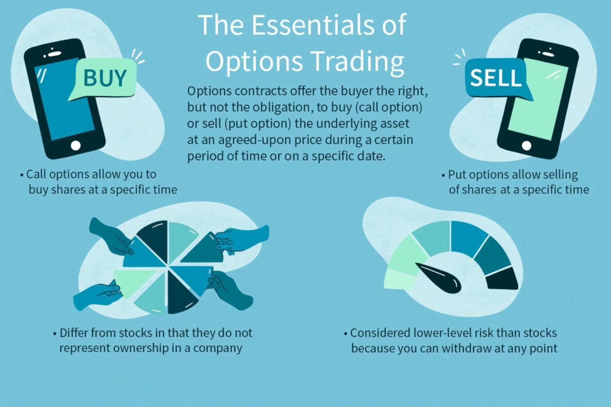

Financial derivatives are integral tools in modern finance, allowing traders and investors to manage risk and leverage opportunities. These instruments derive their value from underlying assets, such as stocks, bonds, or commodities. Among the vast array of derivatives, options trading has emerged as a prominent field, offering unique strategies to balance investment rewards against associated risks. Options are contracts providing the right, but not the obligation, to buy or sell an underlying asset at a predetermined price, called the strike price, before a specific expiry date.

Investment strategies leveraging derivatives are critical for maximizing profits while minimizing risks. By utilizing techniques such as hedging or taking strategic positions in derivative instruments, investors can protect against adverse market movements and potentially enhance their returns. This balance of risk and reward underpins the importance of carefully crafted investment strategies in the financial markets.



Algorithmic trading, or algo trading, represents a leap forward in leveraging technology for financial decision-making. It involves using computer algorithms to execute trades at optimal times, ensuring speed, precision, and the removal of human emotions that can cloud judgment. The integration of algorithmic trading with investment strategies offers the possibility of unprecedented efficiency and accuracy, further refining the approach to trading derivatives like options.

Financial derivatives, options, and the incorporation of algo trading form a triad of strategic investment practices. Understanding their synergy is crucial for those navigating the intricate landscape of modern finance. This guide aims to provide insights into utilizing these tools effectively, maximizing their potential while maintaining a robust risk management approach.

The subsequent sections will explore each aspect in detail, outlining a pathway toward informed and effective financial decisions. By examining the evolving technologies and strategies within this sphere, market participants can better position themselves in a rapidly changing financial environment.

## Table of Contents

## Understanding Financial Derivatives

Financial derivatives are financial instruments that derive their value from an underlying asset, index, or [interest rate](/wiki/interest-rate-trading-strategies). These instruments are a key component of financial markets, serving as tools for risk management, speculation, and [arbitrage](/wiki/arbitrage). Derivatives can improve market efficiency by allowing participants to extract more value from existing assets and manage risks more effectively.

**Types of Derivatives**

1. **Options**: An option is a derivative that gives the holder the right, but not the obligation, to buy (call option) or sell (put option) an underlying asset at a predetermined strike price on or before a specific expiration date. Options are pivotal in strategies that aim to manage risk while optimizing returns. The flexibility they offer in terms of expiration and strike price makes them a versatile instrument for traders seeking to hedge or speculate.

2. **Futures**: A futures contract is an agreement between two parties to buy or sell an asset at a predetermined future date and price. Unlike options, futures carry an obligation for the contract holder to fulfill the terms at expiration. Futures are commonly used for commodities, currencies, and indices. They are often used by investors to hedge against price changes in an asset they would need at a future date.

3. **Swaps**: Swaps are derivative contracts through which two parties exchange cash flows or liabilities from two different financial instruments. The most prevalent swap is the interest rate swap, where parties exchange fixed interest rate payments for floating rate payments, typically to manage exposure to fluctuations in interest rates.

**Role of Derivatives in Hedging and Leveraging**

Derivatives provide investors and corporations with a means to hedge against potential financial losses. For instance, a corporation anticipating future payment obligations in a foreign currency might use currency derivatives to lock in exchange rates and shield itself from adverse currency fluctuations. Derivatives also offer leverage, allowing traders to amplify their exposure to market movements without the need to directly own the underlying asset. This potential to maximize returns, however, comes with increased risk.

**The Global Derivatives Market and Recent Trends**

The derivatives market is one of the most significant components of the global financial system. According to the Bank for International Settlements (BIS), the notional amount of outstanding derivatives contracts was in the hundreds of trillions of dollars as of recent years, highlighting the market's immense scale and influence.

Recent trends in the derivatives market include an increasing demand for more complex and tailored derivative products that meet specific hedging needs. Another trend is the incorporation of technological advancements such as data analytics and [machine learning](/wiki/machine-learning), which are driving more sophisticated, data-driven trading strategies. Regulations are also evolving, with bodies like the European Securities and Markets Authority (ESMA) and the U.S. Commodity Futures Trading Commission (CFTC) focusing on enhancing transparency and reducing systemic risk.

In conclusion, financial derivatives are essential tools for managing risk and enhancing market opportunities. Their versatility and scale make them critical for investors and corporations aiming for efficiency and strategic market engagement.

 to Options Trading

Options are financial derivatives that provide investors the right, but not the obligation, to buy or sell an asset at a predetermined price, within a specified period. These derivatives are crucial instruments for both hedging risks and speculating on price movements in financial markets.

Options are primarily categorized into two types: call options and put options. A call option grants the holder the right to purchase an asset at an agreed-upon price—referred to as the strike price—before the option's expiration date. Conversely, a put option gives the holder the right to sell an asset at the strike price before the option's expiration.

An options contract is defined by several key elements:

1. **Strike Price**: This is the pre-decided price at which the holder can buy (in the case of a call option) or sell (in the case of a put option) the underlying asset. 

2. **Expiration Date**: This is the last date on which the options holder can exercise their right to buy or sell the underlying asset. Beyond this date, the option becomes void and valueless.

The benefits of trading options include flexibility and leverage. They allow investors to gain significant exposure to an asset with a relatively small investment, due to the derivative nature of the instrument. Options also offer strategies for income generation, portfolio protection, and risk management. For example, purchasing a put option can serve as insurance against a decline in the value of an asset.

However, options trading is not without risks. Options can expire worthless if market conditions are unfavorable, leading to a complete loss of the premium paid for buying the option. Additionally, the complexity of options trading strategies necessitates thorough understanding and skillful execution to avoid substantial losses.

Real-world examples of successful options trades demonstrate the potential impact of strategic options trading. Notably, during the 1987 stock market crash, traders who had acquired put options as a hedge against declining stock prices managed to offset losses significantly, utilizing the gains from the put options to mitigate the impact on their portfolios.

In conclusion, options trading is a multifaceted financial tool offering potential high rewards but also posing significant risks. Understanding the mechanics of options, including their contracts, and being aware of both the associated benefits and risks is essential for effective participation in this dynamic area of finance.

## Investment Strategies with Financial Derivatives

Financial derivatives are essential instruments in the world of investment, providing sophisticated strategies for both hedging and speculation. Among these, strategies such as covered calls, protective puts, and iron condors are widely utilized to diversify portfolios and enhance returns.

### Covered Calls
The covered call strategy involves holding a long position in a stock and selling call options on the same asset. This approach allows the investor to generate additional income through the premiums received from the call options. The primary goal is to earn returns from the options premium while retaining the stock's potential for appreciation. However, the upside potential is capped, as the stock may be called away if the market price exceeds the strike price.

For example, assume an investor owns 100 shares of a company trading at $50 per share and sells a call option with a $55 strike price for a $2 premium. If the stock price stays below $55 until expiration, the investor profits from both the stock and the option premium. However, if the stock exceeds the strike price, the shares are sold at $55, capturing the $5 per-share gain plus the $2 premium.

### Protective Puts
A protective put strategy involves purchasing a put option for stocks already owned. This tactic is akin to an insurance policy, offering downside protection by allowing the investor to sell the stock at a predetermined strike price. The main benefit is the hedging of potential losses if the stock price declines significantly.

For instance, an investor holding shares at $50 each might purchase a put option with a $45 strike price. Even if the stock declines to $30, the investor can exercise the put and sell the shares at $45, thus limiting losses to the option premium and the $5 decline from the initial price to the strike price.

### Iron Condors
The iron condor strategy is an advanced, neutral strategy typically utilized in a stable market environment. It involves the simultaneous sale of an out-of-the-money call and put, while also purchasing further out-of-the-money call and put options. This creates a zone of profitability between the two short options' strike prices, minimizing potential losses from significant market movements.

To execute an iron condor, an investor might sell a call option with a $55 strike price and a put option with a $45 strike price while purchasing a call with a $60 strike price and a put with a $40 strike price. The maximum profit occurs if the stock price remains between $45 and $55, with profitability decreasing as the price approaches either $40 or $60.

### Diversification and Portfolio Enhancement
Derivatives allow investors to manage risk and expropriate opportunities without outright buying or selling underlying assets. By employing derivatives strategies, investors can derive incomes under various market conditions, reduce [volatility](/wiki/volatility-trading-strategies), or protect against losses. Furthermore, derivatives provide leverage, enabling investors to gain considerable exposure with a relatively small capital outlay, thus boosting potential returns.

### Market Conditions Impact
The effectiveness of various derivative strategies is closely linked to prevailing market conditions. Covered calls are particularly beneficial in a bullish or stable market, where prices rise moderately or remain stagnant, while protective puts are advantageous in bearish periods or volatile markets. Iron condors thrive in a stable market with low volatility but can entail significant losses during turbulent phases when prices shift rapidly beyond the anticipated range.

Adjustments to strategies should be made based on economic indicators, geopolitical occurrences, and volatility indices. Keeping abreast of these conditions ensures that investors can adapt their derivative strategies to align more closely with market realities, enhancing the probability of achieving desired investment outcomes.

## Algorithmic Trading: A Modern Approach

Algorithmic trading, often referred to as algo trading, represents a sophisticated technique in the financial markets where computer algorithms are used to execute large orders at high speeds and with minimal human intervention. Emerging in the late 20th century, [algorithmic trading](/wiki/algorithmic-trading) has fundamentally transformed how securities are traded, capitalizing on the capabilities of modern technology to enhance execution efficiency. Initially developed for use in large financial institutions, the proliferation of high-speed internet and advancements in trading software have democratized algo trading, making it accessible to retail traders as well.

Algorithms used in trading are typically developed through a combination of quantitative analysis and robust programming. The development process involves creating mathematical models that predict market movements based on historical and real-time data. Once formulated, these models are translated into computer programs using programming languages such as Python, C++, or R. For example, a basic Python script might look like:

```python
import pandas as pd

# Load historical market data
data = pd.read_csv('market_data.csv')

# Define a simple moving average strategy
short_window = 40
long_window = 100

# Calculate moving averages
data['short_mavg'] = data['Close'].rolling(window=short_window, min_periods=1).mean()
data['long_mavg'] = data['Close'].rolling(window=long_window, min_periods=1).mean()

# Generate trading signals
data['signal'] = 0
data['signal'][short_window:] = np.where(data['short_mavg'][short_window:] > data['long_mavg'][short_window:], 1, 0)

# Printing signals for a quick check
print(data[['signal']].tail())
```

Once developed, these algorithms are implemented on trading platforms where they can operate continuously, executing trades as per the defined strategy. The speed and precision with which these algorithms can analyze market conditions and execute trades offer several advantages. The primary benefits of algorithmic trading are speed, accuracy, and the elimination of emotional bias. Trades can be executed in milliseconds, a crucial [factor](/wiki/factor-investing) in volatile markets. This capability ensures that trades are executed on the desired terms, minimizing slippage—the difference between the expected price of a trade and the actual price.

Despite its advantages, algorithmic trading is not without challenges. The complexity of developing effective algorithms requires significant expertise in both finance and technology. Additionally, the reliance on technology makes algo trading susceptible to technical failures and cyber threats. Flash crashes, where rapid selling or buying caused by algos can lead to market plummets or spikes, highlight the potential risks. Regulatory compliance is also a significant concern, as algorithmic trading strategies must adhere to financial market regulations to avoid penalties.

In summary, algorithmic trading is a cornerstone of modern finance, leveraging technology to enhance trading efficiency and effectiveness. While it offers significant benefits, it also poses unique challenges that traders must navigate to be successful.

## Integrating Algo Trading with Options Trading

Algorithmic trading, or algo trading, represents a significant advancement in the world of financial markets, providing unparalleled efficiency and precision. This transformative approach is critically beneficial in options trading, where the complexity of contracts and rapid market changes demand meticulous execution and swift decision-making.

### Efficiency with Algorithms in Options Trading

One of the primary benefits is the enhanced efficiency that algorithms bring to options trading. Algorithms can process vast amounts of market data and execute trades at high speeds, which is vital for options trading where timing can substantially influence profitability. By automating the trading process, algorithms reduce human error, enabling traders to capitalize on fleeting market opportunities with precision.

### Machine Learning and AI in Algorithmic Options Strategies

Machine learning and AI have become pivotal in crafting sophisticated algorithmic strategies. These technologies allow for the development of predictive models by learning from historical data to anticipate future price movements. For instance, a machine learning model can assess factors such as implied volatility, trading [volume](/wiki/volume-trading-strategy), and historical prices to predict option premium fluctuations. The process typically involves training a model using past data and then testing it against new data to gauge its predictive accuracy.

```python
from sklearn.ensemble import RandomForestRegressor
from sklearn.model_selection import train_test_split
from sklearn.metrics import mean_squared_error

# Sample code to predict options prices
data = load_option_market_data()  # Hypothetical function to load data
X = data[['implied_volatility', 'trading_volume', 'historical_prices']]
y = data['option_premium']

X_train, X_test, y_train, y_test = train_test_split(X, y, test_size=0.2, random_state=42)

model = RandomForestRegressor()
model.fit(X_train, y_train)
predictions = model.predict(X_test)

print(f"Mean Squared Error: {mean_squared_error(y_test, predictions)}")
```

This code illustrates a simplified version of how a machine learning model might be constructed to predict option prices, adapting to changing market conditions through continuous learning and adjustments.

### Big Data in Enhancing Predictive Models

The role of Big Data in options trading cannot be understated. Big Data provides the vast datasets necessary for training robust predictive models. This data includes historical trading prices, economic indicators, news sentiment, and transaction volumes, among others. By harnessing Big Data, traders can develop models with improved accuracy, helping identify intricate patterns that would be undetectable with smaller datasets. The integration of Big Data analytics enables traders to generate insights into potential market shifts, offering a competitive edge.

### Successful Algo-Driven Options Trading Strategies

An example of a successful algorithmic strategy in options trading is the use of delta-neutral strategies, which aim to hedge against small price changes. Algorithms precisely calculate and maintain a delta-neutral position, continuously adjusting portfolios to hedge against market volatility efficiently. 

Another successful approach involves straddle strategies, where algorithms predict when an asset's price will experience significant movement, thereby executing call and put options simultaneously. By leveraging data-driven insights, algorithms can identify opportune moments to deploy such strategies, optimizing profit potential.

In conclusion, the integration of algorithms with options trading has ushered in a new era of trading strategy sophistication, where machine learning, AI, and Big Data collectively enhance trading outcomes, offering speed and accuracy previously unattainable through traditional methods.

## Risk Management in Derivatives and Algo Trading

Risk management is an integral component of trading financial derivatives and executing algorithmic trading strategies. The inherent volatility and the leverage involved in derivatives trading amplify potential gains but also increase the risk of significant losses. Thus, effective risk management practices are essential for sustained success and financial stability.

Position sizing and stop-loss orders are fundamental risk management techniques. Position sizing involves determining the appropriate amount of capital to invest in a particular trade. This decision is influenced by factors such as account size, risk tolerance, and the volatility of the asset being traded. A common formula used for position sizing is the Kelly Criterion, which calculates the optimal fraction of capital to bet on a single trade to maximize logarithmic wealth:

$$
f^* = \frac{bp - q}{b}
$$

where:
- $f^*$ is the fraction of the capital to bet
- $b$ is the odds received on the wager (net odds)
- $p$ is the probability of winning
- $q$ is the probability of losing (1 - $p$)

Stop-loss orders, on the other hand, are designed to limit potential losses by automatically closing a trade when the market price reaches a predetermined level. This ensures that traders can cap their potential losses irrespective of human emotions that might otherwise encourage them to hold onto losing positions.

In algorithmic trading, technology plays a critical role in mitigating risks through automation and precision execution. Algorithms can be programmed to incorporate risk management rules such as maximum drawdowns, portfolio diversification, and volatility metrics. By using machine learning models, algorithms can also adapt to changing market conditions, thereby enhancing risk prediction capabilities.

However, despite technological advancements, algorithmic trading is not immune to risk management failures. Case studies in this area highlight lessons learned from significant events. For instance, the "Flash Crash" of May 6, 2010, when the Dow Jones Industrial Average plummeted nearly 1,000 points within minutes, underscored the vulnerabilities of algorithmic trading systems. It revealed how high-frequency trading algorithms, lacking proper risk controls, could exacerbate market volatility. Following investigations, recommendations included the implementation of circuit breakers—halts in trading triggered when a stock or index moves beyond set thresholds.

Another notable case was the collapse of Long-Term Capital Management (LTCM) in 1998, a [hedge fund](/wiki/hedge-fund-trading-strategies) employing complex derivative strategies. Its downfall was partly due to inadequate risk management practices, such as underestimating the probability of extreme market events and overleveraging positions. The lessons from LTCM underscore the importance of stress testing and scenario analysis in identifying potential vulnerabilities in trading strategies.

In conclusion, effective risk management in derivatives and algorithmic trading combines the discipline of traditional risk control measures, like position sizing and stop-loss orders, with advanced technology to navigate market complexities. The integration of robust risk management systems is paramount to safeguarding against unforeseen market dynamics and ensuring long-term trading success.

## Future Trends in Financial Derivatives and Algo Trading

In recent years, financial derivatives and algorithmic trading have experienced significant evolution, driven by technological advancements and regulatory changes. Emerging trends in this field showcase the intersection of innovation and oversight, as market participants seek new ways to enhance their trading strategies while navigating a complex regulatory landscape.

One notable trend is the increasing role of [artificial intelligence](/wiki/ai-artificial-intelligence) (AI) and machine learning in algorithmic trading. These technologies have transformed the way financial data is analyzed and trading decisions are made. Advanced algorithms can process vast amounts of information at speeds unattainable by human traders, yielding insights that enhance decision-making efficiency and accuracy. AI-driven systems are capable of analyzing historical data patterns, predicting market movements, and automating trade execution, thereby facilitating a more nuanced approach to trading strategies. Such advancements enable traders to respond rapidly to dynamic market conditions, ultimately fostering a more adaptive trading environment.

Blockchain technology is poised to exert a profound impact on the derivatives market. Its decentralized and secure nature offers significant improvements in transparency, settlement speed, and cost efficiency. Smart contracts, a blockchain innovation, automate contract execution processes, thereby reducing counterparty risk and enhancing operational efficiency. As the technology matures, it could redefine how derivative contracts are managed and executed, enhancing both reliability and security.

The regulatory landscape is also evolving, with authorities around the globe striving to strike a balance between fostering innovation and ensuring market stability. Emerging regulations focus on promoting transparency, managing systemic risk, and protecting investors. For instance, post-2008 financial reforms, such as the Dodd-Frank Act in the United States and the European Market Infrastructure Regulation (EMIR), have increased regulatory scrutiny over derivative transactions. These changes encourage market participants to adopt more robust risk management practices, thereby contributing to market integrity and stability.

Evolving market conditions are expected to influence the strategies employed by future traders. Factors such as geopolitical developments, economic policies, and technological disruptions necessitate adaptive strategies that can swiftly react to new information and shifting paradigms. Traders may increasingly rely on diversified portfolios that incorporate a mix of traditional and innovative financial derivatives, leveraging advancements in algo trading to optimize returns and mitigate risks.

As financial markets continue to transform, staying abreast of emerging trends in derivatives and algorithmic trading is crucial for both novice and experienced traders. Understanding these trends enables participants to capitalize on new opportunities and navigate the complexities of modern financial systems effectively.

## Conclusion

Understanding financial derivatives and options trading is fundamental to navigating the complexities of the modern financial landscape. These financial instruments not only provide avenues for hedging and leveraging but also open up a multitude of strategic investment opportunities. By mastering derivatives and options, traders can better manage risk and enhance returns, bolstering their portfolio's resilience against market volatility.

Strategic investment practices, when coupled with algorithmic trading, amplify these benefits. Algorithmic trading, or "algo trading," utilizes technology and advanced computational algorithms to execute trades at unprecedented speeds and with precision, eliminating the emotional biases that can affect manual trading decisions. The integration of algorithmic trading strategies with options trading allows investors to optimize their trades, making use of predictive models and large data sets to enhance profitability and accuracy.

The finance sector is on a continuous evolutionary trajectory, driven by advancements in technology and the introduction of innovative trading methodologies. Machine learning and artificial intelligence are increasingly shaping the future of trading strategies, providing powerful tools for analytics and decision-making. Staying informed about these innovations and their impacts is crucial for maintaining a competitive edge in the financial markets.

Continued education and awareness of market trends are paramount for any investor or trader aiming to succeed. Resources for further exploration include academic courses, financial news outlets, online trading platforms with educational content, and professional financial literature. For those interested in algorithmic strategies, engaging with programming resources and data science communities can be particularly advantageous. As financial markets evolve, the commitment to learning and adaptation will remain a trader's most valuable asset.

## References & Further Reading

[1]: Hull, J. C. (2018). ["Options, Futures, and Other Derivatives"](https://www.semanticscholar.org/paper/Options%2C-Futures%2C-and-Other-Derivatives-Hull/89bdee500c8623864fc9eb7a471546aa713acc44). Pearson Education.

[2]: Wilmott, P. (2013). ["Paul Wilmott Introduces Quantitative Finance"](https://www.wiley.com/en-us/Paul+Wilmott+Introduces+Quantitative+Finance,+2nd+Edition-p-9781118836798). Wiley.

[3]: Black, F., & Scholes, M. (1973). ["The Pricing of Options and Corporate Liabilities."](https://www.jstor.org/stable/1831029) Journal of Political Economy, 81(3), 637-654.

[4]: Murphy, J. J. (1999). ["Technical Analysis of the Financial Markets: A Comprehensive Guide to Trading Methods and Applications"](https://archive.org/details/technicalanalysi0000murp). New York Institute of Finance.

[5]: Aldridge, I. (2013). ["High-Frequency Trading: A Practical Guide to Algorithmic Strategies and Trading Systems"](https://books.google.com/books/about/High_Frequency_Trading.html?id=8QpIsVUMhmEC). Wiley.