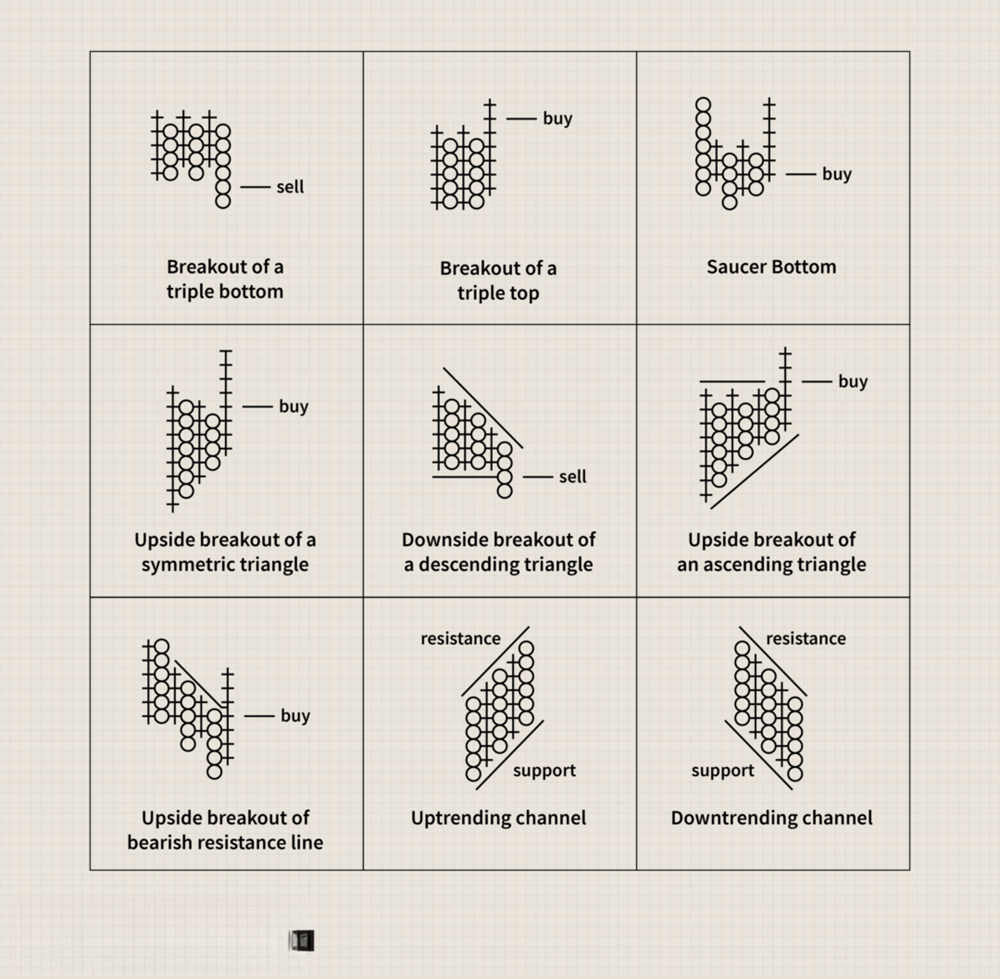

## Table of Contents

## What is Point and Figure charting and why is it used?

Point and Figure charting is a way to look at stock prices that focuses on big changes in price instead of small daily ups and downs. It uses X's and O's to show when prices go up or down. When the price goes up by a certain amount, you add an X to the chart. If the price goes down by that amount, you add an O. This helps to see the main trends without getting distracted by small changes.

People use Point and Figure charts because they make it easier to spot important trends and patterns in stock prices. By ignoring small price movements, these charts help traders focus on what really matters, like when a stock is likely to keep going up or down. This can be helpful for making decisions about buying or selling stocks.

## How does Point and Figure charting differ from traditional candlestick or bar charts?

Point and Figure charting is different from candlestick or bar charts because it only shows big price changes and ignores small ones. In candlestick and bar charts, you see every little up and down in price every day. But in Point and Figure charts, you only add an X when the price goes up by a certain amount, and an O when it goes down by that amount. This means Point and Figure charts are simpler and focus on the main trends.

Candlestick and bar charts give you more details about each day's trading, like the highest and lowest prices, and where the price started and ended. They can show you how much the price moved in one day and help you see patterns like doji or hammer in candlesticks. Point and Figure charts, on the other hand, don't show these details. They help you see the overall direction of the price over time, making it easier to spot long-term trends and important price levels without getting distracted by daily ups and downs.

## What are the basic components of a Point and Figure chart?

A Point and Figure chart is made up of columns of X's and O's. The X's show when the price goes up by a certain amount, called the box size. For example, if the box size is set to $1, you add an X for every $1 increase in price. The O's show when the price goes down by the same amount. So, if the price drops by $1, you add an O. These columns help you see the main direction of the price without getting distracted by small changes.

The chart also has something called the reversal amount, which decides when to switch from a column of X's to a column of O's, or the other way around. If the price goes up enough to add X's, but then drops by the reversal amount, you start a new column with O's. This helps show when the price trend might be changing. By focusing on these big moves, Point and Figure charts make it easier to spot important trends and patterns in the price of a stock.

## How do you construct a Point and Figure chart?

To construct a Point and Figure chart, you start by choosing a box size, which is the amount of price change needed to add an X or an O to the chart. For example, if you set the box size to $1, you add an X when the price goes up by $1, and an O when it goes down by $1. You also need to decide on a reversal amount, which is how much the price needs to change to switch from a column of X's to a column of O's, or vice versa. A common reversal amount is three boxes, meaning the price needs to change by three times the box size to start a new column.

Once you have your box size and reversal amount, you can begin plotting the chart. Start with the first price you have. If it goes up by the box size, you add an X in the first column. Keep adding X's as long as the price keeps going up by the box size. If the price then drops by the reversal amount, you start a new column and add O's for each box size drop in price. Continue this process, switching between columns of X's and O's whenever the price changes by the reversal amount. This way, you build a chart that shows the main trends in the price without showing every small change.

## What is the significance of the Xs and Os in Point and Figure charting?

In Point and Figure charting, the Xs and Os are really important because they show you the big changes in price. When the price goes up by a certain amount, called the box size, you add an X to the chart. This means the price is going up. If the price keeps going up, you keep adding Xs in the same column. But if the price starts to go down by a certain amount, called the reversal amount, you stop adding Xs and start a new column with Os. Each O shows that the price has gone down by the box size.

The Xs and Os help you see the main direction of the price without getting distracted by small changes. By only showing big moves, the chart makes it easier to spot important trends and patterns. For example, if you see a lot of Xs, it means the price has been going up a lot, which might be a good time to buy. If you see a lot of Os, it means the price has been going down, which might be a sign to sell. This way, the Xs and Os help traders make better decisions about when to buy or sell stocks.

## What are the different box sizes and reversal amounts used in Point and Figure charting?

In Point and Figure charting, the box size is how much the price needs to change before you add an X or an O to the chart. It can be different depending on what you're looking at. For stocks, a common box size might be $1, $2, or $5. This means you add an X when the price goes up by that amount, and an O when it goes down by that amount. For other things like commodities or [forex](/wiki/forex-system), the box size might be different, like 0.1% or 1% of the price. You choose the box size based on how much you want to focus on big or small price changes.

The reversal amount is how much the price needs to change to switch from adding Xs to Os, or the other way around. A common reversal amount is three boxes, but it can also be one, two, or more boxes. If you're using a box size of $1 and a reversal amount of three boxes, the price needs to go down by $3 to start adding Os after you've been adding Xs. The reversal amount helps show when the price trend might be changing. Choosing the right box size and reversal amount is important because it affects how the chart looks and what trends you can see.

## How can Point and Figure charts be used to identify support and resistance levels?

Point and Figure charts can help you find support and resistance levels by showing where the price keeps stopping or turning around. Support is like a floor where the price stops falling and starts to go up again. Resistance is like a ceiling where the price stops rising and starts to go down. On a Point and Figure chart, you can see these levels by looking for places where the columns of Xs and Os keep switching back and forth. If the price hits a certain level a few times and then goes the other way, that's a sign of support or resistance.

To find these levels, you look for horizontal lines on the chart where the price has bounced off several times. For example, if you see that the price keeps hitting $50 and then going up, $50 might be a support level. If the price keeps hitting $60 and then going down, $60 might be a resistance level. By spotting these levels, you can make better guesses about where the price might go next. If the price breaks through a support or resistance level, it might mean the price is going to keep moving in that direction, which can help you decide when to buy or sell.

## What are the common chart patterns in Point and Figure charting and what do they indicate?

In Point and Figure charting, there are several common patterns that traders look for to understand what the price might do next. One pattern is the "Double Top," which happens when the price goes up to a certain level, drops, and then goes back up to the same level again before dropping. This can be a sign that the price might keep going down, so it might be a good time to sell. Another pattern is the "Double Bottom," which is the opposite. It happens when the price goes down to a certain level, goes up, and then goes back down to the same level again before going up. This can be a sign that the price might keep going up, so it might be a good time to buy.

Another important pattern is the "Triple Top" and "Triple Bottom." A Triple Top happens when the price goes up to the same level three times before dropping, which can be a strong sign that the price might keep going down. A Triple Bottom happens when the price goes down to the same level three times before going up, which can be a strong sign that the price might keep going up. These patterns help traders see where the price might be stuck and where it might break out next. By looking for these patterns, traders can make better guesses about when to buy or sell a stock.

## How can Point and Figure charts be used for setting price targets and stop-losses?

Point and Figure charts can help you set price targets by looking at the patterns on the chart. When you see a Double Top or Triple Top, you can guess where the price might go next if it breaks down. For example, if the price breaks below a Double Top, you can measure the height of the pattern and subtract it from the [breakout](/wiki/breakout-trading) point to find a price target. This gives you an idea of how far the price might fall, which can help you decide when to sell. The same idea works for Double Bottoms and Triple Bottoms, but you add the height of the pattern to the breakout point to find a price target for when the price might go up.

For setting stop-losses, Point and Figure charts can show you where the price might change direction. A stop-loss is a price where you decide to sell if the price goes down to protect your money. You can set a stop-loss just below a support level on the chart. If the price breaks through this level, it might keep going down, so you want to sell before it loses too much value. By using the chart to find these levels, you can set a stop-loss that helps you manage risk and protect your investment.

## What are the advantages and limitations of using Point and Figure charts in trading?

Point and Figure charts have some good things about them that can help traders. They make it easier to see the main trends in the price of a stock without getting distracted by small changes every day. This can help you spot important patterns like Double Tops and Double Bottoms, which can tell you when the price might go up or down. Also, these charts are good for finding support and resistance levels, which are places where the price often stops and turns around. By using these levels, you can set price targets and stop-losses to help you decide when to buy or sell.

But Point and Figure charts also have some problems. They don't show you all the details about each day's trading like candlestick or bar charts do. This means you might miss some important information, like how much the price moved in one day. Also, choosing the right box size and reversal amount can be hard, and if you pick the wrong ones, the chart might not show the trends clearly. Because of this, Point and Figure charts might not be the best choice for every trader, especially if you like to look at all the small changes in price every day.

## How can Point and Figure charts be integrated with other technical analysis tools?

Point and Figure charts can be used together with other technical analysis tools to help traders make better decisions. For example, you can use moving averages with Point and Figure charts to see if the price is above or below a certain average over time. If the price is above the moving average and you see a bullish pattern like a Double Bottom on the Point and Figure chart, it might be a good time to buy. On the other hand, if the price is below the moving average and you see a bearish pattern like a Double Top, it might be a good time to sell. By combining these tools, you get a clearer picture of what the price might do next.

Another way to use Point and Figure charts with other tools is by looking at [volume](/wiki/volume-trading-strategy). Volume shows how many shares of a stock are being bought and sold. If you see a breakout on a Point and Figure chart and the volume is high, it can be a stronger sign that the price will keep moving in that direction. You can also use indicators like the Relative Strength Index (RSI) to see if a stock is overbought or oversold. If the RSI shows that a stock is overbought and you see a bearish pattern on the Point and Figure chart, it might be a good time to sell. By using Point and Figure charts along with other tools, you can make more informed trading decisions.

## What are some advanced techniques in Point and Figure charting for experienced traders?

Experienced traders can use something called "trend lines" on Point and Figure charts to see where the price might go next. A trend line is a line you draw on the chart to connect the highs or lows of the price. If the price keeps going up and making higher highs, you draw a line under those highs. If the price keeps going down and making lower lows, you draw a line above those lows. When the price breaks through a trend line, it might mean the price is going to keep moving in that direction. This can help traders decide when to buy or sell. Also, traders can use something called "count" to guess how far the price might go. You count the number of columns in a pattern and use that to find a price target. This can help you set goals for when to take your profits.

Another advanced technique is using "percentage scales" instead of fixed box sizes. With a percentage scale, the box size changes based on the price of the stock. This can be helpful for stocks that have a wide range of prices. It helps keep the chart clear and easy to read no matter how high or low the price goes. Traders can also combine Point and Figure charts with other advanced tools like Fibonacci retracement levels. Fibonacci levels help find places where the price might stop and turn around. By looking at these levels on a Point and Figure chart, traders can see where the price might hit support or resistance. This can help them make better decisions about when to buy or sell.

## References & Further Reading

[1]: ["The Definitive Guide to Point and Figure"](https://www.amazon.com/Definitive-Guide-Point-Figure-Comprehensive/dp/0857192450) by Jeremy du Plessis

[2]: ["Point and Figure Charting: The Essential Application for Forecasting and Tracking Market Prices"](https://www.amazon.com/Point-Figure-Charting-Application-Forecasting/dp/1118445708) by Thomas J. Dorsey

[3]: ["Quantitative Technical Analysis: An integrated approach to trading system development and trading management"](https://dl.acm.org/doi/book/10.5555/2789309) by Dr. Howard B. Bandy

[4]: Lo, A. W., & MacKinlay, A. C. (1999). ["A Non-Random Walk Down Wall Street."](https://www.jstor.org/stable/j.ctt7tccx) Princeton University Press.

[5]: ["Trading Systems and Methods"](https://www.amazon.com/Trading-Systems-Methods-Wiley/dp/1119605350) by Perry J. Kaufman