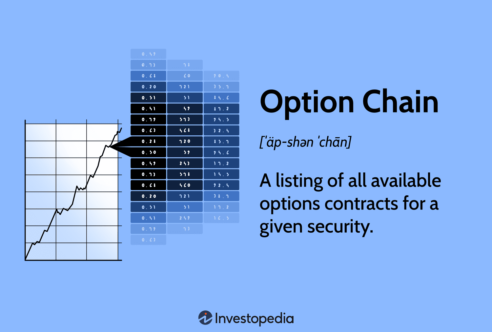

## Table of Contents

## What is an options chain and why is it important for traders?

An options chain is a list that shows all the available options contracts for a specific stock or asset. It includes details like the strike price, expiration date, and whether the option is a call or a put. The options chain helps traders see at a glance what options are available and at what prices, making it easier to decide which options to buy or sell.

Options chains are important for traders because they provide a lot of useful information in one place. By looking at the options chain, traders can see how much it costs to buy or sell an option, and they can compare different options to find the best one for their strategy. This helps traders make smarter decisions and manage their risks better, which is crucial in the fast-paced world of trading.

## How do you read the basic components of an options chain, such as strike price and expiration date?

When you look at an options chain, one of the first things you'll see is the strike price. The strike price is the price at which you can buy or sell the underlying stock if you choose to use your option. It's listed in a column and usually goes from low to high. If you're looking at a call option, a lower strike price means you can buy the stock cheaper if you exercise the option. For a put option, a higher strike price means you can sell the stock at a higher price. The strike price helps you decide if an option is a good deal based on where you think the stock price will go.

The next important part of the options chain is the expiration date. This is the date when the option contract ends. It's shown in another column and usually goes from the nearest date to the furthest away. Options that expire soon are called "near-term" options, and those that expire later are "long-term" options. The expiration date is important because it affects the price of the option. Options that expire soon are usually cheaper but riskier because there's less time for the stock price to move in your favor. Options that expire later cost more but give you more time for the stock to move. Knowing the expiration date helps you pick an option that fits your trading plan.

## What do the terms 'call' and 'put' mean in the context of an options chain?

In the context of an options chain, a 'call' option gives you the right, but not the obligation, to buy a stock at a specific price, called the strike price, before the option expires. If you think the price of the stock will go up, you might buy a call option. This way, you can buy the stock at the lower strike price and then sell it at the higher market price, making a profit. Call options are like betting that the stock will increase in value.

On the other hand, a 'put' option gives you the right, but not the obligation, to sell a stock at the strike price before the option expires. If you think the price of the stock will go down, you might buy a put option. This allows you to sell the stock at the higher strike price even if the market price has dropped, helping you avoid a bigger loss or even make a profit. Put options are like betting that the stock will decrease in value.

## How can volume and open interest help in analyzing an options chain?

Volume and open interest are two important numbers you'll see in an options chain. Volume tells you how many options contracts were traded that day. If the [volume](/wiki/volume-trading-strategy) is high, it means a lot of people are interested in that option. This can be a sign that something big might be happening with the stock, like news or an event that could move the price. Traders often look at volume to see if an option is popular and to decide if they want to trade it too.

Open interest is different from volume. It shows the total number of options contracts that are still open, meaning they haven't been closed or exercised yet. High open interest means there are a lot of people holding onto that option, which can make it easier to trade because there are more buyers and sellers. Traders use open interest to see how much interest there is in an option over time. If open interest is growing, it might mean more people are betting on the stock moving in a certain direction.

## What is the significance of the bid and ask prices in an options chain?

The bid and ask prices in an options chain are very important for traders because they show how much people are willing to pay for an option. The bid price is the highest price someone is willing to pay to buy the option right now. If you want to sell your option, you'll get the bid price. The ask price is the lowest price someone is willing to sell the option for. If you want to buy an option, you'll have to pay the ask price. The difference between the bid and ask price is called the bid-ask spread, and it shows how easy or hard it is to trade the option. A smaller spread means it's easier to trade because the prices are closer together.

Knowing the bid and ask prices helps traders make smart decisions. If the bid price is high and the ask price is low, it means a lot of people want to trade that option, and it's easier to buy or sell. But if the bid and ask prices are far apart, it might be harder to trade because fewer people are interested. Traders look at these prices to see if an option is a good deal and to plan their trades better. Understanding the bid and ask prices can help traders save money and make more profit.

## How does the implied volatility affect the pricing within an options chain?

Implied [volatility](/wiki/volatility-trading-strategies) is a big deal when it comes to the prices you see in an options chain. It's a guess about how much the price of a stock might move in the future. When implied volatility is high, it means people think the stock price could change a lot, so options become more expensive. This is because options are like insurance, and if there's a bigger chance of a big move in the stock price, the insurance costs more. On the other hand, when implied volatility is low, it means people think the stock price won't move much, so options are cheaper.

Traders look at implied volatility to help them decide if an option is a good deal. If the implied volatility is high and they think it's going to go down, they might sell options because they think the price will drop. If the implied volatility is low and they think it's going to go up, they might buy options because they think the price will rise. By understanding how implied volatility affects option prices, traders can make better choices and maybe even make more money.

## What are the Greeks in options trading and how are they displayed in an options chain?

The Greeks in options trading are special measurements that help traders understand how different things can change the price of an option. They are called Delta, Gamma, Theta, Vega, and Rho. Delta tells you how much the option's price will change if the stock price changes by one dollar. Gamma shows how Delta changes when the stock price moves. Theta tells you how much the option's price goes down every day because of time passing. Vega shows how much the option's price changes with changes in implied volatility. Rho tells you how much the option's price changes with changes in interest rates.

In an options chain, the Greeks are usually shown in separate columns next to each option. You can see Delta, Gamma, Theta, Vega, and sometimes Rho listed for each option. This helps traders quickly see how sensitive each option is to different factors. For example, if you see a high Delta, it means the option's price will move a lot if the stock price changes. If Theta is high, it means the option is losing value quickly as time goes by. By looking at the Greeks, traders can pick options that fit their trading plan and manage their risks better.

## How can you use an options chain to identify potential trading opportunities?

You can use an options chain to find good trading opportunities by looking at different parts of it. First, check the volume and open interest. If you see an option with high volume and open interest, it means a lot of people are interested in it. This could be a sign that something big is happening with the stock, like news or an event that might move the price. You can also look at the bid and ask prices. If the bid-ask spread is small, it's easier to trade that option because the prices are close together. A small spread can mean the option is popular and liquid, which is good for trading.

Another way to spot opportunities is by looking at the implied volatility and the Greeks. If the implied volatility is high, options might be expensive, but if you think it will go down, you could sell options and make money as the price drops. The Greeks, like Delta and Theta, can also help. Delta tells you how much the option's price will change if the stock price moves, so you can pick options that will move a lot if you think the stock will go up or down. Theta shows how much the option loses value every day, so if you're planning a short-term trade, you might want to pick options with a lower Theta to lose less value over time. By using all this information from the options chain, you can find the best options to trade and make smarter decisions.

## What advanced strategies can be inferred from patterns in an options chain?

By looking at patterns in an options chain, traders can spot chances to use advanced strategies like spreads and straddles. A spread involves buying and selling options at the same time but with different strike prices or expiration dates. For example, if you see a lot of activity around certain strike prices, you might use a bull call spread if you think the stock will go up a bit. This means buying a call option at a lower strike price and selling another call option at a higher strike price. The options chain helps you see which strike prices are popular and how much they cost, so you can set up your spread to make money if the stock moves the way you expect.

Another strategy you can infer from the options chain is a straddle, which you might use if you think the stock will move a lot but you're not sure which way. A straddle involves buying both a call and a put option at the same strike price and expiration date. If you see high implied volatility in the options chain, it might be a good time to set up a straddle because the options are more expensive, and you can make money if the stock moves a lot in either direction. The options chain shows you the implied volatility and the prices of the options, helping you decide if a straddle is a good move. By understanding these patterns, traders can use advanced strategies to make the most of their trades.

## How do market makers influence the data shown in an options chain?

Market makers are important people in the options market. They help keep the market running smoothly by always being ready to buy or sell options. When you look at an options chain, the bid and ask prices you see are often set by market makers. They decide these prices based on what they think the options are worth and how much risk they want to take. If a lot of people want to buy or sell a certain option, market makers might change the bid and ask prices to make sure they can still make money while helping the market work well.

Market makers also affect the volume and open interest you see in the options chain. When they buy or sell options, it adds to the volume for that day. If they keep the options they buy or sell without closing them, it adds to the open interest. This means that the numbers you see in the options chain are partly because of what market makers are doing. By watching these numbers, traders can get a better idea of what's happening in the market and how market makers are influencing it.

## What are the differences between American and European options as shown in an options chain?

In an options chain, you can see both American and European options listed, but they work a bit differently. American options give you the right to buy or sell the stock at any time before the option expires. This means if you have an American option, you can use it whenever you want up until the expiration date. In the options chain, you'll see the same details like strike price and expiration date for both types, but knowing it's an American option tells you that you have more flexibility in when you can use it.

European options, on the other hand, only let you buy or sell the stock on the expiration date, not before. This means if you have a European option, you have to wait until the very end to use it. In the options chain, the European option will show the same basic information as the American option, but the key difference is in when you can exercise it. This can affect how you plan your trades, as European options might be less flexible but can sometimes be cheaper because of this restriction.

## How can historical data and trends from an options chain be used for predictive analysis?

Historical data and trends from an options chain can help traders predict what might happen next with a stock. By looking at past volume and open interest, traders can see how popular an option was at different times. If they see that volume and open interest often go up before big news or events, they might guess that the same thing could happen again. Traders can also look at how the implied volatility changed in the past. If it usually goes up before earnings reports, they might expect it to do the same next time and plan their trades accordingly.

Another way to use historical data is by looking at how the Greeks, like Delta and Theta, changed over time. If Delta was high and the stock moved a lot in the past, traders might think it will happen again and pick options with a high Delta. Theta can show how quickly options lost value in the past, which can help traders decide if they should buy options that expire soon or later. By understanding these patterns, traders can make better guesses about the future and use that information to make smarter trading decisions.

## References & Further Reading

[1]: "Options, Futures, and Other Derivatives" by John C. Hull - A comprehensive guide to understanding options and other derivative markets.

[2]: "Algorithmic Trading: Winning Strategies and Their Rationale" by Ernest P. Chan - This book provides insights into algorithmic trading strategies.

[3]: "Options as a Strategic Investment" by Lawrence G. McMillan - Detailed exploration of options strategies for investment.

[4]: Lopez de Prado, Marcos. "Advances in Financial Machine Learning." - Discusses the intersection of financial markets and machine learning methods.

[5]: "Quantitative Finance For Dummies" by Steve Bell - Explores quantitative methods in finance, including algorithmic trading.