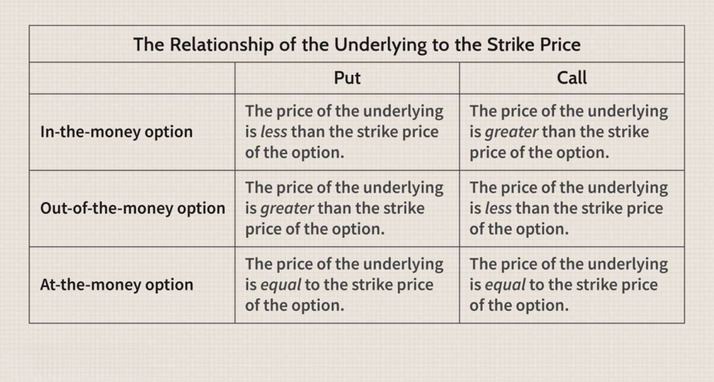

In the ever-evolving landscape of modern financial markets, investors have access to a diverse array of investment options ranging from traditional asset classes such as stocks, bonds, and mutual funds to more sophisticated instruments like derivatives, including futures and options. Among these, options trading has garnered significant attention due to its potential for high leverage and strategic diversity. An option is a financial derivative that contracts the right, but not the obligation, to buy (call option) or sell (put option) an underlying asset at a predetermined price before or at a specified expiration date. This flexibility makes options a valuable tool for both speculative trading and hedging strategies.

Coupled with the rise of options trading, algorithmic trading has reshaped the contours of the financial markets. Algorithmic trading leverages computer algorithms to execute trades at unprecedented speeds and efficiencies, often minimizing human intervention. Algorithms can assess vast datasets, apply predefined trading strategies, and execute orders based on complex calculations faster than any human trader. This method of trading not only enhances precision but also reduces the emotional bias that can affect trading decisions.

The confluence of options trading and algorithmic trading has elevated the importance of an options chain, which is a comprehensive listing of all available options contracts for a given security. The options chain provides key information, including strike prices, expiration dates, and liquidity levels, essential for constructing informed strategies. Utilizing technology and algorithms in this context allows traders to analyze the options chain more efficiently, identify opportunities, and deploy strategies that maximize returns and manage risks effectively.

This article seeks to provide a systematic exploration of options trading and algorithmic trading, beginning with a foundational understanding of options, including their characteristics, advantages, and inherent risks. It progresses to demystifying the options chain and its interpretation, essential knowledge for any options trader. Subsequently, we explore algorithmic trading, unveiling its benefits and the technological ecosystem that supports it, before delving into the integration of algorithmic strategies within options trading. The article will also highlight prominent trading platforms and tools that facilitate options and algorithmic trading, providing readers with resources to enhance their trading approach.

As we continue to navigate through the complexities of modern financial markets, the intersection of technology and trading offers an ever-expanding frontier for investment innovation. By equipping oneself with the knowledge and tools presented in this article, traders can better position themselves to capitalize on the dynamic opportunities that lie ahead.

## Table of Contents

## Understanding Options Trading

Options trading is a financial practice that involves trading contracts known as options, which give an investor the right, but not the obligation, to buy or sell an underlying asset at a predetermined price within a specified timeframe. This type of trading is a cornerstone of modern financial markets due to its ability to offer diverse risk management and speculative opportunities.

Options Contracts: Calls and Puts

There are two primary types of options contracts: calls and puts. A call option gives the holder the right to purchase the underlying asset at a specified strike price before the option expires. Conversely, a put option allows the holder to sell the underlying asset at the strike price before expiration. Each option contract specifies the strike price, expiration date, and the underlying asset, which could be stocks, indices, commodities, or other financial instruments.

Advantages of Trading Options: Leverage and Flexibility

Options trading offers several notable advantages, including leverage and flexibility. Leverage is achieved because options require a lower upfront investment compared to directly purchasing the underlying asset, allowing traders to control a larger position size. For instance, instead of buying 100 shares of a stock, a trader can buy a call option representing 100 shares with a fraction of the capital. This leverage can amplify potential returns, but it also increases the potential for significant losses.

Flexibility is another hallmark advantage. Traders can use options to speculate on price movements, hedge existing positions, or generate additional income through strategies such as covered calls. Options provide strategies for profiting in various market conditions, whether bullish, bearish, or neutral.

Risks and Risk Management in Options Trading

While options trading can be lucrative, it also carries significant risks. The most apparent risk is the potential loss of the entire premium paid for the option if it expires worthless. Moreover, the leverage effect can lead to rapid losses if the market moves against the trader's position.

Effective risk management is crucial in mitigating these risks. Traders should assess their risk tolerance, set stop-loss orders, and employ strategies that align with their investment goals. Diversification of options positions and continuous monitoring of the market are essential practices to manage risk effectively.

Basic Strategies in Options Trading

Options trading encompasses a variety of strategies ranging from simple to complex. Some basic methods include:

1. **Covered Call**: This strategy involves holding a long position in an asset while selling a call option on the same asset to generate income from the option premium.

2. **Protective Put**: In this strategy, a trader owns the underlying asset and buys a put option to protect against a potential decline in the asset's price.

3. **Straddle**: By purchasing both a call and a put option with the same strike price and expiration date, a trader can profit from significant price movements in either direction.

4. **Iron Condor**: This advanced strategy involves holding positions in four different options with different strike prices, allowing traders to profit from a stock that trades within a specific range.

Options trading is a versatile and sophisticated segment of financial markets, offering an array of strategies that cater to diverse investor goals and risk profiles. Understanding the inherent characteristics, benefits, and risks associated with options is crucial for anyone looking to navigate this dynamic environment successfully.

## Decoding the Options Chain

An options chain, a comprehensive display of available option contracts for a particular security, provides traders with essential data points necessary for executing informed trading strategies. It lists all the call and put options available for a given stock, organized by expiration dates and strike prices. The options chain is crucial for traders as it offers a consolidated view of various metrics, helping them assess market sentiment, [liquidity](/wiki/liquidity-risk-premium), and potential risk-reward scenarios.

### Reading and Interpreting an Options Chain

To effectively use an options chain, traders must understand its layout and the meaning of its columns. Typically, an options chain includes the stock symbol, expiration dates, strike prices, bid and ask prices, [volume](/wiki/volume-trading-strategy), and open interest for each option listed. 

- **Stock Symbol**: Indicates the underlying asset, which is the stock for which options are being quoted.
- **Expiration Date**: The date when the option contract expires. Traders must exercise the option on or before this date, or it becomes void. 
- **Strike Price**: The set price at which an option can be bought (call) or sold (put) by the option holder. It's a critical component as it is fundamental in determining the intrinsic value and profitability of an option.
- **Bid and Ask Prices**: Reflect the current price at which participants are willing to buy (bid) or sell (ask) the option, indicative of the option's liquidity and spread.
- **Volume**: Represents the number of contracts traded for the current day, offering insight into market activity and interest.
- **Open Interest**: The total number of outstanding option contracts, providing information on the strength and persistence of a market trend.

### Using Options Chains for Trading Decisions

Options chains allow traders to evaluate several factors simultaneously. Analyzing changes in bid-ask prices, volume, and open interest can suggest market direction and help identify potential entry and [exit](/wiki/exit-strategy) points. For example, a high volume paired with rising open interest often signals that a trend is gaining strength. Additionally, comparisons between current stock prices and various strike prices can determine options' greeks, such as delta or gamma, aiding in risk management and strategy application.

### Tools and Platforms Providing Options Chain Data

Numerous trading platforms and financial services offer real-time options chain data. Platforms like Thinkorswim by TD Ameritrade, [Interactive Brokers](/wiki/interactive-brokers-api), and E*TRADE provide sophisticated tools for analyzing option chains, often integrating charting features, analytical tools, and historical data analysis. These platforms may also offer educational resources for traders to enhance their understanding and application of options data.

In summary, a solid grasp of an options chain is essential for any trader looking to utilize options in their trading strategy. By leveraging this data, traders can better navigate the complexities of options markets, optimize their trading decisions, and potentially increase their profitability.

 to Algorithmic Trading

Algorithmic trading is a method of executing orders using automated pre-programmed trading instructions accounting for variables such as time, price, and volume. This practice leverages the power of computers to systematically execute and optimize trades at speeds and frequencies that are impractical for human traders. It has gained a significant role in modern financial markets, contributing to increased efficiency and liquidity while minimizing the impact of human error and emotional bias.

One of the main benefits of [algorithmic trading](/wiki/algorithmic-trading) is its speed. Algorithms can process vast amounts of market data and execute trades in milliseconds, far surpassing human capabilities. This speed allows traders to capture short-lived market inefficiencies that are undetectable without advanced computation. Precision is another advantage; algorithms can be designed to rigorously adhere to a predetermined trading strategy, reducing deviations that could arise from human intervention. This precision helps in executing trades at optimal prices while ensuring consistency in strategy implementation.

Various strategies are employed in algorithmic trading. Some common ones include trend-following strategies, where algorithms identify and capitalize on market trends, and [arbitrage](/wiki/arbitrage) opportunities, which exploit price discrepancies between instruments or markets. Statistical arbitrage involves complex statistical models to find trading opportunities, while mean reversion strategies focus on the assumption that prices and returns eventually move back to their historical average.

The technology underpinning algorithmic trading incorporates sophisticated software and powerful hardware. Trading algorithms are typically developed using programming languages like Python, C++, and Java. Python, in particular, is favored for its extensive libraries tailored for data analysis and financial modeling. Platforms such as MetaTrader, QuantConnect, and Interactive Brokers provide integrated environments and APIs for developing and testing trading algorithms.

Backtesting and simulation are crucial components in developing successful trading algorithms. Backtesting involves running the trading strategy on historical data to assess its viability and profitability without risking actual capital. This process allows traders to refine their algorithms by evaluating historical performance and adjusting parameters to enhance future outcomes. Simulation offers a risk-free environment where traders can test strategies in real-time market conditions, further ensuring robustness before deploying algorithms in live trading scenarios.

Conclusively, algorithmic trading represents a convergence of technology and finance, enabling more proficient and sophisticated market engagement. It continues to evolve with advancements in computing power and data analytics, promising ongoing enhancements in trading dynamics and investment strategies.

## Integrating Options Trading with Algo Trading

Algorithmic trading has revolutionized various facets of financial markets, including options trading. By leveraging sophisticated algorithms, traders can enhance their strategies, optimize trade execution, and potentially increase profitability. This section explores the integration of algorithmic trading with options trading strategies, emphasizing the development process, potential benefits, successful examples, and associated challenges.

Algorithmic trading can be effectively applied to options strategies through systematic development processes. Initially, traders must define their strategy by identifying specific conditions and rules for entering and exiting trades. This often involves analyzing historical data to identify patterns or market inefficiencies. Utilizing programming languages such as Python, traders can create algorithms that automate these strategies. For instance, the algorithm may execute trades based on the relative pricing of options (using the Greeks), or [volatility](/wiki/volatility-trading-strategies) patterns.

The development of an algorithm for options trading involves several key steps. First, the trader needs to define the trading hypothesis and collect relevant market data. The next step is to implement the algorithm, using [backtesting](/wiki/backtesting) to validate its effectiveness against historical data. Python libraries such as NumPy and pandas are often employed for data manipulation and analysis, while [backtrader](/wiki/backtrader) or Zipline might be used for backtesting. Consideration of market conditions, such as liquidity and trading volume, is crucial during this phase. Finally, the algorithm is refined through optimization techniques, such as parameter tuning, to enhance performance.

The potential benefits of integrating algorithms with options trading are significant. Algorithms can operate at remarkable speed and with precision, ensuring trades are executed instantaneously upon meeting predefined criteria. This reduces the possibility of human error or delay, which is often associated with manual trading. Moreover, algorithms help mitigate emotional biases, enabling traders to stick to their strategies even during volatile market conditions. This disciplined approach can ultimately lead to increased profitability.

Several successful algo trading strategies have emerged in options trading. One example is the market-making strategy, where algorithms provide liquidity by offering to buy and sell options at different prices, profiting from the bid-ask spread. Another is the arbitrage strategy, which exploits price discrepancies between options on different exchanges or between the option and its underlying asset. A more advanced strategy involves volatility modeling, where algorithms anticipate and trade on changes in implied volatility, potentially capturing profitable opportunities.

However, algorithmic options trading is not without challenges. Execution speed is paramount; delays can lead to missed opportunities or adverse price movements. Therefore, co-locating servers close to exchange infrastructures, known as low-latency trading, can be a consideration for institutional traders. Data accuracy and integrity are also critical; algorithms rely heavily on real-time data to function correctly, and any discrepancies can result in erroneous trades. Furthermore, regulatory and technological changes require ongoing adaptation of algorithms to remain compliant and competitive.

In conclusion, integrating algorithmic trading with options trading presents a powerful approach to capitalize on market opportunities. By automating strategies and leveraging data-driven insights, traders can enhance their decision-making processes, mitigate risks, and improve overall trading performance. Nonetheless, careful consideration of execution and data challenges is essential for successful implementation.

## Tools and Platforms for Options and Algo Trading

In the modern landscape of investing, selecting the right tools and platforms is pivotal for both options and algorithmic trading. Numerous platforms cater to these types of trading, each offering a suite of features designed to enhance decision-making and refine trading strategies.

One of the most prominent platforms is **Thinkorswim by TD Ameritrade**, known for its robust analytical tools, comprehensive educational resources, and a user-friendly interface. It offers a multitude of charting capabilities and technical indicators, crucial for analyzing options chains and developing algo trading strategies.

Another popular choice is **Interactive Brokers**, which provides a sophisticated platform with extensive market data, news feeds, and real-time monitoring functionalities. Its API supports several programming languages, including Python, enabling traders to develop customized algorithms. This flexibility, combined with competitive pricing on commissions, makes it attractive for both retail and institutional investors.

**TradeStation** is also noteworthy, acclaimed for its ease of use and highly customizable trading environment. The platform provides powerful analytical tools and simulations to test algorithms and options strategies in a risk-free setting. Its extensive educational resources assist in learning and improving one's trading skills.

Platforms like **E*TRADE** and **Charles Schwab** have embraced technology to offer comprehensive options trading services integrated with features that support algorithmic strategies. These include real-time data, market analysis tools, and access to financial news, aiding traders in staying updated with the latest market trends.

Educational resources and communities are essential components for traders seeking to deepen their knowledge. Websites like **Options Trading IQ** and forums like **Reddit's r/algotrading** provide extensive educational materials and discussions on strategies, while platforms like **Coursera** and **Khan Academy** offer structured courses in finance and programming relevant to algorithmic trading.

Staying informed is crucial, given the fast-paced nature of financial markets. Platforms like **Bloomberg Terminal** and **Reuters Eikon** supply comprehensive market news and data, although they are typically used by institutions due to their cost. However, for retail investors, free or lower-cost alternatives include **Yahoo Finance** and **Google Finance**, offering timely news updates and data.

For those honing their skills or testing new strategies, platforms that offer paper trading and simulation modes are invaluable. **TradingView** and **NinjaTrader** are examples of such platforms, providing a simulated trading environment to practice and refine strategies without risk to real capital.

The integration of options and algorithmic trading on these platforms equips traders with sophisticated tools to analyze and execute strategies effectively. As technology continues to evolve, embracing these resources allows investors to remain agile and competitive in the electronic trading arena.

## Conclusion

In conclusion, the dynamic landscape of modern financial markets offers myriad investment opportunities, with options trading featuring prominently due to its inherent flexibility and potential for high returns. The adoption of algorithmic trading strategies has further enhanced the efficacy of options trading by augmenting decision-making processes with precision, speed, and reduced emotional bias. This integration empowers traders to develop sophisticated strategies that can react to market signals almost instantaneously, thereby optimizing investment outcomes.

The potential benefits of combining options trading with algorithmic strategies are substantial. Traders can achieve greater accuracy in executing trades, leverage advanced analytical tools to predict market movements, and execute complex strategies that would be difficult or impossible to manage manually. Moreover, algorithmic trading enables continuous market monitoring and rapid adaptation to changing conditions, which is crucial in today’s fast-paced trading environments.

As technology continues to evolve, so do trading techniques and strategies. The ongoing advancement in computational power, the refinement of predictive models, and the expansion of datasets accessible to traders signify that the future will likely hold even more innovative trading solutions. Staying informed about these technological advancements is essential for those who wish to remain competitive in the financial markets.

Aspiring traders are encouraged to continuously learn and explore advanced trading techniques. Engaging with educational resources, practicing with simulation platforms, and participating in trading communities can significantly enhance a trader’s understanding and capability. The journey into options and algorithmic trading promises both challenges and rewards, and those who commit to mastering these disciplines are well-positioned to capitalize on the opportunities they present.

## References & Further Reading

[1]: "Options, Futures, and Other Derivatives" by John C. Hull - A comprehensive guide to understanding options and other derivative markets.

[2]: "Algorithmic Trading: Winning Strategies and Their Rationale" by Ernest P. Chan - This book provides insights into algorithmic trading strategies.

[3]: "Options as a Strategic Investment" by Lawrence G. McMillan - Detailed exploration of options strategies for investment.

[4]: Lopez de Prado, Marcos. "Advances in Financial Machine Learning." - Discusses the intersection of financial markets and machine learning methods.

[5]: "Quantitative Finance For Dummies" by Steve Bell - Explores quantitative methods in finance, including algorithmic trading.