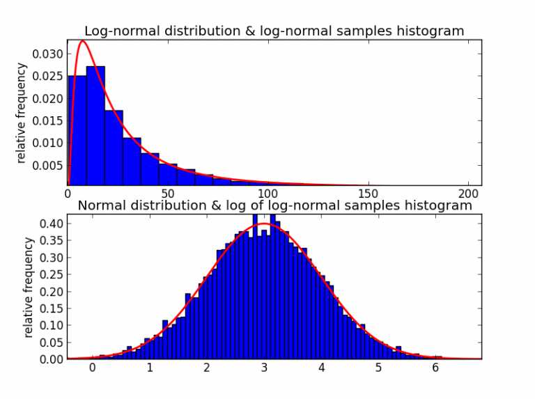

Stochastic calculus is a sophisticated mathematical framework that serves as a cornerstone in quantitative finance, primarily for its ability to model uncertainty and risk. Financial markets are inherently volatile and unpredictable, and stochastic calculus offers the tools necessary to represent and analyze the random processes that underpin these markets. The ability to model random asset prices is crucial for making informed decisions and developing reliable strategies in fields such as algorithmic trading.

A central component of stochastic calculus is the stochastic differential equation (SDE), which is used to describe the dynamics of variables that evolve over time with inherent randomness. SDEs provide the groundwork for a variety of financial models, enabling the prediction and analysis of future asset prices under random influences. Another fundamental concept is Ito's Lemma, a powerful result that generalizes the chain rule of classical calculus to functions of stochastic processes. This lemma is instrumental in transforming complex stochastic processes into more manageable forms, facilitating their use in financial modeling.



The role of stochastic calculus in finance extends to several key applications. In option pricing, it forms the basis for models like the renowned Black-Scholes model, which revolutionized the ability to value derivative instruments. Interest rate modeling also benefits from stochastic calculus, as seen in models such as the Vasicek and Cox-Ingersoll-Ross, which describe the evolution of interest rates as stochastic processes. Additionally, stochastic calculus plays a vital role in portfolio optimization, where it aids in the development of strategies that optimize asset allocation over time, considering both expected returns and associated risks.

Throughout this article, we will explore these applications and elucidate how stochastic calculus enhances the understanding and execution of financial models. Whether it is through option pricing, interest rate modeling, or portfolio optimization, stochastic calculus provides a robust framework for addressing the complexities of financial markets.

## Table of Contents

## Foundations of Stochastic Calculus

Stochastic calculus is an advanced mathematical framework that extends probability theory and calculus to model and analyze random processes. This field plays a pivotal role in quantitative finance, offering tools to model the complexity of financial markets more accurately. Stochastic calculus traces its roots back to the pioneering work of Kiyoshi Itô in the 1940s, which laid the groundwork for its application in financial modeling.

The development of stochastic calculus was driven by the need to bridge the gap between discrete models and continuous-time financial models. Traditional financial models relied heavily on discrete-time frameworks, which, while useful, were limited in their ability to represent the continuous nature of asset price movements. Itô's work introduced stochastic differential equations (SDEs), providing a robust framework for modeling the continuous paths followed by asset prices.

Key stochastic processes are fundamental to stochastic calculus, among which Brownian motion, Markov processes, and Poisson processes are particularly significant.

1. **Brownian Motion**: Often referred to as the Wiener process, Brownian motion is a continuous-time stochastic process with stationary independent increments and paths that are continuous but nowhere differentiable. It serves as a mathematical model for the random movement of particles suspended in a fluid and is key to financial models such as the Black-Scholes option pricing model. Mathematically, a standard Brownian motion $W(t)$ satisfies $W(0) = 0$, and for $0 \leq s < t$, the increment $W(t) - W(s)$ is normally distributed with mean 0 and variance $t-s$.

2. **Markov Processes**: A stochastic process is considered a Markov process if the future states depend only on the present state, not on the sequence of events that preceded it. This memoryless property, known as the Markov property, allows for the simplification of complex systems by focusing on current conditions.

3. **Poisson Processes**: These are used to model events occurring at a random rate over time. Unlike Brownian motion, Poisson processes have jumps, making them suitable for modeling sudden shifts in financial markets, such as market rallies or crashes.

Stochastic calculus enables the integration and differentiation of stochastic processes, thereby serving as an essential tool for the formulation and solution of SDEs. These equations, featuring prominently in financial models, describe the evolution of random variables over time and are used for tasks like pricing derivatives and managing financial risks.

The advent of stochastic calculus marked a significant advancement in the capability to model financial markets, allowing for the development of more sophisticated models that capture the inherent randomness and unpredictability of these environments. Its applications extend beyond finance into fields such as physics, biology, and engineering, where modeling randomness is equally crucial.

## Key Concepts in Stochastic Calculus

Stochastic calculus, an extension of traditional calculus, provides a mathematical framework for modeling systems influenced by randomness. Central to this framework are Stochastic Differential Equations (SDEs), which are used to describe the evolution of random variables over time. SDEs are formulated similarly to ordinary differential equations but incorporate a stochastic component, typically modeled using Brownian motion or Wiener process. Fundamentally, an SDE can be expressed in the form:

$$
dX_t = \mu(X_t, t) dt + \sigma(X_t, t) dW_t
$$

where $X_t$ is the stochastic process, $\mu$ is the drift term, $\sigma$ is the diffusion term, and $dW_t$ represents the increment of a Wiener process.

A pivotal result in stochastic calculus is Ito's Lemma, analogous to the chain rule in classical calculus. Ito's Lemma is essential for transforming functions of stochastic processes, enabling the derivation of financial models that require such transformations. If $f(X_t, t)$ is a twice differentiable function, Ito's Lemma states:

$$
df(X_t, t) = \left( \frac{\partial f}{\partial t} + \mu \frac{\partial f}{\partial X} + \frac{1}{2} \sigma^2 \frac{\partial^2 f}{\partial X^2} \right) dt + \sigma \frac{\partial f}{\partial X} dW_t
$$

This lemma underpins many financial derivatives pricing models by allowing the manipulation of SDEs involving such derivatives.

Martingales are another foundational concept. A stochastic process is a martingale if its expected future value, conditional on past events, is equal to its current value. This property is crucial in pricing theory, particularly in the risk-neutral valuation of derivatives. Risk-neutral measures, often employed in financial mathematics, allow for the simplification of pricing models where the expected value of a payoff is calculated under an equivalent martingale measure.

Girsanov's Theorem is closely related, providing the conditions under which a change of measure transforms a process into a martingale. This theorem aids risk management by permitting the conversion of processes under different probability measures, facilitating the pricing of complex financial instruments.

Stochastic integration is the method by which integration is extended to stochastic processes. The Ito integral, juxtaposed with the Riemann or Lebesgue integral, accommodates the randomness of integrators and is used to solve SDEs. It accumulates the randomness integrated over time, and unlike classical integrals, it is path-dependent.

In practical terms, stochastic integration and the Ito integral play vital roles in financial engineering, particularly in the numerical simulation of SDEs, which is common in derivative pricing and risk management. This integration requires careful definition due to the non-deterministic behavior of the integrand, and often employs simulation techniques such as Monte Carlo methods or finite difference methods in computational applications.

These concepts provide the foundation for much of the quantitative techniques employed in finance, including the formulation of models used for asset pricing, risk assessment, and strategic asset allocation.

## Stochastic Calculus in Finance

Stochastic calculus has had a profound impact on finance, particularly in option pricing, [interest rate](/wiki/interest-rate-trading-strategies) modeling, and portfolio optimization. The introduction of stochastic calculus into option pricing is epitomized by the Black-Scholes-Merton model. This model applies stochastic differential equations to quantify the dynamic behavior of option prices, assuming that asset prices follow a geometric Brownian motion. The Black-Scholes formula is given by:

$$
C(S, t) = S_t N(d_1) - Ke^{-r(T-t)}N(d_2)
$$

where $d_1 = \frac{\ln(S_t/K) + (r + \sigma^2/2)(T-t)}{\sigma \sqrt{T-t}}$ and $d_2 = d_1 - \sigma \sqrt{T-t}$. Here, $S_t$ is the current stock price, $K$ the strike price, $T$ the time to expiration, $r$ the risk-free rate, $\sigma$ the volatility, and $N(\cdot)$ the cumulative distribution function of the standard normal distribution. This revolutionary approach enabled a more accurate assessment of option pricing by incorporating the stochastic nature of financial markets.

In interest rate modeling, stochastic calculus aids in describing the evolution of interest rates over time through various models such as the Vasicek model and the Cox-Ingersoll-Ross (CIR) model. These models assume that interest rates follow a stochastic process, accommodating randomness and mean reversion. The Vasicek model, for instance, is expressed through the stochastic differential equation:

$$
dr_t = a(b - r_t)dt + \sigma dW_t
$$

where $a$ is the speed of reversion, $b$ is the long-term mean, $\sigma$ is the volatility, and $dW_t$ represents the Wiener process.

Portfolio optimization in continuous-time settings benefits from stochastic calculus through stochastic control theory. This mathematical framework allows investors to determine optimal asset allocation strategies dynamically by formulating problems in a continuous-time setup. The Hamilton-Jacobi-Bellman equation is commonly used to find the optimal strategy by minimizing or maximizing a certain objective function, often related to the expected utility of the portfolio's return.

Dynamic asset allocation strategies rely on stochastic models to continually adjust the portfolio composition in response to changing market conditions. Risk management frameworks employ stochastic calculus for evaluating and mitigating financial risks by simulating a range of potential outcomes for asset prices and interest rates. These strategies facilitate efficient risk management by allowing financial institutions to make informed decisions based on probabilistic forecasts.

In summary, stochastic calculus plays a crucial role in modern financial mathematics by offering robust models and tools for option pricing, interest rate modeling, and portfolio optimization. By incorporating randomness into financial models, it addresses the inherent uncertainties of financial markets, enhancing the accuracy and reliability of financial analyses.

## Modeling Uncertainty and Risk

Stochastic calculus is a pivotal tool in modeling uncertainty and risk in financial markets, primarily through the use of stochastic differential equations (SDEs). The diffusion term in an SDE is fundamental to this calculus, representing the inherent market [volatility](/wiki/volatility-trading-strategies). This diffusion process is typically modeled using Brownian motion, which captures the continuous and erratic nature of asset prices.

Beyond simple diffusion, financial markets often exhibit sudden jumps, which diffusion alone cannot model. Jump processes, such as the Poisson process, are integrated into SDEs to account for these abrupt changes, resulting in models like the Merton Jump-Diffusion Model. These models are particularly valuable in assessing risk, as they allow for a realistic assessment of market scenarios, including extreme events.

Risk-neutral valuation plays a crucial role in pricing derivatives. This approach involves constructing a probability measure under which the present value of cash flows can be computed by discounting expected future cash flows at the risk-free rate. The change of measure is facilitated by Girsanov's theorem, transforming the original probability measure into a risk-neutral one without altering the real-world dynamics of the underlying asset.

Stochastic calculus also contributes significantly to risk management through various quantitative metrics. Value at Risk (VaR) quantifies the potential loss in the value of a portfolio over a defined period for a given confidence interval. Expected Shortfall (ES), or conditional VaR, improves upon VaR by considering the magnitude of losses exceeding the VaR threshold. Credit risk evaluations benefit from models like the Vasicek model, which employ stochastic calculus to simulate default probabilities and loss distributions.

Here is a simple Python code snippet illustrating the calculation of VaR and Expected Shortfall using historical simulation:

```python
import numpy as np

# Generate random returns for a portfolio
np.random.seed(42)
returns = np.random.normal(0.001, 0.02, 1000)

# Define parameters
confidence_level = 0.95

# Calculate VaR
var_threshold = np.percentile(returns, (1-confidence_level) * 100)
var = -np.percentile(returns, (1-confidence_level) * 100)

# Calculate Expected Shortfall (ES)
es = -np.mean(returns[returns < var_threshold])

print(f"Value at Risk (VaR): {var:.4f}")
print(f"Expected Shortfall (ES): {es:.4f}")
```

This script creates a Gaussian distribution of returns and calculates the VaR and ES for a given confidence level, demonstrating the practical application of stochastic concepts in risk management. Overall, stochastic calculus not only assists in capturing market volatilities and extreme movements but also provides robust methods for pricing derivatives and managing financial risk.

## Applications in Financial Markets

Stochastic calculus plays a vital role in several areas of the financial markets, providing a robust framework for addressing the complexities and uncertainties inherent in these markets. One of the primary applications of stochastic calculus is in the pricing and hedging of derivatives beyond the classical Black-Scholes model. The Black-Scholes model, while foundational, operates under certain assumptions such as constant volatility and log-normal distribution of asset prices, which may not fully capture the realities of market conditions. Therefore, stochastic calculus allows for the extension of these models to incorporate exotic options and credit derivatives, where the payoff structure or underlying risk factors may be complex.

In fixed income markets, stochastic calculus is crucial for the valuation of bonds and mortgage-backed securities. Models such as the Vasicek and Hull-White models employ stochastic differential equations to describe the evolution of interest rates over time, providing insights into bond pricing and yield curve dynamics. These models can accommodate the randomness and uncertainty in interest rate movements, enabling more accurate predictions of bond prices and returns.

The foreign exchange market also benefits from stochastic models, which aid in the pricing of currency derivatives and the analysis of exchange rate dynamics. By applying stochastic calculus, practitioners can model exchange rates as continuous processes influenced by various factors such as interest rate differentials, geopolitical events, and economic indicators. This approach can enhance the understanding of currency movements and inform hedging strategies against currency risk.

Algorithmic trading strategies leverage stochastic models to achieve optimal execution and statistical [arbitrage](/wiki/arbitrage). These strategies depend on high-frequency data and require real-time decision-making, where stochastic calculus provides the necessary tools to model price fluctuations and estimate future price movements. Stochastic control and the use of martingales in these models help traders identify inefficiencies in the market, predict short-term returns, and execute trades that capitalize on price discrepancies across different trading platforms.

In conclusion, the application of stochastic calculus in financial markets extends beyond traditional boundaries, offering sophisticated models that account for the randomness and complexity of financial phenomena. By providing a means to model uncertainty and volatility, stochastic calculus equips financial practitioners with the tools needed to navigate the challenges of pricing derivatives, managing interest rate risk, understanding foreign exchange dynamics, and executing [algorithmic trading](/wiki/algorithmic-trading) strategies effectively.

## Advanced Topics and Recent Developments

Fractional Brownian Motion (fBM) and rough volatility models have emerged as significant advancements in stochastic calculus, providing deeper insights into financial market behaviors. Traditional models often rely on Brownian motion, which assumes independence of increments and constant volatility across time scales. However, fractional Brownian motion introduces the concept of memory into the modeling framework through its self-similarity and long-range dependence properties[1]. This departure allows for a more accurate representation of market phenomena where volatility exhibits temporal dynamics.

Rough volatility models capitalize on these concepts by assuming that volatility is driven by stochastic processes with Hölder continuity lesser than 0.5[2]. Foundational work by Gatheral, Jaisson, and Rosenbaum in 2014 showed that empirical evidence of volatility surfaces better aligns with rough volatility rather than classical ones, making them a valuable tool for capturing real-world market frictions.

Another promising development is the integration of [machine learning](/wiki/machine-learning) with stochastic calculus. Neural Stochastic Differential Equations (Neural SDEs) combine the expressive power of neural networks with the stochastic modeling framework to adaptively learn the dynamics of financial processes[3]. These models aim to overcome the constraints of pre-specified functional forms by leveraging data-driven discovery of dynamics, bringing scalability and flexibility to modeling. Reinforcement learning also interfaces with stochastic calculus by formulating problems such as option pricing or portfolio optimization as Markov Decision Processes (MDP), where the optimal decision policy evolves with the stochastic nature of markets[4].

Quantum stochastic calculus presents a cutting-edge frontier with potential applicability in finance. It extends classical stochastic calculus by considering non-commutative probability spaces, which can model quantum uncertainty. Researchers are exploring its utilization for portfolio optimization and risk management where traditional models face limitations[5]. These theoretical advancements could lead to novel algorithms that exploit quantum annealing or quantum computing capabilities, promising efficiency in tackling complex financial problems.

Collectively, these advanced topics demonstrate the expanding horizons of stochastic calculus in finance, addressing traditional model shortcomings by incorporating modern computational techniques and theoretical innovations.

**References:**

1. Mandelbrot, B. B., & Van Ness, J. W. (1968). Fractional Brownian motions, fractional noises and applications. SIAM Review, 10(4), 422-437.
2. Gatheral, J., Jaisson, T., & Rosenbaum, M. (2018). Volatility is rough. Quantitative Finance, 18(6), 933-949.
3. Tzen, B., & Raginsky, M. (2019). Neural Stochastic Differential Equations: Deep Latent Gaussian Models in the Diffusion Limit. arXiv preprint arXiv:1905.09883.
4. Sutton, R. S., & Barto, A. G. (2018). Reinforcement learning: An introduction. MIT press.
5. Barchielli, A., & Gregoratti, M. (2020). Quantum continuous measurements: The stochastic Schrodinger equations and the quantum filtering. Springer Nature.

## Challenges and Limitations

Stochastic calculus, while instrumental in financial modeling, presents several challenges and limitations that warrant careful consideration. A primary concern is the reliance on underlying assumptions inherent in stochastic models, which can lead to model risk. Model risk arises when the assumptions, such as the nature of asset price dynamics or the constancy of volatility, do not adequately capture reality. This mismatch can result in significant deviations between predicted and actual outcomes, potentially leading to adverse financial impacts.

Parameter estimation is another significant challenge encountered in applying stochastic calculus. Models often require precise estimation of parameters such as volatility, drift, and correlation, which may be subject to frequent changes. In addition, observed market data, riddled with noise, further complicates accurate estimation. Proper estimation techniques, such as Maximum Likelihood Estimation or the method of moments, must be employed, yet they do not entirely eliminate the uncertainty inherent in these estimates.

Computational demands also present a considerable hurdle in implementing stochastic models, particularly when dealing with high-dimensional problems or complex derivatives. Stochastic differential equations and their solutions can be computationally intensive, necessitating sophisticated numerical methods like Monte Carlo simulation or finite difference methods to find approximate solutions. These computations are resource-intensive and can pose scalability issues, especially in large-scale financial systems.

Handling extreme events, such as market crashes or unexpected economic shifts, reflects another limitation. Traditional stochastic models may inadequately capture tail risks or extreme market movements, as they often assume continuous paths without abrupt changes. Incorporating jump processes or regime-switching models can provide better approximations, yet they add layers of complexity and further assumptions, which may be difficult to validate.

Behavioral factors introduce additional complexity into stochastic calculus models. Human behavior and market sentiment can heavily influence financial markets, introducing biases and irrationalities that standard stochastic models fail to capture. As a result, there is an emerging need to integrate behavioral finance into mathematical models, which might involve developing hybrid models that combine stochastic calculus with insights from psychology and other social sciences.

These challenges highlight the limitations of current stochastic models in finance and underline the necessity for ongoing research and development to refine modeling techniques, improve parameter estimation methods, and incorporate behavioral factors more effectively. Addressing these issues is crucial for enhancing the reliability and accuracy of financial models that underpin critical decision-making in the markets.

## Future Directions

The integration of stochastic calculus with big data and [artificial intelligence](/wiki/ai-artificial-intelligence) (AI) is poised to revolutionize financial modeling and risk management. The capability to process and analyze vast datasets using AI methods enhances the predictive strength and adaptability of stochastic models. Machine learning algorithms can potentially improve the calibration of complex stochastic models, offering more precise parameter estimation and reducing the model risk associated with assumptions in classical financial models.

Multi-scale modeling, which seeks to address financial phenomena occurring at different time scales, is becoming increasingly important. This approach enables the blending of detailed high-frequency data with broader, long-term trends, providing comprehensive insights into market dynamics. Stochastic calculus plays a critical role in this area, allowing for the development of multi-scale models that can navigate between micro-level processes like tick-by-tick price changes and macro-level trends, such as economic cycles.

Emerging fields such as sustainable finance and decentralized finance (DeFi) introduce novel applications for stochastic calculus. In sustainable finance, stochastic models can enhance climate risk assessments, integrating environmental variables into traditional financial metrics to better understand and manage potential impacts. Meanwhile, DeFi, characterized by its blockchain-based financial services, leverages stochastic calculus for pricing assets and managing risks in decentralized markets. The decentralized nature of these systems introduces unique forms of volatility and uncertainty, which stochastic models are well-equipped to analyze.

As climate risk modeling becomes more pertinent, stochastic calculus provides tools to simulate scenarios and assess financial implications of climate events. Accurate modeling of such risks can inform investment strategies and policy-making, promoting resilience in financial markets. By incorporating climate variables into risk assessment frameworks, financial institutions can develop more sophisticated responses to evolving environmental challenges.

In summary, the future of stochastic calculus in finance is set to be shaped by its integration with cutting-edge technologies and emerging market needs. This integration promises to refine traditional financial models and pioneer innovative approaches to handling market risks and opportunities.

## Conclusion

Stochastic calculus acts as a fundamental framework in quantitative finance, providing the necessary tools to model and interpret market uncertainties. Its capability to address the randomness inherent in financial markets makes it indispensable for tasks such as option pricing, interest rate modeling, and risk management. By employing stochastic calculus, analysts can construct models that account for the unpredictable nature of asset prices and interest rates, which are often seen as stochastic processes. 

However, despite its strengths, stochastic calculus is not without its limitations. The reliance on assumptions, such as market efficiency and continuous trading, introduces model risk. These assumptions can lead to inaccuracies in financial predictions if not carefully considered. Moreover, practical challenges like parameter estimation and computational demands present additional hurdles. As a result, it's crucial for practitioners to remain cognizant of these limitations and employ a prudent approach when utilizing stochastic calculus for financial modeling.

Looking ahead, the integration of stochastic calculus with artificial intelligence and advanced analytics presents exciting prospects for the financial sector. Machine learning techniques, when combined with stochastic models, promise to enhance the precision of risk assessments and investment strategies. This synergy could lead to more robust models that better capture the nuances of market dynamics, aiding in more effective risk management and investment decision-making. By embracing these advancements, finance professionals can potentially unlock innovative approaches to understanding and navigating the complexities of modern financial markets.

## References & Further Reading

[1]: Baxter, M., & Rennie, A. (1996). ["Financial Calculus: An Introduction to Derivative Pricing."](https://books.google.com/books/about/Financial_Calculus.html?id=3_4gAwAAQBAJ) Cambridge University Press.

[2]: Shreve, S. E. (2004). ["Stochastic Calculus for Finance I: The Binomial Asset Pricing Model."](https://link.springer.com/book/10.1007/978-0-387-22527-2) Springer Finance.

[3]: Øksendal, B. (2013). ["Stochastic Differential Equations: An Introduction with Applications."](https://link.springer.com/book/10.1007/978-3-642-14394-6) Springer.

[4]: Gatheral, J. (2006). ["The Volatility Surface: A Practitioner's Guide."](https://www.wiley.com/en-us/The+Volatility+Surface%3A+A+Practitioner%27s+Guide-p-9780471792512) Wiley.

[5]: Black, F., & Scholes, M. (1973). ["The Pricing of Options and Corporate Liabilities"](https://www.cs.princeton.edu/courses/archive/fall09/cos323/papers/black_scholes73.pdf). Journal of Political Economy, 81(3), 637-654.

[6]: Vasicek, O. (1977). ["An Equilibrium Characterization of the Term Structure."](https://www.sciencedirect.com/science/article/pii/0304405X77900162) Journal of Financial Economics, 5(2), 177-188.

[7]: Hull, J. C. (2009). ["Options, Futures, and Other Derivatives."](https://www.semanticscholar.org/paper/Options%2C-Futures%2C-and-Other-Derivatives-Hull/89bdee500c8623864fc9eb7a471546aa713acc44) Pearson Prentice Hall.

[8]: Merton, R. C. (1976). ["Option Pricing when Underlying Stock Returns are Discontinuous."](https://www.sciencedirect.com/science/article/pii/0304405X76900222) Journal of Financial Economics, 3(1), 125-144.

[9]: Karatzas, I., & Shreve, S. E. (1998). ["Methods of Mathematical Finance."](https://link.springer.com/book/10.1007/978-1-4939-6845-9) Springer.