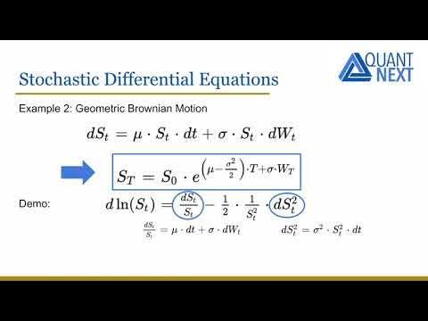

## Table of Contents

## What is stochastic calculus and why is it important?

Stochastic calculus is a branch of mathematics that deals with systems influenced by randomness. It's like regular calculus, but instead of everything being predictable, some parts are uncertain, kind of like flipping a coin where you don't know if it will land heads or tails. This type of math is used to study things that change over time but have some unpredictable elements, like stock prices or weather patterns.

The importance of stochastic calculus comes from its ability to help us understand and manage uncertainty in the real world. For example, in finance, it helps people make better decisions about investments by modeling how stock prices might move randomly over time. This can be really useful for creating strategies to reduce risk. In other fields like physics or biology, it helps scientists understand how random events affect systems, like how molecules move or how diseases spread. By using stochastic calculus, we can make better predictions and decisions even when things are unpredictable.

## How does stochastic calculus differ from traditional calculus?

Stochastic calculus and traditional calculus both deal with how things change over time, but they handle uncertainty differently. Traditional calculus works with functions that are smooth and predictable. For example, if you know the speed of a car, you can use traditional calculus to figure out exactly where it will be at any time in the future. Everything is certain and follows a clear path.

On the other hand, stochastic calculus is used when things are not so predictable. It includes randomness, like how stock prices can jump up or down unexpectedly. Instead of smooth functions, stochastic calculus uses things called stochastic processes, which can have sudden changes or random movements. This makes it perfect for modeling real-world situations where you can't predict everything, like weather patterns or the spread of diseases.

## What are the basic concepts of probability theory needed for stochastic calculus?

To understand stochastic calculus, you need to know some basic ideas from probability theory. One of these is the concept of a random variable. A random variable is like a number that you don't know yet because it depends on chance, like the outcome of rolling a die. Probability theory helps us figure out how likely different outcomes are. For example, when you roll a die, each number from 1 to 6 has a 1 in 6 chance of coming up. We use probabilities to predict what might happen, even if we can't be sure.

Another important idea is the concept of a stochastic process. A stochastic process is a collection of random variables that change over time. Think of it like watching the stock market, where the price of a stock changes from one moment to the next in a way that's not fully predictable. In stochastic calculus, we use these processes to model how things change over time with some randomness involved. Understanding these processes helps us make sense of and work with situations that have uncertainty, like predicting future stock prices or modeling the spread of a disease.

## What is a stochastic process and what are its types?

A stochastic process is a way to describe how something changes over time when there's some randomness involved. Imagine you're watching the weather every day. It might be sunny one day, rainy the next, and you can't predict exactly what will happen. That's a stochastic process - it's like a series of random events that unfold over time. In math, we use these processes to model things like stock prices, the spread of diseases, or how particles move in a gas.

There are different types of stochastic processes, each used for different kinds of situations. One type is called a Markov process, where the future depends only on the present, not on the past. It's like playing a board game where your next move depends only on where you are now, not on how you got there. Another type is a Poisson process, which is good for counting events that happen randomly over time, like the number of phone calls a call center gets in an hour. Each type helps us understand and predict different kinds of random events in the world.

## What is Brownian motion and how is it used in stochastic calculus?

Brownian motion, also called a Wiener process, is a type of stochastic process that describes the random movement of particles suspended in a fluid. Imagine tiny dust particles floating in water; they don't move in a straight line but jiggle around randomly. This movement, first observed by Robert Brown in 1827, is what we call Brownian motion. In math, we use it to model things that change randomly over time, like how stock prices can go up and down unpredictably.

In stochastic calculus, Brownian motion is really important because it helps us build models for things that have a lot of randomness. For example, it's used in finance to predict how stock prices might move. If you think of a stock's price as a tiny particle floating in the market, Brownian motion helps us understand how it might drift and jump around. This is super useful for creating strategies to manage risk and make better investment decisions, even when the future is uncertain.

## What is Ito's Lemma and why is it significant?

Ito's Lemma is like a special rule in stochastic calculus that helps us figure out how things change over time when there's randomness involved. Imagine you have a stock price that moves up and down unpredictably, and you want to know how the value of a related investment changes. Ito's Lemma gives us a way to calculate that by using something called a stochastic differential equation. It's like a tool that helps us turn the randomness of the stock price into a formula we can work with.

This lemma is really important because it's used a lot in finance and other fields where things change randomly. In finance, for example, it helps us understand how the price of options (which are bets on future stock prices) changes over time. By using Ito's Lemma, we can make better predictions and manage risk more effectively. It's a key part of building models that help us deal with uncertainty in the real world, making it a crucial concept in stochastic calculus.

## How do you solve stochastic differential equations (SDEs)?

Solving stochastic differential equations (SDEs) is a bit like solving a puzzle where some pieces keep changing randomly. To start, you need to know the initial condition, which is like knowing where you start on a map. Then, you use a method called the Euler-Maruyama method, which is a way to take small steps forward in time while adding in the random changes. Imagine you're walking and every step you take, the wind might push you a little to the left or right. The Euler-Maruyama method helps you figure out where you'll end up after many of these random steps.

Another way to solve SDEs is by using the Ito calculus, which is like a special set of rules for dealing with randomness. With Ito calculus, you use something called Ito's Lemma to figure out how things change over time. It's a bit like using a recipe to bake a cake, but the ingredients keep changing a little bit every time you mix them. By carefully following these rules, you can predict how things will change even when there's a lot of randomness involved. Both methods help us make sense of and work with the unpredictable changes that happen in the real world.

## What are the differences between Ito and Stratonovich calculus?

Ito and Stratonovich calculus are two ways to handle randomness in math, kind of like different tools for solving the same puzzle. Ito calculus is the more common one, and it treats randomness in a way that's easier to work with when you're trying to model things like stock prices. In Ito calculus, when you calculate how things change over time, you only look at the value right before the random change happens. It's like if you're walking and the wind suddenly pushes you, you only care about where you were just before the wind hit you.

Stratonovich calculus, on the other hand, takes a different approach. It looks at the average value during the random change, not just the value right before it happens. It's like if you're walking and the wind pushes you, you consider where you were during the whole push, not just at the start. This makes Stratonovich calculus more useful in some fields like physics, where you want to understand how things change smoothly over time. Both methods can solve the same problems, but they give slightly different answers because they handle the randomness in different ways.

## How is stochastic calculus applied in financial mathematics?

Stochastic calculus is super important in financial mathematics because it helps us understand and predict how things like stock prices change over time when there's a lot of randomness involved. Imagine you're trying to figure out if a stock's price will go up or down. It's not like a smooth ride where you can predict everything; it's more like a roller coaster with lots of ups and downs. Stochastic calculus uses tools like Brownian motion to model these random movements. By doing this, we can create better strategies for buying and selling stocks, which helps us manage risk and make smarter investment choices.

One of the big ways stochastic calculus is used in finance is through something called option pricing. Options are like bets on whether a stock's price will go up or down by a certain time. To figure out how much these bets should cost, we use a famous model called the Black-Scholes model, which is built using stochastic calculus. This model helps us understand how the price of an option changes based on the random movements of the stock it's linked to. By using stochastic calculus, we can make more accurate predictions about the future value of these options, which is really helpful for people in the financial world who are trying to make money while keeping their risks under control.

## What are some advanced topics in stochastic calculus?

Advanced topics in stochastic calculus dive deeper into understanding and managing randomness in more complex ways. One such topic is the study of stochastic partial differential equations (SPDEs). These are like regular differential equations but with added randomness, used to model things like the spread of heat in a material or the movement of fluids. SPDEs are tricky because they combine the challenges of both randomness and the complexities of partial differential equations, making them a hot area of research for scientists and mathematicians trying to understand how things change in unpredictable environments.

Another advanced topic is the theory of stochastic control, which is about making decisions in situations where randomness plays a big role. Imagine you're a captain steering a ship through stormy seas; you need to make the best choices to keep the ship safe despite the unpredictable waves. Stochastic control helps us figure out the best strategies for managing systems like financial portfolios or industrial processes, where random events can affect outcomes. It's a powerful tool for optimizing decisions in the face of uncertainty, making it crucial for fields like finance, engineering, and economics.

## How can stochastic calculus be used to model real-world phenomena?

Stochastic calculus is really useful for modeling things in the real world that change in ways we can't predict exactly. Imagine you're trying to understand how the price of a stock goes up and down. It's not like a smooth ride; it's more like a roller coaster with lots of unexpected turns. Stochastic calculus uses ideas like Brownian motion to model these random movements. By doing this, we can make better guesses about where the stock price might go next. This helps people in finance make smarter decisions about buying and selling stocks, managing their money more effectively even when the future is uncertain.

Another way stochastic calculus helps is in understanding things like the spread of diseases or how weather changes. For example, if you want to predict how a disease might spread through a population, you can't know exactly who will get sick next. But with stochastic calculus, you can model this randomness and make educated guesses about how the disease might spread over time. This is really helpful for planning things like vaccination campaigns or figuring out how to control the spread. Similarly, weather patterns are full of surprises, but by using stochastic models, scientists can predict things like rainfall or temperature changes more accurately, which is crucial for things like farming or disaster preparedness.

## What are the current research trends and future directions in stochastic calculus?

Right now, a big focus in stochastic calculus research is on stochastic partial differential equations (SPDEs). These are like regular differential equations but with randomness added in, and they're used to model things like how heat spreads or how fluids move in unpredictable ways. SPDEs are tricky because they combine the challenges of randomness with the complexities of partial differential equations. Researchers are working hard to come up with better ways to solve these equations and understand their behavior. This is important for fields like physics, where understanding how things change in unpredictable environments can lead to new discoveries and technologies.

Another hot topic is stochastic control, which is about making the best decisions when randomness is involved. Think of it like steering a ship through stormy seas; you need to make choices to keep the ship safe even though the waves are unpredictable. Stochastic control helps us figure out the best strategies for managing things like financial portfolios or industrial processes, where random events can affect outcomes. In the future, researchers hope to use stochastic control to improve decision-making in even more areas, like healthcare or environmental management, making it a crucial tool for dealing with uncertainty in the real world.

## What are the key concepts in stochastic calculus?

Stochastic calculus, an extension of traditional calculus, provides a mathematical framework for modeling systems influenced by randomness. Central to this framework are Stochastic Differential Equations (SDEs), which are used to describe the evolution of random variables over time. SDEs are formulated similarly to ordinary differential equations but incorporate a stochastic component, typically modeled using Brownian motion or Wiener process. Fundamentally, an SDE can be expressed in the form:

$$
dX_t = \mu(X_t, t) dt + \sigma(X_t, t) dW_t
$$

where $X_t$ is the stochastic process, $\mu$ is the drift term, $\sigma$ is the diffusion term, and $dW_t$ represents the increment of a Wiener process.

A pivotal result in stochastic calculus is Ito's Lemma, analogous to the chain rule in classical calculus. Ito's Lemma is essential for transforming functions of stochastic processes, enabling the derivation of financial models that require such transformations. If $f(X_t, t)$ is a twice differentiable function, Ito's Lemma states:

$$
df(X_t, t) = \left( \frac{\partial f}{\partial t} + \mu \frac{\partial f}{\partial X} + \frac{1}{2} \sigma^2 \frac{\partial^2 f}{\partial X^2} \right) dt + \sigma \frac{\partial f}{\partial X} dW_t
$$

This lemma underpins many financial derivatives pricing models by allowing the manipulation of SDEs involving such derivatives.

Martingales are another foundational concept. A stochastic process is a martingale if its expected future value, conditional on past events, is equal to its current value. This property is crucial in pricing theory, particularly in the risk-neutral valuation of derivatives. Risk-neutral measures, often employed in financial mathematics, allow for the simplification of pricing models where the expected value of a payoff is calculated under an equivalent martingale measure.

Girsanov's Theorem is closely related, providing the conditions under which a change of measure transforms a process into a martingale. This theorem aids risk management by permitting the conversion of processes under different probability measures, facilitating the pricing of complex financial instruments.

Stochastic integration is the method by which integration is extended to stochastic processes. The Ito integral, juxtaposed with the Riemann or Lebesgue integral, accommodates the randomness of integrators and is used to solve SDEs. It accumulates the randomness integrated over time, and unlike classical integrals, it is path-dependent.

In practical terms, stochastic integration and the Ito integral play vital roles in financial engineering, particularly in the numerical simulation of SDEs, which is common in derivative pricing and risk management. This integration requires careful definition due to the non-deterministic behavior of the integrand, and often employs simulation techniques such as Monte Carlo methods or finite difference methods in computational applications.

These concepts provide the foundation for much of the quantitative techniques employed in finance, including the formulation of models used for asset pricing, risk assessment, and strategic asset allocation.

## What is the role of Stochastic Calculus in Finance?

Stochastic calculus has had a profound impact on finance, particularly in option pricing, [interest rate](/wiki/interest-rate-trading-strategies) modeling, and portfolio optimization. The introduction of stochastic calculus into option pricing is epitomized by the Black-Scholes-Merton model. This model applies stochastic differential equations to quantify the dynamic behavior of option prices, assuming that asset prices follow a geometric Brownian motion. The Black-Scholes formula is given by:

$$
C(S, t) = S_t N(d_1) - Ke^{-r(T-t)}N(d_2)
$$

where $d_1 = \frac{\ln(S_t/K) + (r + \sigma^2/2)(T-t)}{\sigma \sqrt{T-t}}$ and $d_2 = d_1 - \sigma \sqrt{T-t}$. Here, $S_t$ is the current stock price, $K$ the strike price, $T$ the time to expiration, $r$ the risk-free rate, $\sigma$ the volatility, and $N(\cdot)$ the cumulative distribution function of the standard normal distribution. This revolutionary approach enabled a more accurate assessment of option pricing by incorporating the stochastic nature of financial markets.

In interest rate modeling, stochastic calculus aids in describing the evolution of interest rates over time through various models such as the Vasicek model and the Cox-Ingersoll-Ross (CIR) model. These models assume that interest rates follow a stochastic process, accommodating randomness and mean reversion. The Vasicek model, for instance, is expressed through the stochastic differential equation:

$$
dr_t = a(b - r_t)dt + \sigma dW_t
$$

where $a$ is the speed of reversion, $b$ is the long-term mean, $\sigma$ is the volatility, and $dW_t$ represents the Wiener process.

Portfolio optimization in continuous-time settings benefits from stochastic calculus through stochastic control theory. This mathematical framework allows investors to determine optimal asset allocation strategies dynamically by formulating problems in a continuous-time setup. The Hamilton-Jacobi-Bellman equation is commonly used to find the optimal strategy by minimizing or maximizing a certain objective function, often related to the expected utility of the portfolio's return.

Dynamic asset allocation strategies rely on stochastic models to continually adjust the portfolio composition in response to changing market conditions. Risk management frameworks employ stochastic calculus for evaluating and mitigating financial risks by simulating a range of potential outcomes for asset prices and interest rates. These strategies facilitate efficient risk management by allowing financial institutions to make informed decisions based on probabilistic forecasts.

In summary, stochastic calculus plays a crucial role in modern financial mathematics by offering robust models and tools for option pricing, interest rate modeling, and portfolio optimization. By incorporating randomness into financial models, it addresses the inherent uncertainties of financial markets, enhancing the accuracy and reliability of financial analyses.

## References & Further Reading

[1]: Baxter, M., & Rennie, A. (1996). ["Financial Calculus: An Introduction to Derivative Pricing."](https://books.google.com/books/about/Financial_Calculus.html?id=3_4gAwAAQBAJ) Cambridge University Press.

[2]: Shreve, S. E. (2004). ["Stochastic Calculus for Finance I: The Binomial Asset Pricing Model."](https://link.springer.com/book/10.1007/978-0-387-22527-2) Springer Finance.

[3]: Øksendal, B. (2013). ["Stochastic Differential Equations: An Introduction with Applications."](https://link.springer.com/book/10.1007/978-3-642-14394-6) Springer.

[4]: Gatheral, J. (2006). ["The Volatility Surface: A Practitioner's Guide."](https://www.wiley.com/en-us/The+Volatility+Surface%3A+A+Practitioner%27s+Guide-p-9780471792512) Wiley.

[5]: Black, F., & Scholes, M. (1973). ["The Pricing of Options and Corporate Liabilities"](https://www.cs.princeton.edu/courses/archive/fall09/cos323/papers/black_scholes73.pdf). Journal of Political Economy, 81(3), 637-654.

[6]: Vasicek, O. (1977). ["An Equilibrium Characterization of the Term Structure."](https://www.sciencedirect.com/science/article/pii/0304405X77900162) Journal of Financial Economics, 5(2), 177-188.

[7]: Hull, J. C. (2009). ["Options, Futures, and Other Derivatives."](https://www.semanticscholar.org/paper/Options%2C-Futures%2C-and-Other-Derivatives-Hull/89bdee500c8623864fc9eb7a471546aa713acc44) Pearson Prentice Hall.

[8]: Merton, R. C. (1976). ["Option Pricing when Underlying Stock Returns are Discontinuous."](https://www.sciencedirect.com/science/article/pii/0304405X76900222) Journal of Financial Economics, 3(1), 125-144.

[9]: Karatzas, I., & Shreve, S. E. (1998). ["Methods of Mathematical Finance."](https://link.springer.com/book/10.1007/978-1-4939-6845-9) Springer.