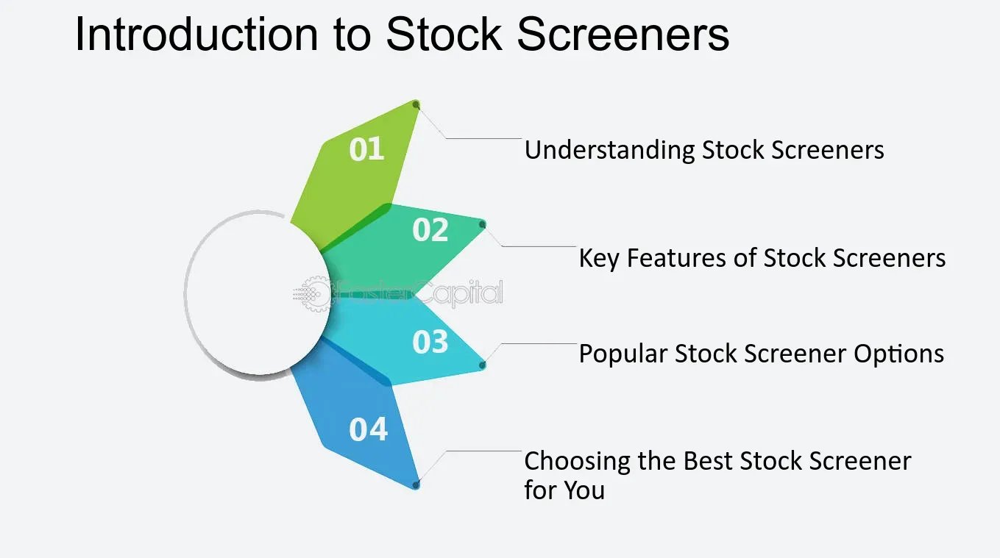

## Table of Contents

## What is a stock screener and why is it useful for investors?

A stock screener is a tool that helps investors find stocks that match certain criteria they are looking for. It's like a filter that lets you sort through thousands of stocks to find the ones that meet your specific needs. For example, you can use a stock screener to find stocks in a certain industry, with a certain price, or that have a certain level of earnings growth.

Stock screeners are useful for investors because they save a lot of time and effort. Instead of manually going through lists of stocks, an investor can quickly narrow down their options to a manageable number. This makes it easier to do more detailed research on the stocks that are most likely to meet their investment goals. Whether you're looking for growth stocks, value stocks, or dividend stocks, a stock screener can help you find them more efficiently.

## How does a stock screener work to filter stocks?

A stock screener works by letting you set different rules or filters that stocks must meet. For example, you might want to see only stocks that cost less than $50 and have grown their earnings by at least 10% in the last year. You enter these rules into the stock screener, and it will show you a list of stocks that match all your criteria.

Once you have your list, you can look at each stock more closely. This helps you find stocks that fit what you're looking for without having to check every single stock yourself. It's like using a search engine to find information on the internet; you type in what you want, and the tool does the hard work of finding it for you.

## What are the basic criteria used in stock screeners for beginners?

For beginners, stock screeners often start with simple criteria like stock price and market capitalization. Stock price is how much it costs to buy one share of a company. You might want to find stocks that are not too expensive, so you can set a price range, like stocks that cost between $10 and $50. Market capitalization, or market cap, is how big a company is. It's calculated by multiplying the stock price by the total number of shares. You can filter for small, medium, or large companies based on their market cap.

Another basic criterion is the sector or industry the company is in. You might be interested in technology, healthcare, or consumer goods, so you can use the screener to find companies in those areas. Additionally, beginners might look at dividend yield, which shows how much a company pays out in dividends each year compared to its stock price. A higher dividend yield can mean more regular income from your investment. These basic filters help beginners narrow down their choices and focus on stocks that fit their initial investment goals.

## Can you explain the difference between free and paid stock screeners?

Free stock screeners are good for beginners because they don't cost any money. They let you search for stocks using basic criteria like price, market cap, and industry. These screeners are usually easy to use and can help you get started with investing. However, free screeners might not have all the fancy features or detailed data that you might want as you learn more about investing.

Paid stock screeners, on the other hand, offer more advanced tools and data. They might let you use more complicated filters, like specific financial ratios or real-time data. These screeners can be really helpful if you want to dive deeper into your research and find stocks that meet very specific criteria. The downside is that they cost money, so you need to decide if the extra features are worth the price for you.

## What are some popular stock screeners available in the market?

There are many popular stock screeners that people use. One well-known free stock screener is Finviz. It's easy to use and lets you filter stocks by price, market cap, and industry. Another free option is Yahoo Finance, which also offers basic screening tools that are good for beginners. These free screeners are great if you're just starting out and want to learn more about investing without spending any money.

For those willing to pay for more advanced features, some popular paid stock screeners include Zacks and Morningstar. Zacks offers detailed research and advanced filters that can help you find stocks that meet very specific criteria. Morningstar is also popular because it provides in-depth analysis and data that can be really useful for more experienced investors. These paid screeners can be a good choice if you're looking for more detailed information and are willing to pay for it.

In addition to these, there are also stock screeners built into some trading platforms like E*TRADE and Charles Schwab. These can be useful if you already have an account with these brokers because they let you screen stocks and then trade them all in one place. Whether you choose a free or paid screener, the key is to find one that fits your needs and helps you make better investment decisions.

## How can one customize a stock screener to meet specific investment strategies?

To customize a stock screener for your specific investment strategy, you start by figuring out what you're looking for in a stock. Do you want stocks that pay high dividends, or are you interested in companies that are growing quickly? Once you know your goals, you can set the filters on the stock screener to match them. For example, if you're looking for dividend stocks, you might set a filter for a minimum dividend yield. If you're interested in [growth stocks](/wiki/growth-stocks), you could filter for high earnings growth rates. You can also use filters like price-to-earnings ratio, market cap, and sector to narrow down your list.

After setting your basic filters, you can get even more specific by adding more detailed criteria. Some screeners let you use technical indicators, like moving averages, to find stocks that are trending in a certain way. You might also want to look at financial health, so you can filter for things like debt-to-equity ratio or return on equity. By combining these different filters, you can create a list of stocks that fit your exact strategy. The key is to experiment with different combinations of filters until you find what works best for you.

## What advanced features should an expert look for in a stock screener?

An expert investor should look for stock screeners that offer advanced features like real-time data and customizable technical indicators. Real-time data is important because it lets you see what's happening with stocks right now, not just at the end of the day. This can help you make quick decisions based on the latest information. Customizable technical indicators, like moving averages or relative strength index (RSI), let you set up the screener to find stocks that match your specific trading strategies. These tools can help you spot trends and patterns that might not be obvious with just basic filters.

Another important feature for experts is the ability to backtest your screening criteria. Backtesting lets you see how well your strategy would have worked in the past, which can give you more confidence in using it now. Some advanced screeners also offer access to detailed financial statements and analyst reports, which can help you dig deeper into a company's performance and future prospects. These features can make a big difference in finding the right stocks and making smarter investment choices.

## How do stock screeners integrate with other financial tools and platforms?

Stock screeners often work well with other financial tools and platforms. Many stock screeners are part of bigger financial websites or trading platforms. For example, if you use a broker like E*TRADE or Charles Schwab, their stock screeners are built right into their websites. This makes it easy to find stocks you like and then buy them without having to switch between different websites. Some screeners also let you save your search results and watchlists, so you can keep track of stocks you're interested in over time.

In addition to being part of trading platforms, stock screeners can also connect with other tools like portfolio trackers and financial news services. For instance, you might use a stock screener to find a list of stocks, and then use a portfolio tracker to see how those stocks are doing in your investment account. Some screeners also let you get alerts or news updates about the stocks you're watching, which can help you stay on top of important changes or events. By working together, these tools can make it easier to manage your investments and make better decisions.

## What are the limitations and potential pitfalls of using stock screeners?

Stock screeners are great tools, but they have some limitations. One big problem is that they can give you too much information. You might end up with a long list of stocks that all meet your criteria, but it can be hard to decide which ones to actually buy. Also, stock screeners only look at numbers and data. They don't tell you about things like a company's management team or what's happening in the world that might affect the stock. So, you still need to do your own research to make sure you're making a good choice.

Another pitfall is that stock screeners can be too focused on the past. They use historical data to find stocks, but what happened before doesn't always predict what will happen next. If you rely too much on a screener, you might miss out on important changes or new opportunities. It's also important to remember that no stock screener is perfect. They can have mistakes or outdated information, so it's always a good idea to double-check the data and not depend on the screener alone for your investment decisions.

## How can stock screeners be used to identify undervalued stocks?

Stock screeners can help you find undervalued stocks by letting you set specific filters that look for companies that might be priced lower than they should be. For example, you might use a stock screener to find stocks with a low price-to-earnings (P/E) ratio, which is a common way to see if a stock is undervalued. A low P/E ratio means the stock's price is low compared to how much money the company is making. You can also look for stocks with a high dividend yield, which means the company pays out a lot of money to shareholders compared to its stock price. By setting these filters, you can find a list of stocks that might be undervalued and worth looking into more closely.

However, using a stock screener to find undervalued stocks is just the first step. You need to do more research to make sure the stocks really are a good deal. Sometimes, a stock might look undervalued because the company is having problems, like losing money or facing tough competition. You should look at the company's financial health, read news about the company, and maybe even look at what experts are saying about it. A stock screener can give you a starting point, but you need to do your own homework to make sure you're making a smart investment.

## What role do stock screeners play in technical analysis for expert traders?

Stock screeners are really helpful for expert traders who use technical analysis. Technical analysis is all about looking at charts and numbers to find patterns that can help predict what a stock will do next. Stock screeners let traders set up filters to find stocks that match these patterns. For example, a trader might use a screener to find stocks that are above their 50-day moving average, which means the stock's price is higher than it has been on average over the last 50 days. This can be a sign that the stock is in an uptrend. By using these filters, traders can quickly find stocks that fit their technical analysis strategies without having to look at every single stock themselves.

However, stock screeners are just tools, and they have their limits. They can help traders find stocks that match certain technical patterns, but they don't tell the whole story. Traders still need to do more research and use other tools to make sure the stocks they find are good investments. For example, they might look at the stock's [volume](/wiki/volume-trading-strategy), which shows how many shares are being traded, or use other indicators like the Relative Strength Index (RSI) to see if a stock is overbought or oversold. By combining the results from a stock screener with other technical analysis tools, expert traders can make better decisions and find more opportunities in the market.

## How can one evaluate the effectiveness of a stock screener over time?

To evaluate how well a stock screener works over time, you can use a method called [backtesting](/wiki/backtesting). This means you look at how the stocks picked by the screener would have done in the past. If the stocks did well, then the screener might be good. You can also keep track of the stocks the screener picks now and see how they do in the future. If they keep doing well, that's a good sign that the screener is helpful.

Another way to check if a stock screener is effective is to compare it to other screeners or to the overall market. If the stocks picked by your screener do better than stocks picked by other screeners or better than the market, then it's probably a good tool. It's also important to think about how easy the screener is to use and if it has all the features you need. If it helps you find good stocks without taking too much time, then it's likely a useful tool for you.

## References & Further Reading

[1]: ["Algorithmic Trading: Winning Strategies and Their Rationale"](https://books.google.com/books/about/Algorithmic_Trading.html?id=WAlFDwAAQBAJ) by Ernest P. Chan

[2]: [(Algorithmic Trading and DMA: An introduction to direct access trading strategies)](https://www.amazon.com/Algorithmic-Trading-DMA-introduction-strategies/dp/0956399207) by Barry Johnson

[3]: ["Technical Analysis of the Financial Markets: A Comprehensive Guide to Trading Methods and Applications"](https://www.amazon.com/Technical-Analysis-Financial-Markets-Comprehensive/dp/0735200661) by John J. Murphy

[4]: ["Trading and Exchanges: Market Microstructure for Practitioners"](https://www.amazon.com/Trading-Exchanges-Market-Microstructure-Practitioners/dp/0195144708) by Larry Harris

[5]: ["The Little Book of Valuation: How to Value a Company, Pick a Stock and Profit"](https://www.amazon.com/Little-Book-Valuation-Company-Profit/dp/1118004779) by Aswath Damodaran