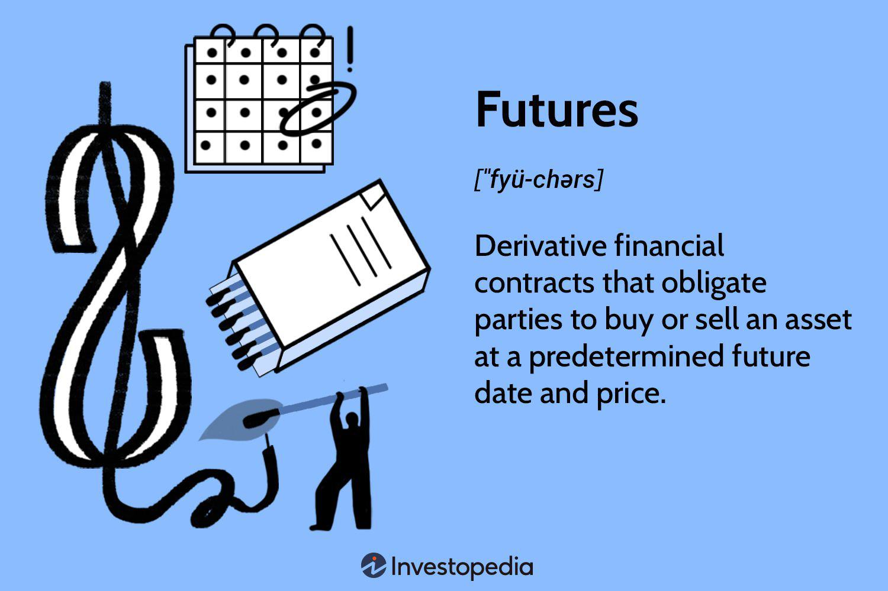

## Table of Contents

## What are futures and how do they work?

Futures are contracts that let people buy or sell something at a set price on a specific date in the future. This "something" can be anything from farm products like wheat and corn, to financial things like stock indexes or currencies. People use futures to try to make money by guessing if the price will go up or down. They can also use futures to protect themselves from price changes. For example, a farmer might use a future to lock in a good price for their crops before they even plant them.

When you buy a future, you're not actually buying the thing right away. Instead, you're making a deal to buy or sell it later. You put down a small amount of money, called a margin, to show you're serious about the deal. If the price of the thing goes up, you can make money. But if it goes down, you could lose money. Futures are traded on special places called futures exchanges, where lots of people come together to buy and sell these contracts. It's a bit like betting on what the price will be in the future, and it can be risky if you're not careful.

## What are the main differences between futures and other financial instruments like stocks and options?

Futures are different from stocks and options in a few big ways. When you buy a stock, you're buying a small piece of a company. You own it, and you can keep it as long as you want. Futures are more like a promise to buy or sell something at a certain price in the future. You don't own the thing right away; you're just agreeing to trade it later. Also, futures usually need you to put down a smaller amount of money upfront, called margin, compared to buying stocks. This can make futures riskier because the price can change a lot, and you might have to put in more money if it goes against you.

Options are another type of financial instrument that's different from futures. An option gives you the right, but not the obligation, to buy or sell something at a set price before a certain date. With futures, you have to follow through with the deal unless you close it out before the date. Options can be less risky because you can choose not to use them if the price doesn't go the way you want. But options can also be more complicated because they have different types, like calls and puts, and they can expire worthless if you don't use them in time. So, while futures and options both deal with future prices, they work in different ways and have different levels of risk and commitment.

## How can someone start trading futures?

To start trading futures, you first need to open an account with a brokerage firm that offers futures trading. This is a bit different from a regular stock trading account. You'll need to fill out some forms and provide information about yourself. The brokerage will also check if you know enough about futures trading because it can be risky. Once your account is set up, you'll need to put some money into it. This money is called your margin, and it's what you use to trade futures.

After you have your account and money ready, you can start looking at futures contracts. You can do this on the brokerage's website or trading platform. You'll see different futures for things like oil, gold, or stock indexes. When you find a future you want to trade, you can place an order to buy or sell it. Remember, trading futures means you're making a deal to buy or sell something later, so you need to keep an eye on the market and be ready to close your position before the contract date if you want to. It's a good idea to start small and learn as you go, because futures can be tricky and you can lose money if you're not careful.

## What are the key terms and concepts a beginner should know before trading futures?

Before you start trading futures, it's important to understand some key terms and concepts. A futures contract is an agreement to buy or sell something at a set price on a specific date in the future. This "something" can be anything from farm products like wheat to financial things like stock indexes. The price you agree on is called the futures price, and it can be different from the current market price of the thing you're trading. When you trade futures, you don't pay the full price right away. Instead, you put down a smaller amount of money called margin, which is like a deposit to show you're serious about the deal. If the price moves against you, you might need to add more money to your account, which is called a margin call.

Another important concept is leverage. Futures trading uses leverage, which means you can control a big amount of the thing you're trading with just a small amount of money. This can make your profits bigger if the price goes your way, but it can also make your losses bigger if the price goes against you. It's also good to know about the futures exchange, which is like a marketplace where people come together to buy and sell futures contracts. The exchange makes sure everything is fair and that people follow the rules. Finally, understanding how to close out your position is key. You can do this by making an opposite trade before the contract date, or you can let the contract go until the end and then buy or sell the thing as agreed.

## What are the risks involved in trading futures and how can they be managed?

Trading futures can be risky because they use something called leverage. This means you can control a big amount of the thing you're trading with just a small amount of money. If the price goes your way, you can make a lot of money. But if it goes the other way, you can lose a lot of money very quickly. Another risk is something called a margin call. If the price moves against you, you might need to put more money into your account to keep your trade going. If you can't add more money, your broker might close your position, and you could lose money. Also, futures have an expiration date, and if you don't close your position before then, you might have to buy or sell the thing you're trading, which can be tricky if you're not ready.

To manage these risks, you can start by using stop-loss orders. These are like safety nets that automatically close your trade if the price goes too far against you. It's also a good idea to only use money you can afford to lose, because futures can be very unpredictable. Another way to manage risk is to diversify, which means not putting all your money into one type of future. Instead, you can spread your money across different kinds of futures. It's also important to keep learning and stay updated on what's happening in the markets. This can help you make better decisions and be ready for changes in prices. By being careful and using these strategies, you can try to keep your risks under control when trading futures.

## What are the most common strategies used in futures trading?

One common strategy in futures trading is called [trend following](/wiki/trend-following). This means you try to find out if the price of something is going up or down over time. If you see the price is going up, you might buy a future, hoping it will keep going up so you can sell it later for more money. If the price is going down, you might sell a future, hoping to buy it back later at a lower price. Trend following can be good because it's simple, but it can also be risky if the trend changes suddenly.

Another strategy is called hedging. This is when you use futures to protect yourself from price changes. For example, if you're a farmer and you want to make sure you get a good price for your crops, you can sell a future now to lock in that price. Even if the price of your crops goes down later, you're safe because you already made a deal. Hedging can help you avoid big losses, but it can also mean you miss out on big gains if the price goes up a lot.

A third strategy is called spread trading. This is when you buy one future and sell another one at the same time. The idea is to make money from the difference in prices between the two futures. For example, you might buy a future for oil that expires in three months and sell a future for oil that expires in six months. If the price difference between these two futures changes in your favor, you can make money. Spread trading can be less risky than other strategies because you're not betting on the overall price going up or down, but it can still be complicated and needs a lot of research.

## How does leverage work in futures trading and what are its implications?

Leverage in futures trading means you can control a big amount of something with just a small amount of money. When you trade futures, you don't need to pay the full price right away. Instead, you put down a smaller amount called margin. This margin acts like a deposit, and it lets you make a deal to buy or sell something in the future. Because you're using less of your own money, any change in the price of what you're trading can have a big effect on your profits or losses. If the price goes up, you can make a lot more money than if you had paid the full price. But if the price goes down, you can lose a lot more money too.

The implications of using leverage are important to understand. Because leverage can make your gains bigger, it can be tempting to trade more than you should. But it also means your losses can be bigger if things don't go your way. If the price moves against you, you might get a margin call, which means you need to put more money into your account to keep your trade going. If you can't add more money, your broker might close your position, and you could lose money. So, while leverage can help you make more money, it also makes futures trading riskier. It's important to be careful and only use money you can afford to lose.

## What are the major futures markets and what types of futures contracts are available?

The major futures markets are places where people trade futures contracts. Some of the biggest ones are the Chicago Mercantile Exchange (CME), the Chicago Board of Trade (CBOT), and the New York Mercantile Exchange (NYMEX). These markets let people trade futures for all sorts of things, from farm products like corn and wheat to financial things like stock indexes and currencies. The CME, for example, is known for trading futures on things like the S&P 500 and Eurodollars, while the CBOT is famous for grain futures. The NYMEX is where people often trade futures for energy products like oil and natural gas.

Futures contracts available in these markets cover a wide range of things. For farm products, you can find futures for corn, wheat, soybeans, and even livestock like cattle and hogs. These help farmers and food companies manage the risk of price changes. For energy, there are futures for [crude oil](/wiki/crude-oil), natural gas, and gasoline, which are important for energy companies and people who use a lot of energy. In the financial world, you can trade futures on stock indexes like the S&P 500 or the Dow Jones, interest rates like Treasury bonds, and currencies like the euro or the yen. These help investors and businesses protect themselves from changes in the market or try to make money by guessing where prices will go.

## How do economic indicators and global events influence futures prices?

Economic indicators and global events can have a big impact on futures prices. When important economic reports come out, like the unemployment rate or inflation numbers, they can change what people think about the economy. If the numbers are good, people might feel more confident and think prices will go up. This can make futures prices go up too. On the other hand, if the numbers are bad, people might worry about the economy and think prices will go down. This can make futures prices go down. For example, if a report shows that more people are out of work, it might make people think the economy is getting worse, and they might sell futures, pushing the prices down.

Global events can also shake up futures prices. Things like wars, natural disasters, or big changes in government policies can make the markets go crazy. If there's a war in a country that makes a lot of oil, for example, people might worry that there won't be enough oil, and the price of oil futures might go up. Or if a big storm hits a place that grows a lot of corn, people might think there will be less corn, and the price of corn futures might go up. These events can make prices move a lot, and people who trade futures need to keep an eye on what's happening around the world to try to guess where prices might go next.

## What are the advanced technical analysis tools used by expert futures traders?

Expert futures traders often use advanced technical analysis tools to help them make better decisions about when to buy or sell futures contracts. One common tool is the Moving Average Convergence Divergence (MACD), which helps traders see if the price of a future is starting to go up or down. It does this by comparing two moving averages of the price over time. Another tool is the Relative Strength Index (RSI), which measures how fast the price is going up or down and can tell traders if a future is overbought or oversold. This can help them decide if it's a good time to buy or sell. Traders also use Bollinger Bands, which are lines drawn above and below the price to show how much the price is moving around. If the price gets close to the top or bottom band, it might mean the price is about to change direction.

Another important tool is the Fibonacci retracement, which helps traders find levels where the price might stop going down and start going up again, or vice versa. This tool uses numbers from the Fibonacci sequence to draw lines on a chart that can act like magnets for the price. Traders also use chart patterns like head and shoulders or double tops and bottoms to predict where the price might go next. These patterns can show when the price might be about to change direction. Finally, many expert traders use automated trading systems, which are computer programs that can buy and sell futures based on the rules the trader sets up. These systems can help traders make decisions faster and without letting their emotions get in the way.

## How can algorithmic trading be applied to futures markets?

Algorithmic trading in futures markets means using computer programs to buy and sell futures contracts automatically. These programs follow rules that traders set up, looking at things like price, [volume](/wiki/volume-trading-strategy), and other market data to decide when to make a trade. For example, a trader might tell the program to buy a future if the price goes above a certain level, or to sell if it goes below another level. This can help traders make decisions faster than they could on their own and can take the emotion out of trading, which can sometimes lead to better results.

Using [algorithmic trading](/wiki/algorithmic-trading) in futures markets can be really helpful because futures can move quickly and be hard to keep up with. The programs can watch the market all the time and make trades even when the trader is not around. This can be especially useful for strategies like trend following or [arbitrage](/wiki/arbitrage), where the program can spot small changes in prices and act on them right away. But it's important for traders to keep an eye on their algorithms and make sure they're working right, because the markets can change and what worked before might not work in the future.

## What are the regulatory considerations and compliance requirements for trading futures?

Trading futures comes with a lot of rules and regulations that you need to follow. In the United States, the main group that makes sure everyone follows the rules is called the Commodity Futures Trading Commission (CFTC). They work to make sure the futures markets are fair and that people don't cheat or do anything wrong. If you want to trade futures, you need to open an account with a broker that the CFTC says is okay to use. This broker will make sure you know enough about futures trading and that you understand the risks. They will also make sure you follow all the rules, like having enough money in your account to cover your trades.

Another important part of trading futures is something called the National Futures Association (NFA). The NFA is like a club that futures brokers and traders have to join. They make sure everyone follows the rules set by the CFTC and their own rules too. For example, the NFA might check to make sure your broker is telling you the truth about the risks of trading futures. They also make sure that brokers don't let people trade futures if they don't have enough money or if they don't know enough about what they're doing. Following these rules helps keep the futures markets safe and fair for everyone.

## References & Further Reading

[1]: Lopez de Prado, M. (2018). ["Advances in Financial Machine Learning."](https://www.amazon.com/Advances-Financial-Machine-Learning-Marcos/dp/1119482089) Wiley.

[2]: Aronson, D. R. (2006). ["Evidence-Based Technical Analysis: Applying the Scientific Method and Statistical Inference to Trading Signals."](https://www.amazon.com/Evidence-Based-Technical-Analysis-Scientific-Statistical/dp/0470008741) Wiley.

[3]: Jansen, S. (2020). ["Machine Learning for Algorithmic Trading."](https://github.com/stefan-jansen/machine-learning-for-trading) Packt.

[4]: Chan, E. P. (2008). ["Quantitative Trading: How to Build Your Own Algorithmic Trading Business."](https://github.com/egorpe/EPChan-QuantitativeTrading/blob/master/example7_6.m) Wiley.

[5]: Hull, J. C. (2017). ["Options, Futures, and Other Derivatives."](https://www.semanticscholar.org/paper/Options%2C-Futures%2C-and-Other-Derivatives-Hull/89bdee500c8623864fc9eb7a471546aa713acc44) Pearson.