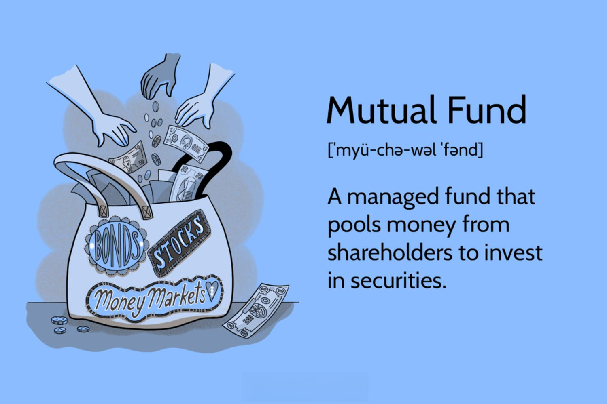

## Table of Contents

## What are mutual funds and how do they work?

Mutual funds are a type of investment where many people pool their money together to buy a variety of stocks, bonds, or other assets. This makes it easier for individual investors to own a diverse range of investments without having to buy each one separately. A professional money manager runs the mutual fund, deciding which investments to buy and sell to try to grow the fund's value.

When you invest in a mutual fund, you buy shares of the fund, which represent a part of the overall portfolio. The value of your shares will go up or down based on how well the investments in the fund perform. Mutual funds can be a good option for people who want to invest but don't have the time or knowledge to pick individual stocks. They offer a way to spread out risk and potentially earn returns over time.

## What are the different types of mutual funds available for trading?

There are several types of mutual funds that you can invest in, each with its own way of investing your money. Some mutual funds focus on stocks, which are shares in companies. These can be further divided into funds that invest in big, well-known companies or smaller, growing companies. There are also funds that invest in bonds, which are loans to companies or governments that pay interest over time. Bond funds can be safer than stock funds but usually offer lower returns. 

Another type of mutual fund is called a balanced fund, which mixes stocks and bonds to try to balance risk and reward. Then there are index funds, which aim to match the performance of a specific market index, like the S&P 500, by buying the same stocks in the same proportions as the index. These are often cheaper to own because they don't need a lot of active management. Sector funds focus on a specific part of the economy, like technology or health care, and can be riskier because they depend on how well that one sector does.

Lastly, there are money market funds, which invest in very safe, short-term investments like government securities and are meant to be a safe place to park your money. Target-date funds are designed for people saving for retirement and automatically adjust their mix of investments as the target date gets closer. Each type of fund has its own risks and potential rewards, so it's important to understand what you're investing in.

## How can beginners start investing in mutual funds?

Beginners can start investing in mutual funds by first setting clear financial goals. Do you want to save for retirement, buy a house, or just grow your money over time? Once you know what you're saving for, you can choose the right type of mutual fund. You might want to talk to a financial advisor or do some research online to learn about different funds and what they invest in. Many people start with index funds because they are easy to understand and usually have lower fees.

After [picking](/wiki/asset-class-picking) a fund, you need to open an account with a brokerage or directly with a mutual fund company. You'll need to fill out some forms and provide personal information. Once your account is set up, you can start investing. You can either make a one-time investment or set up regular contributions, like putting in a little money each month. This is called dollar-cost averaging and can help smooth out the ups and downs of the market. Remember, investing in mutual funds is for the long term, so be patient and keep learning as you go.

## What are the risks associated with trading mutual funds?

Trading mutual funds comes with some risks that you should know about. One big risk is that the value of your investment can go up or down. This happens because mutual funds invest in things like stocks and bonds, and these can change in price. If the stocks or bonds in the fund do badly, the value of your mutual fund shares will go down too. Another risk is that you might lose money if you need to sell your shares when the market is down. This is called market risk.

Another risk to think about is the fees you have to pay. Mutual funds charge fees for managing the fund, and these can eat into your returns. Some funds have higher fees than others, so it's important to look at the expense ratio before you invest. There's also the risk that the fund manager might not make good choices about which stocks or bonds to buy and sell. If the manager picks poorly, the fund might not do well, even if the market is doing okay. So, it's a good idea to research the fund's performance history and the manager's track record before you invest.

## How do fees and expenses impact the returns on mutual funds?

Fees and expenses can make a big difference in how much money you make from your mutual funds. Every mutual fund has something called an expense ratio, which is a percentage of your investment that goes towards paying the costs of running the fund. This includes things like paying the fund manager, marketing the fund, and other operational costs. The higher the expense ratio, the less money you get to keep from your investment returns. For example, if a fund has a 1% expense ratio, and it earns 6% in a year, you only get to keep 5% after fees.

Over time, these fees can add up and really eat into your returns. Imagine you invest $10,000 in a fund that grows at 6% a year. If the expense ratio is 1%, after 20 years, your investment might be worth about $26,000. But if the expense ratio is 0.5%, it could be worth about $30,000 instead. That's a big difference just because of fees! So, when you're picking a mutual fund, it's smart to look at the expense ratio and try to choose funds with lower fees to keep more of your money.

## What is the importance of diversification in a mutual fund portfolio?

Diversification is really important when you're investing in mutual funds because it helps spread out your risk. Instead of putting all your money into one type of investment, like stocks in just one company or one sector, you spread it across many different investments. This way, if one investment doesn't do well, it won't hurt your whole portfolio too much. It's like not putting all your eggs in one basket. By having a mix of stocks, bonds, and maybe even other types of investments, you can protect yourself from big losses and have a smoother ride in the market.

Another reason diversification matters is that it can help you get better returns over time. Different types of investments do well at different times. When stocks are doing great, bonds might not be doing as well, and vice versa. By having a mix, you can take advantage of these ups and downs. Plus, it lets you tap into different parts of the economy and different countries, which can lead to more growth opportunities. So, by diversifying your mutual fund portfolio, you're setting yourself up for a more balanced and potentially more rewarding investment experience.

## How can one analyze the performance of mutual funds?

To analyze the performance of mutual funds, you can start by looking at the fund's historical returns. This tells you how the fund has done in the past, usually over different time periods like one year, three years, or five years. You can compare these returns to a benchmark, like the S&P 500 for stock funds, to see if the fund is doing better or worse than the market. It's also helpful to see how the fund has performed in different market conditions, like during a bull market when prices are going up or a bear market when they're going down. This gives you an idea of how the fund might do in the future.

Another important thing to look at is the fund's risk. You can do this by checking the fund's standard deviation, which shows how much the fund's returns have varied over time. A higher standard deviation means the fund is riskier because its returns can swing a lot. You can also look at the fund's beta, which tells you how much the fund moves with the market. A beta of more than 1 means the fund is more volatile than the market, while a beta less than 1 means it's less volatile. By understanding both the returns and the risk, you can get a good picture of how well a mutual fund is performing and whether it fits your investment goals.

## What are the tax implications of trading mutual funds?

When you trade mutual funds, you need to think about taxes. If you sell your mutual fund shares for more money than you paid for them, you have to pay capital gains tax. How much you pay depends on how long you held the shares. If you held them for a year or less, it's a short-term capital gain, and you'll pay your regular income tax rate on it. If you held them for more than a year, it's a long-term capital gain, and you'll pay a lower tax rate, usually between 0% and 20%, depending on your income.

Mutual funds can also create tax events even if you don't sell your shares. This happens when the fund manager sells stocks or bonds within the fund and makes a profit. These profits are called capital gains distributions, and they are passed on to you, the investor. You'll have to pay taxes on these distributions, even if you reinvest them back into the fund. Some funds, like index funds, tend to have fewer of these events because they don't trade as often. So, when picking a mutual fund, it's smart to think about how often it trades and how that might affect your taxes.

## How does market timing affect mutual fund trading strategies?

Market timing is when people try to guess the best times to buy and sell mutual funds based on what they think the market will do next. It's like trying to jump in and out of the market to make more money. But it's really hard to do well because nobody can predict the market perfectly. If you guess wrong, you might buy high and sell low, which is the opposite of what you want. That's why many experts say it's better to stick with a long-term plan instead of trying to time the market.

Even though market timing can be risky, some people still try to do it. They might use different strategies, like looking at economic reports or following market trends, to decide when to trade. But these strategies don't always work, and they can lead to more trading, which means more fees and taxes. So, if you're thinking about market timing, it's important to understand the risks and maybe talk to a financial advisor to see if it fits with your overall investment goals.

## What advanced strategies can be used to optimize mutual fund investments?

One advanced strategy for optimizing mutual fund investments is called asset allocation. This means spreading your money across different types of investments, like stocks, bonds, and maybe even real estate or commodities. By doing this, you can balance risk and reward based on your goals and how much risk you're comfortable with. For example, if you're young and saving for retirement, you might put more money into stocks because they can grow a lot over time. But as you get closer to retirement, you might shift more money into bonds to protect what you've saved. Another part of asset allocation is rebalancing your portfolio. This means checking your investments every so often and making adjustments to keep your mix of stocks, bonds, and other investments in line with your plan.

Another strategy is to use tax-efficient investing. This means picking mutual funds that help you pay less in taxes. For example, index funds and exchange-traded funds (ETFs) often have lower turnover, which means they buy and sell investments less often. This can lead to fewer capital gains distributions, so you pay less in taxes. You can also put certain types of mutual funds in different types of accounts to save on taxes. For example, you might put bond funds, which often pay out a lot of interest, in a tax-deferred account like an IRA, where you don't have to pay taxes on the interest until you take the money out. By thinking about taxes when you pick your mutual funds, you can keep more of your investment returns.

## How do economic cycles influence mutual fund performance?

Economic cycles can have a big impact on how well mutual funds do. These cycles go through different stages, like growth, peak, recession, and recovery. When the economy is growing, companies usually do well, and stock prices go up. This is good for mutual funds that invest in stocks because their value can go up too. But when the economy hits a peak and starts to slow down, stock prices might start to drop. If a recession comes, where the economy shrinks, stock funds can lose a lot of value because companies aren't doing as well and people are worried about the future.

On the other hand, bond funds can be a bit different. When the economy is growing, interest rates might go up, which can make bond prices go down. But when the economy is in a recession, interest rates often go down, which can make bond prices go up. So, bond funds might do better during tough economic times. By understanding where we are in the economic cycle, you can pick mutual funds that might do better based on what's happening in the economy. This can help you make smarter choices about where to put your money.

## What role does a financial advisor play in managing mutual fund investments?

A financial advisor can help a lot when you're managing your mutual fund investments. They can look at your money goals, like saving for a house or retirement, and help you pick the right mutual funds. They know a lot about different funds and can explain which ones might be good for you based on how much risk you want to take and how long you plan to invest. They can also help you understand the fees and taxes that come with mutual funds, so you can make choices that save you money.

Besides picking funds, a financial advisor can keep an eye on your investments and make changes when needed. They can tell you when it's a good time to buy more of a fund or sell some to keep your portfolio balanced. They can also help you stay calm during times when the market goes up and down a lot. By having a financial advisor, you get someone who can guide you through the ups and downs of investing in mutual funds and help you reach your financial goals.

## What is the understanding of Mutual Funds?

Mutual funds are investment vehicles that pool money from multiple investors to purchase a diversified portfolio of securities. This pooling of resources allows individual investors to participate in a larger collection of assets, which they might not be able to access alone due to cost and expertise constraints. The core features of mutual funds include professional management, diversification, economies of scale, and [liquidity](/wiki/liquidity-risk-premium).

There are several types of mutual funds, each offering unique benefits tailored to specific investor needs. Equity funds primarily invest in stocks and have the potential for high returns, albeit with higher risk. Fixed income funds, or bond funds, focus on generating regular income through investments in bonds, thus offering more stability. Balanced funds combine both equities and fixed income to offer a mix of growth and income. Money market funds invest in short-term, low-risk instruments and aim to preserve capital. Index funds are designed to replicate the performance of a specific index, offering broad market exposure with typically lower fees. Each type of fund caters to different investment objectives and risk tolerances, allowing investors to choose according to their financial goals.

Mutual funds are managed by professional fund managers who are responsible for selecting the securities and managing the portfolio in accordance with the fund’s investment objectives. Fund managers conduct extensive research and use various analytical tools and market forecasts to make informed investment decisions. They are supported by a team of analysts and traders to optimize the fund’s performance while adhering to regulatory requirements and the fund’s stated strategies.

Investing in mutual funds offers several advantages for beginners. They provide access to a professionally managed and diversified portfolio, helping to mitigate risk through asset allocation. Mutual funds are also liquid, meaning investors can easily buy or sell shares and get their money relatively quickly. Furthermore, mutual funds operate under strict regulatory oversight, ensuring transparency and investor protection. However, there are drawbacks, such as management fees and expenses that can affect returns. Additionally, investors relinquish control over individual security selection to the fund manager, which may not suit everyone’s investment style.

For beginners, understanding key terms associated with mutual funds is crucial. The Net Asset Value (NAV) represents the per-share value of the mutual fund and is calculated by dividing the total value of the fund’s assets by the number of outstanding shares. It is the price at which investors buy or sell shares. The expense ratio is a measure of the fund’s operating expenses expressed as a percentage of its average assets, directly impacting investors’ returns. Other important terms include load, which refers to any sales charges or commissions, and turnover rate, indicating the frequency with which the fund’s assets are bought and sold. Familiarity with these terms can help investors make informed decisions and better manage their investments.

 to Algorithmic Trading

Algorithmic trading, also known as algo trading, refers to the use of computer programs and algorithms to execute trading orders. The primary mechanism of [algorithmic trading](/wiki/algorithmic-trading) is to exploit computational power and high-speed data networks to process a broad range of trading strategies aimed at optimized market transactions. Through a predefined set of rules based on time, price, quantity, or any mathematical model, algorithmic trading ensures the systematic execution of trading strategies without the need for human intervention.

One of the standout benefits of leveraging algorithms in trading is speed. Computers can process complex quantitative data and execute trades at speeds far beyond human capabilities, capitalizing on even the minutest market inefficiencies. Efficiency is another significant advantage; algorithms can handle multi-[factor](/wiki/factor-investing) and multi-parameter trading strategies tirelessly, minimizing errors associated with human judgment, such as emotional biases.

Several prominent algorithms are widely used in trading. For example, the "Volume Weighted Average Price" (VWAP) algorithm executes a large order broken down into smaller sizes to minimize market impact, aiming to match the order's fill price with the [volume](/wiki/volume-trading-strategy)-weighted average price over a specified period. Another example is the "Mean Reversion" strategy, which relies on the assumption that the price of a security will revert to its average price over time. The formula for mean reversion can be expressed as:

$$
\text{Trading Signal} = \text{Current Price} - \text{Moving Average}
$$

Where a positive signal might suggest selling, and a negative one indicates buying.

Data and programming knowledge are essential aspects of algorithmic trading. A profound understanding of statistical and quantitative analysis coupled with proficiency in programming languages like Python is crucial. Python, for instance, is extensively used for its extensive data handling libraries like Pandas and NumPy, which enable traders to analyze large datasets efficiently. Here is a simple example of calculating moving averages using Python:

```python
import pandas as pd

# Suppose we have a DataFrame df with columns 'Date' and 'Price'
df['Moving Average'] = df['Price'].rolling(window=20).mean()
```

Despite its advantages, algorithmic trading comes with its own set of risks and challenges. Market [volatility](/wiki/volatility-trading-strategies), erroneous algorithms, and technical failures can lead to substantial losses. Furthermore, the reliance on algorithms can obscure market factors not encapsulated in the model, leading to inaccurate trading signals. Effective risk management is paramount; establishing stop-loss controls and employing robust [backtesting](/wiki/backtesting) techniques are essential components to mitigate these risks.

In conclusion, algorithmic trading employs computerized strategies to enhance trading efficiency and precision while necessitating strong data analysis and programming skills. However, traders must remain vigilant of the inherent risks and maintain a balanced approach to mitigate potential pitfalls.

## References & Further Reading

[1]: Bergstra, J., Bardenet, R., Bengio, Y., & Kégl, B. (2011). ["Algorithms for Hyper-Parameter Optimization."](https://dl.acm.org/doi/10.5555/2986459.2986743) Advances in Neural Information Processing Systems 24.

[2]: ["Advances in Financial Machine Learning"](https://www.amazon.com/Advances-Financial-Machine-Learning-Marcos/dp/1119482089) by Marcos Lopez de Prado

[3]: ["Evidence-Based Technical Analysis: Applying the Scientific Method and Statistical Inference to Trading Signals"](https://www.amazon.com/Evidence-Based-Technical-Analysis-Scientific-Statistical/dp/0470008741) by David Aronson

[4]: ["Machine Learning for Algorithmic Trading"](https://github.com/PacktPublishing/Machine-Learning-for-Algorithmic-Trading-Second-Edition) by Stefan Jansen

[5]: ["Quantitative Trading: How to Build Your Own Algorithmic Trading Business"](https://books.google.com/books/about/Quantitative_Trading.html?id=j70yEAAAQBAJ) by Ernest P. Chan