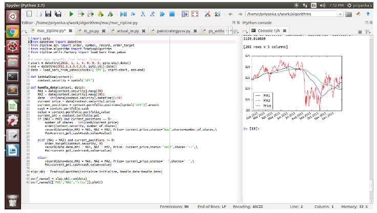

Algorithmic trading, a cornerstone of modern financial markets, has dramatically changed the way trading is executed by leveraging the speed and accuracy of computer-driven strategies. It involves the use of advanced algorithms and mathematical models to make rapid trading decisions, with the aim of optimizing trade execution and maximizing returns. With the growing popularity of Python due to its simplicity and versatility, choosing a comprehensive library such as Zipline for algorithmic trading becomes essential for traders who wish to automate and refine their trading strategies.

Zipline stands out as a powerful Pythonic event-driven system specifically designed for backtesting trading algorithms. Initially developed by Quantopian, Zipline has become a valuable tool for traders looking to test their strategies against historical market data before deploying them in live markets. The library enables users to simulate how a trading strategy would have performed in the past, providing crucial insights into its potential effectiveness in future trades.



This article will explore the significance of Zipline in Python for algorithmic trading. We will examine its benefits, why it serves as an indispensable tool for traders, and how to get started with using it for your trading algorithms today. Through its integration with Python's scientific stack, Zipline simplifies the development, testing, and optimization of trading strategies, empowering traders to enhance their trading operations with confidence.

## Table of Contents

## Benefits of Using Zipline for Algo Trading

Zipline offers a streamlined approach to developing trading algorithms, making it an ideal choice for both novice and experienced algorithmic traders. Its focus on usability is evident through its seamless integration with the PyData ecosystem, which includes powerful data manipulation and analysis libraries. One of the standout features of Zipline is its 'batteries included' philosophy. This approach ensures that users have easy access to a wide range of statistical tools and techniques directly within the library. For example, common statistical metrics like moving averages are readily available, allowing traders to quickly implement and test trading strategies without needing to build these functions from scratch.

Furthermore, Zipline's integration with scientific libraries such as matplotlib and scikit-learn enhances its utility. Matplotlib allows users to visualize data and trading performance in an intuitive manner, which is crucial for analyzing results and refining strategies. Scikit-learn provides a suite of machine learning tools that can be employed to optimize algorithms and potentially improve trading outcomes. The combination of these libraries within Zipline positions it as a robust solution for conducting sophisticated data analysis and strategy development.

The compatibility of Zipline with DataFrame formats, particularly with the popular Pandas library, is another key benefit. This feature allows users to import historical data seamlessly and export performance [statistics](/wiki/bayesian-statistics) in a format that is highly compatible with other data science tools. Traders can thus leverage the Pandas library to manipulate and analyze this data, enhancing their ability to refine and optimize algorithms.

Additionally, Zipline's capability to handle both [backtesting](/wiki/backtesting) and live trading offers a versatile platform for traders. Backtesting allows users to apply trading strategies to historical data to evaluate their performance before risking actual capital in live markets. This feature is crucial for validating the robustness of a trading strategy. Meanwhile, the transition from backtesting to live trading within the same framework simplifies the implementation process, reducing the barriers to executing strategies in real-world scenarios.

Overall, Zipline provides an efficient and user-friendly environment for developing and testing [algorithmic trading](/wiki/algorithmic-trading) strategies, aiding traders in focusing on refining their strategies without getting bogged down by the intricacies of execution.

## Installation of Zipline

Installing Zipline can be achieved through popular Python package managers such as pip and conda, making it accessible for users who are working with Python versions 3.8 and above. This process simplifies setting up a local environment for algorithmic trading development and testing.

To install Zipline using pip, the following command should be executed in the terminal:

```bash
pip install zipline-reloaded
```

This command retrieves the latest version of Zipline from the Python Package Index and installs it along with its dependencies. The "zipline-reloaded" package is a maintained fork of the original Zipline project, providing enhancements and supporting newer Python versions. 

Alternatively, users who prefer the Conda package manager can install Zipline using the conda-forge channel. This can be achieved with the following command:

```bash
conda install -c conda-forge zipline-reloaded
```

Conda-forge is a community-driven collection of packages for the Conda package manager. It ensures that the packages are up-to-date and compatible with a wide array of operating systems and environments. Using Conda can be particularly beneficial for managing complex dependencies and virtual environments in Python.

Having Zipline installed on your local machine sets the stage for the development and backtesting of trading algorithms. It integrates well with other Python packages within the scientific computing ecosystem, enabling traders to apply various data analysis and visualization methods to refine their trading strategies. By establishing a solid foundation with Zipline's installation, users can focus on crafting and iterating on potent trading strategies.

## Basic Structure of a Zipline Algorithm

Every Zipline algorithm is anchored by two essential functions: `initialize(context)` and `handle_data(context, data)`. These functions work in tandem to set up and operate the algorithm effectively.

The `initialize(context)` function is responsible for setting up the initial state of the algorithm. This involves defining variables, scheduling functions, and setting up parameters that will be used throughout the lifecycle of the algorithm. For instance, an algorithm might save a list of stocks to trade or set moving average periods during this initialization phase. The function is executed only once at the start of the algorithm, ensuring that all necessary preparations are in place before any trading decisions are executed.

```python
def initialize(context):
    context.asset = symbol('AAPL')
    context.short_mavg_window = 20
    context.long_mavg_window = 50
```

The `handle_data(context, data)` function processes incoming data and makes trading decisions. It is called once for each trading bar (a discrete unit of time, such as a minute or a day) and allows the algorithm to react to new market data. Within this function, you might calculate metrics like moving averages, decide whether to buy or sell an asset, handle orders, and record performance metrics. This step-by-step handling of data is crucial for making informed trading decisions.

```python
def handle_data(context, data):
    short_mavg = data.history(context.asset, 'price', context.short_mavg_window, '1d').mean()
    long_mavg = data.history(context.asset, 'price', context.long_mavg_window, '1d').mean()

    # Buy when short moving average crosses above long moving average
    if short_mavg > long_mavg and not context.portfolio.positions[context.asset].amount:
        order_target_percent(context.asset, 1.0)
    # Sell when short moving average crosses below long moving average
    elif short_mavg < long_mavg and context.portfolio.positions[context.asset].amount > 0:
        order_target_percent(context.asset, 0.0)
```

Understanding the roles of `initialize()` and `handle_data()` functions is pivotal for the development of robust algorithmic trading strategies using Zipline. With these structures, traders can manage data flow efficiently, allowing for precise handling of orders and performance tracking. This foundation supports the development of sophisticated trading algorithms that require precise decision-making and data management capabilities.

## Implementing a Moving Average Crossover Strategy

A popular algorithmic trading strategy, the Moving Average Crossover, involves using two moving averages to identify potential buy or sell signals. This strategy leverages the relationship between two different time-based moving averages to forecast possible changes in price direction.

In the Moving Average Crossover strategy, two key types of crossovers are defined: the bullish crossover and the bearish crossover. A 'bullish crossover' occurs when a shorter moving average (e.g., a 50-day moving average) crosses above a longer moving average (e.g., a 200-day moving average). This crossover implies a potential upward trend, prompting a buy signal. Conversely, a 'bearish crossover' suggests a sell signal when the shorter moving average crosses below the longer moving average, indicating a potential downward trend.

Zipline offers a methodical way to implement this strategy by efficiently calculating these moving averages and handling crossover events in real-time. Within Zipline's `handle_data` function, the short-term and long-term moving averages are computed for each trading bar. Here's how one might implement the Moving Average Crossover strategy in Python using Zipline:

```python
def initialize(context):
    context.short_mavg_window = 50
    context.long_mavg_window = 200
    context.asset = symbol('AAPL')

def handle_data(context, data):
    # Calculate the short moving average
    short_mavg = data.history(context.asset, 'price', context.short_mavg_window, '1d').mean()

    # Calculate the long moving average
    long_mavg = data.history(context.asset, 'price', context.long_mavg_window, '1d').mean()

    # Check for bullish crossover
    if short_mavg > long_mavg and not context.portfolio.positions[context.asset].amount:
        order_target_percent(context.asset, 1.0)  # Buy signal

    # Check for bearish crossover
    elif short_mavg < long_mavg and context.portfolio.positions[context.asset].amount:
        order_target_percent(context.asset, 0.0)  # Sell signal

```

In the code example above, `initialize` sets up the short and long moving average windows and specifies the asset to be traded. The `handle_data` function calculates the moving averages and determines the trading actions based on crossover occurrences.

Backtesting this strategy using historical data is a vital step that allows traders to assess its performance before proceeding with live trading. By analyzing metrics such as profit and loss, drawdown, and the number of trades, traders can refine and optimize the strategy for better outcomes. Utilizing Zipline's ability to backtest and simulate trades provides a controlled environment to test various configurations and hypotheses, enhancing the strategy's robustness before real-world application.

## Conclusion

Zipline provides a powerful yet user-friendly environment for developing and testing algorithmic trading strategies in Python. Its integration with popular data science libraries, such as pandas and numpy, simplifies the complex process of financial analysis, allowing traders to focus on refining their algorithms rather than managing the intricacies of execution. With Zipline, traders can efficiently backtest their strategies against historical data, utilizing an event-driven architecture that mirrors live trading conditions.

Implementing strategies like the Moving Average Crossover becomes straightforward with Zipline's built-in features, such as data ingestion and performance tracking. For instance, a Moving Average Crossover strategy can be easily coded to generate buy and sell signals based on the interaction between short-term and long-term moving averages:

```python
def initialize(context):
    context.asset = symbol('AAPL')
    context.short_mavg = 0
    context.long_mavg = 0

def handle_data(context, data):
    short_window = 50
    long_window = 150
    prices = data.history(context.asset, 'price', bar_count=long_window, frequency="1d")

    context.short_mavg = prices[-short_window:].mean()
    context.long_mavg = prices.mean()

    if context.short_mavg > context.long_mavg:
        order_target_percent(context.asset, 1)
    elif context.short_mavg < context.long_mavg:
        order_target_percent(context.asset, -1)
    record(short_mavg=context.short_mavg, long_mavg=context.long_mavg)
```

For further exploration, traders can enhance their testing by importing custom datasets, which allows testing strategies on a wider range of scenarios and financial instruments. Additionally, by leveraging Zipline's flexibility, traders can venture into more advanced strategy development, potentially incorporating [machine learning](/wiki/machine-learning) models to further improve their trading performance. Zipline's open-source nature and active community support continuously contribute to its adaptability, ensuring it remains a formidable tool in the algorithmic trading domain.

## Next Steps

Once you have acquired a foundational understanding of Zipline, several advanced features await exploration to refine and enhance your trading strategies further. A valuable extension of Zipline's capabilities is its ability to import and conduct backtesting on custom CSV datasets. This feature allows you to apply your algorithms to specific historical market data, facilitating a thorough examination of their effectiveness in various market conditions. In a typical process, importing a CSV dataset involves defining the structure of the data, ensuring proper synchronization with the dates, and mapping it accurately for Zipline’s backtesting environment. You can achieve this using the following steps in Python:

```python
import pandas as pd
from zipline.data.bundles import register
from zipline.data.bundles.csvdir import csvdir_equities

# Define the path where your CSV files are stored
csv_dir = 'path/to/your/csvfiles'

# Register your CSV data bundle
register(
    'my-custom-bundle',
    csvdir_equities(
        ['daily'],
        csv_dir
    )
)
```

With your data set up, attention can be directed toward evaluating its performance using various backtesting metrics. Profit and Loss (PnL), for example, provide insights into the financial outcomes of trading decisions:

$$
\text{PnL} = \sum (\text{Value of closing stock position} - \text{Value of opening stock position})
$$

This formula calculates the difference between the value of stock positions at their closing and opening prices, providing a straightforward measure of profitability. Further metrics such as the number of trades, average return per trade, and maximum drawdown may also be considered. Calculating these metrics helps in assessing the risk and return profiles of your strategies in detail.

To further your expertise in algorithmic trading, enrolling in comprehensive courses or workshops is beneficial. These educational opportunities often provide in-depth coverage of advanced topics such as statistical [arbitrage](/wiki/arbitrage), machine learning applications in trading, and risk management techniques. They enhance one's ability to develop, implement, and refine trading strategies efficiently. By embracing these advanced learning paths, you can significantly elevate your algorithmic trading acumen and potentially increase your success in the markets.

## References & Further Reading

[1]: ["Trading Evolved: Anyone Can Build Killer Trading Strategies in Python"](https://www.amazon.com/Trading-Evolved-Anyone-Killer-Strategies-ebook/dp/B07VDLX55H) by Andreas F. Clenow

[2]: ["Advances in Financial Machine Learning"](https://resources.caih.jhu.edu/textbooks/Resources/_pdfs/Advances_In_Financial_Machine_Learning.pdf) by Marcos Lopez de Prado

[3]: Inman, M., & Redinbo, R. G. (2018). ["Python for Finance: Mastering Data-Driven Finance"](https://books.google.com/books/about/Python_for_Finance.html?id=2qd9DwAAQBAJ). O'Reilly Media, Inc.

[4]: ["Machine Learning for Algorithmic Trading"](https://github.com/stefan-jansen/machine-learning-for-trading) by Stefan Jansen

[5]: Johnson, R. (2020). ["Algorithmic Trading and Quantitative Strategies"](https://www.taylorfrancis.com/books/mono/10.1201/9780429183942/algorithmic-trading-quantitative-strategies-raja-velu). Springer, Cham.