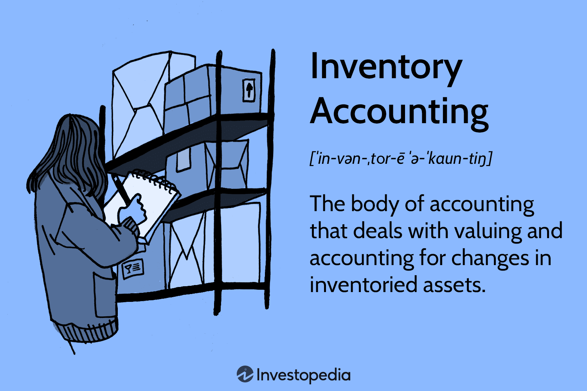

## Table of Contents

## What is inventory accounting?

Inventory accounting is a way businesses keep track of the goods they have for sale. It helps them know how much stuff they have, where it is, and how much it cost. This is important because it affects how much profit a business makes. If a business doesn't keep good track of its inventory, it might think it has more or less profit than it really does.

There are different ways to do inventory accounting. Some businesses use a method called "first in, first out" (FIFO), where they sell the oldest items first. Others use "last in, first out" (LIFO), where they sell the newest items first. Each method can change how much a business says it made in profit. Choosing the right method depends on the type of business and what makes the most sense for them.

## Why is inventory accounting important for businesses?

Inventory accounting is really important for businesses because it helps them know exactly what they have and where it is. This is key for making sure they can meet customer demands without running out of stock or having too much stuff sitting around. If a business knows what it has, it can plan better and make smarter decisions about buying more goods or selling what they have.

Also, inventory accounting affects how much profit a business shows on its [books](/wiki/algo-trading-books). By keeping track of how much each item costs and how much it sells for, a business can figure out its profit margins. This is important for understanding if the business is doing well or if it needs to make changes. Good inventory accounting helps businesses stay on top of their finances and make sure they're not losing money because of mistakes in their records.

## What are the different methods of inventory accounting?

There are a few main ways businesses can do inventory accounting. One common method is called "First In, First Out," or FIFO. This means that the first items a business buys are the first ones it sells. It's like a line at the grocery store where the first person in line gets served first. This method can be good when prices are going up because it means the business can report higher profits.

Another method is "Last In, First Out," or LIFO. With LIFO, the last items a business buys are the first ones it sells. It's like if you put new groceries at the front of your fridge and use them before the older ones. This can be helpful when prices are going up because it lets the business show lower profits, which can mean paying less in taxes.

There's also a method called "Weighted Average Cost," or WAC. This method takes the average cost of all the items in inventory and uses that to figure out the cost of goods sold. It's like if you mixed all your different priced groceries together and used the average price to figure out how much you spent. This method can be good for businesses with lots of different items that change in price a lot.

## How does inventory accounting affect financial statements?

Inventory accounting affects financial statements a lot because it changes how much a business says it has in assets and how much profit it makes. On the balance sheet, inventory is shown as an asset. If a business uses a method like FIFO, it might show a higher value for inventory because it's using older, cheaper costs. This makes the business look like it has more assets. On the other hand, using LIFO might show a lower value for inventory because it uses newer, more expensive costs.

The income statement also changes because of inventory accounting. The cost of goods sold (COGS) is calculated differently depending on the method used. If a business uses FIFO, COGS might be lower because it's selling older, cheaper items first. This makes the profit look higher. But if it uses LIFO, COGS could be higher because it's selling newer, more expensive items first, which can make the profit look lower. This can affect how much tax the business has to pay and how investors see the business's performance.

## What are the common challenges faced in inventory accounting?

One big challenge in inventory accounting is keeping track of everything correctly. It's easy to make mistakes, like counting the wrong number of items or putting down the wrong price. These small errors can add up and mess up the whole inventory record. If a business doesn't have good systems in place to keep everything organized, it might end up with numbers that are way off. This can make it hard to know if the business is making money or losing it.

Another challenge is dealing with changes in prices. If the cost of goods goes up or down, it can be tricky to figure out the right value for inventory. Using different methods like FIFO or LIFO can change how much profit the business shows, and it's important to pick the right one. Plus, if a business sells a lot of different products, keeping track of all the different prices and quantities can get really complicated. This is why having a good inventory management system is so important.

## How can businesses implement effective inventory accounting practices?

To implement effective inventory accounting practices, businesses need to start by choosing the right inventory accounting method that fits their needs. If prices are going up, using FIFO can show higher profits, which might be good for some businesses. But if they want to show lower profits for tax reasons, LIFO might be better. It's important to pick a method and stick with it so the financial statements make sense over time. Also, businesses should invest in good inventory management software. This can help keep track of everything accurately and make it easier to update records when things change.

Another key part of effective inventory accounting is doing regular checks, or audits, to make sure the numbers are right. This means counting the physical inventory and comparing it to what's written down. If there are any differences, the business needs to figure out why and fix the records. It's also helpful to train employees well so they understand how to handle inventory correctly. This includes knowing how to enter data, how to deal with returns, and how to spot mistakes. By keeping everything organized and up-to-date, businesses can avoid big problems and keep their financial statements accurate.

## What are the benefits of accurate inventory accounting?

Accurate inventory accounting helps businesses know exactly what they have and where it is. This means they can make sure they have enough stock to meet customer needs without having too much sitting around. If a business knows what it has, it can plan better and buy more goods at the right time. This saves money because it stops the business from buying too much or running out of stock, which can lose them customers.

Also, accurate inventory accounting affects how much profit a business shows. If the numbers are right, the business can see if it's making money or if it needs to change how it does things. This helps with making smart decisions about pricing and selling. Plus, when the inventory records are correct, it makes the financial statements look good to investors and lenders. They trust the business more, which can help it grow and get more money to invest in the future.

## How does inventory accounting integrate with other business systems?

Inventory accounting works closely with other parts of a business, like sales and purchasing. When a sale happens, the inventory system needs to know so it can update how much stock is left. This helps keep the numbers right and makes sure the business knows what it has at all times. The purchasing system also needs to talk to the inventory system. If the inventory is low, the purchasing system can order more goods to keep the stock at the right level. This way, the business can always meet customer needs without having too much stuff sitting around.

Inventory accounting also connects with the accounting and finance systems. The numbers from inventory accounting go into the financial statements to show how much the business has in assets and how much profit it makes. This helps the business see if it's doing well and making money. If the inventory numbers are wrong, it can mess up the whole financial picture. That's why it's important for all these systems to work together smoothly. When they do, the business can make better decisions and keep everything running smoothly.

## What role does technology play in modern inventory accounting?

Technology plays a big role in modern inventory accounting by making it easier and more accurate. Businesses use special software called inventory management systems to keep track of their goods. These systems can automatically update when items are bought or sold, so the numbers stay correct without a lot of work. They can also use barcode scanners and RFID tags to count inventory quickly and without mistakes. This helps businesses know exactly what they have and where it is, which is important for planning and making decisions.

Technology also helps businesses connect their inventory accounting with other systems like sales and purchasing. When a sale happens, the inventory system knows right away and updates the stock levels. This keeps everything in sync and helps avoid problems like running out of stock or having too much. Plus, technology makes it easier to do regular checks, or audits, to make sure the numbers are right. By using technology, businesses can save time, reduce errors, and make better decisions based on accurate data.

## How do international accounting standards impact inventory accounting?

International accounting standards, like those set by the International Accounting Standards Board (IASB), have rules that businesses need to follow when they do inventory accounting. One important standard is called IAS 2, which tells businesses how to value their inventory and how to show it on their financial statements. This helps make sure that businesses around the world are doing their inventory accounting in a similar way, which makes it easier for investors and others to understand and compare different companies.

These standards can affect how businesses choose their inventory accounting methods. For example, IAS 2 says businesses can use either FIFO or weighted average cost methods, but it doesn't allow LIFO. This means businesses that want to follow these standards have to pick a method that fits the rules. By following international standards, businesses can make sure their financial reports are clear and trustworthy, which is important for doing business around the world.

## What are the advanced techniques used in inventory accounting analysis?

Advanced techniques in inventory accounting analysis help businesses get a better understanding of their stock and make smarter decisions. One technique is called ABC analysis, which sorts inventory into three groups based on how important they are for the business. Group A items are the most valuable and need close watching, while Group C items are less important and can be checked less often. This helps businesses focus their time and resources on the items that matter most. Another technique is just-in-time (JIT) inventory, which aims to have goods arrive exactly when they're needed, reducing the need to keep a lot of stock on hand. This can save money and space but needs careful planning and good relationships with suppliers.

Another advanced technique is the use of economic order quantity (EOQ) models. EOQ helps businesses figure out the best amount of inventory to order at one time to minimize costs. It takes into account things like how much it costs to order goods and how much it costs to keep them in stock. By using EOQ, businesses can save money and keep their inventory levels just right. Also, some businesses use inventory turnover analysis to see how quickly they're selling and replacing goods. A high turnover rate can mean the business is doing well and not holding onto too much stock, while a low rate might show that they need to sell more or buy less. These techniques help businesses keep their inventory in check and make sure they're using their resources wisely.

## How can inventory accounting strategies be optimized for different industries?

Different industries need different inventory accounting strategies because they sell different types of goods and have different ways of working. For example, in the retail industry, where things like clothes and electronics are sold, businesses often use the FIFO method. This helps them show higher profits when prices are going up, which is good for their financial reports. Retailers also use technology like barcode scanners to keep track of their stock accurately and quickly. They might also use just-in-time inventory to make sure they have the right amount of goods without keeping too much in stock, which can save money and space.

In the manufacturing industry, where raw materials are turned into finished products, businesses might use the weighted average cost method. This helps them handle the many different materials and parts they use, which can change in price a lot. Manufacturers also use techniques like economic order quantity to figure out the best amount of materials to order at once, which can save money on ordering and storage costs. They might also use ABC analysis to focus on the most important materials and parts, making sure they always have what they need to keep production going smoothly.

## What is the Role of Inventory Management in Algorithmic Trading?

In [algorithmic trading](/wiki/algorithmic-trading), the term "inventory" refers to the portfolio of securities, including stocks, bonds, and derivatives, that traders hold at any given moment. Unlike traditional inventory, which involves physical goods, securities inventory is a dynamic component of financial markets. Effective management of this inventory is essential to ensuring that trading objectives are met while risks and costs are minimized.

In algorithmic trading, inventory management involves a strategic balance of securities to exploit market inefficiencies and gain advantages through price discrepancies. Traders must decide the optimal quantity and types of securities to hold, executing trades based on predictive models and real-time data analytics. The goal is to achieve better returns by taking advantage of high-frequency trading opportunities and market [volatility](/wiki/volatility-trading-strategies).

One key aspect of inventory management in algorithmic trading is the need to adhere to regulatory requirements. Traders must maintain compliance with market regulations related to capital requirements, trading limits, and risk exposure limits. This necessitates careful monitoring of inventory levels and adjustments to trading strategies as market conditions and regulatory landscapes evolve.

Risk management plays a critical role in inventory management for algorithmic trading. Traders must consider risk factors such as [liquidity](/wiki/liquidity-risk-premium) risk, market risk, and counterparty risk. With an effective strategy, the portfolio can be adjusted dynamically to mitigate these risks. This often involves using quantitative risk assessment models and scenario analysis to predict and prepare for potential market shifts.

Mathematical modeling and algorithm development are central to managing securities inventory effectively. Algorithms can be designed to perform tasks such as:

- **Mean-Variance Optimization:** This method helps in the allocation of assets within the portfolio to balance the trade-off between expected return and risk. The optimization problem can be mathematically defined as:
$$
  \min_{w} \left( \frac{1}{2} w^\top \Sigma w - \mu^\top w \right)

$$

  where $w$ is the vector of weights of the assets, $\Sigma$ is the covariance matrix of asset returns, and $\mu$ is the vector of expected returns.

- **Arbitrage Strategies:** These algorithms identify and exploit price discrepancies across different markets or financial instruments, pursuing profit by executing synchronized trades that capitalize on these temporary market inefficiencies.

Overall, the integration of advanced computational techniques, real-time data analytics, and strict compliance measures facilitates efficient inventory management in algorithmic trading. This enhances the trader's ability to optimize trades effectively and maintain a competitive edge in fast-paced financial markets.

## What are the Inventory Accounting Methods used in Algorithmic Trading?

Inventory valuation is a critical [factor](/wiki/factor-investing) in determining the financial performance of a trading operation, influencing both decision-making and reporting practices. While traditional corporate settings often deal with physical goods, algorithmic trading environments focus on securities or financial instruments. Within this context, established financial models such as the Economic Order Quantity (EOQ) and Mean-Variance Optimization (MVO) are relevant for analyzing trading scenarios and optimizing outcomes.

The Economic Order Quantity (EOQ) model is typically applied in inventory management to determine the optimal order quantity that minimizes the total cost of inventory. This model can be adapted to algorithmic trading to optimize the balance between transaction costs and holding costs of securities. The EOQ formula is expressed as follows:

$$
EOQ = \sqrt{\frac{2DS}{H}}
$$

Where:
- $D$ is the annual demand for the securities or trades.
- $S$ is the cost per order or transaction.
- $H$ is the holding or carrying cost per unit.

In a trading environment, using EOQ helps strategists minimize the costs associated with buying and holding financial instruments. By obtaining the EOQ, traders can determine an efficient quantity of securities to trade, aligning with market conditions and reducing unnecessary costs.

Mean-Variance Optimization, on the other hand, is a mathematical framework used in portfolio theory to optimize the return-to-risk ratio of a portfolio. The goal of MVO is to construct a portfolio that either maximizes return for a given level of risk or minimizes risk for a given level of expected return. The optimization problem can be stated as:

$$
\text{Minimize: } \frac{1}{2} \mathbf{w}^T \Sigma \mathbf{w} - \lambda \mathbf{w}^T \mathbf{r}
$$

Subject to:

$$
\sum_{i=1}^{n} w_i = 1
$$

Where:
- $\mathbf{w}$ is the vector of weights of the securities in the portfolio.
- $\Sigma$ is the covariance matrix of returns.
- $\lambda$ is the risk tolerance parameter.
- $\mathbf{r}$ is the expected returns vector.

In algorithmic trading, MVO assists in structuring a portfolio that balances the trade-off between risk and expected return. It leverages statistical methods to analyze historical data and predict future performance, proving crucial in strategy development and risk management.

Both EOQ and MVO provide sophisticated techniques for managing and optimizing financial instrument inventories in trading. Integrating these models into trading algorithms supports the precise calibration of trading activities and inventory levels, crucial for capitalizing on market opportunities and enhancing overall trading performance.

## References & Further Reading

[1]: ["Inventory Accounting: The International Diversity, International Financial Reporting Standards and Global Convergence"](https://www.researchgate.net/publication/228170590_Accounting_Diversity_and_International_Valuation) by Richard P. Brief

[2]: Bjork, T. (2009). ["Arbitrage Theory in Continuous Time."](http://www.nigerianwomeninmaths.org/cs/books/Tomas%20Bjork-Arbitrage%20Theory%20in%20Continuous%20Time%20(Oxford%20Finance)%20(2009)%20(1).pdf) Oxford University Press.

[3]: ["Advances in Financial Machine Learning"](https://www.amazon.com/Advances-Financial-Machine-Learning-Marcos/dp/1119482089) by Marcos Lopez de Prado

[4]: ["Quantitative Trading: How to Build Your Own Algorithmic Trading Business"](https://www.amazon.com/Quantitative-Trading-Build-Algorithmic-Business/dp/1119800064) by Ernest P. Chan

[5]: PWC, IFRS and US GAAP: similarities and differences. [Link](https://viewpoint.pwc.com/dt/us/en/pwc/accounting_guides/ifrs_and_us_gaap_sim/assets/pwcifrsusgaap1124.pdf)

[6]: ["Machine Learning for Algorithmic Trading"](https://github.com/stefan-jansen/machine-learning-for-trading) by Stefan Jansen