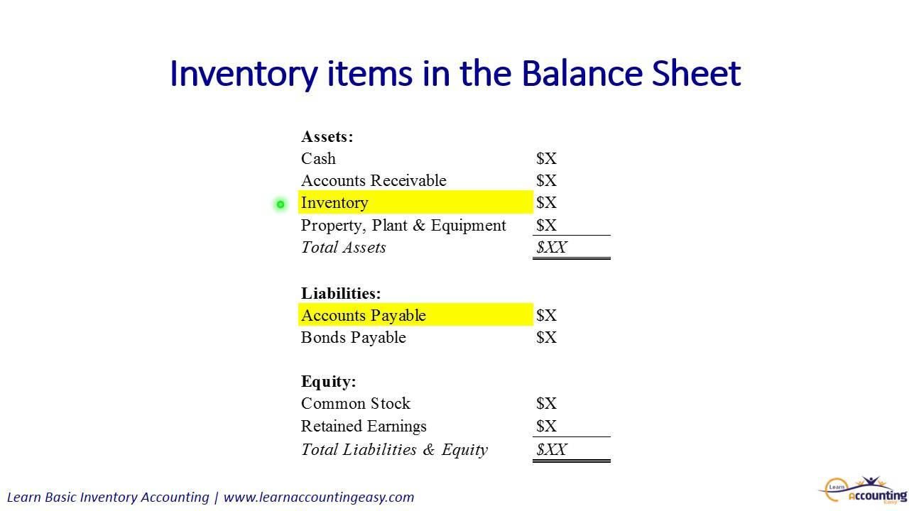

In today's rapidly evolving financial landscape, the synthesis of balance sheet analysis, inventory management, and financial accounting significantly contributes to the world of algorithmic trading. These foundational elements are vital in formulating robust investment strategies that rely on a comprehensive understanding of a company's financial health and operational efficiency. A balance sheet provides a snapshot of a company's financial position at a specific point in time, detailing its assets, liabilities, and equity. This financial statement is crucial for investors and traders who seek to evaluate the solvency and liquidity of a company, thereby aiding in informed decision-making.

Inventory analysis further complements this picture by offering insights into a firm's operational efficiency and its ability to manage supply chain and production processes effectively. Techniques such as First In, First Out (FIFO), Last In, First Out (LIFO), and weighted average valuations provide diverse perspectives on inventory accounting, impacting financial statements and business strategies. The inventory turnover ratio, a measure of how quickly a company sells and replaces its inventory, serves as a critical indicator for assessing a company's market competitiveness and operational health.



Algorithmic trading, characterized by the use of complex algorithms to execute trades at speeds and frequencies beyond human capability, leverages these aspects of financial accounting to optimize trading decisions. By integrating data from balance sheets and inventory analytics, algorithms can establish patterns and predict market movements, enabling traders to capitalize on fleeting opportunities with precision.

This article aims to expound on how balance sheets and inventory analysis enhance the efficacy of algorithmic trading. Readers can expect a thorough explanation of these financial concepts, their integration into trading models, and an exploration of both the advantages and challenges inherent in this symbiosis. Ultimately, a deeper understanding of these elements will facilitate more informed and strategic trading decisions.

## Table of Contents

## Understanding Balance Sheets in Financial Accounting

A balance sheet is a financial statement that provides a snapshot of a company's financial position at a specific point in time. It is structured around the accounting equation: Assets = Liabilities + Equity. This equation highlights the fundamental relationship between what a company owns and owes, alongside the residual interest of the shareholders.

**Components of a Balance Sheet:**

1. **Assets**: These are resources owned by the company that have economic value. They are categorized into current and non-current assets. Current assets include cash, inventories, and accounts receivable, while non-current assets entail long-term investments and property, plant, and equipment.

2. **Liabilities**: These represent the company's obligations and are similarly divided into current and non-current categories. Current liabilities consist of accounts payable and short-term debt, while non-current liabilities include long-term debt and other long-term obligations.

3. **Equity**: Often referred to as shareholders' or owners' equity, this component reflects the residual interest in the assets of the entity after deducting liabilities. It comprises common stock, retained earnings, and additional paid-in capital.

**Role in Financial Accounting and Reporting:**

Balance sheets play a pivotal role in financial accounting. They are essential for financial reporting, providing stakeholders such as investors, creditors, and regulators with crucial insights into a company's financial stability and operational efficiency. By analyzing a balance sheet, stakeholders can assess [liquidity](/wiki/liquidity-risk-premium), solvency, and the overall financial condition of a business entity.

**Assessing Financial Health:**

Through the analysis of a balance sheet, investors and analysts can assess the financial health of a company. Key metrics derived from the balance sheet include the current ratio (Current Assets / Current Liabilities), which measures a company's ability to cover short-term obligations, and the debt-to-equity ratio (Total Liabilities / Equity), which evaluates financial leverage and risk exposure.

**Investors and Balance Sheets:**

Investors use balance sheets to evaluate investment opportunities by comparing assets and liabilities to determine a company's net worth and financial resilience. For instance, a company with a strong asset base relative to its liabilities might be considered financially healthy, offering lower risk for investment.

**Relevance in Algorithmic Trading:**

In [algorithmic trading](/wiki/algorithmic-trading), balance sheets are integral for selecting equities. Algorithms can be programmed to identify companies with strong balance sheets, ensuring a robust asset base or favorable debt-to-equity ratios. Such quantitative parameters improve the probability of selecting financially sound companies, paving the way for optimized trading strategies.

For example, a Python script for evaluating companies based on their balance sheet strength may use pandas to handle financial data and perform calculations, such as computing the current and debt-to-equity ratios, to identify viable trading opportunities:

```python
import pandas as pd

# Sample balance sheet data
data = {'current_assets': [500000, 700000], 'current_liabilities': [300000, 500000],
        'total_liabilities': [200000, 400000], 'equity': [300000, 600000]}
balance_sheets = pd.DataFrame(data)

# Calculate financial ratios
balance_sheets['current_ratio'] = balance_sheets['current_assets'] / balance_sheets['current_liabilities']
balance_sheets['debt_to_equity'] = balance_sheets['total_liabilities'] / balance_sheets['equity']

# Criteria for selection
selected = balance_sheets[(balance_sheets['current_ratio'] > 1.5) & (balance_sheets['debt_to_equity'] < 0.5)]
print(selected)
```
By incorporating balance sheet analysis into algorithmic trading strategies, traders can enhance their decision-making process, aligning trades with firms that demonstrate robust financial health.

## The Role of Inventory Analysis

Inventory analysis is a critical component of business operations, aiding organizations in efficient management of their stock and resources. At its core, inventory analysis involves evaluating the quantities, location, and status of the stock a business uses or sells. Understanding inventory levels can streamline operations, reduce costs, and significantly influence financial outcomes.

Inventory valuation is a crucial aspect of inventory analysis. It refers to the method used to assign value to the inventory held by a business, impacting both the balance sheet and income statement. The most common valuation methods are:

1. **First-In, First-Out (FIFO):** Under FIFO, the oldest stock items purchased or produced are recorded as sold first. This method aligns well with the natural flow of inventory for businesses dealing with perishable goods. In times of rising prices, FIFO results in lower cost of goods sold (COGS) and higher ending inventory value.

2. **Last-In, First-Out (LIFO):** LIFO assumes the newest inventory is sold first. This approach is advantageous in an inflationary environment as it lends itself to higher COGS and thus lower taxable income. However, it can lead to outdated inventory valuations.

3. **Weighted Average Cost:** This method calculates inventory value based on the average cost of all items available for sale during the period. It smooths out price fluctuations over the accounting period, providing a consistent cost measure.

Effective inventory management directly impacts financial statements and overall business efficiency. Proper management ensures that there is minimal overstock or stockouts, maintains efficient cash flow, and supports business growth. Efficient inventory systems improve operational decisions, reduce holding costs, and enhance customer satisfaction.

Inventory turnover ratios are a pivotal metric in this analysis. Inventory turnover is calculated as:

$$
\text{Inventory Turnover Ratio} = \frac{\text{Cost of Goods Sold (COGS)}}{\text{Average Inventory}}
$$

This ratio measures how frequently a company's inventory is sold and replenished over a specific period. High turnover ratios indicate effective inventory management and strong sales, whereas low ratios may suggest overstock or obsolescence. Investors use these ratios to assess business performance and make informed decisions about potential investments.

Inventory analysis extends beyond internal operations and is integral to algorithmic trading strategies. Algorithms that incorporate inventory data can assess a firm's supply chain effectiveness and sector position, influencing trading decisions. For instance, an algorithm might capture real-time inventory changes across sales channels to predict potential price movements or stock shortages. This integration enables traders to capitalize on sector trends, ensuring timely and profitable trading strategies. 

In conclusion, inventory analysis, with its valuation and management techniques, not only enhances business operations but also supports effective investment decisions by intersecting with algorithmic trading strategies related to supply chain and sector analyses.

## Integrating Financial Accounting with Algorithmic Trading

Integrating financial accounting with algorithmic trading involves leveraging comprehensive financial data to enhance algorithmic models used in trading decisions. Financial accounting provides crucial quantitative data that form the foundation for developing sophisticated trading algorithms. Key financial metrics derived from accounting statements, such as revenue, profit margins, and liquidity ratios, are often used to predict market movements, assess company value, and inform investment strategies.

In designing trading algorithms, the accuracy and timeliness of financial data are paramount. Algorithms utilize real-time data retrieval systems to update and analyze financial statements, allowing traders to respond quickly to market conditions. This real-time analysis helps in capturing transient financial anomalies or trends that could be translated into profitable trades.

One model employed in algorithmic trading is the [fundamental analysis](/wiki/fundamental-analysis) model, which uses financial accounting data like earnings, revenue growth, and balance sheet strength to predict stock price movements. Such models might incorporate a multivariate regression analysis where dependent variables (e.g., stock prices) are predicted based on independent financial variables (e.g., EPS, debt ratio).

Accounting anomalies, such as discrepancies found in revenue recognition or sudden changes in asset liquidity, can present unique trading opportunities. Algorithms programmed to detect these discrepancies can capitalize on market inefficiencies. For example, predictive algorithms might identify undervalued stocks by comparing intrinsic values derived from detailed accounting analysis against current market prices.

In practice, detecting anomalies involves employing statistical techniques such as Z-scores and variance analysis, which can indicate irregularities in financial reporting. Here's a simple Python snippet demonstrating how one could detect sudden changes in a financial metric, such as inventory levels:

```python
import pandas as pd
import numpy as np

# Sample data for inventory levels across periods
data = {'Period': ['Q1', 'Q2', 'Q3', 'Q4'],
        'Inventory': [10000, 15000, 12000, 25000]}
df = pd.DataFrame(data)

# Calculate percentage change
df['Change'] = df['Inventory'].pct_change()

# Detect anomaly with Z-score
df['Z-score'] = (df['Change'] - df['Change'].mean()) / df['Change'].std()

# Highlight periods where change is significant
anomalies = df[np.abs(df['Z-score']) > 2]

print(anomalies)
```

Through algorithms equipped with such data-driven insights, traders can automate decision-making processes, minimizing human error and improving the likelihood of successful trades. Integrating financial accounting with algorithmic trading is not just about data interpretation but also about continuously refining models to align with evolving market dynamics and financial practices.

## Advantages of Using Algorithmic Trading

Algorithmic trading, often referred to as algo trading, offers several advantages over manual trading, significantly transforming how financial markets operate. 

Firstly, algorithmic trading enhances efficiency through automation and speed. Algorithms execute trades in milliseconds, allowing for the rapid processing of vast amounts of data that would be impossible manually. This speed is crucial in markets where price movements can occur in fractions of a second, thereby providing a competitive edge to traders who can capitalize on minute price discrepancies. 

Secondly, risk management is a major feature integrated into algorithmic trading systems. These systems can be programmed to adhere to pre-defined risk parameters, automatically executing stop-loss orders when certain market conditions are met. This minimizes the emotional bias often associated with manual trading by strictly following predefined rules, thus ensuring consistency and discipline.

Several case studies illustrate the success of algorithmic trading strategies. One notable example is Renaissance Technologies, a [hedge fund](/wiki/hedge-fund-trading-strategies) known for its Medallion Fund, which reportedly achieved annualized returns of about 66% between 1988 and 2018. Another example is the use of high-frequency trading ([HFT](/wiki/high-frequency-trading-strategies)) strategies that leverage algorithms to execute a large number of orders at extremely fast speeds, capitalizing on small price changes across diverse assets.

Moreover, algorithmic trading emphasizes scalability and precision. Once an algorithm is developed, it can be deployed across multiple markets and assets simultaneously, significantly increasing trading [volume](/wiki/volume-trading-strategy) without a proportional increase in errors. Precision is another advantage, as algorithms can make decisions based on quantitative data inputs and statistical models, thereby eliminating human error inherent in manual trading.

In summary, algorithmic trading provides substantial improvements in trading efficiency, precision, and risk management, while offering the scalability necessary for modern financial markets. These advantages underscore its growing dominance in the trading landscape.

## Challenges and Considerations

Integrating balance sheet and inventory data into algorithmic trading algorithms presents a notable set of challenges. First, the data from balance sheets and inventory records can be vast, complex, and inconsistent across businesses, making it difficult to standardize and incorporate into trading systems. Algorithms require precise and uniform input to function effectively, yet financial data often come in varied formats requiring sophisticated normalization.

In terms of risk, algorithmic trading is inherently prone to market [volatility](/wiki/volatility-trading-strategies). Algorithms make decisions based on historical data and specific parameters, which may not accurately predict unexpected market shifts or economic events. This volatility can result in significant financial loss if algorithms are not equipped to handle abrupt changes. Additionally, the high-frequency nature of algorithmic trading increases the susceptibility to systemic risks and market anomalies.

Regulatory considerations are another crucial [factor](/wiki/factor-investing). The financial sector is highly regulated, and adhering to regulations like MiFID II in the EU or FINRA rules in the US is mandatory. These regulations can affect how algorithms operate, demanding compliance with transparency, accountability, and reporting standards. Non-compliance can lead to legal repercussions and financial penalties.

Robust [backtesting](/wiki/backtesting) and risk assessment are critical components to mitigate these challenges. Backtesting involves simulating an algorithm's trading strategy on historical data to evaluate its effectiveness before live deployment. This process helps in understanding potential pitfalls and optimizing the strategy. However, backtesting is limited by the assumption that past performance can predict future results, which may not always hold true.

To counter these challenges, traders and developers can employ diverse strategies and advanced technologies. Machine learning algorithms can enhance data processing and prediction capabilities, enabling the system to adapt to new data patterns over time. Additionally, employing cloud-based technologies for real-time data retrieval and processing can significantly improve the agility and scalability of trading systems.

Python, for example, can be used to implement such strategies effectively. Here's a simple outline of a Python function that might normalize balance sheet data for further analysis:

```python
import pandas as pd

def normalize_data(df):
    normalized_df = (df - df.mean()) / df.std()
    return normalized_df

# Example usage:
balance_sheet_data = pd.DataFrame({
    'Assets': [100, 150, 200],
    'Liabilities': [30, 50, 70],
    'Equity': [70, 100, 130]
})

normalized_balance_sheet_data = normalize_data(balance_sheet_data)
print(normalized_balance_sheet_data)
```

This example demonstrates the basic approach to prepare financial data for integration into more complex trading algorithms. Employing these strategies helps mitigate risks associated with data integration, regulatory compliance, and market volatility, ensuring that algorithmic trading systems operate reliably and effectively in a dynamic financial landscape.

## Future Trends in Financial Accounting and Algo Trading

Emerging technologies like [artificial intelligence](/wiki/ai-artificial-intelligence) (AI) and [machine learning](/wiki/machine-learning) are increasingly transforming trading algorithms, providing unprecedented capabilities in data analysis and decision-making. These technologies allow for the development of algorithms that learn from historical data and adapt to new patterns, enhancing prediction accuracy and optimizing trading strategies. AI techniques, such as neural networks and [reinforcement learning](/wiki/reinforcement-learning), are being employed to scrutinize vast amounts of financial data and derive actionable insights, fostering more informed trading decisions. Machine learning algorithms can process diverse data sets, including news articles, social media sentiment, and real-time market data, to predict market trends more efficiently than traditional models.

The future of trading strategies is expected to integrate more refined financial metrics, informed by advancements in financial accounting and data analytics. These enhanced metrics will likely include non-traditional data sources, such as environmental, social, and governance ([ESG](/wiki/esg-investing)) factors, which are gaining prominence in investment decisions. Incorporating these expanded metrics into trading algorithms could provide a more comprehensive view of a company's performance and risks, potentially leading to more sustainable and responsible investment strategies.

Big data and analytics are playing a crucial role in the evolution of trading models. The ability to process and analyze large volumes of data in real-time is enabling traders to capture more nuanced market signals and execute trades with greater precision. Advanced analytics tools can identify hidden correlations and emerging patterns in financial markets, facilitating the development of sophisticated trading models that can anticipate and exploit market inefficiencies.

Financial technology (fintech) is significantly influencing the landscape of financial accounting and trading. Fintech innovations are streamlining data collection and reporting processes, making financial information more accessible and transparent. This accessibility supports the integration of real-time financial data into trading algorithms, enhancing their responsiveness to market changes. Furthermore, fintech platforms are democratizing access to advanced trading tools, allowing a broader range of investors to benefit from algorithmic trading strategies.

In conclusion, the confluence of AI, machine learning, big data, and fintech is reshaping the field of algorithmic trading and financial accounting. As these technologies continue to advance, they promise to deliver more precise, efficient, and inclusive trading solutions, while integrating broader and more insightful financial metrics.

## Conclusion

In this article, we explored the intricate relationship between balance sheets, inventory analysis, and algorithmic trading. These financial components are vital in crafting effective trading strategies. A balance sheet, with its components of assets, liabilities, and equity, provides a snapshot of a company's financial health, which is indispensable for identifying potential investment opportunities. Similarly, inventory analysis, through methods like FIFO, LIFO, and weighted average, informs business efficiency and impacts financial statements — an essential consideration for traders focusing on supply chain dynamics.

The integration of financial accounting principles with algorithmic trading enhances decision-making by offering a quantitative foundation from which algorithms can predict market trends. This synergy showcases how real-time data analysis and retrieval are pivotal in the trading ecosystem. Algorithmic trading, with its speed, precision, and scalability, further emphasizes the significant advantages it has over traditional manual trading methods. However, it also presents challenges such as market volatility risks and the necessity for robust compliance frameworks.

Looking ahead, the fusion of machine learning and AI with trading algorithms promises more refined and adaptive trading strategies, while the proliferation of big data and analytics continues to evolve trading models. Fintech innovations are expected to further influence both financial accounting and trading strategies, offering advanced tools for analysis and decision-making.

In conclusion, utilizing balance sheet analysis and inventory management in algorithmic trading holds great promise for informed investment decisions. Traders and analysts are encouraged to deepen their understanding of these financial concepts and explore algorithmic trading strategies, thereby positioning themselves to capitalize on technological advancements and emerging opportunities in the financial markets.

## References & Further Reading

[1]: ["Financial Modeling and Algorithmic Trading Techniques"](https://www.sciencedirect.com/science/article/pii/S1319157824001046) by Robert Kissell.

[2]: ["Inventory Accounting: A Comprehensive Guide"](https://www.amazon.com/Inventory-Accounting-Comprehensive-Steven-Bragg/dp/0471356425) by Steven M. Bragg.

[3]: ["Principles of Financial Accounting"](https://www.investopedia.com/terms/f/financialaccounting.asp) by Charles T. Horngren, Walter T. Harrison Jr., and M. Suzanne Oliver.

[4]: ["Advances in Financial Machine Learning"](https://www.amazon.com/Advances-Financial-Machine-Learning-Marcos/dp/1119482089) by Marcos Lopez de Prado.

[5]: ["Building Winning Algorithmic Trading Systems: A Trader's Journey"](https://www.amazon.com/Building-Winning-Algorithmic-Trading-Systems/dp/1118778987) by Kevin J. Davey.