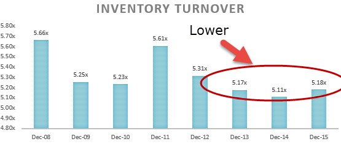

Inventory analysis, financial analysis, and algorithmic trading are integral components of a comprehensive business strategy in today’s fast-paced, technology-driven markets. Each plays a critical role in parsing large volumes of data to extract actionable insights, optimize operations, and enhance decision-making. The intersection of these elements allows businesses to not only maintain competitiveness but also to foresee market trends and manage risks effectively.

Inventory analysis is an essential part of a company’s financial analysis toolkit. It involves examining a company's stock of goods and materials, which can be categorized into raw materials, work-in-progress, and finished goods. Understanding inventory helps in assessing a company's operational efficiency and impacts balance sheet analysis by providing a clearer picture of a business's working capital management. The valuation of inventory, using methods like First-In-First-Out (FIFO), Last-In-First-Out (LIFO), or weighted average, directly influences the accuracy of a company’s financial statements and plays a critical role in determining profitability.



Financial analysis, on the other hand, employs various tools and metrics, such as financial ratios, to evaluate a company's performance and stability. Ratios associated with inventory, like inventory turnover and days sales of inventory, provide insights into how effectively a company manages its inventory relative to its sales. These ratios aid in identifying trends, forecasting future performance, and supporting financial decision-making processes.

Algorithmic trading leverages mathematical models and algorithms to execute trades based on real-time market data. The integration of inventory and financial data into algorithmic trading can significantly enhance the precision of these models. By incorporating detailed inventory data, businesses can refine their trading strategies, adapt quickly to inventory-related market signals, and improve their predictive capabilities.

This article explores how balance sheet analysis, inventory management, and algo trading intersect, providing a holistic view of how modern businesses can implement these intersections for optimal performance. Following the introduction, you'll gain insight into the significance of inventory within financial analysis, understand the importance of inventory-related financial ratios, explore the integration of inventory data in algorithmic trading, and examine the advantages and challenges of combining these frameworks. Additionally, future trends and the evolving role of technology in these fields will be discussed, concluding with practical insights and recommendations for leveraging these integrated strategies for sustained market competitiveness.

## Table of Contents

## Understanding Inventory in Financial Analysis

Inventory is a critical component of a company's balance sheet and serves as a bridge between production and sales. It represents the goods and materials a business holds for the purpose of resale or production. On the balance sheet, inventory is considered a current asset, reflecting its potential to be converted into cash within a year as part of the normal business cycle. Its significance extends beyond mere financial metrics; effective inventory management can substantially impact a company's operational efficiency, cash flow, and profitability.

### Types of Inventory

Inventory can be categorized into three main types:

1. **Raw Materials**: These are the basic materials and components that companies use to produce goods. For manufacturers, raw materials constitute a direct input into the production process.

2. **Work-in-Progress (WIP)**: This category includes all items that are in the production process but not yet completed. WIP inventory encompasses raw materials, labor, and overhead costs that are in the midst of being transformed into finished goods.

3. **Finished Goods**: These are completed products that are ready for sale. Finished goods represent the end result of the production cycle and are ready to be sold to customers.

### Methods of Inventory Valuation

Inventory valuation methods are crucial for financial reporting and tax purposes, affecting the cost of goods sold, net income, and inventory value on the balance sheet. The primary valuation methods include:

- **First-In, First-Out (FIFO)**: FIFO assumes that the oldest inventory items are sold first. In periods of rising prices, this method can result in lower cost of goods sold and thus higher net income and tax expenses, as it assumes cheaper, older costs are recorded first.

- **Last-In, First-Out (LIFO)**: LIFO assumes that the newest inventory items are sold first. During inflationary periods, LIFO can lead to higher cost of goods sold and lower ending inventory values, resulting in lower taxable income. However, it is important to note that LIFO is not permitted under the International Financial Reporting Standards (IFRS).

- **Weighted Average Cost**: This method calculates an average cost per unit by dividing the total cost of goods available for sale by the total units available for sale. It smooths out price fluctuations over the accounting period, providing a consistent cost measure for inventory.

### Role of Inventory Data in Assessing Operational Efficiency

Inventory data is pivotal in evaluating a company’s operational efficiency. Key performance indicators, such as inventory turnover and days sales of inventory (DSI), help assess how well a company manages its stock levels relative to its sales. 

- **Inventory Turnover**: This ratio indicates how many times a company sells and replaces its stock over a period. It is calculated as:
$$
  \text{Inventory Turnover} = \frac{\text{Cost of Goods Sold (COGS)}}{\text{Average Inventory}}

$$

  A higher turnover rate signifies efficient inventory management, whereas a lower rate may imply overstocking or obsolete inventory.

- **Days Sales of Inventory (DSI)**: This metric shows the average number of days it takes for a company to turn its inventory into sales, calculated as:
$$
  \text{DSI} = \frac{\text{Ending Inventory}}{\text{COGS}} \times 365

$$

  A lower DSI reflects an efficient inventory cycle, while a higher DSI can signal potential issues in moving stock.

In conclusion, understanding how inventory is defined, categorized, and valued, along with examining its role through key financial metrics, provides valuable insights into a company's operational health. Efficient inventory management is integral to optimizing operational efficiency and can significantly influence financial outcomes.

## Financial Ratios and Their Importance in Inventory Analysis

Financial ratios are pivotal metrics in inventory analysis, providing crucial insights into a company's sales performance and inventory management effectiveness. Two key ratios that play a significant role in this context are inventory turnover and days sales of inventory (DSI).

### Inventory Turnover

Inventory turnover measures how many times a company's inventory is sold and replaced over a given period. It is calculated using the formula:

$$
\text{Inventory Turnover} = \frac{\text{Cost of Goods Sold (COGS)}}{\text{Average Inventory}}
$$

This ratio is essential for understanding the efficiency with which a company is managing its inventory. A high inventory turnover indicates that a company sells its inventory quickly, suggesting robust sales performance and effective inventory management. Conversely, a low turnover may signal excess inventory, poor sales, or ineffective inventory strategy.

**Example Calculation**: 
Consider a company with a COGS of $500,000 and an average inventory worth $100,000. The inventory turnover would be:

$$
\text{Inventory Turnover} = \frac{500,000}{100,000} = 5
$$

This indicates the company turns over its inventory five times in the specified period.

### Days Sales of Inventory (DSI)

DSI evaluates the average number of days a company takes to sell its entire inventory during a given period. The formula is:

$$
\text{DSI} = \frac{\text{Average Inventory} \times 365}{\text{Cost of Goods Sold}}
$$

DSI provides a perspective on the duration for which the current stock will last if no new inventory is added. It helps understand how efficiently a company manages its inventory relative to its sales. A lower DSI suggests faster sales and efficient inventory turnover, while a higher DSI may indicate slower sales.

**Example Calculation**:
Using the previous example's figures, the DSI would be:

$$
\text{DSI} = \frac{100,000 \times 365}{500,000} = 73 \text{ days}
$$

This means, on average, it takes the company 73 days to sell its current inventory.

### Impact on Financial Decision-Making

The analysis of these ratios provides managers and investors with insights critical to strategic decision-making. Managers can identify operational inefficiencies and adjust pricing, purchasing, or marketing strategies to optimize inventory levels. Investors leverage these ratios to assess a company’s financial health and operational efficiency, influencing investment decisions.

Efficient inventory management reflected through favorable ratios supports cash flow improvements, reduces holding costs, and enhances profitability. By monitoring inventory turnover and DSI, companies can better align inventory levels with demand forecasts, avoiding both stockouts and excess inventory situations.

Overall, inventory ratios are indispensable in sculpting financial and strategic initiatives, giving businesses a competitive edge. Their application not only supports operational adjustments but also aids in robust financial forecasting and planning.

## Integrating Inventory Analysis with Algo Trading

Algorithmic trading, commonly known as algo trading, involves the use of computer algorithms to execute trades at speeds and frequencies beyond human capability. It relies heavily on financial data to make informed trading decisions. Among the critical financial data types used in this process, inventory data holds a valuable position. 

### Integration with Algorithmic Trading

Incorporating inventory data into [algorithmic trading](/wiki/algorithmic-trading) models can significantly enhance their performance. Inventory data provides insights into a company's operational health, supply chain efficiency, and potential stock levels, influencing trading strategies. By understanding inventory levels, traders can predict stock price movements, align trading strategies with company operations, and anticipate changes in market trends.

### Enhancements through Inventory Data

Inventory data contributes to more accurate forecasting of a company's prospects. For example, a sudden increase in finished goods inventory might suggest weakened demand, potentially signaling a future price drop. Conversely, a decrease in inventory may indicate strong sales performance and possibly an upward price trend. By integrating these insights, algo trading systems can better 'see' market patterns that might not be evident through traditional financial data alone.

### Case Studies

Several trading firms have successfully leveraged inventory data to optimize their trading algorithms. For instance, large retail chains have employed real-time inventory tracking systems, feeding continuous inventory updates into their algorithmic trading models. These systems can be programmed to adjust strategies dynamically, aligning trades with the latest inventory reports and market conditions.

### Real-Time Inventory Data and High-Frequency Trading

In the domain of high-frequency trading ([HFT](/wiki/high-frequency-trading-strategies)), where rapid execution is crucial, real-time inventory data is indispensable. HFT traders can use live inventory updates to make instantaneous trading decisions based on the current supply-demand dynamics in a particular sector. For example, if real-time data indicates a sudden depletion in the technology sector's components inventory, an HFT algorithm can promptly capitalize on the anticipated price increases before the market at large becomes aware.

Integrating real-time inventory data involves sophisticated data processing and the ability to interpret this data swiftly. Implementing such systems requires robust technological infrastructure to handle vast amounts of data efficiently and accurately. The formulaic adjustment of trading strategies can be illustrated with Python as follows:

```python
def adjust_trading_strategy(inventory_level, threshold_low, threshold_high):
    if inventory_level < threshold_low:
        return "Buy"
    elif inventory_level > threshold_high:
        return "Sell"
    else:
        return "Hold"

current_inventory = get_real_time_inventory_data()  # Placeholder function
strategy = adjust_trading_strategy(current_inventory, 1000, 5000)
execute_trade(strategy)  # Executes the trade based on strategy
```

In conclusion, the fusion of inventory analysis and algorithmic trading holds significant potential for enhancing trading strategies. By integrating comprehensive inventory data, traders can achieve a competitive advantage, making more informed decisions and staying ahead in the fast-paced trading environment.

## Advantages of Combining Financial and Inventory Analysis in Trading

Combining financial and inventory analysis in trading provides numerous advantages that enhance decision-making and operational efficiency. By integrating these elements, traders and financial managers can gain a more comprehensive view of a company's performance, leading to more informed decisions.

One of the primary benefits is the improvement in decision-making processes. Financial analysis provides a quantitative view of a company's performance, often using financial statements and ratios. Inventory analysis offers insights into how well a company manages its resources, highlighting its operational efficiency. When these analyses are combined, traders can identify trends and anomalies that may not be apparent from a single perspective. For instance, a rising inventory turnover ratio, in conjunction with strong financial ratios, signals efficient asset management and potential market opportunities.

Moreover, this integrated analysis enhances risk management and predictive capabilities. Comprehensive inventory data allows traders to predict potential supply chain disruptions or excess inventory issues. When combined with financial analysis, it aids in understanding the financial implications of these risks. Advanced algorithms can utilize this data to forecast potential market movements and adjust trading strategies accordingly. Predictive models, often powered by [machine learning](/wiki/machine-learning), analyze historical inventory data alongside financial metrics to predict future stock performance.

An example of successful integration comes from technology companies that have adopted these methods. For instance, firms like Amazon and Walmart use sophisticated algorithms that incorporate inventory data with financial metrics to optimize stock levels and pricing strategies. These companies have leveraged data analytics to reduce holding costs and improve asset turnover, leading to more efficient operations and a competitive edge in the market.

To illustrate how this combination is technically implemented, consider a Python example that uses libraries like pandas and numpy to assess inventory turnover and financial ratios:

```python
import pandas as pd

# Sample financial and inventory data
data = {
    'Cost of Goods Sold': [100000, 150000, 200000],
    'Average Inventory': [20000, 25000, 30000],
    'Net Sales': [500000, 600000, 700000],
    'Total Assets': [400000, 450000, 500000]
}

df = pd.DataFrame(data)

# Calculating Inventory Turnover Ratio
df['Inventory Turnover'] = df['Cost of Goods Sold'] / df['Average Inventory']

# Calculating Return on Assets (ROA)
df['ROA'] = df['Net Sales'] / df['Total Assets']

print(df[['Inventory Turnover', 'ROA']])
```

This script calculates key ratios that integrate financial data, aiding in evaluating a company's operational efficiency and profitability.

Overall, companies that effectively combine financial and inventory analyses can achieve greater accuracy in forecasting, leading to increased market adaptability. This integrated approach not only supports enhanced efficiency and risk management but also offers a significant strategic advantage in the competitive trading environment.

## Challenges and Considerations

Data standardization and integration are critical challenges in the intersection of inventory analysis, financial analysis, and algorithmic trading. Companies often struggle with disparate data sources and formats, which can obstruct seamless data integration necessary for precise analyses and trading strategies. Consistent formats and standardized data are essential, as non-standard data can lead to erroneous analyses and decisions. Moreover, integrating real-time data from various systems, such as inventory management and financial databases, requires robust data pipelines that can handle both [volume](/wiki/volume-trading-strategy) and velocity. Ensuring that this data is both accurate and timely is crucial to support reactive algorithmic trading models.

Regulatory and compliance challenges are significant in algorithmic trading, as various financial regulators impose stringent requirements to ensure market stability and integrity. Regulations may pertain to algorithm development, testing, deployment, and ongoing monitoring to prevent market abuse and systemic risk. Compliance with these regulations is necessary to avoid legal repercussions and potential financial penalties. Moreover, firms must ensure that their trading algorithms are transparent and auditable, with clear documentation and well-defined risk management protocols.

Accuracy and timeliness of financial data are paramount for effective algorithmic trading. Delays in data acquisition or errors in financial data can lead to suboptimal trading decisions, potentially resulting in financial losses. Ensuring the precision of financial metrics is a complex task, often involving sophisticated error-checking and validation systems. Moreover, the deployment of high-frequency trading algorithms necessitates real-time data ingestion and processing capabilities to exploit fleeting market opportunities. Advanced computational infrastructure and real-time data feeds are indispensable for maintaining the requisite accuracy and timeliness in algorithmic trading environments.

## Future Trends in Inventory and Financial Analysis for Trading

The landscape of inventory and financial analysis in trading is undergoing a transformative phase with the integration of [artificial intelligence](/wiki/ai-artificial-intelligence) (AI) and machine learning. These technologies hold the potential to significantly enhance the capabilities of inventory and financial analytics. AI and machine learning can process vast amounts of data faster and more accurately than traditional methods, providing deeper insights into inventory trends and financial performance.

### AI and Machine Learning Enhancements

Machine learning algorithms are being employed to predict inventory needs, optimize stock levels, and manage supply chains more efficiently. By analyzing historical data and recognizing patterns, these algorithms can forecast demand fluctuations and adjust inventory strategies accordingly. For instance, predictive models can automate replenishment processes, thereby reducing the risk of overstocking or stockouts, which are critical concerns in optimizing operational costs and ensuring customer satisfaction.

In finance, machine learning is enhancing predictive accuracy in financial markets by developing models that assess various financial metrics. This assists traders in making informed decisions by identifying profitable trading opportunities and assessing risk more effectively. AI algorithms also facilitate sentiment analysis of news articles and social media feeds, providing additional context for financial decision-making.

### Fintech Developments

The fintech sector continues to evolve, introducing innovative tools that influence inventory and algo trading. Blockchain technology, for instance, offers transparency and traceability in inventory management, ensuring data integrity and reducing fraud. Additionally, the application of smart contracts can streamline operations, enhancing efficiency in transactions related to inventory procurement and financial settlements.

Moreover, the integration of fintech solutions with inventory management systems allows for real-time financial analysis, aiding in the precision and speed of trading operations. This convergence of technologies supports high-frequency trading by providing instantaneous access to inventory data, enabling traders to make timely and data-driven decisions.

### Future Strategies

Looking ahead, the integration of AI-driven inventory and financial analytics is expected to further refine trading strategies. Companies are likely to adopt more sophisticated machine learning models that not only respond to current market conditions but also anticipate future trends. This proactive approach will help in crafting strategies that leverage comprehensive data analysis.

For instance, hybrid models combining inventory metrics with market sentiment and economic indicators could be developed to enhance algo trading strategies. These models could autonomously adjust their trading parameters in response to changes in inventory levels, demand forecasts, or financial market conditions.

In conclusion, the ongoing advancements in AI, machine learning, and fintech are poised to revolutionize inventory and financial analysis in trading. By harnessing these technologies, businesses and traders can gain a competitive market advantage through informed decision-making and seamless integration of inventory and financial data.

## Conclusion

In summarizing the interplay between inventory analysis, financial analysis, and algorithmic trading, it is clear that the integration of these elements significantly enhances business strategies. Inventory analysis provides critical insights into a company's operational efficiency, allowing for more informed decision-making regarding resource allocation and process optimization. This analysis, when combined with financial insights derived from key ratios such as inventory turnover and days sales of inventory, equips businesses with a robust framework for evaluating sales performance and improving inventory management strategies.

Introducing algorithmic trading into this equation opens new avenues for leveraging these insights. Algorithmic models, which rely heavily on accurate and comprehensive data, can be fine-tuned with inventory metrics to optimize trading strategies. This integration can lead to improved risk management and predictive capabilities, as real-time inventory data can significantly inform trading decisions, especially in high-frequency trading environments.

Businesses and traders who embrace this integrated approach can achieve significant advantages such as increased operational efficiency, reduced risk, and enhanced market competitiveness. The adaptability and foresight gained through such strategies cannot be overstated, as they not only streamline operations but also future-proof strategies against evolving market demands. As technology continues to advance, the potential for even more sophisticated integrations will offer further opportunities for businesses to refine their approaches. The imperative for businesses now is to leverage these integrated strategies to remain agile and responsive in an increasingly complex trading landscape.

## References & Further Reading

1. **Books:**
   - Shim, J. K., & Siegel, J. G. (2001). *Financial Management*. Barron's Educational Series. This book provides comprehensive coverage of financial management principles, including detailed discussions on inventory management and balance sheet analysis.
   - Hull, J. C. (2012). *Options, Futures, and Other Derivatives*. Prentice Hall. This book offers insights into the complex world of derivatives, with sections that are highly relevant to algorithmic trading.

2. **Articles:**
   - Brigham, E. F., & Houston, J. F. (2013). "Fundamentals of Financial Management." An article that explores various financial strategies, including techniques related to inventory and financial analysis.
   - Fama, E. F., & French, K. R. (1993). "Common risk factors in the returns on stocks and bonds." Journal of Financial Economics, 33(1), 3-56. This research paper offers foundational knowledge on risk factors influencing trading strategies.

3. **Research Papers:**
   - Engle, R. F. (2002). "Dynamic Conditional Correlation – A Simple Class of Multivariate GARCH Models." Journal of Business & Economic Statistics, 20(3), 339-350. Understanding advanced financial models can assist in integrating financial data into algorithmic trading.
   - Geman, H., & Roncoroni, A. (2006). "Understanding the Fine Structure of Electricity Prices." Journal of Business, 79(3), 1225-1261. This paper explores complex pricing structures, offering insights relevant to high-frequency trading and inventory analysis.

4. **Case Studies:**
   - "The Impact of Inventory Management on Financial Performance" by the Harvard Business Review. This case study examines real-world applications of inventory and financial analysis in improving company performance.
   - "Algorithmic Trading and Its Impact on Financial Stability" by the International Monetary Fund (IMF). This study investigates the role of algorithmic trading in global financial markets.

5. **Online Resources:**
   - Investopedia's section on Financial Analysis (https://www.investopedia.com/financial-analysis-4689745) provides a glossary of terms and detailed articles on various aspects of financial analysis, including inventory management.
   - The Quantitative Finance Reading List (https://quant.stackexchange.com/) offers a community-driven compilation of books and resources focused on quantitative finance techniques, which are instrumental for algorithmic trading strategies.

6. **Software and Tools:**
   - Python's Pandas library is adept at handling time-series data, which is crucial for analyzing financial and inventory datasets.
   - QuantLib (https://www.quantlib.org/) is an open-source library widely used for quantitative finance in Python and C++, useful for building models in algo trading.

Consider exploring these resources to gain a deeper understanding of how inventory management and financial analysis empower algorithmic trading strategies, enhancing decision-making and predictive capabilities.