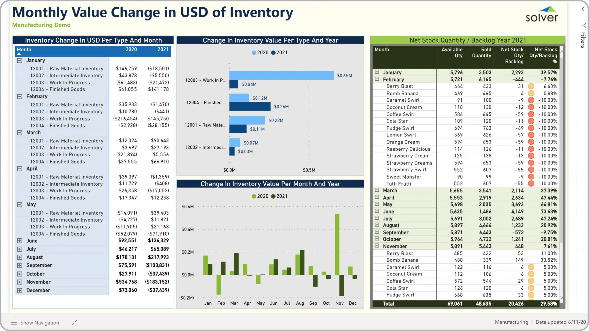

## Table of Contents

## What is inventory analysis and why is it important for companies?

Inventory analysis is when a company looks at all the stuff they have in stock to see how much they have, what's selling, and what's not. It helps them figure out how much of each item they need to keep on hand and when to order more. It's like checking your pantry to see what food you have and what you need to buy before you go shopping.

It's really important for companies because it helps them save money and make more money. If they have too much stuff, it can get old or go bad, and they might have to sell it for less or throw it away. If they don't have enough, they might lose customers who want to buy things they don't have. By doing inventory analysis, companies can make sure they have just the right amount of everything, so they can keep their customers happy and make the most profit.

## What are the different types of inventory a company might have?

A company might have different types of inventory, like raw materials, work-in-progress, and finished goods. Raw materials are the things a company buys to make their products. For example, a bakery might have flour, sugar, and eggs as raw materials. Work-in-progress is stuff that's in the middle of being made. If the bakery is mixing dough or baking cakes, those are work-in-progress. Finished goods are the final products ready to be sold. For the bakery, this would be the cakes and cookies on the shelves.

Another type of inventory is MRO, which stands for maintenance, repair, and operations supplies. These are things a company needs to keep their business running smoothly, like tools, cleaning supplies, and spare parts. For instance, the bakery might need oven mitts, cleaning brushes, and extra light bulbs. Some companies also have safety stock, which is extra inventory they keep just in case they run out of something unexpectedly. This helps them avoid running out of popular items and keeps customers happy.

## How can inventory be classified based on its value and usage?

Inventory can be classified based on its value and usage using a method called ABC analysis. In ABC analysis, inventory items are divided into three categories: A, B, and C. Category A items are the most valuable and important to the company. They make up a small part of the total inventory but account for a large part of the company's sales and profits. These are the items that the company needs to keep a close eye on because they are critical to the business. Category B items are less valuable than A items but more valuable than C items. They make up a moderate part of the inventory and contribute a fair amount to sales and profits. Category C items are the least valuable and least important. They make up the largest part of the inventory but contribute the smallest amount to sales and profits. These items don't need as much attention as A and B items.

Another way to classify inventory based on value and usage is through the Just-In-Time (JIT) method. In JIT, inventory is kept to a minimum, and items are ordered and received just as they are needed for production or sale. This method is useful for companies that want to reduce the costs of holding inventory. High-value items that are used frequently might be ordered more often in smaller quantities to keep costs down and ensure they are always available. Low-value items that are used less often might be ordered in larger quantities but less frequently. This way, the company can manage its inventory efficiently and keep its operations running smoothly without tying up too much money in stock.

## What are the basic methods used to analyze inventory levels?

One basic method to analyze inventory levels is the Economic Order Quantity (EOQ) model. This method helps businesses figure out the best amount of inventory to order at one time. It looks at how much it costs to order items and how much it costs to keep them in stock. By using the EOQ model, a company can find the right balance between ordering too often, which can be expensive, and ordering too much, which can tie up money and space. It's like trying to buy just enough groceries to last until your next shopping trip without running out of food or wasting any.

Another method is the Reorder Point (ROP) system. This system helps businesses know when it's time to order more inventory. It takes into account how long it takes to get new stock and how quickly items are used or sold. By setting a reorder point, a company can make sure they always have enough inventory on hand without running out. For example, if a store knows it takes a week to get new shirts and they sell about 10 shirts a day, they might set their reorder point at 70 shirts, so they order more when they have 70 shirts left. This way, they can keep their shelves stocked without overstocking.

A third method is the Just-In-Time (JIT) inventory system. This approach aims to have inventory arrive exactly when it's needed, reducing the need to store large amounts of stock. It's particularly useful for businesses that want to minimize storage costs and reduce waste. For instance, a car manufacturer using JIT might order parts to arrive just as they are needed on the assembly line, rather than keeping a large stockpile. This method requires good planning and reliable suppliers, but it can help companies operate more efficiently and save money.

## How does the ABC analysis help in managing inventory?

ABC analysis helps businesses manage their inventory by sorting items into three categories: A, B, and C, based on their value and how often they are used. Category A items are the most important because they make up a small part of the inventory but bring in a big part of the sales and profits. These items need a lot of attention to make sure there's always enough in stock. Category B items are less important than A items but more important than C items. They make up a medium part of the inventory and contribute a fair amount to sales and profits. Category C items are the least important. They make up the biggest part of the inventory but bring in the smallest amount of sales and profits. These items don't need as much attention as A and B items.

By using ABC analysis, businesses can focus their time and resources on the items that matter the most. They can keep a close watch on A items to make sure they never run out, while not spending too much time on C items. This helps them use their resources better and save money. For example, a store might check their A items every day, B items every week, and C items every month. This way, they can make sure they always have the right amount of everything, keep their customers happy, and make the most profit.

## What role does the Economic Order Quantity (EOQ) play in inventory management?

The Economic Order Quantity (EOQ) model helps businesses figure out the best amount of inventory to order at one time. It looks at the costs of ordering items and the costs of keeping them in stock. By using EOQ, a company can find the right balance between ordering too often, which can be expensive, and ordering too much, which can tie up money and space. It's like trying to buy just enough groceries to last until your next shopping trip without running out of food or wasting any.

Using EOQ helps businesses save money and manage their inventory better. If a company orders too little, they might run out of stock and lose sales. If they order too much, they might have to pay more to store the extra items, and those items might get old or go bad. EOQ helps businesses find the sweet spot where they can keep their customers happy without spending too much money on inventory. It's a useful tool for making sure the business runs smoothly and efficiently.

## How can Just-In-Time (JIT) inventory systems improve company efficiency?

Just-In-Time (JIT) inventory systems help companies be more efficient by making sure inventory arrives just when it's needed. This means the company doesn't have to keep a lot of extra stuff in stock, which saves money on storage and reduces waste. For example, a car factory using JIT might order parts to arrive right when they need to be put on the car. This way, they don't have to pay to store a bunch of parts they're not using yet. It also helps the company use their space better because they don't need big warehouses for inventory.

JIT also makes the company's operations smoother because it helps them plan better. When inventory comes in just in time, the company can keep their production line moving without stopping to wait for parts. This means they can make things faster and meet their customers' needs more quickly. But for JIT to work well, the company needs good relationships with their suppliers who can deliver things on time. If everything goes right, JIT can help the company save money, use space better, and keep their customers happy.

## What are the key performance indicators (KPIs) used in inventory analysis?

Key performance indicators (KPIs) for inventory analysis help businesses see how well they're doing with their stock. Some common KPIs include inventory turnover rate, which shows how often a company sells and replaces its inventory in a year. A high turnover rate means the company is selling things quickly, which is good. Another KPI is the days sales of inventory (DSI), which tells you how many days it takes to turn inventory into sales. A lower DSI means the company is selling things faster, which is also good. The stock-to-sales ratio is another KPI that compares the amount of inventory a company has to its sales. A lower ratio means the company is not holding too much stock compared to what it's selling.

Other important KPIs include the carrying cost of inventory, which is the cost of storing and managing inventory. Companies want to keep this cost as low as possible. The fill rate is another KPI that measures how well a company can meet customer demand without running out of stock. A high fill rate means the company is good at keeping enough inventory to satisfy customers. Lastly, the inventory accuracy rate shows how well the actual inventory matches what's recorded in the system. A high accuracy rate means the company's inventory records are reliable, which helps in making better decisions about ordering and managing stock.

## How do companies use inventory turnover ratios to assess performance?

Companies use inventory turnover ratios to see how well they are managing their stock. The inventory turnover ratio tells them how many times they sell and replace their inventory in a year. A high turnover ratio means the company is selling its products quickly, which is good because it shows that they are not holding onto too much stock. If the ratio is low, it might mean that the company has too much inventory that's not selling, which can be a problem because it ties up money and space.

By looking at the inventory turnover ratio, companies can make better decisions about ordering and managing their stock. For example, if the ratio is low, they might decide to order less next time or try to sell off the extra inventory faster. If the ratio is high, they might feel confident to order more because they know their products are selling well. This helps them keep their business running smoothly and make the most profit.

## What advanced statistical methods can be applied to forecast inventory needs?

One advanced statistical method for forecasting inventory needs is time series analysis. This method looks at past sales data to find patterns and trends over time. By understanding these patterns, a company can predict how much of an item they will need in the future. For example, if a store sees that they sell more ice cream in the summer, time series analysis can help them order the right amount before the season starts. This method uses things like moving averages and exponential smoothing to make these predictions more accurate.

Another method is regression analysis, which looks at how different factors, like price changes or marketing campaigns, affect sales. By studying these factors, a company can figure out how much inventory they will need based on what's happening in the market. For example, if a company knows that lowering the price of a product will increase sales, they can use regression analysis to predict how much extra inventory they need to order. This helps them plan better and avoid running out of stock or having too much left over.

## How can technology and software enhance inventory analysis and management?

Technology and software make inventory analysis and management a lot easier for companies. They use special programs called inventory management systems that keep track of how much stuff they have, what's selling, and what's not. These systems can update in real time, so businesses always know exactly what's in stock. They can also use barcodes and RFID tags to quickly scan items and update their inventory records. This helps them save time and makes sure their records are accurate. Plus, these systems can create reports and charts that show how well the business is doing, so managers can make smart decisions about ordering more stock or getting rid of items that aren't selling.

Another way technology helps is by using software that can predict how much inventory a company will need in the future. These programs use fancy math to look at past sales data and find patterns. They can tell a business how much of each item to order and when to order it, so they never run out of popular products. Some software even connects with suppliers, so orders can be placed automatically when inventory gets low. This makes everything run smoother and helps the company save money by not having too much or too little stock.

## What are the challenges and best practices in implementing a comprehensive inventory analysis system?

Setting up a complete inventory analysis system can be tough for companies. One big challenge is getting accurate data. If the numbers about what's in stock are wrong, the whole system won't work right. Another problem is training staff to use the new system. It can take time for everyone to learn how to do things the new way, and mistakes can happen. Also, making sure the system works well with other parts of the business, like sales and ordering, can be tricky. If the system doesn't fit well with how the company already does things, it might not help as much as it could.

To make the most of an inventory analysis system, companies should start by making sure their data is correct. They should check their inventory often to keep their records up to date. It's also important to train everyone who will use the system so they know how it works and can use it well. Companies should pick a system that fits their specific needs and can grow with them as they change. Keeping the system simple and easy to use can help too. Regularly checking how the system is working and making changes when needed can help keep everything running smoothly and help the company make the best decisions about their inventory.

## What is the role of inventory in financial analysis?

Inventory is a critical component of a company's balance sheet and serves as a bridge between production and sales. It represents the goods and materials a business holds for the purpose of resale or production. On the balance sheet, inventory is considered a current asset, reflecting its potential to be converted into cash within a year as part of the normal business cycle. Its significance extends beyond mere financial metrics; effective inventory management can substantially impact a company's operational efficiency, cash flow, and profitability.

### Types of Inventory

Inventory can be categorized into three main types:

1. **Raw Materials**: These are the basic materials and components that companies use to produce goods. For manufacturers, raw materials constitute a direct input into the production process.

2. **Work-in-Progress (WIP)**: This category includes all items that are in the production process but not yet completed. WIP inventory encompasses raw materials, labor, and overhead costs that are in the midst of being transformed into finished goods.

3. **Finished Goods**: These are completed products that are ready for sale. Finished goods represent the end result of the production cycle and are ready to be sold to customers.

### Methods of Inventory Valuation

Inventory valuation methods are crucial for financial reporting and tax purposes, affecting the cost of goods sold, net income, and inventory value on the balance sheet. The primary valuation methods include:

- **First-In, First-Out (FIFO)**: FIFO assumes that the oldest inventory items are sold first. In periods of rising prices, this method can result in lower cost of goods sold and thus higher net income and tax expenses, as it assumes cheaper, older costs are recorded first.

- **Last-In, First-Out (LIFO)**: LIFO assumes that the newest inventory items are sold first. During inflationary periods, LIFO can lead to higher cost of goods sold and lower ending inventory values, resulting in lower taxable income. However, it is important to note that LIFO is not permitted under the International Financial Reporting Standards (IFRS).

- **Weighted Average Cost**: This method calculates an average cost per unit by dividing the total cost of goods available for sale by the total units available for sale. It smooths out price fluctuations over the accounting period, providing a consistent cost measure for inventory.

### Role of Inventory Data in Assessing Operational Efficiency

Inventory data is pivotal in evaluating a company’s operational efficiency. Key performance indicators, such as inventory turnover and days sales of inventory (DSI), help assess how well a company manages its stock levels relative to its sales. 

- **Inventory Turnover**: This ratio indicates how many times a company sells and replaces its stock over a period. It is calculated as:
$$
  \text{Inventory Turnover} = \frac{\text{Cost of Goods Sold (COGS)}}{\text{Average Inventory}}

$$

  A higher turnover rate signifies efficient inventory management, whereas a lower rate may imply overstocking or obsolete inventory.

- **Days Sales of Inventory (DSI)**: This metric shows the average number of days it takes for a company to turn its inventory into sales, calculated as:
$$
  \text{DSI} = \frac{\text{Ending Inventory}}{\text{COGS}} \times 365

$$

  A lower DSI reflects an efficient inventory cycle, while a higher DSI can signal potential issues in moving stock.

In conclusion, understanding how inventory is defined, categorized, and valued, along with examining its role through key financial metrics, provides valuable insights into a company's operational health. Efficient inventory management is integral to optimizing operational efficiency and can significantly influence financial outcomes.

## What is the importance of financial ratios in inventory analysis?

Financial ratios are pivotal metrics in inventory analysis, providing crucial insights into a company's sales performance and inventory management effectiveness. Two key ratios that play a significant role in this context are inventory turnover and days sales of inventory (DSI).

### Inventory Turnover

Inventory turnover measures how many times a company's inventory is sold and replaced over a given period. It is calculated using the formula:

$$
\text{Inventory Turnover} = \frac{\text{Cost of Goods Sold (COGS)}}{\text{Average Inventory}}
$$

This ratio is essential for understanding the efficiency with which a company is managing its inventory. A high inventory turnover indicates that a company sells its inventory quickly, suggesting robust sales performance and effective inventory management. Conversely, a low turnover may signal excess inventory, poor sales, or ineffective inventory strategy.

**Example Calculation**: 
Consider a company with a COGS of $500,000 and an average inventory worth $100,000. The inventory turnover would be:

$$
\text{Inventory Turnover} = \frac{500,000}{100,000} = 5
$$

This indicates the company turns over its inventory five times in the specified period.

### Days Sales of Inventory (DSI)

DSI evaluates the average number of days a company takes to sell its entire inventory during a given period. The formula is:

$$
\text{DSI} = \frac{\text{Average Inventory} \times 365}{\text{Cost of Goods Sold}}
$$

DSI provides a perspective on the duration for which the current stock will last if no new inventory is added. It helps understand how efficiently a company manages its inventory relative to its sales. A lower DSI suggests faster sales and efficient inventory turnover, while a higher DSI may indicate slower sales.

**Example Calculation**:
Using the previous example's figures, the DSI would be:

$$
\text{DSI} = \frac{100,000 \times 365}{500,000} = 73 \text{ days}
$$

This means, on average, it takes the company 73 days to sell its current inventory.

### Impact on Financial Decision-Making

The analysis of these ratios provides managers and investors with insights critical to strategic decision-making. Managers can identify operational inefficiencies and adjust pricing, purchasing, or marketing strategies to optimize inventory levels. Investors leverage these ratios to assess a company’s financial health and operational efficiency, influencing investment decisions.

Efficient inventory management reflected through favorable ratios supports cash flow improvements, reduces holding costs, and enhances profitability. By monitoring inventory turnover and DSI, companies can better align inventory levels with demand forecasts, avoiding both stockouts and excess inventory situations.

Overall, inventory ratios are indispensable in sculpting financial and strategic initiatives, giving businesses a competitive edge. Their application not only supports operational adjustments but also aids in robust financial forecasting and planning.

## References & Further Reading

1. **Books:**
   - Shim, J. K., & Siegel, J. G. (2001). *Financial Management*. Barron's Educational Series. This book provides comprehensive coverage of financial management principles, including detailed discussions on inventory management and balance sheet analysis.
   - Hull, J. C. (2012). *Options, Futures, and Other Derivatives*. Prentice Hall. This book offers insights into the complex world of derivatives, with sections that are highly relevant to algorithmic trading.

2. **Articles:**
   - Brigham, E. F., & Houston, J. F. (2013). "Fundamentals of Financial Management." An article that explores various financial strategies, including techniques related to inventory and financial analysis.
   - Fama, E. F., & French, K. R. (1993). "Common risk factors in the returns on stocks and bonds." Journal of Financial Economics, 33(1), 3-56. This research paper offers foundational knowledge on risk factors influencing trading strategies.

3. **Research Papers:**
   - Engle, R. F. (2002). "Dynamic Conditional Correlation – A Simple Class of Multivariate GARCH Models." Journal of Business & Economic Statistics, 20(3), 339-350. Understanding advanced financial models can assist in integrating financial data into algorithmic trading.
   - Geman, H., & Roncoroni, A. (2006). "Understanding the Fine Structure of Electricity Prices." Journal of Business, 79(3), 1225-1261. This paper explores complex pricing structures, offering insights relevant to high-frequency trading and inventory analysis.

4. **Case Studies:**
   - "The Impact of Inventory Management on Financial Performance" by the Harvard Business Review. This case study examines real-world applications of inventory and financial analysis in improving company performance.
   - "Algorithmic Trading and Its Impact on Financial Stability" by the International Monetary Fund (IMF). This study investigates the role of algorithmic trading in global financial markets.

5. **Online Resources:**
   - Investopedia's section on Financial Analysis (https://www.investopedia.com/financial-analysis-4689745) provides a glossary of terms and detailed articles on various aspects of financial analysis, including inventory management.
   - The Quantitative Finance Reading List (https://quant.stackexchange.com/) offers a community-driven compilation of books and resources focused on quantitative finance techniques, which are instrumental for algorithmic trading strategies.

6. **Software and Tools:**
   - Python's Pandas library is adept at handling time-series data, which is crucial for analyzing financial and inventory datasets.
   - QuantLib (https://www.quantlib.org/) is an open-source library widely used for quantitative finance in Python and C++, useful for building models in algo trading.

Consider exploring these resources to gain a deeper understanding of how inventory management and financial analysis empower [algorithmic trading](/wiki/algorithmic-trading) strategies, enhancing decision-making and predictive capabilities.

