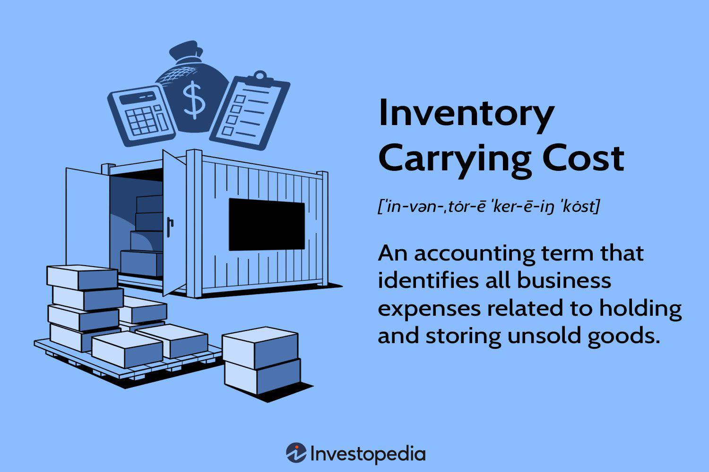

In today's competitive business landscape, effective inventory management plays a pivotal role in determining a company's profitability and operational efficiency. A fundamental aspect of inventory management is understanding inventory carrying costs, which encompass all expenses related to storing unsold goods. These costs are not limited to obvious expenses like warehousing and insurance; they also include depreciation, taxes, and opportunity costs. Efficiently managing these costs is crucial because they can account for 20% to 30% of a company's total inventory value, depending on the industry.

In addition to traditional inventory management, there is an increasing interest in the intersection of inventory strategies and algorithmic trading, commonly known as algo trading. This convergence highlights the potential for leveraging automated systems to optimize both stock management and trading portfolios. Improved inventory management can lead to more informed trading decisions and precise risk assessment, especially for industries that rely heavily on speed and precision.

This article investigates how managing inventory carrying costs and employing algo trading can influence strategic business decisions and enhance overall performance. By understanding the interaction between these elements, businesses can gain a competitive edge, optimizing operations for improved profitability and efficiency. Whether a business is looking to refine its warehouse management practices or integrate algorithmic trading strategies, insights gained from these discussions can lead to smarter, more agile operations.

## Table of Contents

## Understanding Inventory Carrying Costs

Inventory carrying costs, also referred to as holding costs, encompass all expenses incurred from storing unsold goods. These costs are critical components of an organization's financial planning and operational strategy, reflecting both direct and indirect expenses associated with maintaining inventory.

The primary elements of inventory carrying costs include warehousing expenses, insurance, depreciation, taxes, and opportunity costs. Warehousing expenses cover physical storage requirements, such as rent, utilities, and labor costs associated with managing inventory spaces. Insurance costs reflect the premiums paid to protect stock against potential losses from theft, damage, or other unforeseen events. Depreciation is the reduction in the value of inventory over time, particularly for perishable goods or items subject to fashion trends or technological advancements.

Taxes related to inventory pertain to property taxes levied on the total value of goods stored at a given time. Opportunity costs, often considered an intangible component, represent the potential returns that a business could have earned had its capital been allocated elsewhere instead of being tied up in inventory.

Carrying costs are typically expressed as a percentage of a company's total inventory value. Depending on the industry, these costs can range from 20% to 30%. This percentage is a critical metric for businesses, as it helps quantify the financial burden of holding inventory and its impact on overall profitability.

For companies aiming to maintain healthy profit margins and cash flow, efficient management of inventory carrying costs is essential. This involves optimizing inventory levels to balance demand and supply effectively, thereby avoiding overstocking and minimizing the related expenses. By accurately forecasting demand and implementing strategies such as just-in-time inventory systems, businesses can significantly reduce carrying costs, enhancing their financial performance and competitive advantage.

## Components of Inventory Carrying Costs

Inventory carrying costs, or holding costs, represent a significant aspect of overall inventory management. These costs can be divided into several components, each contributing to the total expenses incurred by a company for storing unsold goods.

Tangible costs constitute the most visible part of inventory carrying costs. These include storage expenses, which cover the physical space necessary to house inventory. This might involve leasing a warehouse or allocating specific parts of a company's facilities to store goods. Additionally, handling costs represent the expenditures associated with the movement of inventory, whether it's offloading deliveries, organizing items within a warehouse, or preparing products for shipment. Insurance costs also fall under tangible expenses; they provide coverage against potential losses from events like theft, fire, or natural disasters.

Intangible costs, although not as immediately apparent, play a crucial role in inventory carrying expenses. Opportunity costs refer to the potential benefits a company forgoes by having capital tied up in inventory instead of investing it elsewhere. Depreciation and obsolescence risks are crucial aspects of intangible costs. Depreciation accounts for the decline in value of stored goods over time due to factors such as age or demand shifts. Obsolescence risks arise when products become outdated or irrelevant, often necessitating markdowns or disposal, which directly impacts a company’s bottom line.

Further, companies must also consider taxes associated with inventory, which can fluctuate based on inventory valuation and local regulations. Shrinkage represents another critical component involving losses due to theft, errors, or spoilage. Such losses reduce the actual inventory available for sale, impacting profit margins.

Understanding all these components is essential for businesses aiming to accurately calculate and manage their inventory expenses. Proper management of these costs can lead to optimized resource allocation, enhanced cash flow, and improved profitability. This comprehensive approach allows for a more precise determination of inventory-related expenses, facilitating informed decision-making and strategic financial planning.

## Impact on Warehouse Management

Effective warehouse management plays a critical role in reducing inventory carrying costs, which include expenses like warehousing, insurance, and depreciation associated with storing goods. By implementing strategic approaches in warehouse management, companies can optimize their operational efficiency and enhance profitability.

One primary strategy to minimize carrying costs is optimizing storage solutions. Efficient space utilization involves reorganizing the warehouse layout to maximize capacity while ensuring ease of access to goods. This optimization can reduce the physical footprint of storage, thereby lowering expenses related to space rental or maintenance. Techniques such as ABC analysis can be employed to categorize inventory based on turnover rates, allowing faster-moving items to be placed in more accessible locations, which minimizes handling time.

Improving inventory turnover is another essential tactic. High inventory turnover indicates that a company is selling and replacing its stock frequently, resulting in reduced holding times and lowering the associated carrying costs. Companies aim for a balance between having enough inventory to meet customer demands and minimizing excess stock. This balance can be quantitatively assessed using the inventory turnover ratio:
$$

\text{Inventory Turnover Ratio} = \frac{\text{Cost of Goods Sold (COGS)}}{\text{Average Inventory}} 
$$
A higher ratio suggests efficient inventory management.

The integration of technology for tracking and automating processes can further enhance warehouse efficiency. Implementing systems such as Warehouse Management Systems (WMS) and Radio Frequency Identification (RFID) can provide real-time data on inventory levels, locations, and turnover rates. These technologies facilitate accurate forecasting and inventory planning, reducing the risks of overstocking or stockouts. Automation tools like robotics and conveyor systems can streamline operations, decreasing labor costs and reducing human error in inventory management.

Ultimately, the objective is to strike a balance between minimizing carrying costs and maintaining adequate service levels to meet operational demands. By aligning inventory management strategies with business goals, companies can achieve a synergy that not only controls carrying costs but also enhances customer satisfaction and business performance. This balanced approach supports sustainable growth and profitability in today's competitive market.

## Algorithmic Trading and Inventory Costs

Algorithmic trading, commonly referred to as algo trading, utilizes complex algorithms to automate trading decisions and manage portfolios. This method is advantageous for operations that demand high precision and speed, as it minimizes the human element, reducing errors and improving efficiency. A critical, yet often overlooked component of algo trading is its interaction with inventory carrying costs, particularly in the context of industries that maintain physical inventories.

Efficient management of inventory directly impacts trading decisions and risk assessments. In algo trading, the ability to predict market fluctuations and swiftly adjust trading strategies is paramount. Inventory carrying costs, such as warehousing, insurance, and opportunity costs, can significantly affect a firm’s cash flow and capital allocation, elements that algorithms consider when optimizing trading strategies. By minimizing these costs, companies can allocate more resources to their trading activities, enhancing their ability to respond to market changes.

Lower inventory carrying costs can lead to higher returns on investment. In sectors that rely heavily on speed and precision—such as electronics or fast fashion—holding large amounts of inventory is typically not feasible due to the risks of depreciation and obsolescence. Reduced carrying costs mean that a company can invest more in technological infrastructure and analytical tools critical for algo trading, thereby improving the speed and effectiveness of trading operations.

Integrating warehouse operations with trading strategies can enhance overall financial performance. By aligning inventory management practices with trading algorithms, companies can leverage real-time data to make informed decisions. For example, an optimized inventory system that keeps stock levels lean can provide direct feedback into trading algorithms, enabling automated systems to adjust portfolios based on the latest supply chain dynamics. This integration ensures that the financial resources are optimally used, reducing idle stock and freeing up capital for other trading activities.

In conclusion, the synchronization of efficient inventory management with [algorithmic trading](/wiki/algorithmic-trading) strategies presents a significant opportunity for companies seeking to enhance profitability and maintain a competitive edge. By reducing inventory carrying costs, companies can reallocate resources to critical areas of their operations, thereby bolstering their investment returns and overall market performance.

## Strategies for Reducing Inventory Carrying Costs

Implementing effective strategies to reduce inventory carrying costs is essential in maintaining a competitive edge in today's fast-paced business environment. One primary method is the adoption of just-in-time (JIT) inventory systems. JIT emphasizes minimal inventory levels, enabling businesses to order and receive stock only as needed for production or sales. This system reduces excess stock and minimizes carrying costs by limiting storage requirements and reducing the risk of obsolescence. By aligning production schedules closely with demand, businesses can enhance their operational efficiency and reduce waste.

Predictive analytics plays a pivotal role in optimizing inventory levels. Utilizing advanced analytics enables companies to accurately forecast demand, allowing them to adjust their inventory levels proactively. By integrating [machine learning](/wiki/machine-learning) and statistical models, companies can anticipate market trends and consumer behavior, ensuring inventory remains lean while meeting customer needs. For instance, Python libraries such as Pandas and Scikit-learn can be employed to construct predictive models that analyze historical sales data, identify patterns, and forecast future demand.

Dropshipping is another innovative model that significantly reduces the necessity of holding inventory. In a dropshipping arrangement, the retailer transfers customer orders and shipment details to a third party, typically a manufacturer or wholesaler, who then ships the goods directly to the customer. This model eliminates the need for inventory storage, effectively reducing carrying costs. Companies can focus on sales and marketing, leveraging their resources efficiently without the burden of warehouse management.

Regular audits and process reviews are crucial for identifying areas where inventory costs can be reduced. Conducting comprehensive audits ensures all inventory processes align with broader business objectives, allowing for the identification of inefficiencies or bottlenecks. Through careful analysis of procurement, storage, and distribution processes, companies can implement targeted improvements that reduce waste and streamline operations. Audits can also uncover discrepancies in inventory records, helping to address issues such as shrinkage and obsolescence.

In summary, reducing inventory carrying costs involves implementing JIT systems, leveraging predictive analytics for accurate demand forecasting, exploring dropshipping models, and conducting regular audits. These strategies collectively enhance a company's ability to optimize inventory management, reduce costs, and improve overall financial performance.

## Conclusion

Inventory carrying costs are a pivotal [factor](/wiki/factor-investing) in shaping a company’s financial metrics and operational capabilities. By managing these costs effectively, businesses can enhance profitability and operational efficiency. Such management involves understanding and controlling various cost components, including warehousing, insurance, depreciation, taxes, and opportunity costs. These expenses, if left unchecked, can erode profit margins and create financial strain, thereby undermining a business's competitive position.

The strategic optimization of inventory processes, especially when integrated with algorithmic trading, offers significant benefits. Algorithmic trading systems, used predominantly in financial markets, leverage automated, rules-based systems to manage trading portfolios. By incorporating refined inventory management practices, these systems can achieve lower carrying costs, ultimately leading to higher returns on investment. For instance, reducing inventory holding times can improve cash flow, which is critical in sectors where precision and speed are paramount.

Furthermore, ongoing evaluation and adjustment of inventory processes is fundamental to maintaining a competitive edge in an ever-evolving market landscape. Businesses must regularly audit inventory levels, adopt predictive analytics to anticipate market demand, and continuously refine their logistics and warehouse strategies. This proactive approach ensures that businesses remain agile and responsive, minimizing unnecessary inventory and reducing associated costs.

In conclusion, the management of inventory carrying costs is not a one-time task but a continuous process that requires strategic thinking and adaptation. When executed effectively, it not only improves a company's bottom line but also strengthens its overall operational capabilities, ensuring long-term success in a competitive business environment.

## References & Further Reading

[1]: ["Inventory Management: Advanced Methods for Managing Inventory and Reducing Costs"](https://www.coursera.org/articles/inventory-management) by John T. Mentzer

[2]: ["Inventory and Production Management in Supply Chains"](https://www.taylorfrancis.com/books/mono/10.1201/9781315374406/inventory-production-management-supply-chains-edward-silver-david-pyke-douglas-thomas) by Edward A. Silver, David F. Pyke, and Rein Peterson

[3]: ["Supply Chain Management: Strategy, Planning, and Operation"](https://www.pearson.com/en-us/subject-catalog/p/supply-chain-management-strategy-planning-and-operation/P200000005863/9780137502844) by Sunil Chopra and Peter Meindl

[4]: Zipkin, P. (2000). ["Foundations of Inventory Management."](https://books.google.com/books/about/Foundations_of_Inventory_Management.html?id=rjzbkQEACAAJ) McGraw-Hill Higher Education.

[5]: ["Algorithmic and High-Frequency Trading"](https://math.nyu.edu/~avellane/QuantCongressUSA2011AlgoTradingLAST.pdf) by Álvaro Cartea, Sebastian Jaimungal, and José Penalva

[6]: ["Operations Management: Processes and Supply Chains"](https://www.pearson.com/en-us/subject-catalog/p/operations-management-processes-and-supply-chains/P200000005955/9780136860631) by Lee J. Krajewski, Manoj K. Malhotra, and Larry P. Ritzman