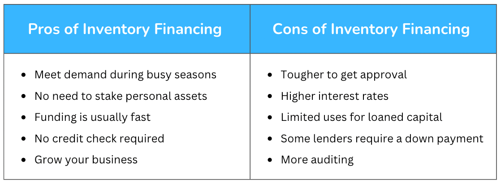

## Table of Contents

## What is inventory financing?

Inventory financing is a type of loan that businesses can use to buy products they plan to sell. Instead of using their own money, a business can borrow money from a bank or a lender to purchase inventory. The inventory itself acts as collateral for the loan, which means if the business can't pay back the loan, the lender can take the inventory.

This type of financing is helpful for businesses that need to keep a lot of products in stock but don't have enough cash on hand. It allows them to buy more inventory than they could afford otherwise, which can help them grow and meet customer demand. However, it's important for businesses to manage this type of loan carefully, as they need to sell the inventory quickly enough to repay the loan on time.

## How does inventory financing work?

Inventory financing works by letting a business borrow money to buy products they want to sell. The business goes to a bank or a lender and asks for a loan. The lender gives the business the money, and the business uses it to buy inventory. The important thing is that the inventory itself is used as a promise to the lender. This means if the business can't pay back the loan, the lender can take the inventory to get their money back.

Once the business has the inventory, they need to sell it. The money they make from selling the products is used to pay back the loan. It's like a cycle: borrow money, buy inventory, sell inventory, pay back the loan. The business needs to be careful to sell the products fast enough to pay back the loan on time. If they can do this well, inventory financing can help them grow by having more products to sell without using all their own money.

## Who can benefit from inventory financing?

Inventory financing can help small businesses that don't have a lot of money to buy products. These businesses can use the loan to buy more inventory than they could afford on their own. This means they can have more products to sell, which can help them make more money and grow. It's especially useful for businesses that need to keep a lot of stock but don't have enough cash to do so.

Seasonal businesses can also benefit from inventory financing. For example, a store that sells holiday decorations might need to buy a lot of products before the holiday season starts. They can use a loan to buy these items and then sell them during the busy season. This way, they can make sure they have enough stock to meet customer demand without spending all their money upfront.

## What are the typical requirements for obtaining inventory financing?

To get inventory financing, a business usually needs to show the lender that they can pay back the loan. This means they need to have a good credit history and a solid plan for how they will sell the inventory and make money. The lender will look at the business's financial records, like their income and expenses, to see if they are a good risk. They might also want to know about the business's past performance and how well they have managed inventory before.

The inventory itself is very important too. The lender will want to know what kind of products the business wants to buy and how much they are worth. They need to be sure that if the business can't pay back the loan, they can sell the inventory to get their money back. Sometimes, the lender might ask for other things as well, like a personal guarantee from the business owner, which means the owner promises to pay back the loan if the business can't.

## What are the different types of inventory financing?

There are a few different types of inventory financing that businesses can use. One type is called floor planning. This is often used by car dealerships or furniture stores. The business borrows money to buy products and keeps them on the sales floor. They only pay back the loan as they sell the items. Another type is called blanket inventory financing. This is when a business uses all of their inventory as collateral for the loan. It's good for businesses that have a lot of different products.

Another type of inventory financing is called field warehousing. In this type, a third party keeps the inventory in a special place until the business pays back the loan. This can be helpful for businesses that need to show the lender that the inventory is safe. Lastly, there is consignment inventory financing. Here, the business doesn't buy the inventory outright. Instead, they sell it on behalf of the supplier and only pay for what they sell. This can be a good option for businesses that want to try new products without spending a lot of money upfront.

## How does inventory financing differ from other types of business loans?

Inventory financing is different from other types of business loans because it uses the inventory as collateral. This means if the business can't pay back the loan, the lender can take the inventory to get their money back. Other loans, like term loans or lines of credit, might use other things as collateral, like equipment or real estate, or they might not use any collateral at all. Inventory financing is specifically for buying products to sell, so it's very focused on helping businesses manage their stock.

Another way inventory financing is different is that it's often short-term. Businesses need to sell the inventory quickly to pay back the loan, so the loan term is usually shorter than other types of loans. This can be good for businesses that need money fast to buy products, but it also means they need to be careful to sell the items quickly enough. Other loans, like term loans, might have longer repayment periods and can be used for many different things, not just buying inventory.

## What are the advantages of using inventory financing for a business?

Inventory financing can help a business grow by letting them buy more products than they could with their own money. This means they can have more things to sell, which can bring in more customers and make more money. It's especially good for businesses that need to keep a lot of stock but don't have enough cash to do so. By using inventory financing, they can keep their shelves full and meet customer demand without spending all their money upfront.

Another advantage is that inventory financing can be a quick way to get money. Businesses can get the loan and buy the products they need right away. This is helpful for seasonal businesses that need to buy a lot of items before a busy time of year. Also, because the inventory itself is used as a promise to the lender, it can be easier for some businesses to get this type of loan compared to other kinds of loans that might need different kinds of collateral or a longer approval process.

## What are the potential disadvantages or risks associated with inventory financing?

One big risk of inventory financing is that the business has to sell the products fast enough to pay back the loan. If they can't sell the items quickly, they might not have the money to pay the lender on time. This can lead to problems like high interest rates or even losing the inventory to the lender. It's a lot of pressure to sell the products quickly, and if the business doesn't do well, it can get into financial trouble.

Another disadvantage is that inventory financing can be expensive. The interest rates on these loans can be high, especially if the business is seen as a risk by the lender. This means the business has to make enough money from selling the inventory to cover not just the cost of the products but also the interest on the loan. If the profit margins are low, it might not be worth it to use inventory financing because the costs can eat into the business's profits.

## How can a business qualify for the best rates on inventory financing?

To get the best rates on inventory financing, a business needs to show the lender that they are a good risk. This means having a strong credit history and a good track record of managing inventory and paying back loans on time. Lenders want to see that the business has been successful in the past and can be trusted to sell the inventory and pay back the loan. A business can help its case by keeping good financial records and showing the lender that they have a solid plan for how they will use the loan and make money from the inventory.

Another way to qualify for better rates is to have valuable inventory. If the products the business wants to buy are in high demand and can be sold quickly, the lender might see less risk and offer a better rate. The business should also be ready to offer more collateral if needed, like equipment or real estate, to show the lender they are serious about paying back the loan. By being well-prepared and showing the lender that they are a reliable and low-risk borrower, a business can increase its chances of getting the best rates on inventory financing.

## What impact does inventory financing have on a company's financial statements?

Inventory financing impacts a company's financial statements in a few ways. When a company gets a loan for inventory, it shows up on the balance sheet as both an asset (the inventory) and a liability (the loan). The inventory is listed under current assets because it's expected to be sold within a year. The loan is listed under current liabilities if it needs to be paid back within a year, or under long-term liabilities if the repayment period is longer. This means the company's total assets and total liabilities both go up by the amount of the loan.

As the company sells the inventory, the impact continues on the income statement and cash flow statement. On the income statement, the cost of the inventory sold is recorded as an expense, reducing the company's net income. The revenue from selling the inventory increases the company's sales, which can help offset the expense. On the cash flow statement, the money received from selling the inventory is shown as cash inflow from operating activities. At the same time, the payments made to pay back the loan are shown as cash outflows from financing activities. If managed well, inventory financing can help a company improve its cash flow by allowing it to sell more products without using all its own money.

## How should a business manage its inventory to maximize the benefits of inventory financing?

To get the most out of inventory financing, a business needs to be smart about managing its inventory. They should keep track of what products sell well and how fast they sell. This way, they can buy the right amount of inventory that they know they can sell quickly. It's important not to buy too much inventory because that can tie up money and make it hard to pay back the loan on time. By focusing on products that move quickly, the business can turn the inventory into cash faster and use that money to pay back the loan.

Another key part of managing inventory is keeping good records and having a clear plan. The business should know exactly what inventory they have, where it is, and how much it's worth. This helps them show the lender that they are in control and can be trusted to pay back the loan. A good plan also includes knowing when to buy more inventory and how to price the products to make a profit. By staying organized and having a solid strategy, the business can use inventory financing to grow without getting into financial trouble.

## What are the future trends and innovations in inventory financing?

In the future, technology will play a bigger role in inventory financing. More businesses will use software to keep track of their inventory in real-time. This can help them know exactly what they have and what they need to buy. Lenders might also use this technology to see how well a business is managing its inventory. This can make it easier for businesses to get loans because lenders can see that the inventory is being managed well. Another trend could be the use of [artificial intelligence](/wiki/ai-artificial-intelligence) to predict how much inventory a business will need. This can help businesses buy just the right amount of products, so they don't have too much or too little.

Another innovation in inventory financing might be more flexible loan options. Lenders might start offering loans that can change based on how well the business is doing. If the business is selling a lot of inventory, they might be able to borrow more money. If they are not selling as much, the loan might get smaller. This can help businesses manage their cash flow better. Also, there might be more online platforms that connect businesses with lenders. These platforms can make it easier for businesses to find the right loan for their needs and get the money faster.

## References & Further Reading

[1]: Berger, A. N., & Udell, G. F. (2006). ["A more complete conceptual framework for SME finance."](https://www.sciencedirect.com/science/article/pii/S0378426606000938) Journal of Banking & Finance, 30(11), 2945-2966.

[2]: Culp, C. L. (2001). ["The Risk Management Process: Business Strategy and Tactics."](https://archive.org/details/riskmanagementpr0000culp) John Wiley & Sons.

[3]: Khandani, A. E., & Lo, A. W. (2007). ["What happened to the quants in August 2007?"](https://web.mit.edu/Alo/www/Papers/august07.pdf) Journal of Investment Management, 5(4), 5-54.

[4]: Johnson, R. A., & Soenen, L. (2003). ["Indicators of successful companies."](https://www.sciencedirect.com/science/article/pii/S0263237303000501) Managerial Finance, 29(12), 3-15.

[5]: Darbyshire, J. (2019). ["Mastering Financial Mathematics in Microsoft Excel: A Practical Guide for Business Calculations."](https://archive.org/details/masteringfinanci0000daya) Pearson Education.

[6]: Tabb, L., & Schwartz, R. A. (2011). ["Electronic Trading and the Future of Human Competition."](https://www.researchgate.net/publication/272175956_Schwartz_S_H_2011_Values_Individual_and_cultural_In_F_J_R_van_de_Vijver_Eds_A_Chasiotis_S_M_Breugelmans_Fundamental_questions_in_cross-cultural_psychology_pp_463-493_Cambridge_Cambridge_University_Pre) The MIT Press. 

[7]: Fleming, M. J., & Nguyen, G. (2020). ["The Big Three: Credit Ratings and the Economic Crisis."](https://www.newyorkfed.org/research/staff_reports/sr590.html) Liberty Street Economics. 

[8]: Fabozzi, F. J., & Markowitz, H. M. (2011). ["The Theory and Practice of Investment Management: Asset Allocation, Valuation, Portfolio Construction, and Strategies."](https://onlinelibrary.wiley.com/doi/book/10.1002/9781118267028) Wiley Finance.