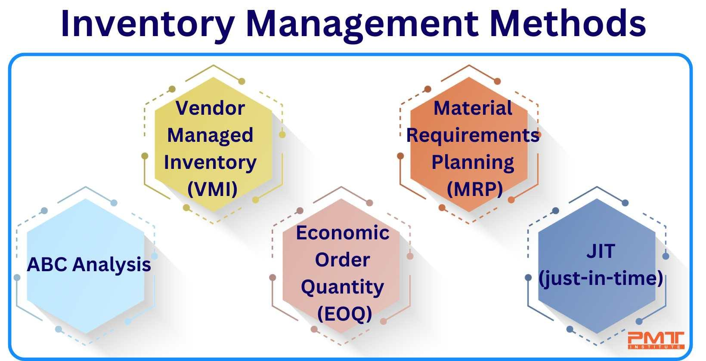

Inventory management is a crucial component of both business and financial landscapes, ensuring efficient operations and long-term sustainability. Its significance spans multiple sectors, from the handling of raw materials in manufacturing processes to the management of finished goods in retail environments. Effective inventory management not only optimizes cash flow but also confers a competitive advantage by ensuring the right balance between supply and demand.

Optimization of inventory levels is crucial for maintaining business efficacy, as it directly influences cash flow and overall performance. Proper management of inventory helps to minimize costs related to storage and spoilage, thereby increasing a business's profitability. At the same time, maintaining adequate inventory levels prevents stockouts and lost sales opportunities, enhancing customer satisfaction.

In addition to its traditional business applications, inventory management is intricately linked to algorithmic trading, which depends on precise computational methods and data analysis to execute trades efficiently. In the context of financial instruments such as stocks, bonds, and derivatives, inventory strategies ensure traders can maintain optimal levels, adapt to market conditions, and capitalize on fleeting opportunities.

This article examines the interconnected landscape of inventory methods, management practices, logistics, and algorithmic trading, highlighting their collective impact on various industries. Through innovative strategies and cutting-edge technologies, businesses and financial traders can leverage effective inventory management to drive operational efficiency and maximize profitability.

## Table of Contents

## Inventory Management: An Overview

Inventory management is a systematic approach involving the ordering, storing, and utilization of a company's inventory, which includes raw materials, components, and finished products. This practice is critical for maintaining the balance between supply and demand, minimizing costs, and maximizing efficiency. Poor inventory management can lead to overstocking or stockouts, which can significantly impact a company's cash flow and opportunity costs.

Several methods exist to streamline inventory processes, each tailored to specific industry requirements. Just-in-Time (JIT) inventory management aims to reduce holding costs by aligning the production schedule with raw material deliveries, ensuring that inventory arrives just when needed for production. This method helps minimize storage space and reduce waste.

Materials Requirement Planning (MRP) takes a more predictive approach by using sales forecasts and lead time data to anticipate inventory needs. This method focuses on ensuring that materials are available for production and products are available for delivery, enhancing both production efficiency and customer satisfaction.

The Economic Order Quantity (EOQ) model is a quantitative method focused on determining the optimal order quantity that minimizes total inventory costs, which include both ordering and holding costs. The EOQ formula is:

$$
EOQ = \sqrt{\frac{2DS}{H}}
$$

where:
- $D$ is the demand rate,
- $S$ is the ordering cost per order,
- $H$ is the holding cost per unit per year.

Additionally, technologies like Artificial Intelligence (AI) and Enterprise Resource Planning (ERP) systems have significantly enhanced inventory management. AI applications facilitate predictive analysis and demand forecasting, enabling more precise inventory control. ERP systems integrate various business processes, providing real-time inventory visibility and enhancing decision-making capabilities.

Emerging technologies continue to transform inventory management into a dynamic field. These advances offer better accuracy in predicting inventory needs, optimizing stock levels, and improving overall supply chain management. This technology-driven precision helps businesses maintain competitive advantages in a rapidly changing market landscape. 

By preventing overstocking and stockouts, efficient inventory management not only improves cash flow but also reduces the potential for lost sales and enhances consumer satisfaction. Consequently, it is an indispensable element in achieving operational excellence across industries.

## Common Inventory Management Methods

Just-in-Time Management (JIT) is a strategy that optimizes inventory by minimizing stock levels. The primary principle is to synchronize production schedules with the arrival of raw materials, thereby reducing holding costs. JIT is widely used in manufacturing industries to enhance efficiency and reduce waste. This method relies heavily on reliable suppliers and streamlined production processes to ensure that materials arrive as needed, without delay.

Materials Requirement Planning (MRP) utilizes predictive analytics to manage inventory needs efficiently. It involves calculating the precise amount of inventory required to meet production demands based on detailed sales forecasts. MRP systems integrate data from various sources, such as customer orders and inventory status, to forecast future requirements, optimize stock levels, and plan production schedules. This approach helps businesses prevent overstocking or shortages, aligning production rates with demand.

Economic Order Quantity (EOQ) is a mathematical model that determines the optimal order quantity to minimize the total cost associated with inventory. These costs include ordering and holding costs. EOQ is calculated using the formula:

$$
EOQ = \sqrt{\frac{{2DS}}{H}}
$$

where:
- $D$ is the annual demand,
- $S$ is the ordering cost per order,
- $H$ is the holding cost per unit, per year.

By applying EOQ, businesses can reduce costs by ordering the right amount of stock at the right time, balancing inventory management efficiency with cost considerations.

Days Sales of Inventory (DSI) is a metric that measures the average time it takes for a company to convert its inventory into sales. It provides insights into the efficiency of a company’s inventory management and sales performance. DSI is calculated using the formula:

$$
DSI = \left(\frac{{\text{Inventory}}}{\text{Cost of Goods Sold}}\right) \times 365
$$

A lower DSI value indicates a faster turnover of inventory, which suggests efficient inventory management and quicker sales cycles. Keeping track of DSI helps businesses identify potential issues in inventory movement and adjust their strategies accordingly to enhance operational performance.

## Logistics in Inventory Management

Effective logistics plays a vital role in maintaining optimal inventory levels, ensuring the harmonious flow of goods throughout the supply chain. It is characterized by the synchronization of data, transportation, warehousing, and distribution processes, which collectively sustain the efficiency of inventory management. The significance of logistics is underscored by the challenges of overstock and stockouts, both of which have profound implications on operational performance.

Overstock refers to the accumulation of excess inventory—a situation that ties up capital and increases storage costs. Conversely, stockouts occur when inventory levels run too low to meet demand, leading to potential sales losses and customer dissatisfaction. Addressing these challenges requires innovative logistics strategies, exemplified by practices such as cross-docking. Cross-docking involves the direct transfer of products from inbound to outbound transportation, significantly reducing the need for storage and enhancing inventory turnover rates. This method is particularly beneficial for perishable goods or high-demand products where quick movement is essential.

The integration of logistics technology further enhances transparency and operational efficiency in inventory management. Technologies such as RFID (Radio-Frequency Identification) and IoT (Internet of Things) devices enable real-time tracking of inventory items, thereby offering precise insights into stock levels and movements. This technological advancement fosters a transparent supply chain, facilitates accurate demand forecasting, and supports proactive decision-making.

Moreover, logistics management software, integrated with Enterprise Resource Planning (ERP) systems, automates various logistical tasks. These systems optimize routing, scheduling, and load planning, helping businesses align logistics operations with inventory needs. An example is the use of Transportation Management Systems (TMS) that optimize freight movements and reduce transportation costs through strategic planning algorithms.

In conclusion, effective logistics management is indispensable for agile and responsive inventory management. By tackling overstock and stockouts and leveraging technological solutions, businesses can achieve optimized inventory levels that drive efficiency and profitability across their supply chains.

## Algorithmic Trading and Inventory Management

In [algorithmic trading](/wiki/algorithmic-trading), 'inventory' encompasses financial instruments such as stocks, bonds, and derivatives managed by traders. Effective inventory management within this context is pivotal for maintaining an optimal balance that minimizes both risks and capital costs. Achieving this requires computational models and strategies to systematically assess and adjust inventory positions.

Algorithmic trading systems often employ advanced models, including Economic Order Quantity (EOQ) and mean-variance optimization, to manage these positions effectively. The EOQ model, traditionally used for tangible goods, is adapted in this arena to optimize the tradeoff between ordering costs and holding costs of financial instruments. By minimizing these costs, traders improve their capital efficiency.

Mean-variance optimization, derived from modern portfolio theory, aids traders in balancing expected returns with associated risks. This model provides a framework to select inventory positions that optimize the trade-off between risk (expressed as variance) and expected return. Utilizing a mathematical approach, mean-variance optimization can be expressed as:

$$
\min_w \left( \frac{1}{2} w^T \Sigma w - \lambda \mu^T w \right)
$$

where $w$ is the weight vector of the portfolio, $\Sigma$ is the covariance matrix of returns, $\lambda$ is the risk aversion parameter, and $\mu$ is the vector of expected returns.

For traders, precise inventory management empowers them to dynamically respond to fluctuating market conditions, enabling them to swiftly capitalize on price discrepancies. Automated systems driven by algorithms analyze market data in real time, providing traders with actionable insights that align inventory levels with current market demands. This agility is crucial for maintaining competitiveness and profitability in fast-paced trading environments.

The integration of advanced computational models thus becomes indispensable for achieving strategic success in algorithmic trading. By ensuring that inventory management is not only effective but also responsive, traders can navigate the inherent complexities and seize opportunities within the financial markets.

## Risks and Challenges

Switching inventory management methods without sufficient justification can indicate underlying management issues within a business. Such changes may lead to confusion and inefficiencies, affecting the consistency and reliability of the supply chain. It's crucial for businesses to thoroughly assess the need for switching methods and ensure that any transition is strategically aligned with the company's operational goals.

Frequent write-offs represent a significant risk as they may signal deeper issues such as inventory obsolescence or inefficiencies in turnover processes. These write-offs can erode profitability and reflect poor demand forecasting or a lack of effective inventory control mechanisms. Addressing these challenges requires robust inventory management practices and regular audits to ensure that inventory levels are both reflective of current demand and aligned with market trends.

In the context of algorithmic trading, inventory pertains to financial instruments such as stocks and derivatives, where risks such as market [volatility](/wiki/volatility-trading-strategies) and [liquidity](/wiki/liquidity-risk-premium) are critical considerations. Algorithmic trading systems must be adept at managing these inventories to minimize risk and capitalize on market opportunities. Market volatility can lead to rapid price changes, necessitating precise and adaptable inventory strategies. Liquidity risk, the risk of being unable to buy or sell assets without causing a significant impact on the asset's price, is also a critical concern. Adequate inventory management in this domain ensures that traders maintain an optimal balance of instruments, mitigating potential losses due to adverse market movements.

Regulatory compliance introduces another layer of complexity, demanding that businesses maintain precise inventory levels and engage in transparent reporting practices. Regulations often require companies to provide accurate inventory records, which can impact financial reporting and audit outcomes. Failure to adhere to these regulations may result in penalties and damage to the company's reputation. Therefore, maintaining compliance through diligent inventory practices and ensuring the accuracy of reporting is essential for sustaining operational integrity and avoiding legal repercussions.

## Conclusion

Inventory management is a complex and vital area impacting numerous sectors, from logistics and manufacturing to finance and retail. By implementing innovative strategies and emerging technologies, businesses can fine-tune their inventory levels, which leads to improved operational efficiency and increased profitability. For example, technologies such as Artificial Intelligence (AI) and Enterprise Resource Planning (ERP) systems enable more precise demand forecasting and inventory tracking, thereby reducing excess stock and shortages. This level of optimization ensures that resources are allocated effectively, minimizing waste and enhancing business performance.

In the domain of algorithmic trading, inventory management plays a crucial role in the strategic planning and execution of trades. Traders depend on accurate inventory management to maintain an optimal balance of financial instruments, such as stocks and bonds. This balance is essential for minimizing both risks and capital costs. By employing sophisticated models like the Economic Order Quantity (EOQ) and mean-variance optimization, algorithmic trading systems can adjust inventory positions quickly in response to market fluctuations, seizing opportunities for [arbitrage](/wiki/arbitrage) or price discrepancies.

Moreover, inventory management's significance continues to rise as global markets become more interconnected and dynamic. Whether dealing with physical goods in a warehouse or financial instruments in a portfolio, the principles of inventory management remain essential for ensuring organizational success. By continuously refining inventory processes and embracing technological advancements, businesses and traders can achieve a competitive edge in an ever-evolving market landscape.

## References & Further Reading

[1]: Silver, E. A., Pyke, D. F., & Thomas, D. J. (2016). ["Inventory and Production Management in Supply Chains"](https://www.taylorfrancis.com/books/mono/10.1201/9781315374406/inventory-production-management-supply-chains-edward-silver-david-pyke-douglas-thomas), CRC Press.

[2]: Zipkin, P. H. (2000). ["Foundations of Inventory Management"](https://link.springer.com/content/pdf/10.1007/978-3-658-24382-1_2.pdf), McGraw-Hill.

[3]: Fisher, M. L. (1997). ["What is the right supply chain for your product?"](https://edisciplinas.usp.br/pluginfile.php/2454987/mod_resource/content/1/what%20is%20the%20right%20supply%20chain%20for%20your%20product.pdf), Harvard Business Review.

[4]: Chopra, S., & Meindl, P. (2019). ["Supply Chain Management: Strategy, Planning, and Operation"](https://books.google.com/books/about/Supply_Chain_Management_Strategy_Plannin.html?id=gPDQCQAAQBAJ), Pearson.

[5]: Lopez de Prado, M. (2018). ["Advances in Financial Machine Learning"](https://www.amazon.com/Advances-Financial-Machine-Learning-Marcos/dp/1119482089), Wiley.

[6]: Aronson, D. R. (2007). ["Evidence-Based Technical Analysis: Applying the Scientific Method and Statistical Inference to Trading Signals"](https://onlinelibrary.wiley.com/doi/book/10.1002/9781118268315), Wiley.

[7]: Jansen, S. (2020). ["Machine Learning for Algorithmic Trading"](https://github.com/stefan-jansen/machine-learning-for-trading), Packt Publishing.

[8]: Chan, E. P. (2008). ["Quantitative Trading: How to Build Your Own Algorithmic Trading Business"](https://github.com/ftvision/quant_trading_echan_book), Wiley.