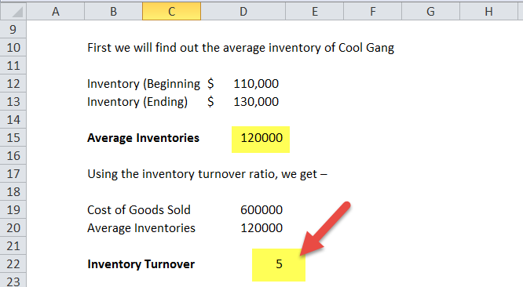

In today's competitive business environment, efficient inventory management stands as a cornerstone for maintaining profitability and achieving operational success. Inventory turnover is a critical performance indicator that quantifies how effectively a company sells and replenishes its inventory within a specified period. This metric provides insights into the efficiency of inventory management processes and is calculated using the formula: 

$$
\text{Inventory Turnover} = \frac{\text{Cost of Goods Sold (COGS)}}{\text{Average Inventory}}
$$



Alternatively, it can also be determined by dividing sales by inventory. A high inventory turnover ratio typically corresponds to efficient practices, reflecting robust demand for products and effective inventory control strategies.

Excel emerges as a powerful tool for businesses looking to compute inventory turnover accurately, courtesy of its versatile built-in formulas and functions. Utilizing Excel can simplify the process, allowing for quick computations and real-time insights into inventory management. Through formulas, data can be collated and analyzed, enabling businesses to make informed decisions that bolster their competitive stance.

Furthermore, integrating inventory management metrics with algorithmic trading strategies can unlock comprehensive insights into market dynamics. By aligning inventory data with algorithmic trading, companies can enhance their decision-making processes within both inventory and financial markets. This integration not only aids in optimizing inventory levels but also in refining trading decisions grounded in robust data analytics.

## Table of Contents

## Understanding Inventory Turnover

Inventory turnover is a critical metric used to assess a company's efficiency in managing its inventory. It gauges how often a business is able to sell and subsequently replace its stock within a set timeframe, typically a year. This indicator is vital for businesses as it provides insights into sales effectiveness as well as inventory management proficiency.

### Formula and Calculation

The concept of inventory turnover can be quantified using two primary formulas:

1. **Sales-Based Formula**:
$$
   \text{Inventory Turnover} = \frac{\text{Net Sales}}{\text{Average Inventory}}

$$
   This formula considers the total sales revenue generated over a period relative to the average inventory.

2. **Cost of Goods Sold (COGS)-Based Formula**:
$$
   \text{Inventory Turnover} = \frac{\text{Cost of Goods Sold (COGS)}}{\text{Average Inventory}}

$$
   This alternative approach uses the cost of goods sold in place of sales to provide a more precise measure of the inventory's cost turnover rather than its sales turnover.

The COGS-based formula is often more reliable if the sale prices of inventory items vary significantly.

### Understanding High and Low Turnover Ratios

- A **high inventory turnover ratio** suggests that inventory is being sold and replenished frequently over the period. This is typically indicative of robust product demand and efficient inventory management, minimizing holding costs and potential waste from obsolescence.
- Conversely, a **low inventory turnover ratio** may signal overstocking issues, sluggish product sales, or ineffective inventory management strategies. This could potentially lead to increased holding costs and financial ties to stagnant inventories.

The optimal turnover ratio varies across industries due to differing business models and market demands. For example, the fast fashion industry typically experiences higher inventory turnover than the heavy machinery industry due to differences in product lifecycle durations and customer purchase frequency.

Inventory turnover remains a pivotal measure for ensuring that a company aligns its inventory levels with sales forecasts and market trends efficiently. By optimizing this ratio, businesses can improve cash flow, reduce storage costs, and enhance profitability.

## Using Excel to Calculate Inventory Turnover

Excel provides a powerful platform for efficiently calculating inventory turnover ratios, allowing businesses to understand and optimize their inventory management practices. This process can be accomplished through the use of Excel's built-in formulas and functions, which simplify the calculation of inventory turnover ratios.

### Calculating Inventory Turnover in Excel

Inventory turnover is typically expressed as the ratio of sales to inventory or, more precisely, as the ratio of the cost of goods sold (COGS) to average inventory for a specific period. The formula can be represented as:

$$
\text{Inventory Turnover Ratio} = \frac{\text{COGS}}{\text{Average Inventory}}
$$

Where:
- **COGS** (Cost of Goods Sold) is the total cost of production or purchase of the goods sold by a company within a certain period.
- **Average Inventory** is calculated by taking the sum of the inventory at the beginning and the end of the period and dividing it by two.

Excel can be utilized to execute this calculation efficiently:

1. **Calculate COGS**: Enter the values of the cost of goods sold in a designated Excel column.
2. **Determine Average Inventory**: Use the formula `=AVERAGE(beginning_inventory, ending_inventory)` to calculate the average inventory over the period.
3. **Compute Inventory Turnover**: Divide the COGS by the Average Inventory using the formula `=COGS/Average_Inventory`.

#### Practical Example

Consider calculating the inventory turnover for a company, such as Ford, using hypothetical data. Suppose Ford's COGS for a fiscal year is $150 million, the beginning inventory is $20 million, and the ending inventory is $25 million.

1. **COGS**: Input or reference the value of $150,000,000 in a specific cell, say B2.
2. **Average Inventory**: Use the formula `=AVERAGE(20000000, 25000000)` in cell B3 to get the average inventory of $22,500,000.
3. **Inventory Turnover**: Apply the turnover formula in cell B4 as `=B2/B3`, resulting in an inventory turnover ratio of approximately 6.67.

For major companies like General Motors, a similar approach can be elaborated:

- Assume General Motors has a COGS of $200 million, with average inventory calculated previously using existing data entries.
- Use the same method described above to automate the calculation and analyze their inventory turnover efficiency.

Excel's capabilities enhance the robustness of this analysis, providing businesses with clear insights into their inventory management efficiency. Such data-driven approaches allow companies to make informed decisions and optimize their strategic inventory practices. By leveraging Excel, businesses can seamlessly integrate these calculations into broader financial analyses, supporting overall operational strategy and performance assessment.

## Key Excel Formulas for Inventory Management

Excel offers a range of formulas that significantly enhance inventory management by improving data retrieval, computation, and analysis processes. Three key formulas—VLOOKUP, SUMIF, and AVERAGEIF—serve as essential tools in optimizing inventory operations.

**VLOOKUP Function**

The VLOOKUP (Vertical Lookup) function is crucial for retrieving data related to specific products using unique identifiers such as product codes or SKU numbers. By searching for a particular value in the first column of a table and returning corresponding values from other columns, VLOOKUP streamlines data management. This capability is particularly valuable when managing extensive inventory databases, allowing inventory managers to quickly access pertinent product details. For instance, the formula `=VLOOKUP(lookup_value, table_array, col_index_num, [range_lookup])` enables precise product data retrieval, where `lookup_value` is the unique product identifier, `table_array` defines the search range, `col_index_num` specifies the column number, and `range_lookup` determines an exact or approximate match.

**SUMIF Function**

The SUMIF function allows for the calculation of total values based on specific criteria, which is essential for efficient inventory evaluation. By summing up values within a defined range that meets a particular condition, SUMIF helps inventory managers ascertain the total value or quantity of a subset of products, thereby facilitating informed decision-making. The formula `=SUMIF(range, criteria, [sum_range])` is used, where `range` is the group of cells to evaluate, `criteria` is the condition that defines which cells to add, and `sum_range` is the actual cells to sum. This function is particularly useful for calculating total sales of specific product categories or inventories from certain suppliers.

**AVERAGEIF Function**

The AVERAGEIF function offers insights into average turnover rates based on set conditions, thereby aiding in the identification of high-demand products. It calculates the average of a specified range that meets certain criteria, enabling more nuanced analysis of inventory performance. The formula `=AVERAGEIF(range, criteria, [average_range])` requires specifying the `range` to evaluate, `criteria` that determines which cells to include in the average, and the `average_range` which provides the actual values to average. By employing AVERAGEIF, businesses can determine average sales volumes across different product lines or timeframes, thus recognizing trends and adjusting inventory strategies accordingly.

These powerful Excel functions contribute to more accurate and efficient inventory management, providing businesses the ability to leverage data-driven insights for improved operational decision-making.

## Enhancing Inventory Management through Algorithmic Trading

Algorithmic trading uses computational power and data analytics to execute faster and more precise trading decisions. By leveraging advanced calculations and pattern recognition, [algorithmic trading](/wiki/algorithmic-trading) can significantly enhance inventory management. Inventory turnover insights, when integrated with trading algorithms, provide valuable data that can refine decision-making and investment strategies. 

One key aspect of algorithmic trading is the utilization of predictive analytics. Predictive analytics involves using historical data and [machine learning](/wiki/machine-learning) models to forecast future outcomes. In the context of inventory management, this can mean predicting future inventory needs based on past sales patterns. Predictive models can anticipate when a specific product might run out of stock, allowing businesses to adjust their inventory levels accordingly. This predictive capability aligns closely with algorithmic trading, where foresight into market movements can greatly enhance trading performance.

Moreover, algorithmic trading strategies can benefit from insights gained from inventory turnover metrics. A high inventory turnover ratio may signal strong demand for certain products, information that traders can use to adjust their positions accordingly. For instance, if an algorithm detects an unusually high turnover rate for a tech gadget, it might suggest a bullish trading strategy on stocks of the manufacturer.

Python, a popular language for algorithmic trading, can be employed to harness inventory data for trading strategies. Here’s a simple example demonstrating how one might use Python to analyze inventory turnover and integrate it with trading algorithms:

```python
import pandas as pd

# Sample inventory and sales data
data = {'Product': ['A', 'B', 'C'],
        'COGS': [1000, 1500, 1200],  # Cost of Goods Sold
        'Average_Inventory': [200, 400, 300]} 

df = pd.DataFrame(data)

# Calculate Inventory Turnover Ratio
df['Inventory_Turnover'] = df['COGS'] / df['Average_Inventory']

# Simple trading strategy based on inventory turnover
def trading_strategy(row):
    if row['Inventory_Turnover'] > 5:
        return 'Buy'
    elif row['Inventory_Turnover'] < 2:
        return 'Sell'
    else:
        return 'Hold'

# Apply the trading strategy
df['Trading_Action'] = df.apply(trading_strategy, axis=1)
print(df)
```

This example demonstrates how insights from inventory turnover can be directly applied to generate trading actions. By integrating turnover data into trading algorithms, businesses can more effectively align their trading strategies with their inventory management processes, paving the way for market gains and enhanced profitability. 

In sum, algorithmic trading and inventory management are increasingly interlinked, with predictive analytics providing the connective tissue that enhances both fields. By incorporating data-driven insights from inventory turnover into trading strategies, companies can develop more nuanced and responsive approaches to both inventory management and trading.

## Strategies to Improve Inventory Turnover

Implementing effective strategies to improve inventory turnover is essential for maintaining a balance between supply and demand, reducing holding costs, and enhancing operational efficiency. One of the most impactful approaches is the use of demand forecasting models. These models leverage historical sales data, market trends, and statistical techniques to predict future demand. By aligning inventory quantities with these forecasts, companies can minimize overstock and stockouts, optimizing the turnover rate. Demand forecasting can be implemented through various techniques such as time series analysis, machine learning algorithms, and econometric models, each providing nuanced insights into anticipated market behavior.

Another key strategy is the adoption of lean inventory practices, particularly the Just-in-Time (JIT) methodology. JIT aims to align raw material orders from suppliers directly with production schedules, thus minimizing inventory levels. This approach reduces carrying costs and increases inventory turnover rates by ensuring that inventory is received and used only as needed. Companies like Toyota have successfully employed JIT to streamline operations, reduce waste, and significantly enhance responsiveness to consumer demand without overburdening storage facilities.

Regular assessment and adjustment of the product mix is also crucial for optimizing inventory turnover. By continuously analyzing sales data and customer preferences, businesses can identify underperforming products and adjust their offerings accordingly. This process involves discontinuing low-demand items, introducing new products that meet current market needs, and promoting high-demand items more aggressively. Efficient product mix adjustment not only improves turnover rates but also aligns the company’s inventory strategy with evolving consumer trends.

Incorporating these strategies requires a commitment to data-driven decision-making and continuous process improvement. By fostering a responsive and adaptable approach to inventory management, organizations can enhance their turnover rates, improve overall efficiency, and gain a competitive edge in the marketplace.

## Real-World Applications and Examples

Walmart serves as a prominent example of efficient inventory turnover, leveraging advanced analytics and effective supplier coordination to maintain its competitive edge. The company employs sophisticated data analytics systems to monitor inventory levels in real-time and predict market demand, ensuring the right products are available at the right time. This approach minimizes excess inventory and reduces carrying costs, contributing to a higher inventory turnover ratio. By partnering closely with suppliers, Walmart further optimizes its restocking process, enabling a swift response to changing consumer demands. This synchronized supply chain strategy allows Walmart to maintain its status as a leader in retail efficiency.

Amazon exemplifies the use of sophisticated algorithms for demand forecasting, which plays a pivotal role in achieving high inventory turnover and customer satisfaction. The e-commerce giant employs machine learning models and big data analytics to forecast demand accurately. These technologies enable Amazon to anticipate purchasing trends and adjust inventory levels accordingly, minimizing overstock and stockouts. The company's use of real-time data collection and analysis ensures efficient inventory management, leading to an enhanced customer experience through faster delivery and product availability. As a result, Amazon achieves a high turnover rate, reflecting its capability to fulfill consumer needs swiftly and efficiently.

Case studies across various industries underscore the significant impact of effective inventory turnover management on achieving competitive advantages. Companies that integrate real-time analytics, predictive modeling, and efficient supply chain practices not only optimize their inventory levels but also improve their market agility and customer responsiveness. These strategies lead to reduced operational costs and increased resource allocation efficiency. Through continuous improvement and adaptation of inventory management techniques, organizations can solidify their position in dynamic markets, showcasing the vital role of inventory turnover in sustaining profitability and fostering innovation.

## Conclusion

Efficient inventory turnover management is crucial for achieving operational efficiency and maintaining a competitive edge in today's dynamic business environments. By monitoring the inventory turnover ratio, businesses can gain a deeper understanding of their inventory processes, ensuring that products are sold and replaced promptly, thereby reducing holding costs and minimizing waste. A key formula to compute inventory turnover is:

$$
\text{Inventory Turnover Ratio} = \frac{\text{Cost of Goods Sold (COGS)}}{\text{Average Inventory}}
$$

Excel is a versatile tool that simplifies these calculations through its built-in functions and formulas, allowing businesses to evaluate their performance efficiently and make informed decisions. Features such as VLOOKUP, SUMIF, and AVERAGEIF enable users to retrieve specific data, calculate values based on criteria, and analyze average turnover rates, respectively. Through these functionalities, businesses can identify high-demand products and optimize their inventory levels.

Incorporating trading algorithms with inventory turnover insights also endows businesses with strategic advantages, facilitating better decision-making and enhanced investment strategies. This integration allows organizations to leverage predictive analytics to anticipate demand and align inventory practices with market trends, thereby driving profitability.

Organizations that implement comprehensive inventory management practices stand to gain sustained profitability by reducing excess inventory, improving customer satisfaction, and adapting to ever-changing market demands. Ultimately, leveraging tools like Excel and integrating advanced algorithms helps businesses not only streamline their operations but also foster resilience and adaptability in competitive markets.

## References & Further Reading

[1]: ["Inventory Management and Optimization in SAP ERP"](https://www.sap-press.com/inventory-management-and-optimization-in-sap-erp_3977/) by Elke Roeder and Martin Murray

[2]: Hart, C. A., & Rudelius, W. "Managing Inventory in the Age of Big Data: How Analytics Are Transforming Inventory Management Processes." Journal of Business Logistics.

[3]: ["Operations and Supply Chain Management"](https://www.uagc.edu/blog/operations-management-vs-supply-chain-management-whats-difference) by F. Robert Jacobs and Richard B. Chase

[4]: Silver, E. A., Pyke, D. F., & Peterson, R. "Inventory and Production Management in Supply Chains." CRC Press.

[5]: ["Financial Trading and Investing"](https://shop.elsevier.com/books/financial-trading-and-investing/teall/978-0-323-90955-6) by John L. Teall