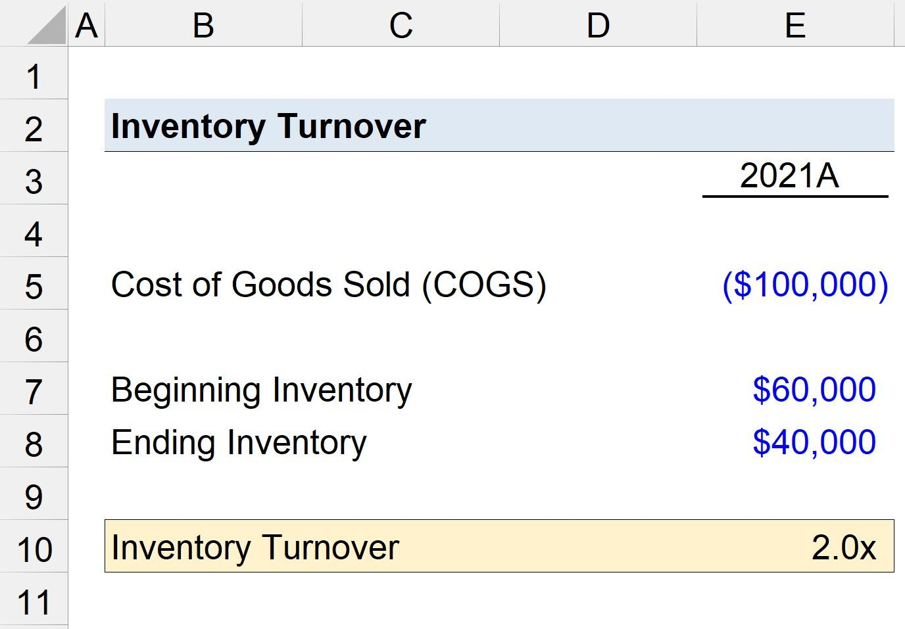

Understanding the intricate relationships between financial ratios, inventory management, and algorithmic trading is crucial for modern businesses aiming to optimize performance. Financial ratios, which include metrics like the inventory turnover ratio, are essential tools that provide key insights into a company's operational efficiency. These ratios help quantify how effectively a company manages its inventory, thereby reflecting the company's health and competitive positioning in the market. Inventory turnover, for example, is calculated as the cost of goods sold divided by the average inventory and indicates how many times inventory is sold and replaced over a period. 

Algorithmic trading, on the other hand, uses sophisticated algorithms and various financial metrics to enhance decision-making and trading performance. By relying on precise calculations of financial ratios, algorithmic trading strategies can identify profitable trading opportunities and execute trades at optimal prices, often at very high speeds. This synergy between financial analysis and high-frequency trading enables improved trading outcomes by leveraging turnover metrics in real-time decision-making processes.



This article explores the intricate connections between turnover analysis, inventory management, and algorithmic trading strategies. We will discuss how these elements interact and contribute to effective business performance, emphasizing the need for an integrated approach that combines financial planning, efficient resource management, and advanced trading technologies.

## Table of Contents

## Financial Ratios and Turnover Analysis

Financial ratios are essential tools for evaluating a company's financial health and operational efficiency. These ratios, derived from financial statements, offer quantitative data that investors, managers, and analysts use to assess a company's performance. Among these, turnover ratios like inventory turnover are particularly valuable in providing insights into how a company manages its assets.

Inventory turnover, a critical turnover ratio, measures how frequently a company sells and replaces its inventory over a specific period. It is calculated using the formula:

$$
\text{Inventory Turnover} = \frac{\text{Cost of Goods Sold (COGS)}}{\text{Average Inventory}}
$$

A high inventory turnover ratio often signifies robust sales, efficient inventory management, and effective asset utilization. Companies with high turnover rates typically maintain lean inventories and adjust swiftly to market demand fluctuations, thus optimizing their resource usage and minimizing carrying costs. Conversely, a low turnover ratio may suggest overstocking, sluggish sales, or ineffective inventory management, leading to potential cash flow issues and increased storage costs.

Analyzing turnover ratios is crucial for businesses striving to maintain competitive advantages within their industries. These ratios not only reflect a company's operational efficiency but also serve as indicators of its market position and potential profitability. Effective turnover analysis allows companies to identify inefficiencies, optimize their supply chain processes, and improve their sales strategies.

Overall, financial ratios, especially turnover ratios, are indispensable in assessing financial performance, guiding strategic decisions, and achieving long-term success in increasingly competitive markets.

## Inventory Management Strategies

Effective inventory management is crucial for businesses aiming to optimize resource utilization and minimize costs. Inventory turnover, a vital metric in this context, measures how often inventory is sold and replaced over a specific period. This metric can be expressed as:

$$
\text{Inventory Turnover} = \frac{\text{Cost of Goods Sold (COGS)}}{\text{Average Inventory}}
$$

A high inventory turnover indicates efficient sales and inventory management, which can lead to improved cash flow and reduced holding costs. On the contrary, a low turnover ratio can result in excess stock and diminished profitability.

Implementing advanced inventory management strategies is essential to managing turnover effectively. Two prominent methods are:

1. **Just-in-Time (JIT) Inventory System**:
   The JIT inventory system reduces inventory levels and holding costs by receiving goods only as they are needed in the production process. This approach minimizes waste and ensures that inventory is not left to sit unsold. JIT necessitates precise demand forecasting and robust supplier relationships. Its implementation can significantly improve a company's responsiveness to market demands while maintaining lean inventory levels.

2. **Pull-Through Production Systems**:
   A pull-through system involves producing goods based on actual demand rather than predicted demand. This strategy ensures that production is closely aligned with market needs, decreasing the likelihood of overproduction and excessive inventory. By producing only what is required, companies can enhance resource allocation and operational efficiency.

For businesses seeking to optimize inventory management, embracing these strategies can lead to significant improvements in operational efficiency. Ensuring that inventory turnover remains high is central to maintaining healthy financial performance, and adopting JIT and pull-through systems can be instrumental in achieving this goal. Understanding and applying these methods effectively requires a detailed analysis of company-specific needs and market conditions, alongside continuous monitoring and adaptation of inventory practices.

## Algorithmic Trading and Turnover Ratios

Algorithmic trading, a sophisticated form of trading that employs algorithms, leverages complex mathematical models and computations to execute trades with remarkable speed and precision. It fundamentally relies on financial ratios and quantitative analysis for making informed trading decisions. Among these financial metrics, turnover ratios hold particular significance in [algorithmic trading](/wiki/algorithmic-trading) as they measure the efficiency and frequency of security transactions within a specific timeframe.

Turnover ratios, such as portfolio turnover, serve as critical indicators of how efficiently a trading strategy manages asset transactions to achieve its objectives. A higher portfolio turnover ratio suggests a greater frequency of trades, pointing to a dynamic trading strategy that may capitalize on short-term market movements. These ratios are calculated as follows:

$$
\text{Portfolio Turnover Ratio} = \frac{\text{Total Asset Purchases or Sales}}{\text{Average Portfolio Value}}
$$

This formula indicates how comprehensively the assets within a portfolio are being managed over a given period. In algorithmic trading, optimizing this ratio is essential for identifying trading opportunities that align with the trading model's parameters.

High-frequency trading ([HFT](/wiki/high-frequency-trading-strategies)), a subset of algorithmic trading, epitomizes the reliance on high turnover ratios. HFT strategies benefit from significant turnover ratios by executing a large number of trades within fractions of a second to exploit small price discrepancies in the market. Through rapid trading, HFT can achieve substantial cumulative profits despite minimal gains per transaction. Python, for example, is often used in the development of HFT algorithms due to its extensive libraries and ease of integration with trading platforms:

```python
import numpy as np

def calculate_turnover_ratio(purchases, sales, avg_portfolio_value):
    total_trades = purchases + sales
    turnover_ratio = total_trades / avg_portfolio_value
    return turnover_ratio

# Example usage
turnover = calculate_turnover_ratio(purchases=100000, sales=150000, avg_portfolio_value=500000)
print(f"Portfolio Turnover Ratio: {turnover}")
```

In conclusion, turnover ratios are indispensable in algorithmic trading strategies, playing a vital role in assessing trading efficiency and optimizing portfolio management. By focusing on these metrics, traders can enhance decision-making processes and improve the overall performance of their trading strategies, particularly in environments characterized by high-frequency trading.

## The Interconnection of Financial Analysis and Trading Strategies

Financial ratios and inventory management are essential elements that significantly influence the design and efficacy of algorithmic trading strategies. The integration of turnover analysis into trading algorithms can substantially improve trading performance. This integration allows for a real-time assessment of asset [liquidity](/wiki/liquidity-risk-premium) and market demand, translating to more informed and timely trading decisions.

High turnover ratios are indicative of high market activity and liquidity. By incorporating these metrics into algorithmic models, trading strategies can be adjusted dynamically to exploit these market conditions, enhancing profit potential while mitigating risk. For instance, algorithms can be programmed to initiate trades when inventory turnover reaches predefined thresholds, ensuring optimal entry and [exit](/wiki/exit-strategy) points based on market conditions.

Efficient inventory management complements these strategies by ensuring that the financial resources tied up in assets are minimized, thus freeing liquidity for trading activities. This synergy allows businesses to maintain a lean inventory system, reducing holding costs and improving cash flow, which can be reallocated to more lucrative trading opportunities.

Understanding and leveraging the interplay between financial ratios, inventory management, and algorithmic trading is crucial for businesses aiming to optimize operational and trading performance. This holistic approach not only improves short-term trading outcomes but also contributes to long-term business sustainability. By continuously analyzing and adapting these interconnected components, businesses can maintain competitive advantages in the fast-evolving financial landscape.

## Challenges and Limitations

Financial ratios and turnover analysis are indispensable tools for evaluating a company's operational efficiency and financial health; however, they are not without limitations. One of the primary challenges lies in the varying industry standards, which can make direct comparisons between companies misleading. For instance, industries like retail may naturally exhibit higher inventory turnover ratios compared to heavy manufacturing due to the differing nature of their operations and sales cycles. Additionally, seasonal fluctuations can significantly impact financial ratios. Companies operating in sectors with strong seasonality, such as tourism or retail, may experience considerable changes in their inventory turnover and other ratios throughout the year, making it essential for analysts to account for these variations to avoid misinterpretation of data.

Algorithmic trading, while transformative for the financial markets, presents its own set of challenges, including high transaction costs and regulatory constraints. Transaction costs can erode profit margins, especially when frequent trading is involved. Algorithmic trading strategies, particularly high-frequency trading (HFT), require the continuous buying and selling of securities, leading to substantial cumulative transaction fees. Moreover, the regulatory landscape governing algorithmic trading is complex and varies across jurisdictions, posing compliance challenges for traders who operate internationally. Regulations may also limit the speed and [volume](/wiki/volume-trading-strategy) of trades that can be executed, impacting the efficiency and potential profitability of these strategies.

Balancing high turnover with the associated costs and risks is pivotal for the sustained success of trading strategies. While high turnover ratios can suggest active and potentially lucrative trading strategies, they can also indicate overtrading, which increases transaction costs and market exposure. This can amplify the risks, especially in volatile markets. It is crucial for traders to optimize algorithms to strike a balance between turnover and cost efficiency to maximize their returns while minimizing risks. 

To make informed decisions, businesses must carefully interpret financial metrics, bearing in mind these limitations and challenges. Proper contextual understanding and additional qualitative insights are necessary to complement quantitative analysis. By considering factors such as industry standards, seasonal effects, and regulatory environments, businesses can better navigate potential pitfalls associated with these metrics. Continuous monitoring and adaptation are essential for leveraging financial ratios and algorithmic trading to their full potential, ensuring that strategic decisions align with both short-term objectives and long-term goals.

## Conclusion

In modern business strategy, the effective use of financial ratios, inventory management, and algorithmic trading strategies plays a vital role in enhancing performance and achieving competitive advantages. A thorough understanding and optimization of turnover analysis are crucial, enabling businesses to maximize operational efficiency and achieve trading success. Turnover analysis, particularly inventory turnover and turnover ratios, offers insights into the frequency and success of asset management. A robust framework can be established by integrating these elements, offering businesses strategic positioning for short-term gains and ensuring long-term sustainability.

Furthermore, financial metrics and turnover ratios underpin algorithmic trading strategies, where their integration can greatly enhance decision-making processes and trading outcomes. Businesses adept at leveraging high turnover ratios can capitalize on rapid market opportunities, improving portfolio performance. The interplay between dynamic inventory management and trading strategies ensures that companies can maintain optimal resource deployment, thus minimizing costs and maximizing profits.

Continuous analysis and strategic adaptation are required in the ever-evolving landscape of finance and trading. With market conditions in constant flux, businesses must be agile in interpreting financial data and anticipating changes in the economic environment. This necessitates a proactive approach to revising strategies, ensuring consistent alignment with current and future market dynamics. Through this ongoing process, businesses can sustain operational excellence and financial profitability, navigating complex challenges and seizing opportunities for growth.

## References & Further Reading

[1]: ["Operations Management for Competitive Advantage"](https://books.google.com/books/about/Operations_Management_for_Competitive_Ad.html?id=oTOnYmZ5ulAC) by Richard B. Chase, F. Robert Jacobs, and Nicholas J. Aquilano

[2]: ["Inventory Management and Production Planning and Scheduling"](https://archive.org/details/inventorymanagem00silv) by Edward A. Silver, David F. Pyke, and Rein Peterson

[3]: ["High-Frequency Trading: A Practical Guide to Algorithmic Strategies and Trading Systems"](https://www.amazon.com/High-Frequency-Trading-Practical-Algorithmic-Strategies/dp/1118343506) by Irene Aldridge

[4]: ["Algorithmic Trading and DMA: An introduction to direct access trading strategies" ](https://www.amazon.com/Algorithmic-Trading-DMA-introduction-strategies/dp/0956399207) by Barry Johnson

[5]: ["Just-in-Time Manufacturing in Perspective"](https://link.springer.com/article/10.1057/jors.1993.124) by Alan Harrison

[6]: ["Financial Statement Analysis and Security Valuation"](https://cie-advances.asme.org/GR-8-08/publication/Download_PDFS/Financial_Statement_Analysis_And_Security_Valuation.pdf) by Stephen H. Penman

[7]: ["Market Liquidity: Theory, Evidence, and Policy"](https://academic.oup.com/book/55158) by Thierry Foucault, Marco Pagano, and Ailsa Röell