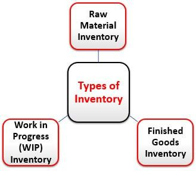

In today's rapidly evolving financial landscape, inventory management is a cornerstone of operational efficiency across numerous sectors, including both traditional industries and algorithmic trading. Inventory, encompassing raw materials, work-in-progress items, and finished products, is essential for a company's ability to meet market demands effectively. This article examines the significance of recognizing different types of inventory and their management methodologies, especially within algorithmic trading systems, where strategic handling of financial instruments is crucial.

In traditional business operations, the efficient management of inventory minimizes costs related to excess stock and storage, thereby enhancing profitability. Similarly, in algorithmic trading, managing trading inventory necessitates precision to optimize returns and control risks. By analyzing key concepts and practical examples, this article seeks to bridge the traditional understanding of inventory with its strategic application in modern trading environments. Readers will gain insights into how these inventory principles contribute to informed trading and investment decisions, ultimately leading to greater financial success. 



Join us as we explore the intricate aspects of inventory management and its evolving role within both business and automated trading contexts, facilitating improved strategies and resource management in response to dynamic market conditions.

## Table of Contents

## Understanding Inventory: Types and Examples

Inventory management is a critical aspect of ensuring a company's ability to meet market demands efficiently. In essence, inventory refers to the different materials and goods a business holds, which can be categorized into three primary types: raw materials, work-in-progress (WIP), and finished goods. Each type plays a unique and essential role in a company's production cycle and overall operations.

**Raw Materials**: These are the basic inputs used in the manufacturing process. Companies involved in production need to ensure they maintain an optimal level of raw materials to avoid production disruptions. For instance, aluminum and steel are essential raw materials in automotive manufacturing. A shortage could halt production lines, while surplus could lead to increased storage costs and capital being unnecessarily tied up.

**Work-In-Progress (WIP)**: This category includes items that are under various stages of the manufacturing process but are not yet completed. Managing WIP inventory is crucial because it directly affects a company's productivity and ability to meet manufacturing deadlines. An example of WIP inventory is a partially assembled aircraft in aerospace manufacturing. Efficient management ensures that there are no bottlenecks or delays in production, optimizing the flow of goods through different stages of assembly.

**Finished Goods**: This type pertains to completed products ready for sale to customers. Effective management of finished goods involves ensuring there is enough stock to meet customer demand without overproducing. In the electronics industry, for instance, maintaining an optimal level of finished goods like smartphones or televisions is vital to cater to market demand while minimizing the cost and space associated with storing excess products.

Efficient inventory management is key to minimizing the costs associated with holding excess inventory while reducing storage expenses and enhancing profitability. Companies often employ various inventory management techniques to achieve this balance. Techniques such as Just-In-Time (JIT) aim to align inventory orders from suppliers directly with production schedules, thereby minimizing excess inventory levels. This approach reduces waste and storage costs, leading to improved financial performance.

In summary, a well-structured inventory management system that effectively addresses the distinct needs associated with raw materials, WIP items, and finished goods is essential for maintaining operational efficiency and financial health. By optimizing their inventory levels, businesses can better respond to market fluctuations and enhance overall profitability.

## Inventory Management and Turnover

Effective inventory management is crucial for businesses aiming to balance stock availability with cost efficiency. It ensures that companies maintain the optimal amount of stock to meet customer demand without incurring unnecessary holding costs. One central metric in this regard is the inventory turnover ratio, which serves as an indicator of how quickly a company sells and replaces its stock over a specific period. A high turnover ratio typically suggests efficient inventory management, with stock rapidly moving from acquisition to sale, while a low ratio may indicate overstock or slower sales.

Inventory turnover ratio is calculated as follows:

$$
\text{Inventory Turnover Ratio} = \frac{\text{Cost of Goods Sold (COGS)}}{\text{Average Inventory}}
$$

Where:

- $\text{Cost of Goods Sold (COGS)}$ refers to the direct costs attributable to the production of the goods sold by a company.
- $\text{Average Inventory}$ is usually calculated as the average of the beginning and ending inventory values over a certain period.

Different accounting methods can affect inventory evaluation and the calculation of the cost of goods sold, each with its specific applications and impact on financial statements:

1. **First-In-First-Out (FIFO)**: Under FIFO, it is assumed that the oldest inventory items are sold first. This method can be beneficial in times of rising prices, as the cost of goods sold will be based on lower historical costs, resulting in higher reported profits.

2. **Last-In-First-Out (LIFO)**: LIFO assumes that the most recently acquired items are sold first. In an inflationary market, LIFO can lead to higher COGS and lower ending inventory values, reducing taxable income but also potentially lowering reported profitability.

3. **Weighted Average**: This method calculates the average cost of items available for sale during the period and applies that average to the cost of goods sold and ending inventory. It's particularly useful for businesses that deal with a large volume of similar items.

Effective management of inventory turnover prevents potential issues such as overstock, which ties up capital and increases storage costs, and obsolescence, where items become outdated or unsellable. Additionally, companies that manage their turnover proficiently are better positioned to avoid capital lock-up, ensuring that funds are available for other operational needs and investments.

In summary, maintaining an optimal inventory turnover is a strategic advantage, allowing businesses to enhance [liquidity](/wiki/liquidity-risk-premium), reduce unnecessary expenditure, and improve their overall financial health.

## Inventory in Algorithmic Trading

Inventory in [algorithmic trading](/wiki/algorithmic-trading) refers to the variety of financial instruments that algorithms manage during execution of trading strategies. These inventories are essential components of automated systems that determine the allocation and holding periods of assets, thereby impacting the strategy's success in the market.

### Managing Trading Inventory

Effectively managing trading inventory is vital for several reasons, including risk management, capital efficiency, and optimal performance of trading strategies. An algorithmic trader must balance holding sufficient inventory to seize favorable market opportunities while minimizing exposure to adverse market movements. Proper inventory management allows for efficient capital utilization, reducing unnecessary costs and enhancing returns.

### Models for Optimal Inventory Management

To achieve optimal inventory levels, traders employ various quantitative models. Mean-Variance Optimization (MVO) is a staple in portfolio management, used to construct a portfolio that maximizes expected return for a given level of risk (variance). This model considers the expected return (E(R)) and the [volatility](/wiki/volatility-trading-strategies) (σ) of assets, solving the optimization problem:

$$
\max \quad E(R) - \frac{\lambda}{2} \cdot \sigma^2 
$$

where $\lambda$ represents the risk aversion coefficient.

Dynamic Programming models offer another sophisticated approach by breaking down decision-making processes into simpler, recursive stages, optimizing decision-making at each point in time under uncertainty.

### Key Trading Strategies and Inventory Management

Several algorithmic trading strategies fundamentally depend on precise inventory management:

1. **Market-Making**: This strategy involves placing buy and sell limit orders to capture the spread. Effective inventory management ensures that market makers do not hold excessive inventory, which could lead to increased market risk.

2. **Statistical Arbitrage**: Traders implement strategies that exploit price inefficiencies between related financial instruments. Accurate inventory management enables them to quickly adjust positions in response to shifting market conditions, optimizing returns.

3. **Mean Reversion**: This strategy anticipates that asset prices will revert to their historical mean. Proper inventory control is essential to maintain liquidity and minimize the risk associated with market volatility.

In conclusion, inventory management within algorithmic trading represents a critical component in enhancing strategy performance and ensuring risk-adjusted returns. As quantitative models and computational tools evolve, traders can increasingly refine their inventory strategies to better align with their financial objectives.

## Inventory Management Tools and Technologies

Advancements in technology have significantly enhanced inventory management tools for algorithmic trading, offering immense potential to optimize trading strategies and manage risk. Platforms such as QuantConnect and Riskalyze have become instrumental in this domain, providing traders with sophisticated facilities to develop and test robust trading algorithms that include integrated inventory management capabilities.

QuantConnect is an open-source algorithmic trading platform that supports multiple asset classes and languages, including Python and C#. It offers a cloud-based environment where traders can backtest their strategies using historical data and receive real-time market feeds. QuantConnect's API allows for the seamless integration of inventory management models, enabling traders to monitor and adjust their trading positions continuously. This capability is crucial for maintaining appropriate inventory levels that align with specific trading strategies.

Riskalyze, on the other hand, is a risk management platform that provides tools to assess and optimize portfolio risk. With features such as risk profiling and stress testing, Riskalyze assists traders in maintaining an optimal inventory of financial instruments. By quantifying the risk associated with various trades, traders can make informed decisions about when to hold or liquidate inventory, ensuring capital efficiency and risk mitigation.

Data analytics and [machine learning](/wiki/machine-learning) have further revolutionized inventory management in algorithmic trading by providing actionable insights into market trends and behaviors. These technologies enable traders to develop predictive models that forecast price movements and volatility. By utilizing machine learning algorithms, traders can automate decision-making processes, continually refine their strategies, and adapt to changing market conditions.

For example, machine learning models can be trained on historical trading data to recognize patterns that indicate market trends. A basic illustration in Python might involve the use of a Random Forest Classifier to predict short-term price movements:

```python
from sklearn.ensemble import RandomForestClassifier
from sklearn.model_selection import train_test_split
from sklearn.metrics import accuracy_score

# Sample data features and targets
features = ... # Historical trading data
targets = ... # Price movement indicators

# Splitting dataset into training and testing sets
X_train, X_test, y_train, y_test = train_test_split(features, targets, test_size=0.2, random_state=42)

# Initializing and training the model
model = RandomForestClassifier(n_estimators=100, random_state=42)
model.fit(X_train, y_train)

# Predictions and accuracy
predictions = model.predict(X_test)
accuracy = accuracy_score(y_test, predictions)

print(f'Prediction Accuracy: {accuracy}')
```

By leveraging these tools and technologies, traders benefit from real-time tracking and efficient resource allocation. Such advancements not only enhance overall trading performance but also ensure that trading strategies remain adaptive and aligned with market dynamics, ultimately contributing to enhanced profitability and strategic success in algorithmic trading.

## Real-World Applications and Case Studies

Many sectors effectively apply inventory management principles to optimize their operations and enhance market positioning, underscoring its critical role beyond conventional business environments.

High-Frequency Trading ([HFT](/wiki/high-frequency-trading-strategies)) firms are a testament to the application of advanced inventory management within the financial sector. These firms capitalize on the ability to execute trade volumes at rapid speeds, measured in microseconds. This agility is facilitated by robust algorithms designed to manage vast inventories of financial instruments simultaneously. Inventory management in HFT involves dynamically adjusting positions to mitigate risks and enhance liquidity. These firms rely on sophisticated models to balance inventory levels, ensuring efficient capital allocation and maintaining strategic market positions.

Retail giants, such as Walmart, exemplify the use of inventory metrics to streamline supply chain operations. Walmart's inventory management system integrates real-time data to monitor stock levels, predict demand, and manage replenishments. By employing metrics such as the inventory turnover ratio, Walmart optimizes product availability while minimizing carrying costs. This approach reduces the risk of overstock and obsolescence, thereby enhancing cost-efficiency and customer satisfaction. By aligning their inventory strategies with consumer demand, Walmart maintains a competitive edge in the retail sector.

In the automotive industry, companies like Toyota have adopted the Just-In-Time (JIT) inventory system to synchronize production with demand. The JIT system minimizes waste by reducing the amount of inventory held at any given time. This approach requires a seamless coordination of supply chain elements, ensuring components arrive exactly when needed for assembly. By avoiding excess inventory and related holding costs, Toyota optimizes resource usage and increases operational efficiency. This inventory strategy not only reduces waste but also enhances flexibility, allowing for quick adaptation to market changes.

These case studies illustrate the pivotal role of inventory management across diverse industries, providing insights into how organizations leverage these principles to optimize operational efficiency and market responsiveness.

## Conclusion

Inventory management stands as a critical element in both conventional industries and the evolving domain of algorithmic trading. By grasping the various types and examples of inventory, alongside effective management strategies, businesses and traders can enhance their operational efficiency and ensure financial success. For instance, understanding how to efficiently manage raw materials, work-in-progress items, and finished goods enables manufacturers to better align their production capabilities with market demands. This alignment minimizes costs associated with excess inventory and storage, ultimately boosting profitability.

In the modern landscape where technology rapidly evolves, exploiting advanced inventory management tools is essential for sustaining and increasing profitability. The use of sophisticated platforms and technologies—such as QuantConnect for algorithmic trading—provides traders with real-time analytics and predictive models. This technological edge aids in making informed decisions that optimize inventory levels and reduce risks, which is paramount for maintaining a competitive advantage.

Moreover, integrating these insights into inventory management practices allows organizations and traders to adeptly navigate the intricate challenges posed by fluctuating market demands and dynamic positions. By aligning inventory management strategies with technological advancements, businesses can streamline operations, reduce waste, and enhance customer satisfaction across various sectors. As such, the strategic application of robust inventory management plays a pivotal role in achieving long-term financial resilience and operational excellence.

## References & Further Reading

[1]: ["Inventory Management Explained: A focus on Forecasting, Lot Sizing, Safety Stock, and Ordering Systems"](https://www.amazon.com/Inventory-Management-Explained-Forecasting-Ordering/dp/0972763112) by David J. Piasecki

[2]: ["Advances in Financial Machine Learning"](https://www.amazon.com/Advances-Financial-Machine-Learning-Marcos/dp/1119482089) by Marcos Lopez de Prado

[3]: ["Just-In-Time: Making it Happen: Unleashing the Power of Continuous Improvement"](https://www.amazon.com/Just-Time-Unleashing-Continuous-Improvement/dp/0471132667) by Hiroyuki Hirano

[4]: ["Quantitative Trading: How to Build Your Own Algorithmic Trading Business"](https://www.amazon.com/Quantitative-Trading-Build-Algorithmic-Business/dp/1119800064) by Ernest P. Chan

[5]: ["The Goal: A Process of Ongoing Improvement"](https://www.amazon.com/Goal-Process-Ongoing-Improvement/dp/0884271951) by Eliyahu M. Goldratt and Jeff Cox

[6]: Fama, E. F., & French, K. R. (1992). ["The Cross-Section of Expected Stock Returns."](https://www.jstor.org/stable/2329112) The Journal of Finance, 47(2), 427-465.

[7]: ["Machine Learning for Algorithmic Trading"](https://github.com/stefan-jansen/machine-learning-for-trading) by Stefan Jansen