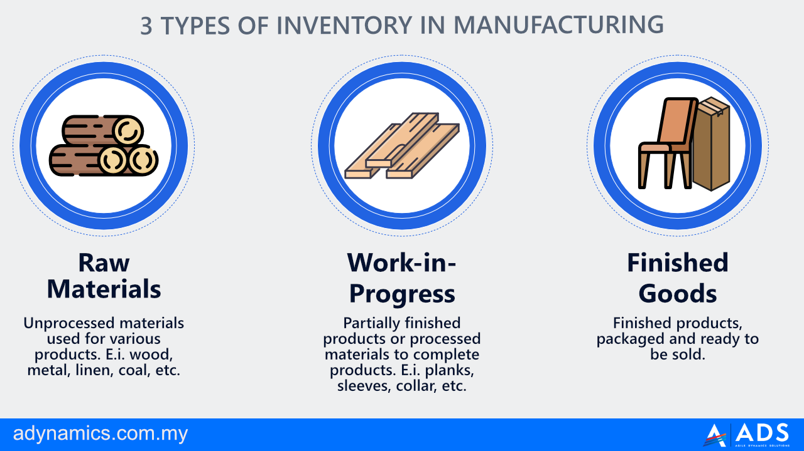

## Table of Contents

## What is inventory?

Inventory is all the goods and materials a business has to sell or use. It includes things like products on store shelves, items in a warehouse, and raw materials waiting to be turned into finished goods. Keeping track of inventory is important because it helps businesses know what they have, what they need to order, and what is selling well.

Managing inventory well can help a business save money and make more sales. If a business has too much inventory, it can waste money on storage and risk having products that don't sell. If it has too little, it might miss out on sales because customers can't find what they want. Good inventory management means finding the right balance to keep customers happy and the business running smoothly.

## Why is inventory management important for businesses?

Inventory management is important for businesses because it helps them keep the right amount of products on hand. If a business has too much inventory, it can end up spending a lot of money on storage and may have products that don't sell. On the other hand, if a business doesn't have enough inventory, it can miss out on sales because customers can't find what they want. By managing inventory well, a business can save money and make sure it always has the products customers need.

Good inventory management also helps businesses plan better. When a business knows what it has in stock and what is selling, it can make smarter decisions about what to order and when. This can prevent problems like running out of popular items or having too many slow-moving products. Overall, effective inventory management keeps a business running smoothly and helps it meet customer demands more efficiently.

## What are the different types of inventory?

There are several types of inventory that businesses use. The first type is raw materials. These are the basic things a business needs to make its products. For example, a bakery might have flour, sugar, and eggs as raw materials. Another type is work-in-progress inventory. This is stuff that is in the middle of being made into a finished product. For a car factory, this could be a car that is halfway built.

The next type is finished goods inventory. These are the products that are ready to be sold to customers. In a clothing store, the shirts and pants on the racks are finished goods. Lastly, there is maintenance, repair, and operating (MRO) inventory. These are the supplies a business needs to keep running smoothly, like cleaning supplies or tools. Each type of inventory is important for different parts of a business's operations.

## Can you provide examples of raw materials inventory?

Raw materials inventory includes the basic things a business needs to make its products. For a bakery, raw materials might be flour, sugar, eggs, and butter. These are the ingredients the bakery uses to make cakes, cookies, and bread. A furniture maker might have wood, nails, and paint as raw materials. They use these to build chairs, tables, and other pieces of furniture.

In a car factory, raw materials could include steel, rubber, and glass. These materials are used to make car parts like the body, tires, and windows. For a clothing company, raw materials might be cotton, wool, and dyes. These are used to make shirts, pants, and other clothes. Each type of business needs different raw materials to make their products.

## What is work-in-process inventory and what are some examples?

Work-in-process inventory is stuff that is in the middle of being made into a finished product. It's not raw materials anymore, but it's not ready to be sold yet. This type of inventory is important because it shows what a business is working on at the moment.

For example, in a car factory, a car that has its body built but is waiting for the engine to be installed is work-in-process inventory. In a bakery, dough that is rising before it's baked into bread is also work-in-process inventory. Another example is a piece of furniture that is partially assembled, like a table with the legs attached but still needing the top. These examples show how work-in-process inventory is a key part of the production process.

## What does finished goods inventory include? Give some examples.

Finished goods inventory includes all the products that are ready to be sold to customers. These are the items that have gone through all the steps of production and are now complete. For a store, finished goods are what you see on the shelves or racks, ready for people to buy.

For example, in a clothing store, finished goods inventory might include shirts, pants, and dresses that are all ready to wear. In a bakery, the finished goods could be freshly baked bread, cakes, and cookies that are ready to be sold to customers. These examples show how finished goods inventory is what businesses have on hand to sell right away.

## How does maintenance, repair, and operating (MRO) inventory differ from other types?

MRO inventory is different from other types because it includes things a business needs to keep running smoothly, not the stuff they sell. This can be things like cleaning supplies, tools, and spare parts. For example, a factory might have MRO inventory like lubricants for machines, light bulbs, and safety gear. These items help keep the factory working well but are not part of the products they make.

Other types of inventory, like raw materials, work-in-process, and finished goods, are all about making and selling products. Raw materials are the basic things needed to make something, work-in-process is stuff that's being made, and finished goods are ready to sell. MRO inventory is special because it's about keeping the business itself running, not about making money from selling things. It's important for keeping operations smooth and efficient.

## What are some strategies for managing inventory effectively?

One good way to manage inventory is by using a system called "just-in-time" (JIT). This means a business orders things right when they need them, not too early. This can save money because the business does not have to keep a lot of stuff in storage. But, it needs good planning and a reliable way to get things quickly. If something goes wrong, like a delay, the business might run out of what it needs.

Another strategy is called "ABC analysis." This means sorting inventory into three groups: A, B, and C. Group A has the most important items that sell a lot and make the most money. Group B has items that are okay but not as important. Group C has the least important items that do not sell as much. By focusing on Group A, a business can make sure it always has enough of the best-selling items. This helps the business use its time and money better.

Using technology can also help manage inventory. Many businesses use special software to keep track of what they have and what they need. This software can tell them when to order more and how much to order. It can also help predict what customers will want in the future. By using technology, businesses can make smarter choices and keep their inventory at the right level.

## How do inventory turnover rates affect a business’s operations?

Inventory turnover rate is how fast a business sells and replaces its inventory. A high turnover rate means a business is selling its products quickly. This is good because it means the business is making money and not keeping a lot of stuff in storage. But, if the turnover rate is too high, the business might run out of products and miss out on sales. So, it's important to find a balance where the business sells things fast but still has enough stock to meet customer needs.

A low inventory turnover rate means a business is selling its products slowly. This can be bad because it means the business is spending money on storage and might have products that do not sell. If the products sit too long, they might go bad or become outdated. A business with a low turnover rate needs to figure out why its products are not selling and maybe change what it sells or how it sells it. Keeping the right turnover rate helps a business save money and keep customers happy.

## What are the challenges of managing perishable inventory?

Managing perishable inventory is hard because these items can go bad quickly. Things like fruits, vegetables, and dairy products have a short shelf life. If a business orders too much, they might end up throwing away a lot of spoiled goods. This can waste money and hurt the environment. It's important for businesses to keep track of how fast these items sell so they can order just the right amount.

Another challenge is keeping perishable items at the right temperature. If they get too warm or too cold, they can spoil faster. Businesses need to have good refrigeration and make sure it's working well all the time. This can be expensive and needs a lot of attention. If something goes wrong with the cooling system, a business could lose a lot of inventory quickly. Managing perishable inventory well means finding a balance between having enough to sell and not having too much that goes to waste.

## How can technology improve inventory management?

Technology can make inventory management a lot easier for businesses. Special software can keep track of what a business has in stock and what it needs to order. This software can tell the business when to order more and how much to order. It can also help predict what customers will want in the future. By using technology, businesses can make smarter choices and keep their inventory at the right level. This helps them save money and make sure they always have what customers need.

Another way technology helps is by making it easier to see what's going on with inventory from anywhere. With tools like barcode scanners and RFID tags, businesses can quickly check what they have in stock. This means they can update their inventory records fast and accurately. It also helps them find things in their warehouse more easily. Using technology like this can make the whole process of managing inventory smoother and less stressful for businesses.

## What advanced inventory management techniques should experts consider?

One advanced technique experts should consider is demand forecasting. This means using data and math to guess what customers will want in the future. By looking at past sales and other information, businesses can order just the right amount of stuff. This helps them avoid having too much or too little inventory. It can save money and keep customers happy because the business will have what people want when they want it.

Another technique is using something called "vendor-managed inventory" (VMI). This is when the business lets its suppliers take care of keeping the right amount of stock. The suppliers can see how much inventory the business has and make sure it stays at the right level. This can help the business focus on other things while the suppliers handle the inventory. It can make the whole process smoother and more efficient.

## How can inventory management improve turnover?

Effective inventory management is crucial for businesses aiming to balance stock availability with cost efficiency. It ensures that companies maintain the optimal amount of stock to meet customer demand without incurring unnecessary holding costs. One central metric in this regard is the inventory turnover ratio, which serves as an indicator of how quickly a company sells and replaces its stock over a specific period. A high turnover ratio typically suggests efficient inventory management, with stock rapidly moving from acquisition to sale, while a low ratio may indicate overstock or slower sales.

Inventory turnover ratio is calculated as follows:

$$
\text{Inventory Turnover Ratio} = \frac{\text{Cost of Goods Sold (COGS)}}{\text{Average Inventory}}
$$

Where:

- $\text{Cost of Goods Sold (COGS)}$ refers to the direct costs attributable to the production of the goods sold by a company.
- $\text{Average Inventory}$ is usually calculated as the average of the beginning and ending inventory values over a certain period.

Different accounting methods can affect inventory evaluation and the calculation of the cost of goods sold, each with its specific applications and impact on financial statements:

1. **First-In-First-Out (FIFO)**: Under FIFO, it is assumed that the oldest inventory items are sold first. This method can be beneficial in times of rising prices, as the cost of goods sold will be based on lower historical costs, resulting in higher reported profits.

2. **Last-In-First-Out (LIFO)**: LIFO assumes that the most recently acquired items are sold first. In an inflationary market, LIFO can lead to higher COGS and lower ending inventory values, reducing taxable income but also potentially lowering reported profitability.

3. **Weighted Average**: This method calculates the average cost of items available for sale during the period and applies that average to the cost of goods sold and ending inventory. It's particularly useful for businesses that deal with a large volume of similar items.

Effective management of inventory turnover prevents potential issues such as overstock, which ties up capital and increases storage costs, and obsolescence, where items become outdated or unsellable. Additionally, companies that manage their turnover proficiently are better positioned to avoid capital lock-up, ensuring that funds are available for other operational needs and investments.

In summary, maintaining an optimal inventory turnover is a strategic advantage, allowing businesses to enhance [liquidity](/wiki/liquidity-risk-premium), reduce unnecessary expenditure, and improve their overall financial health.

## What is the role of inventory in algorithmic trading?

Inventory in [algorithmic trading](/wiki/algorithmic-trading) refers to the variety of financial instruments that algorithms manage during execution of trading strategies. These inventories are essential components of automated systems that determine the allocation and holding periods of assets, thereby impacting the strategy's success in the market.

### Managing Trading Inventory

Effectively managing trading inventory is vital for several reasons, including risk management, capital efficiency, and optimal performance of trading strategies. An algorithmic trader must balance holding sufficient inventory to seize favorable market opportunities while minimizing exposure to adverse market movements. Proper inventory management allows for efficient capital utilization, reducing unnecessary costs and enhancing returns.

### Models for Optimal Inventory Management

To achieve optimal inventory levels, traders employ various quantitative models. Mean-Variance Optimization (MVO) is a staple in portfolio management, used to construct a portfolio that maximizes expected return for a given level of risk (variance). This model considers the expected return (E(R)) and the [volatility](/wiki/volatility-trading-strategies) (σ) of assets, solving the optimization problem:

$$
\max \quad E(R) - \frac{\lambda}{2} \cdot \sigma^2 
$$

where $\lambda$ represents the risk aversion coefficient.

Dynamic Programming models offer another sophisticated approach by breaking down decision-making processes into simpler, recursive stages, optimizing decision-making at each point in time under uncertainty.

### Key Trading Strategies and Inventory Management

Several algorithmic trading strategies fundamentally depend on precise inventory management:

1. **Market-Making**: This strategy involves placing buy and sell limit orders to capture the spread. Effective inventory management ensures that market makers do not hold excessive inventory, which could lead to increased market risk.

2. **Statistical Arbitrage**: Traders implement strategies that exploit price inefficiencies between related financial instruments. Accurate inventory management enables them to quickly adjust positions in response to shifting market conditions, optimizing returns.

3. **Mean Reversion**: This strategy anticipates that asset prices will revert to their historical mean. Proper inventory control is essential to maintain liquidity and minimize the risk associated with market volatility.

In conclusion, inventory management within algorithmic trading represents a critical component in enhancing strategy performance and ensuring risk-adjusted returns. As quantitative models and computational tools evolve, traders can increasingly refine their inventory strategies to better align with their financial objectives.

## References & Further Reading

[1]: ["Inventory Management Explained: A focus on Forecasting, Lot Sizing, Safety Stock, and Ordering Systems"](https://www.amazon.com/Inventory-Management-Explained-Forecasting-Ordering/dp/0972763112) by David J. Piasecki

[2]: ["Advances in Financial Machine Learning"](https://www.amazon.com/Advances-Financial-Machine-Learning-Marcos/dp/1119482089) by Marcos Lopez de Prado

[3]: ["Just-In-Time: Making it Happen: Unleashing the Power of Continuous Improvement"](https://www.amazon.com/Just-Time-Unleashing-Continuous-Improvement/dp/0471132667) by Hiroyuki Hirano

[4]: ["Quantitative Trading: How to Build Your Own Algorithmic Trading Business"](https://www.amazon.com/Quantitative-Trading-Build-Algorithmic-Business/dp/1119800064) by Ernest P. Chan

[5]: ["The Goal: A Process of Ongoing Improvement"](https://www.amazon.com/Goal-Process-Ongoing-Improvement/dp/0884271951) by Eliyahu M. Goldratt and Jeff Cox

[6]: Fama, E. F., & French, K. R. (1992). ["The Cross-Section of Expected Stock Returns."](https://www.jstor.org/stable/2329112) The Journal of Finance, 47(2), 427-465.

[7]: ["Machine Learning for Algorithmic Trading"](https://github.com/stefan-jansen/machine-learning-for-trading) by Stefan Jansen