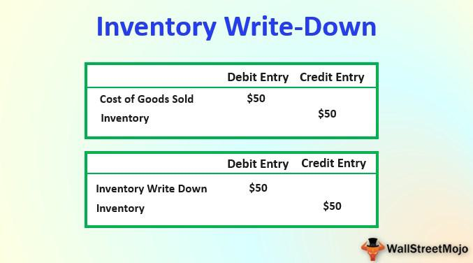

Accurate inventory accounting is crucial for businesses across various industries as it ensures the depiction of a company's true financial position. By maintaining precise records of inventory, companies are able to manage costs effectively, enhance their operational efficiency, and meet customer demand more accurately. One significant component of maintaining financial accuracy is dealing with inventory write-offs, which reflect the portion of inventory that has lost value and cannot be sold at its original cost. Recognizing inventory write-offs is essential for maintaining the integrity of a company’s financial statements and for providing stakeholders with a real picture of its asset value.

Inventory write-offs address situations where products become obsolete, damaged, or lost, necessitating a reduction in asset value on the balance sheet. They directly impact cost of goods sold and overall financial reporting, making them vital for periodical financial assessments. Without recognizing write-offs, businesses risk inflating assets, misrepresenting profit margins, and inadvertently misleading investors or auditors. This practice ensures compliance with accounting principles and provides a safeguard against financial discrepancies.



In the context of algorithmic trading, inventory write-offs play a peculiar yet integral role. Algorithmic trading firms, though primarily focused on equities, bonds, and other financial instruments, deal with technical infrastructures and data inventories that require meticulous accounting. Inventory write-offs in this domain could relate to depreciated technology, obsolete data models, or impaired software tools that fail to deliver expected performance metrics. Properly accounting for such write-offs is crucial for these firms to maintain high-frequency trading precision and to make informed strategic decisions. By accurately reflecting the real value of technological investments, algorithmic traders can ensure robust financial health, which in turn supports the strategic allocation of resources for developing and optimizing trading algorithms.

## Table of Contents

## Understanding Inventory Write-Offs

Inventory write-offs are an essential accounting mechanism used to adjust an entity's financial records to reflect the true value of inventory. This adjustment is crucial for ensuring that financial statements present an accurate portrayal of a company's financial position. Write-offs occur when inventory items are deemed to have no future economic benefit and are therefore removed from the company's books.

Several scenarios can necessitate an inventory write-off. One common situation arises when inventory becomes obsolete, rendering items unsellable due to technological advancements or market shifts. For example, outdated electronics might need to be written off as they have little to no demand. Inventory can also be written off due to physical damage, which could render goods unsellable or unsafe. Additionally, loss due to theft or misplacement, which results in discrepancies between recorded and actual inventory, can lead to a write-off.

Distinguishing between write-offs and write-downs is crucial for accurate accounting. While both adjust the value of inventory, they do so in different circumstances and have varying impacts on financial statements. An inventory write-off implies that the inventory is completely valueless, leading to its removal from the balance sheet. In contrast, a write-down reduces the inventory's recorded value due to a decline in market value, while still retaining the inventory on the books with a new, lower valuation.

Understanding these concepts is vital for maintaining financial accuracy and ensuring businesses can make informed strategic decisions based on the most current data available.

## Accounting for Inventory Write-Offs

Inventory write-offs are essential elements in accounting as they reflect the need to remove inventory from accounting records due to factors such as obsolescence, damage, or losses. The accounting for inventory write-offs can be performed using different methods, primarily the direct write-off method and the allowance method. 

### Journal Entry Process for Recording Inventory Write-Offs

To record an inventory write-off, a journal entry is necessary to remove the inventory from the [books](/wiki/algo-trading-books) and recognize the associated loss. The basic journal entry involves debiting a loss account and crediting the inventory account. For example, if an accounting department decides to write off $10,000 worth of obsolete inventory, the following journal entry would be required:

```
Loss on Inventory Write-Off   $10,000
   Inventory                         $10,000
```

This entry decreases the inventory account and acknowledges the loss, directly impacting the financial statements.

### Direct Write-Off Method

The direct write-off method involves expensing inventory losses directly without establishing any reserve or allowance beforehand. This method simplifies inventory accounting, as losses are recognized only when they are certain. However, it can result in volatile swings in reported financial results since losses are only acknowledged at inventory's disposal. 

In financial statements, utilizing the direct write-off method may impact the consistency and comparability of financial data across periods. For example, if $5,000 worth of inventory is identified as unsellable in a particular fiscal period, it is directly expensed within that period, possibly inflating expenses. 

### Allowance Method and Use of Contra Accounts

The allowance method, in contrast, involves creating reserves for potential inventory write-offs ahead of time by estimating future losses. This proactive approach helps smooth income fluctuations over periods. Companies establish a contra account, often called "Allowance for Inventory Obsolescence," which serves as an offset to the inventory account. When actual write-offs occur, they are charged against this allowance, rather than directly impacting the income statement.

Here is an example of how entries would be recorded:

1. Estimate future write-offs:
   ```
   Loss on Inventory Write-Off   $3,000
      Allowance for Obsolete Inventory   $3,000
   ```

2. When the actual loss is realized:
   ```
   Allowance for Obsolete Inventory   $2,500
      Inventory                                  $2,500
   ```

In the allowance method, the estimation of future losses enhances foresight and planning. By charging the allowance account, the company mitigates sudden impacts on profits during periods when losses are realized. This method also provides a more realistic picture of future financial obligations and supports strategic planning decisions.

Both methods have their merits, but the choice between them largely depends on the company's financial policies and the nature of the inventory being managed. In any case, accurate record-keeping and accounting practices remain pivotal to ensuring financial integrity.

## Impact of Inventory Write-Offs on Algo Trading Operations

Inventory write-offs directly impact the financial statements of [algorithmic trading](/wiki/algorithmic-trading) firms by adjusting the valuation of assets, which has a downstream effect on profitability and strategic decision-making. In the context of algorithmic trading, inventory doesn't typically refer to physical goods but rather to the digital assets—securities, derivatives, or cryptocurrencies—held for trading purposes.

An inventory write-off involves removing obsolete, damaged, or otherwise non-tradable assets from the financial books, which reduces the stated income and asset value on the balance sheet. For algorithmic trading firms, precise inventory accounting is integral, as inaccuracies can distort financial realities, leading to flawed decision-making. An incorrect inventory valuation due to overestimation can wrongly inflate asset values and profits, leading to misguided strategies such as over-leveraging positions or excessive risk-taking. 

Furthermore, inaccurate inventory management impacts cash flow analysis and [liquidity](/wiki/liquidity-risk-premium) assessments. If assets that are thought to be liquid become unsellable due to obsolescence or market conditions, the firm might face unexpected liquidity shortages. For algo traders, this could mean insufficient capital for executing trades, missed opportunities, or failure to meet margin requirements, potentially resulting in significant financial penalties or losses.

Accurate write-offs help maintain financial health by providing a clearer picture of a firm's asset liquidity and true market position. This transparency enables traders to make informed strategic decisions. For example, a firm aware of its actual asset valuation might decide to rebalance its portfolio, adjust its algorithm parameters, or alter its risk management protocols to optimize trading outcomes.

In summary, inventory write-offs serve as a critical checkpoint for algorithmic trading firms, ensuring that asset valuations reflect genuine market conditions. This accuracy not only upholds financial integrity but also supports strategic decision-making that aligns with the firm’s financial reality and market forecasts. Thus, it underscores the indispensability of maintaining robust inventory management practices within the trading operations.

## Tools and Software to Manage Inventory Write-Offs

To effectively manage inventory write-offs, businesses increasingly rely on software solutions that automate and streamline the process. These tools not only facilitate accurate record-keeping but also enhance decision-making capabilities, particularly in fast-paced environments such as algorithmic trading. 

One popular category of software solutions is enterprise resource planning (ERP) systems. ERPs like SAP and Oracle offer comprehensive modules designed for inventory management, including functionalities to automate write-offs. These systems integrate with other business processes, ensuring that inventory adjustments are reflected in real-time across all financial statements. The integration helps maintain accurate inventory valuations and supports compliance with regulatory standards.

Inventory management software such as NetSuite and Fishbowl provides specialized features to manage write-offs efficiently. These platforms offer real-time tracking, customizable reporting, and advanced analytics to aid businesses in understanding inventory trends and making informed write-off decisions. For algorithmic trading firms, the ability to swiftly adjust inventories in response to market fluctuations is crucial. These tools facilitate such agility by providing insights into inventory levels and potential needs for write-offs, enabling traders to act promptly.

Adopting technology brings several advantages to managing inventory write-offs. Automation reduces the risk of human error, ensuring that inventory levels and financial impacts are accurately recorded. Additionally, software solutions often include audit trails and user activity logs, which enhance transparency and facilitate auditing processes. The scalability of these tools allows algorithmic trading firms to grow without facing limitations in their inventory management systems.

For algorithmic trading operations, where precision and speed are paramount, tools like QuickBooks Online and Xero can be particularly beneficial. These cloud-based accounting solutions offer integrations with algorithmic trading platforms, enabling seamless synchronization of financial data. They provide robust features for managing write-offs, including automated journal entries and reconciliation functions that minimize manual intervention.

In conclusion, leveraging specialized software for managing inventory write-offs offers significant benefits, particularly for businesses operating in dynamic sectors like algorithmic trading. The ability to automate complex processes, maintain accurate records, and gain actionable insights ensures that inventory management supports strategic business objectives.

## Challenges in Inventory Write-Offs in Algo Trading

Algorithmic trading, known for its fast-paced and data-driven nature, presents unique challenges when it comes to managing inventory write-offs. Understanding these challenges is crucial for maintaining financial integrity and optimizing trading strategies.

One of the primary challenges is the rapid market changes that affect inventory valuation. Algorithmic trading relies heavily on the ability to make decisions based on current market conditions. However, these conditions can change in an instant due to economic news, geopolitical events, or shifts in market sentiment, leading to significant fluctuations in asset values. Such [volatility](/wiki/volatility-trading-strategies) can complicate the accurate assessment of inventory worth, making it difficult to decide when a write-off is necessary.

Inventory write-offs are particularly challenging in trading environments where the holding period for financial instruments is typically short. Unlike traditional inventory, which might suffer from physical damage or obsolescence, the inventory in algorithmic trading can quickly become less valuable due to adverse market movements or regulatory changes. These dynamics demand a system capable of real-time valuations, something traditional accounting methods struggle to offer.

To mitigate risks associated with inventory write-offs, traders can adopt several strategies. Implementing robust risk management systems is fundamental. These systems should include automated alerts to notify traders of significant market changes that might affect inventory valuation. Moreover, utilizing statistical models to predict potential market movements can help in preemptively adjusting positions, thereby minimizing the need for write-offs.

### Python Example for Risk Mitigation
Algorithmic traders can use Python to build models that predict market trends and inform inventory decisions. Here's a simplified example using a moving average crossover strategy:

```python
import pandas as pd
import numpy as np

# Load historical price data
data = pd.read_csv('price_data.csv')

# Calculate short and long-term moving averages
data['Short_MA'] = data['Close'].rolling(window=50).mean()
data['Long_MA'] = data['Close'].rolling(window=200).mean()

# Generate trading signals
data['Signal'] = np.where(data['Short_MA'] > data['Long_MA'], 1, 0)  # 1 for buy signal, 0 for sell

# Backtest the strategy
data['Position'] = data['Signal'].diff()
data['Inventory_Value'] = data['Position'] * data['Close']

# Evaluate performance and impact on inventory valuation
total_return = data['Inventory_Value'].sum()
print(f"Total Return from Strategy: {total_return}")
```

### Conclusion
By adopting adaptable tools and strategies, algotraders can better handle the challenges of inventory write-offs. Incorporating automated systems for monitoring real-time data and predictive analytics can significantly enhance decision-making processes, ensuring financial accuracy and strategic agility in dynamic markets.

## Conclusion

Inventory write-offs are a significant component of maintaining financial accuracy within businesses, including those operating in algotrading sectors. Their primary importance lies in ensuring that the financial statements reflect true values, thereby allowing for more precise strategic decision-making. As discussed, effective inventory management, particularly through write-offs, helps mitigate risks associated with obsolescence, damage, or loss, which in turn protects a company's financial health.

In algorithmic trading, the need for accurate accounting practices cannot be overstated. These practices are essential because they support transparency and consistency, fundamental aspects of trust and reliability in trading operations. Accurate record-keeping and timely write-offs ensure that assets reported on financial statements are not overstated, which would otherwise lead to distorted financial insights affecting trading algorithms' effectiveness.

Ongoing assessment and adaptation of inventory management strategies are crucial to match the dynamic changes in markets. For algo traders, where rapid market shifts can greatly impact inventory valuation, constantly updated strategies help maintain accurate and relevant data that inform trading decisions. Implementing advanced software solutions can automate these inventory processes, ensuring real-time adjustments align with current market conditions.

Continuous evaluation and improvement of inventory management, with a focus on accurate write-offs, enable firms to respond promptly to market changes. This adaptability not only enhances the integrity of financial reporting but also empowers algorithmic traders to make informed and strategic financial decisions, ultimately driving their success in competitive trading environments.

## References & Further Reading

[1]: Bergstra, J., Bardenet, R., Bengio, Y., & Kégl, B. (2011). ["Algorithms for Hyper-Parameter Optimization."](https://dl.acm.org/doi/10.5555/2986459.2986743) Advances in Neural Information Processing Systems 24.

[2]: ["Advances in Financial Machine Learning"](https://www.amazon.com/Advances-Financial-Machine-Learning-Marcos/dp/1119482089) by Marcos Lopez de Prado

[3]: ["Evidence-Based Technical Analysis: Applying the Scientific Method and Statistical Inference to Trading Signals"](https://www.amazon.com/Evidence-Based-Technical-Analysis-Scientific-Statistical/dp/0470008741) by David Aronson

[4]: ["Machine Learning for Algorithmic Trading"](https://github.com/stefan-jansen/machine-learning-for-trading) by Stefan Jansen

[5]: ["Quantitative Trading: How to Build Your Own Algorithmic Trading Business"](https://github.com/LucindaYa/quant-resources/blob/master/Quantitative%20Trading%20How%20to%20Build%20Your%20Own%20Algorithmic%20Trading%20Business.pdf) by Ernest P. Chan