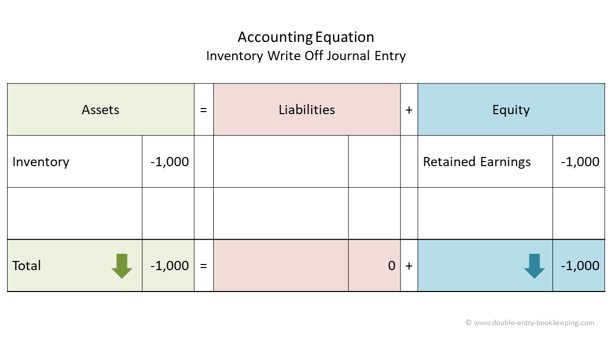

## Table of Contents

## What is an inventory write-off in accounting?

An inventory write-off in accounting is when a business decides that some of its inventory is no longer worth what it paid for it. This can happen if the inventory gets damaged, becomes outdated, or if it's just not selling. When this happens, the business has to remove the value of that inventory from its books. This is called writing off the inventory.

Writing off inventory affects a company's financial statements. It reduces the value of the inventory on the balance sheet, which is a record of what the company owns and owes. It also affects the income statement, which shows the company's profits and losses. When inventory is written off, it's usually recorded as a loss, which means the company's profit for that period will be lower. This helps give a more accurate picture of the company's financial health.

## Why might a company need to write off inventory?

A company might need to write off inventory when the items they have in stock lose their value or become unsellable. This can happen for a few reasons. Sometimes, products get damaged or spoiled, especially if they are perishable goods like food or medicine. Other times, items might become outdated, like old electronics or fashion items that are no longer in style. If the inventory isn't selling, it's not making money for the company, so they have to remove its value from their records.

Writing off inventory helps a company keep its financial records accurate. If they didn't write off the inventory, their [books](/wiki/algo-trading-books) would show they have more valuable items than they actually do. This could make the company look more profitable than it really is. By writing off the inventory, the company shows a true picture of its financial health, which is important for making good business decisions and for being honest with investors and lenders.

## How does inventory write-off affect a company's financial statements?

When a company writes off inventory, it changes the numbers on its financial statements. The balance sheet, which shows what the company owns and owes, will show less inventory. This is because the company is saying that some of its inventory is not worth anything anymore. So, the total value of the inventory on the balance sheet goes down.

The income statement, which shows how much money the company made or lost, is also affected. Writing off inventory is usually recorded as a loss. This means the company's profit for that period will be lower. By showing this loss, the company gives a more honest picture of how well it's doing financially. This helps everyone who looks at the financial statements, like investors and lenders, understand the real situation of the company.

## What are the common reasons for inventory becoming obsolete or unsellable?

Inventory can become obsolete or unsellable for a few main reasons. One common reason is damage. If items get broken, spoiled, or otherwise harmed, they can't be sold as they were meant to be. This often happens with perishable goods like food or medicine, but it can happen to anything if it's not stored or handled properly. Another reason is changes in what customers want. If a product goes out of style, like certain clothes or electronics, it becomes hard to sell. Companies have to keep up with what people are buying, or they'll end up with inventory they can't move.

Another reason inventory might become unsellable is because of new technology. When newer, better versions of a product come out, the older ones lose their value quickly. This is especially true in industries like tech and electronics, where new gadgets are always being released. Finally, economic changes can also make inventory unsellable. If there's a big change in the economy, like a recession, people might not have as much money to spend on certain things, leaving companies with products they can't sell.

## What is the difference between inventory write-off and inventory write-down?

An inventory write-off and an inventory write-down are two ways a company deals with inventory that's lost value, but they're not the same thing. An inventory write-off happens when a company decides that some of its inventory is totally worthless. This could be because the items are damaged, outdated, or just not selling at all. When this happens, the company removes the whole value of that inventory from its books. It's like saying, "This stuff is worth nothing now, so we're not going to count it anymore."

On the other hand, an inventory write-down is when a company thinks its inventory is still worth something, but less than what they paid for it. Instead of getting rid of the whole value, they just lower it to what they think it's worth now. This might happen if a product isn't selling as well as expected, but it's still possible to sell it for a lower price. So, the company changes the value of the inventory on its books to reflect this new, lower value. Both write-offs and write-downs affect a company's financial statements, but in different ways.

## How do you calculate the amount to be written off from inventory?

To calculate the amount to be written off from inventory, you first need to figure out which items are no longer worth anything. This could be because they're damaged, outdated, or just not selling. Once you know which items these are, you look at how much you paid for them when you bought them. The total cost of these items is the amount you need to write off.

For example, if you bought 100 shirts for $10 each, and now 50 of them are damaged and can't be sold, you would write off the cost of those 50 shirts. That means you're writing off $500 (50 shirts times $10 each). This $500 is removed from your inventory value on your financial records, showing that these shirts are now worth nothing.

## What are the accounting entries required for an inventory write-off?

When a company decides to write off some of its inventory, it needs to make a few entries in its accounting records. First, it has to take the cost of the inventory that's being written off out of the inventory account. This is done by debiting an expense account, like "Loss on Inventory Write-Off" or "Cost of Goods Sold," and crediting the inventory account. This shows that the company is no longer counting the value of the written-off inventory as part of its stock.

The second step is to make sure the write-off is shown on the income statement. By debiting the expense account, the company is recording a loss, which means its profit for that period will be lower. This helps to give a true picture of how the company is doing financially. It's important to keep these records accurate so that everyone who looks at the financial statements, like investors and lenders, can see the real situation of the company.

## What are the tax implications of writing off inventory?

When a company writes off inventory, it can affect its taxes. Writing off inventory means the company is saying some of its stock is now worth nothing. This can lower the company's taxable income because the write-off is usually recorded as a loss. When a company has a lower taxable income, it might have to pay less in taxes. This is because taxes are calculated based on how much profit a company makes, and writing off inventory reduces that profit.

However, the rules about how inventory write-offs affect taxes can be different depending on where the company is located and what kind of business it is. Companies need to follow the tax laws in their area. Sometimes, they might need to show proof that the inventory really is worthless before they can write it off for tax purposes. It's a good idea for companies to talk to a tax professional to make sure they're doing everything right and taking advantage of any tax benefits they can get from writing off inventory.

## How can a company prevent the need for frequent inventory write-offs?

A company can prevent the need for frequent inventory write-offs by keeping a close eye on what's in stock. They should regularly check their inventory to see what's selling and what's not. If they notice that certain items aren't moving, they can try to sell them at a discount or return them to the supplier before they become worthless. It's also important to store inventory properly to avoid damage. For example, keeping perishable goods in the right temperature can prevent spoilage.

Another way to reduce the need for write-offs is by staying up-to-date with what customers want. Companies should keep an eye on trends and be ready to change what they sell if something goes out of style. They can also use technology to help manage inventory better. For instance, using software that predicts how much of a product will sell can help them order just the right amount, so they don't end up with too much stock that they can't sell. By being smart about what they buy and how they manage it, companies can keep their inventory valuable and avoid having to write it off.

## What are the best practices for managing inventory to minimize write-offs?

To minimize inventory write-offs, a company should always keep a close watch on what they have in stock. They need to check their inventory often to see which items are selling and which ones are not. If they see that some items are not moving, they can try to sell them at a lower price or return them to the supplier before they lose all their value. It's also important to take good care of the inventory. For example, keeping perishable goods at the right temperature can stop them from going bad. By doing these things, a company can make sure their inventory stays valuable and they don't have to write it off.

Another good practice is to stay updated with what customers want. Companies should keep an eye on trends and be ready to change what they sell if something goes out of style. They can also use technology to help manage inventory better. For example, using software that predicts how much of a product will sell can help them order just the right amount, so they don't end up with too much stock that they can't sell. By being smart about what they buy and how they manage it, companies can keep their inventory valuable and avoid having to write it off.

## How does inventory write-off impact inventory turnover ratios and other key performance indicators?

When a company writes off inventory, it can change its inventory turnover ratio. This ratio shows how quickly a company sells and replaces its stock. If a company writes off a lot of inventory, the amount of inventory on its books goes down. This can make the inventory turnover ratio look better because the company is selling a higher percentage of what's left. But, it doesn't mean the company is doing better at selling things. It just means they got rid of inventory that wasn't worth anything anymore.

Writing off inventory also affects other key performance indicators like gross margin and net profit. When inventory is written off, it's usually recorded as a loss, which lowers the company's profit. This can make the gross margin, which is the difference between sales and the cost of goods sold, go down. A lower gross margin means the company is making less money on each item it sells. This can also affect the net profit, which is what's left after all expenses are paid. By keeping an eye on these indicators, a company can see how writing off inventory changes its financial health and make better decisions about managing stock.

## What are the advanced methods or software tools used for tracking and managing inventory write-offs?

Companies use advanced software tools to keep track of and manage inventory write-offs. One popular type of software is called an Enterprise Resource Planning (ERP) system. ERP systems help businesses manage all parts of their operations, including inventory. They can track how much inventory a company has, how fast it's selling, and when it might need to be written off. These systems can also send alerts when inventory is not moving, helping the company decide when to write it off before it loses all its value.

Another useful tool is inventory management software. This software is made just for tracking inventory and can be linked with other business systems. It helps companies see which items are selling and which ones are not, making it easier to spot inventory that might need to be written off. Some of these tools even use [artificial intelligence](/wiki/ai-artificial-intelligence) (AI) to predict future sales and suggest when to order more or when to write off existing stock. By using these advanced tools, companies can make better decisions about their inventory and reduce the need for write-offs.

## References & Further Reading

[1]: Bergstra, J., Bardenet, R., Bengio, Y., & Kégl, B. (2011). ["Algorithms for Hyper-Parameter Optimization."](https://dl.acm.org/doi/10.5555/2986459.2986743) Advances in Neural Information Processing Systems 24.

[2]: ["Advances in Financial Machine Learning"](https://www.amazon.com/Advances-Financial-Machine-Learning-Marcos/dp/1119482089) by Marcos Lopez de Prado

[3]: ["Evidence-Based Technical Analysis: Applying the Scientific Method and Statistical Inference to Trading Signals"](https://www.amazon.com/Evidence-Based-Technical-Analysis-Scientific-Statistical/dp/0470008741) by David Aronson

[4]: ["Machine Learning for Algorithmic Trading"](https://github.com/stefan-jansen/machine-learning-for-trading) by Stefan Jansen

[5]: ["Quantitative Trading: How to Build Your Own Algorithmic Trading Business"](https://github.com/LucindaYa/quant-resources/blob/master/Quantitative%20Trading%20How%20to%20Build%20Your%20Own%20Algorithmic%20Trading%20Business.pdf) by Ernest P. Chan