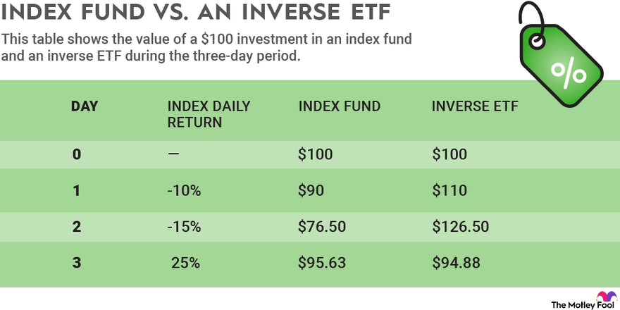

## Table of Contents

## What is an inverse ETF?

An inverse ETF, or exchange-traded fund, is a type of investment that aims to make money when the market goes down. It does the opposite of what a regular ETF does. If a regular ETF goes up when the market goes up, an inverse ETF goes up when the market goes down. This can be useful for investors who want to protect their money during times when they think the market will fall.

Inverse ETFs use different financial tools, like derivatives, to achieve their goal. These tools allow the ETF to move in the opposite direction of the market. However, inverse ETFs can be risky. They are usually meant for short-term trading, not for long-term investing. This is because the daily adjustments needed to keep the ETF moving in the opposite direction can lead to losses over time if the market doesn't move as expected.

## How does short selling work?

Short selling is when someone borrows a stock or another asset from someone else and sells it right away, hoping to buy it back later at a lower price. If the price does go down, they can buy the stock back cheaper than they sold it, return the borrowed stock to the owner, and keep the difference as profit. For example, if you borrow and sell a stock for $100 and it drops to $80, you buy it back for $80, return it, and you make $20.

However, short selling can be risky. If the price of the stock goes up instead of down, you lose money. You have to buy the stock back at a higher price to return it, which means you lose the difference. For instance, if you sell a stock for $100 and it goes up to $120, you have to buy it back for $120, losing $20. Also, there's no limit to how much you could lose because there's no cap on how high a stock price can go.

## What are the main differences between inverse ETFs and short selling?

Inverse ETFs and short selling are both ways to make money when the market goes down, but they work differently. An inverse [ETF](/wiki/etf-trading-strategies) is a type of fund that you can buy like a stock. It uses financial tools to move in the opposite direction of the market. So, if the market goes down, the inverse ETF goes up. You don't need to borrow anything to invest in an inverse ETF, and it's managed by professionals who handle the financial tools for you.

Short selling, on the other hand, involves borrowing a stock from someone else and selling it right away. You hope the price will go down so you can buy it back cheaper, return it to the owner, and keep the difference as profit. Unlike inverse ETFs, short selling requires you to borrow the stock, and you have to manage the process yourself. It can be riskier because if the stock price goes up instead of down, your losses can be unlimited.

Both methods have their own risks and are usually used for short-term trading. Inverse ETFs can be easier to use because they are managed professionally, but they can still lose money over time if the market doesn't move as expected. Short selling gives you more control, but it also means you take on more risk, especially since there's no limit to how much you could lose if the stock price rises.

## What are the risks associated with investing in inverse ETFs?

Investing in inverse ETFs can be risky. One big risk is that they are usually meant for short-term trading, not long-term investing. This is because they use financial tools that need to be adjusted every day to keep moving in the opposite direction of the market. If the market doesn't move as expected over time, these daily adjustments can lead to losses. So, if you hold an inverse ETF for a long time, you might lose money even if the market eventually goes down.

Another risk is that inverse ETFs can be more volatile than regular ETFs. This means their value can go up and down a lot more, which can be stressful for investors. Also, because they use complex financial tools, there's a chance that the ETF might not track the market perfectly. This can lead to unexpected losses. So, it's important to understand these risks before deciding to invest in inverse ETFs.

## Can you explain the mechanics of how an inverse ETF achieves its inverse performance?

An inverse ETF tries to make money when the market goes down. It does this by using financial tools called derivatives, like futures contracts and swaps. These tools let the ETF move in the opposite direction of the market. For example, if the market goes down by 1%, the inverse ETF tries to go up by 1%. The people who manage the ETF use these derivatives to make sure the ETF's value changes the opposite way from the market.

These financial tools need to be adjusted every day to keep the ETF moving in the opposite direction. If the market goes up one day, the ETF goes down, and the managers have to make sure it's ready to do the opposite the next day. This daily adjustment can sometimes cause problems. If the market doesn't move as expected over time, the ETF might lose money even if the market eventually goes down. So, it's important for investors to understand that inverse ETFs are usually meant for short-term trading, not long-term investing.

## What are the costs involved in short selling compared to investing in inverse ETFs?

Short selling can involve several costs. When you short sell, you have to borrow the stock from someone else, and this usually comes with a borrowing fee. The fee can change depending on how hard it is to borrow the stock. Also, if the stock price goes up instead of down, you lose money. You have to buy the stock back at a higher price to return it, and this can be a big cost. There might also be other costs like interest on the borrowed stock and any fees your broker charges for the transaction.

Investing in inverse ETFs is different. You don't have to borrow anything, so there are no borrowing fees. But there are other costs to think about. Inverse ETFs have management fees, which are the costs for the professionals who manage the fund. These fees can add up over time. Also, like any ETF, there might be trading fees when you buy or sell the ETF. So, while inverse ETFs might seem simpler and less costly than short selling, it's important to look at all the fees involved.

## How do inverse ETFs and short selling fit into a broader investment strategy?

Inverse ETFs and short selling can be useful tools in a broader investment strategy, especially for investors who want to protect their money or make gains when the market goes down. Both methods let you make money from falling prices, which can be helpful if you think the market will go down soon. For example, if you have a lot of stocks and you're worried about a market drop, you could use inverse ETFs or short selling to balance out your losses. This way, if the market does go down, your gains from the inverse ETFs or short selling could help cover the losses from your other investments.

However, these tools should be used carefully. They are usually meant for short-term trading, not for holding onto for a long time. Inverse ETFs and short selling can be risky and might not be right for everyone. They need a lot of watching and understanding of the market. So, they are often used by experienced investors who can handle the risks and know when to use them. If you're thinking about using inverse ETFs or short selling, it's a good idea to talk to a financial advisor to make sure they fit into your overall investment plan.

## What are some common examples of inverse ETFs available in the market?

Some common inverse ETFs are the ProShares Short S&P 500 (SH) and the ProShares UltraShort S&P 500 (SDS). The SH ETF tries to give you the opposite daily performance of the S&P 500. So, if the S&P 500 goes down by 1%, the SH ETF tries to go up by 1%. The SDS ETF is similar, but it tries to give you twice the opposite performance of the S&P 500. If the S&P 500 goes down by 1%, the SDS ETF tries to go up by 2%.

Another example is the ProShares Short QQQ (PSQ), which aims to give you the opposite daily performance of the Nasdaq-100 Index. If the Nasdaq-100 goes down by 1%, the PSQ ETF tries to go up by 1%. These ETFs are popular because they let investors make money when the market goes down, but they can be risky and are usually meant for short-term trading.

## How does the performance of an inverse ETF correlate with the performance of the underlying index or asset?

An inverse ETF tries to move in the opposite direction of the index or asset it's based on. For example, if the S&P 500 goes down by 1% in a day, an inverse ETF like the ProShares Short S&P 500 (SH) tries to go up by 1% that same day. This is done using financial tools like futures contracts and swaps, which the ETF managers adjust every day to make sure the ETF moves the opposite way from the index.

However, the performance of an inverse ETF doesn't always match the opposite of the index perfectly over time. This is because the ETF is adjusted daily, and if the market moves differently than expected, the ETF might not give you the exact opposite performance you were hoping for. So, while an inverse ETF can be a good way to make money when the market goes down, it's important to know that it's usually meant for short-term trading, not for holding onto for a long time.

## What are the tax implications of using inverse ETFs versus short selling?

The tax implications of using inverse ETFs are different from short selling. When you invest in an inverse ETF, you might have to pay taxes on any gains you make. If you hold the ETF for less than a year, any profits you make are considered short-term capital gains, and you'll be taxed at your regular income tax rate. If you hold it for more than a year, the gains are considered long-term capital gains, which are usually taxed at a lower rate. Also, if the ETF pays out dividends, you'll have to pay taxes on those too.

Short selling has its own tax rules. When you short sell, you don't own the stock, so you don't get dividends. But if you make money from short selling, those profits are also taxed as short-term capital gains if you close the position within a year. If you hold the short position for more than a year, it's a bit more complicated. The IRS treats the profit as ordinary income if you've held the position for over a year, which can mean a higher tax rate. Plus, if you have to pay a fee to borrow the stock, you might be able to deduct that fee from your taxes, but it depends on your situation.

## How can leverage be used in conjunction with inverse ETFs and what are the associated risks?

Leverage can be used with inverse ETFs to make bigger gains when the market goes down. Some inverse ETFs use leverage to try to give you two or three times the opposite performance of the market. For example, if the market goes down by 1%, a leveraged inverse ETF might try to go up by 2% or 3%. This can be a good way to make more money if you think the market will drop a lot. But it's important to know that using leverage can also make your losses bigger if the market doesn't go down as much as you thought.

Using leverage with inverse ETFs can be very risky. Because these ETFs are adjusted every day, if the market moves differently than expected, the ETF might not give you the gains you were hoping for. And because of the leverage, any losses can be much bigger than if you were just using a regular inverse ETF. So, it's really important to understand these risks and to only use leveraged inverse ETFs if you're ready to handle the chance of big losses. They are usually meant for short-term trading, not for holding onto for a long time.

## What advanced strategies can be employed using inverse ETFs and short selling in volatile markets?

In volatile markets, investors can use inverse ETFs and short selling to try to make money when the market goes down. One strategy is to use inverse ETFs to protect your other investments. If you think the market will drop soon, you can buy an inverse ETF that moves in the opposite direction of the market. This way, if the market does go down, the gains from the inverse ETF can help cover the losses from your other investments. Another strategy is to use short selling to bet against specific stocks that you think will go down. If you're right and the stock price drops, you can buy it back cheaper, return it, and keep the difference as profit.

However, these strategies can be risky, especially in volatile markets. Inverse ETFs and short selling are usually meant for short-term trading, not for holding onto for a long time. If the market doesn't move as expected, you could lose money. Also, if you use leveraged inverse ETFs, which try to give you two or three times the opposite performance of the market, your gains can be bigger, but so can your losses. So, it's important to watch the market closely and be ready to make quick decisions. If you're not sure about using these strategies, it's a good idea to talk to a financial advisor to make sure they fit into your overall investment plan.

## References & Further Reading

[1]: ["Short Selling: Strategies, Risks, and Rewards"](https://www.amazon.com/Short-Selling-Strategies-Risks-Rewards/dp/0471660205) by Amit Kumar

[2]: ["The ETF Handbook: How to Value and Trade Exchange Traded Funds"](https://www.amazon.com/ETF-Handbook-Exchange-Traded-Finance/dp/1119193907) by David J. Abner

[3]: Khandani, A. E., & Lo, A. W. (2007). ["What Happened to the Quants in August 2007?"](https://web.mit.edu/Alo/www/Papers/august07.pdf) MIT Sloan School Working Paper.

[4]: ["Algorithmic and High-Frequency Trading"](https://www.cambridge.org/us/universitypress/subjects/mathematics/mathematical-finance/algorithmic-and-high-frequency-trading) by Álvaro Cartea, Sebastian Jaimungal, and José Penalva

[5]: Hull, J. (2021). ["Risk Management and Financial Institutions"](https://www.amazon.com/Management-Financial-Institutions-Wiley-Finance/dp/1119932483) (5th Edition). Wiley.

[6]: ["The Volatility Surface: A Practitioner's Guide"](https://github.com/PlamenStilyianov/Quant/blob/master/Gatheral%20J.%20The%20volatility%20surface..%20A%20practitioner%27s%20guide%20(Wiley%2C%202006)(ISBN%200471792519)(210s)_FD_.pdf) by Jim Gatheral