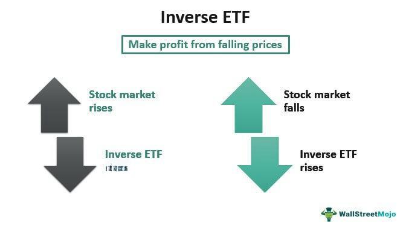

In the modern financial landscape, investment strategies such as inverse Exchange Traded Funds (ETFs), short selling, and algorithmic trading have become increasingly significant. These advanced techniques equip investors with tools to navigate and potentially profit from declining markets—a crucial skill in times of economic uncertainty and volatility. By setting these strategies as focal points, investors can manage risks more adeptly and take advantage of diverse market conditions.

Inverse ETFs serve as an innovative mechanism for investors aiming to gain from declining market indices without directly engaging in short-selling activities. By moving in the opposite direction of their benchmark index, inverse ETFs offer opportunities for speculative strategies primarily aimed at short-term gains. Short selling, by contrast, involves borrowing shares of a stock and selling them, with the intention of repurchasing them at a lower price. This approach allows investors to hedge against a potential downturn in specific stocks, although it requires a deeper understanding of market dynamics and involves higher risk given the potential for losses if the stock price rises instead.



Algorithmic trading, which relies on computer programs to execute trades based on pre-set criteria, adds a layer of sophistication to these strategies. This method leverages the power of technology to process vast quantities of data rapidly, enabling timely decision-making that can capitalize on market fluctuations. In volatile markets, algorithmic trading can enhance the effectiveness of inverse ETFs and short selling by eliminating emotional biases and ensuring a disciplined investment approach.

This article will provide insights into these strategies, exploring their benefits, drawbacks, and practical applications. By understanding how inverse ETFs, short selling, and algorithmic trading can be integrated into a comprehensive investment portfolio, investors can potentially achieve a significant edge in today’s financial markets. As we investigate these approaches, it is essential to consider the evolving market dynamics and continuously refine investment strategies to align with individual financial goals.

## Table of Contents

## Understanding Inverse ETFs

Inverse Exchange-Traded Funds (ETFs) serve as strategic financial instruments crafted to yield returns inversely proportional to the performance of a specified benchmark index. When the related index experiences a decline, inverse ETFs are designed to generate profits—effectively allowing investors to capitalize on bearish market movements without resorting to traditional short-selling mechanisms.

These investment vehicles are particularly suited for short-term strategies, primarily due to their intrinsic mechanics of daily rebalancing. Daily rebalancing is implemented to maintain the ETF's target inverse exposure, typically resetting at the close of each trading day. Although essential for achieving the desired inverse relationship, this process incurs additional costs and complexity, often leading to cumulative return deviations when held over extended periods due to phenomena like 'compounding decay.'

An enhanced version, known as leveraged inverse ETFs, seeks to amplify the inverse daily return by multiples (e.g., -2x or -3x of the benchmark's daily performance). While this feature potentially magnifies gains, it equally increases exposure to amplified losses, necessitating a careful approach and suitability predominantly for sophisticated, risk-tolerant traders.

Selecting an appropriate inverse [ETF](/wiki/etf-trading-strategies) involves a comprehensive evaluation of several critical parameters. The expense ratio, reflecting the annual cost associated with managing the ETF as a percentage of assets, is a pivotal [factor](/wiki/factor-investing) due to its direct impact on net returns. Liquidity is another crucial consideration, typically gauged through trading [volume](/wiki/volume-trading-strategy) and bid-ask spreads, to ensure efficient trade execution and to minimize transaction costs. Furthermore, investors must assess the degree of correlation between the ETF's performance and that of the underlying index, ensuring alignment with investment objectives.

As an illustration of this evaluation, consider a hypothetical inverse ETF tracking the S&P 500 Index. Suppose the S&P 500 decreases by 1% in one day. A corresponding -1x inverse ETF would ideally aim to increase by approximately 1%. However, non-linear holding period returns necessitate a vigilant focus on tracking accuracy and holding duration, situating inverse ETFs favorably for day-to-day tactical maneuvers rather than extended investment horizons.

In conclusion, while inverse ETFs provide a tactical means of profiting from downturns, their inherent complexities and potential risks mandate a thorough understanding and evaluation, emphasizing their role as a component of thoughtful, measured investment strategies.

## Inverse ETFs vs. Short Selling

Short selling and inverse exchange-traded funds (ETFs) represent two distinct strategies for investors seeking to profit from declining market conditions. These methods offer investors various ways to hedge their portfolios or capitalize on anticipated downward trends in stock prices, each with its unique characteristics, advantages, and disadvantages.

Short selling is a trading strategy where an investor borrows shares from a broker and sells them on the open market, intending to repurchase them later at a lower price. This approach entails a few steps: identifying a stock that the investor believes will decline in value, borrowing the stock from a brokerage, selling it at the current market price, and eventually repurchasing the stock to return to the lender. The difference between the selling price and the repurchase price represents the profit or loss from the trade. However, short selling requires a margin account and entails borrowing fees, adding to the complexity and potential costs of the strategy. Additionally, short sellers face the risk of unlimited losses, as there's theoretically no upper limit to a stock's price.

Inverse ETFs provide an alternative for investors seeking similar exposure without the intricacies involved in short selling. These financial instruments are designed to produce returns opposite to that of their benchmark index, which means they appreciate when the market declines. Inverse ETFs can be bought and sold like traditional stocks, simplifying the execution process as they don't require a margin account or the locating and borrowing of stocks. This ease of use, along with typically lower associated costs, makes inverse ETFs an attractive option for those looking for a straightforward method to bet against the market or hedge existing long positions.

The choice between short selling and investing in inverse ETFs involves weighing the balance between potential precision and associated risks. Short selling may offer a more precise hedge for investors aware of specific stock movements but comes with inherent complexity, risks of high losses, and additional fees. Conversely, inverse ETFs present a more accessible and less risky option suitable for investors who prefer simplicity and cost-effectiveness. Ultimately, the decision hinges on an investor's sophistication, risk tolerance, and investment objectives, making it imperative for individuals to carefully evaluate their strategies within the broader context of their comprehensive investment approach.

## Algorithmic Trading in Inverse ETFs and Short Selling

Algorithmic trading employs sophisticated computer programs to execute trades based on predetermined strategies and criteria. Its application in inverse ETFs and short selling introduces a structured and efficient approach to navigating volatile markets. By leveraging algorithms, traders can swiftly analyze copious amounts of data, providing the ability to make quick and informed decisions. This technological advancement mitigates emotional biases, promoting a disciplined trading strategy.

Incorporating inverse ETFs and short selling into [algorithmic trading](/wiki/algorithmic-trading) can be advantageous due to their responsiveness to market downturns. Algorithms are instrumental in identifying market inefficiencies and profiting from price movements by executing trades precisely when market conditions favor inverse strategies. The use of algorithms in these contexts allows investors to handle complexity and swiftly react to price fluctuations, potentially capitalizing on short-term market movements.

Algorithmic strategies benefit greatly from the ability to process vast datasets, which include market trends, historical prices, and economic indicators. These data insights are critical for developing robust trading models, as they inform decision-making processes and strategy adjustments. For instance, [machine learning](/wiki/machine-learning) techniques can be used to predict stock trends based on historical data, while statistical [arbitrage](/wiki/arbitrage) models might detect price discrepancies for short selling opportunities.

A basic Python implementation for a trading algorithm might look like this:

```python
import pandas as pd
from sklearn.model_selection import train_test_split
from sklearn.ensemble import RandomForestClassifier

# Load market data
data = pd.read_csv('market_data.csv')
features = data[['feature1', 'feature2', 'feature3']]
target = data['direction']  # 1 for up, 0 for down

# Split data into training and test sets
X_train, X_test, y_train, y_test = train_test_split(features, target, test_size=0.3, random_state=42)

# Train a Random Forest Classifier
model = RandomForestClassifier(n_estimators=100, random_state=42)
model.fit(X_train, y_train)

# Predict market direction
predictions = model.predict(X_test)

# Implement trading rules based on predictions
def execute_trades(predictions):
    for i, pred in enumerate(predictions):
        if pred == 1:
            print(f"Buying Inverse ETF at index {i}")
        else:
            print(f"Selling/Shorting stock at index {i}")

execute_trades(predictions)
```

The effectiveness of these algorithms hinges on their ability to adapt to shifting market conditions and evolving economic indicators. Traders must remain vigilant, continuously refining their models with new data inputs and market feedback to optimize performance. Understanding these market dynamics and integrating comprehensive datasets into algorithmic strategies are vital for maintaining a competitive edge in trading inverse ETFs and executing short selling strategies.

## Risks and Considerations in Using Inverse ETFs and Short Selling

Inverse Exchange-Traded Funds (ETFs) and short selling are advanced investment strategies that come with particular risks and considerations. One primary concern with inverse ETFs is that they are unsuitable for long-term holds. These financial instruments are engineered to achieve the inverse of the daily performance of their benchmark index, meaning they are designed for short-term speculative strategies. The daily compounding and rebalancing inherent in inverse ETFs can lead to significant tracking errors over extended periods. For instance, if markets experience extreme [volatility](/wiki/volatility-trading-strategies), the performance of an inverse ETF could deviate considerably from the expected outcome due to these compounding effects.

Short selling carries its own unique set of risks. This strategy involves borrowing a security and selling it with the intention of repurchasing it at a lower price. However, one of the most significant risks is the potential for infinite losses. If the security's price rises instead of falls, the short seller is obligated to buy back the security at a potentially much higher price, thereby realizing substantial losses.

Market conditions, economic indicators, and technical analysis are vital components in managing the risks associated with both inverse ETFs and short selling. Economic indicators such as GDP growth rates, inflation, and interest rates can influence market sentiment and asset prices significantly. Therefore, understanding the economic backdrop is crucial for investors employing these strategies. Technical analysis may also support decision-making by providing insight into price trends and market [momentum](/wiki/momentum).

Investors contemplating the use of these strategies must carefully assess their risk tolerance and market knowledge. Risk tolerance refers to the degree of variability in investment returns that an investor is willing to withstand in their investment portfolio. To evaluate whether inverse ETFs or short selling align with one's investment objectives, investors might consider simulating potential scenarios using Python:

```python
import numpy as np

# Hypothetical market data
market_return = np.random.normal(loc=0.001, scale=0.02, size=252)  # daily returns
inverse_etf_return = -market_return  # inverse of the market

# Simulation for an inverse ETF over a year's period
initial_investment = 1000
etf_value = initial_investment
for daily_return in inverse_etf_return:
    etf_value *= (1 + daily_return)

print(f"Final value of inverse ETF: {etf_value:.2f}")
```

This basic code snippet models the impact of daily market fluctuations on an inverse ETF investment over a standard trading year of 252 days, beginning with an initial investment. Such simulations can aid investors in visualizing potential outcomes and help in making informed decisions. Nonetheless, both methods require a substantial level of financial acumen and regular monitoring of market developments to implement effectively and safely.

## Integrating Strategies for Diversification

Integrating inverse ETFs, short selling, and algorithmic trading into an investment strategy can offer a robust means of navigating the complexities of the financial markets. By effectively combining these techniques, investors can hedge against potential market downturns while capitalizing on upward market trends through their traditional investment holdings.

Inverse ETFs specifically allow investors to profit from declining market conditions without the complications associated with direct short selling. When used alongside traditional investments, these funds can provide a straightforward method to hedge against market losses. This hedging capability becomes particularly effective when integrated into a broader portfolio strategy that includes algorithmic trading.

Algorithmic trading provides the analytical foundation for managing these advanced financial instruments. Algorithms can swiftly analyze massive datasets to provide actionable insights, ensuring responsive and timely trading actions. They programmatically execute trades based on pre-set criteria, which allows for more disciplined and less emotionally driven trading decisions. By incorporating inverse ETFs and short selling into algorithmic strategies, investors can potentially optimize their responses to volatile market conditions.

Diversification is a fundamental principle in investment management, aimed at reducing risk by spreading investments across various financial instruments, industries, and other categories. Combining inverse ETFs, short selling, and algorithmic trading contributes significantly to this diversity. This multi-faceted approach can enhance a portfolio's resilience by mitigating risks associated with single market movements or sector downturns.

Consultation with financial advisors is advisable when employing these sophisticated strategies. Advisors can offer tailored insights into how these instruments can align with individual financial goals and risk tolerances. They can assist in constructing a balanced investment plan that leverages these tools to better prepare for both market upside and downside scenarios.

Effectively integrating these strategies requires a deep understanding of their interplay and an ability to adapt to shifting market conditions. Continuous refinement and education are essential as the financial landscape evolves, ensuring that investors remain abreast of new opportunities and risks associated with these dynamic investment tools.

## Conclusion

Understanding and utilizing inverse ETFs, short selling, and algorithmic trading indeed holds the potential to significantly enhance portfolio performance. Each of these strategies comes with its set of benefits and risks, presenting investors with a dynamic toolkit for thoughtful financial management. Inverse ETFs provide a straightforward mechanism to offset declines in market indices, while short selling offers precise hedging capabilities. Algorithmic trading, in turn, can optimize trade execution and reduce emotional decision-making, delivering a strategic edge through speed and data analysis accuracy.

The combined application of these strategies can offer a comprehensive hedge against various market conditions. For instance, during market downturns, inverse ETFs can offset losses, while algorithmic models can swiftly adapt to changing economic indicators to optimize short selling opportunities. However, this integrative approach requires a sophisticated understanding of each strategy's mechanics and implications.

Achieving successful investment outcomes necessitates a well-thought-out approach balanced by extensive knowledge, diligent practice, and meticulous risk management. Investors need to be aware of potential pitfalls, such as the risks of holding inverse ETFs over long periods due to tracking errors from their daily rebalancing nature, or the possible infinite losses from short selling if stock prices increase unexpectedly.

As markets evolve, continued education and adaptability in investment strategies remain crucial. Financial landscapes are inherently volatile, and maintaining an updated comprehension of market dynamics could be the difference between profit and loss. Investors should actively refine their strategies to align with evolving financial goals, adapting to new economic data, technological advances, and changing regulations.

In conclusion, while employing inverse ETFs, short selling, and algorithmic trading presents challenges, it also provides an opportunity for increased portfolio resilience and growth. By staying informed and adaptive, investors can harness these advanced techniques to meet and surpass their financial objectives, ensuring long-term investment success.

## References & Further Reading

[1]: ["Short Selling: Strategies, Risks, and Rewards"](https://www.amazon.com/Short-Selling-Strategies-Risks-Rewards/dp/0471660205) by Amit Kumar

[2]: ["The ETF Handbook: How to Value and Trade Exchange Traded Funds"](https://www.amazon.com/ETF-Handbook-Exchange-Traded-Finance/dp/1119193907) by David J. Abner

[3]: Khandani, A. E., & Lo, A. W. (2007). ["What Happened to the Quants in August 2007?"](https://web.mit.edu/Alo/www/Papers/august07.pdf) MIT Sloan School Working Paper.

[4]: ["Algorithmic and High-Frequency Trading"](https://www.cambridge.org/us/universitypress/subjects/mathematics/mathematical-finance/algorithmic-and-high-frequency-trading) by Álvaro Cartea, Sebastian Jaimungal, and José Penalva

[5]: Hull, J. (2021). ["Risk Management and Financial Institutions"](https://www.amazon.com/Management-Financial-Institutions-Wiley-Finance/dp/1119932483) (5th Edition). Wiley.

[6]: ["The Volatility Surface: A Practitioner's Guide"](https://github.com/PlamenStilyianov/Quant/blob/master/Gatheral%20J.%20The%20volatility%20surface..%20A%20practitioner%27s%20guide%20(Wiley%2C%202006)(ISBN%200471792519)(210s)_FD_.pdf) by Jim Gatheral