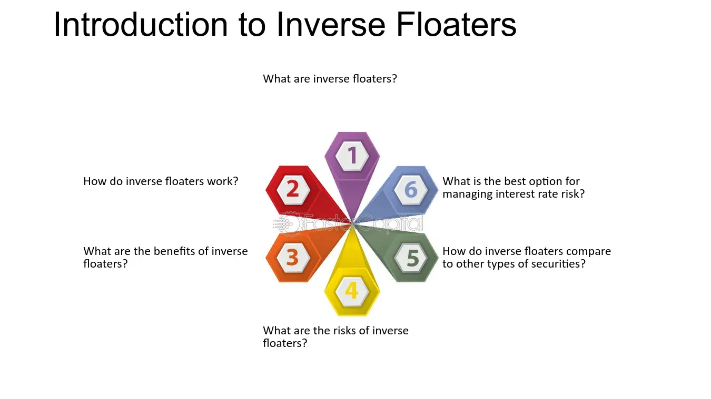

## Table of Contents

## What is an inverse floater?

An inverse floater is a type of bond or security where the interest rate moves in the opposite direction to a benchmark interest rate, like the LIBOR or the federal funds rate. This means that when the benchmark rate goes up, the interest rate on the inverse floater goes down, and when the benchmark rate goes down, the interest rate on the inverse floater goes up. This unique feature makes inverse floaters attractive to certain investors who want to bet on the direction of interest rates.

Inverse floaters are often used in structured finance, where they are created by splitting a regular bond into two parts: a floater and an inverse floater. The floater pays interest based on the benchmark rate, while the inverse floater pays the remaining interest. This setup can be risky because if the benchmark rate rises too high, the interest payment on the inverse floater could drop to zero. Therefore, inverse floaters are considered complex and are usually bought by experienced investors who understand the risks involved.

## How does an inverse floater differ from a regular bond?

An inverse floater is different from a regular bond mainly because of how it pays interest. A regular bond pays a fixed interest rate, which stays the same no matter what happens to other interest rates. On the other hand, an inverse floater's interest rate changes based on a benchmark rate, like the LIBOR, but it moves in the opposite direction. So, if the benchmark rate goes up, the interest rate on the inverse floater goes down, and if the benchmark rate goes down, the interest rate on the inverse floater goes up.

This opposite movement of interest rates makes inverse floaters more complex and riskier than regular bonds. With a regular bond, you know exactly what interest you will get, making it easier to predict your income. But with an inverse floater, your interest payments can change a lot, and they could even drop to zero if the benchmark rate gets too high. This means inverse floaters are usually bought by investors who understand these risks and want to bet on the direction of interest rates.

## What are the key components of an inverse floater?

An inverse floater has a few main parts that make it work. The first part is the benchmark interest rate, like the LIBOR or the federal funds rate. This rate goes up and down over time, and it's what the inverse floater uses to figure out its own interest rate. The second part is the formula that connects the inverse floater's interest rate to the benchmark rate. This formula makes the inverse floater's rate move in the opposite way of the benchmark rate. So, if the benchmark rate goes up, the inverse floater's rate goes down, and if the benchmark rate goes down, the inverse floater's rate goes up.

The third part of an inverse floater is the cap and floor. The cap is the highest interest rate the inverse floater can pay, and the floor is the lowest interest rate it can pay. These limits are important because they stop the interest rate from going too high or too low. For example, if the benchmark rate gets really high, the inverse floater's rate could drop to the floor, which might be zero. This keeps the interest payments from going negative. Together, these parts make an inverse floater a special kind of bond that can be risky but also interesting for some investors.

## How is the interest rate on an inverse floater determined?

The interest rate on an inverse floater is figured out using a special formula that looks at a benchmark interest rate, like the LIBOR. The formula makes the inverse floater's interest rate move in the opposite direction of the benchmark rate. So, if the benchmark rate goes up, the interest rate on the inverse floater goes down. And if the benchmark rate goes down, the interest rate on the inverse floater goes up. This opposite movement is what makes an inverse floater different from other bonds.

There are also limits, called a cap and a floor, that keep the interest rate from getting too high or too low. The cap is the highest interest rate the inverse floater can pay, and the floor is the lowest interest rate it can pay. If the benchmark rate gets really high, the interest rate on the inverse floater could drop all the way to the floor, which might be zero. This keeps the interest payments from going negative. These parts together make an inverse floater a tricky but interesting type of bond.

## What are the risks associated with investing in inverse floaters?

Investing in inverse floaters can be risky. One big risk is that the interest rate you get can change a lot. If the benchmark rate, like the LIBOR, goes up a lot, the interest rate on your inverse floater can drop all the way to zero. This means you might not get any interest at all, which can be a problem if you were counting on that money. Also, because the interest rate moves in the opposite direction of the benchmark rate, it can be hard to guess what will happen. If you guess wrong about which way interest rates will go, you could lose money.

Another risk is that inverse floaters can be hard to understand and sell. They are more complex than regular bonds, so not many people know how to buy and sell them. This can make it hard to get out of your investment if you need to. If the market for inverse floaters isn't doing well, you might have to sell them for less than you paid, which means you lose money. Because of these risks, inverse floaters are usually for experienced investors who know what they're doing and can handle the ups and downs.

## Can you explain the relationship between an inverse floater and its reference rate?

An inverse floater's interest rate is tied to a reference rate, like the LIBOR. The special thing about an inverse floater is that its interest rate moves in the opposite direction of the reference rate. So, if the reference rate goes up, the interest rate on the inverse floater goes down. And if the reference rate goes down, the interest rate on the inverse floater goes up. This opposite movement can make things tricky because if the reference rate gets really high, the interest you get from the inverse floater could drop all the way to zero.

This relationship can be both a good thing and a bad thing. If you think the reference rate will go down, an inverse floater could be a good choice because your interest rate will go up. But if you're wrong and the reference rate goes up instead, you could end up getting no interest at all. This makes inverse floaters a bit of a gamble, and they're usually best for people who know a lot about how interest rates work and are okay with taking some risk.

## How do you calculate the coupon payment for an inverse floater?

The coupon payment for an inverse floater is figured out using a special formula that looks at a benchmark rate, like the LIBOR. The formula is set up so that when the benchmark rate goes up, the coupon payment goes down. And when the benchmark rate goes down, the coupon payment goes up. This opposite movement is what makes an inverse floater different from other bonds. The formula usually looks something like this: Coupon Rate = Maximum Rate - (Multiplier x Benchmark Rate). The Maximum Rate is the highest possible coupon rate, and the Multiplier is a number that shows how much the coupon rate changes for each change in the benchmark rate.

There are also limits called a cap and a floor that keep the coupon payment from getting too high or too low. The cap is the highest coupon rate the inverse floater can pay, and the floor is the lowest coupon rate it can pay. If the benchmark rate gets really high, the coupon payment could drop all the way to the floor, which might be zero. This keeps the coupon payment from going negative. So, if you know the benchmark rate, the maximum rate, the multiplier, and the cap and floor, you can figure out the coupon payment for an inverse floater.

## What are some common uses of inverse floaters in financial markets?

Inverse floaters are used in financial markets to help investors make money when they think interest rates will go down. They are part of a bigger group of investments called structured products. These products are made by splitting a regular bond into two parts: a regular floater and an inverse floater. The regular floater pays interest based on a benchmark rate like the LIBOR, while the inverse floater pays the rest of the interest. This setup lets investors bet on the direction of interest rates. If someone thinks rates will go down, they might buy an inverse floater because its interest payments will go up when the benchmark rate goes down.

Another use of inverse floaters is in managing risk. Some big investors, like banks or hedge funds, use them to balance out their other investments. For example, if a bank has a lot of regular bonds that lose value when interest rates go up, they might buy inverse floaters to make money if rates do go up. This can help them keep their overall risk lower. But inverse floaters are tricky and can be risky, so they are mostly used by people who know a lot about how interest rates work and are okay with taking some risk.

## What strategies can investors use to mitigate the risks of inverse floaters?

Investors can use a few different strategies to make inverse floaters less risky. One good idea is to not put all their money into inverse floaters. Instead, they can mix them with other types of investments, like regular bonds or stocks. This way, if the interest rates go the wrong way and the inverse floater loses money, the other investments might still do well and help balance things out. Another strategy is to keep a close eye on the benchmark rate that the inverse floater is tied to. If investors think the benchmark rate might go up a lot, they can sell the inverse floater before it loses too much value.

Another way to manage the risks is to use something called a stop-loss order. This is a way to tell the people selling the inverse floater to sell it for you if its value drops to a certain point. This can help stop big losses if the interest rates move against what you expected. Also, it's a good idea to only invest money in inverse floaters that you can afford to lose. Inverse floaters can be tricky and risky, so it's important to be ready for the chance that you might not get the interest payments you were hoping for. By using these strategies, investors can try to keep the risks of inverse floaters under control.

## How do inverse floaters perform in different interest rate environments?

Inverse floaters do well when interest rates are going down. When the benchmark rate, like the LIBOR, drops, the interest rate on the inverse floater goes up. This means the people who own the inverse floater get more money in interest payments. So, if someone thinks that interest rates will go down, they might buy an inverse floater to make money from the higher interest payments.

But inverse floaters can be risky when interest rates are going up. If the benchmark rate goes up a lot, the interest rate on the inverse floater can drop all the way to zero. This means the people who own the inverse floater might not get any interest at all. Because of this, inverse floaters are usually for people who know a lot about how interest rates work and are okay with taking some risk.

## What are the regulatory considerations for issuing and trading inverse floaters?

When it comes to issuing and trading inverse floaters, there are a lot of rules that need to be followed. These rules come from places like the Securities and Exchange Commission (SEC) in the United States. The SEC wants to make sure that people who buy inverse floaters know what they are getting into. So, the people who sell inverse floaters have to give a lot of information about how they work, the risks involved, and what could happen to the interest payments. This is to help people make smart choices about whether to buy them.

Also, because inverse floaters can be risky, there are rules about who can buy them. Some places might say that only people who know a lot about investing and can handle the risks should be allowed to buy inverse floaters. This is to protect people who might not understand how tricky these investments can be. When trading inverse floaters, there are also rules about how they can be bought and sold, and how much information has to be shared with everyone involved. All these rules are there to make sure that the market for inverse floaters is fair and safe for everyone.

## How can advanced financial models be used to predict the behavior of inverse floaters?

Advanced financial models can help predict how inverse floaters will act by looking at things like interest rates and how they might change in the future. These models use a lot of math to figure out what could happen to the interest payments on an inverse floater. They take into account the benchmark rate, like the LIBOR, and use past data to guess where this rate might go. By doing this, the models can show what the interest rate on the inverse floater might be at different times, helping investors see if it's a good investment for them.

These models also help by running a lot of different scenarios. They can show what would happen to the inverse floater if interest rates go up a little, go up a lot, go down a little, or go down a lot. This helps investors understand the risks better and make better choices. But it's important to remember that these models are not perfect. They can't predict the future for sure, but they give a good idea of what might happen, which is really helpful for people thinking about buying inverse floaters.

## What are inverse floaters?

Inverse floaters, also known as inverse floating-rate bonds, are specialized debt instruments whose coupon rates move inversely with changes in a specified benchmark interest rate. This unique financial structure allows the coupon payments of inverse floaters to increase when interest rates fall and decrease when interest rates rise. 

The mechanism by which inverse floaters operate is typically tied to a benchmark interest rate, such as the London Interbank Offered Rate (LIBOR) or the U.S. Treasury rate. The coupon rate can be expressed mathematically as:

$$
C = M - (L \times R)
$$

where:
- $C$ is the resulting coupon rate,
- $M$ is a fixed margin,
- $L$ is a leverage factor,
- $R$ is the benchmark interest rate.

This formulation ensures that as the benchmark rate $R$ decreases, the coupon rate $C$ increases, provided the leverage [factor](/wiki/factor-investing) $L$ and margin $M$ are held constant.

Inverse floaters are often issued by both governmental entities and corporations aiming to raise capital while leveraging the potential benefits associated with varying [interest rate](/wiki/interest-rate-trading-strategies) environments. In periods of declining interest rates, these bonds offer investors the opportunity to achieve higher returns due to the increasing coupon payments. Conversely, in rising interest rate environments, the bonds might yield reduced returns, highlighting the importance of market timing and accurate rate forecasts for potential investors.

Governments may utilize inverse floaters to manage debt portfolios effectively, while corporations may use them as part of strategic financing plans, seeking to tailor debt service costs in accordance with expected interest rate movements. Understanding the interest rate dynamics and knowing the implications of the inverse rate structure are critical for participants considering these debt instruments.

## References & Further Reading

[1]: Bergstra, J., Bardenet, R., Bengio, Y., & Kégl, B. (2011). ["Algorithms for Hyper-Parameter Optimization."](https://dl.acm.org/doi/10.5555/2986459.2986743) Advances in Neural Information Processing Systems 24.

[2]: ["Advances in Financial Machine Learning"](https://www.amazon.com/Advances-Financial-Machine-Learning-Marcos/dp/1119482089) by Marcos Lopez de Prado

[3]: ["Evidence-Based Technical Analysis: Applying the Scientific Method and Statistical Inference to Trading Signals"](https://www.amazon.com/Evidence-Based-Technical-Analysis-Scientific-Statistical/dp/0470008741) by David Aronson

[4]: ["Machine Learning for Algorithmic Trading"](https://github.com/stefan-jansen/machine-learning-for-trading) by Stefan Jansen

[5]: ["Quantitative Trading: How to Build Your Own Algorithmic Trading Business"](https://www.amazon.com/Quantitative-Trading-Build-Algorithmic-Business/dp/1119800064) by Ernest P. Chan