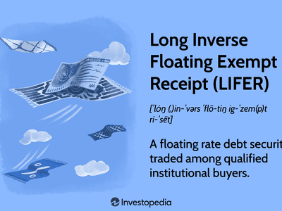

Bond investments provide a reliable option for investors seeking steady and predictable returns over time. Among the various types of bonds, inverse floaters stand out due to their unique mechanism of inversely correlating with interest rate fluctuations. Inverse floaters, a subset of floating-rate bonds, have coupon rates that increase as benchmark interest rates decrease, offering a potential advantage in environments where rates are declining. This distinctive feature makes them attractive for investors looking to capitalize on changes in interest rate dynamics while also adding a layer of diversification to bond portfolios.

As financial markets become increasingly sophisticated, the role of technology in trading strategies has grown exponentially. Algorithmic trading has emerged as a pivotal tool for enhancing investment returns and managing complex bond instruments like inverse floaters. Through advanced computational methods, algorithms can analyze large datasets to identify market inefficiencies and execute trades at optimal times. This approach not only improves precision in managing inverse floaters but also allows for a more responsive adaptation to shifting market conditions.



This article aims to explore the integration of inverse floaters within a bond investment strategy, particularly how algorithmic trading can enhance the management of these bonds. By examining the interaction between these elements, the goal is to present investors with a well-informed strategy that maximizes returns while mitigating risks in a fluctuating interest rate environment.

## Table of Contents

## What Are Inverse Floaters?

Inverse floaters, also known as inverse floating-rate bonds, are specialized debt instruments whose coupon rates move inversely with changes in a specified benchmark interest rate. This unique financial structure allows the coupon payments of inverse floaters to increase when interest rates fall and decrease when interest rates rise. 

The mechanism by which inverse floaters operate is typically tied to a benchmark interest rate, such as the London Interbank Offered Rate (LIBOR) or the U.S. Treasury rate. The coupon rate can be expressed mathematically as:

$$
C = M - (L \times R)
$$

where:
- $C$ is the resulting coupon rate,
- $M$ is a fixed margin,
- $L$ is a leverage factor,
- $R$ is the benchmark interest rate.

This formulation ensures that as the benchmark rate $R$ decreases, the coupon rate $C$ increases, provided the leverage [factor](/wiki/factor-investing) $L$ and margin $M$ are held constant.

Inverse floaters are often issued by both governmental entities and corporations aiming to raise capital while leveraging the potential benefits associated with varying [interest rate](/wiki/interest-rate-trading-strategies) environments. In periods of declining interest rates, these bonds offer investors the opportunity to achieve higher returns due to the increasing coupon payments. Conversely, in rising interest rate environments, the bonds might yield reduced returns, highlighting the importance of market timing and accurate rate forecasts for potential investors.

Governments may utilize inverse floaters to manage debt portfolios effectively, while corporations may use them as part of strategic financing plans, seeking to tailor debt service costs in accordance with expected interest rate movements. Understanding the interest rate dynamics and knowing the implications of the inverse rate structure are critical for participants considering these debt instruments.

## Benefits and Risks of Inverse Floaters

Inverse floaters present unique benefits and risks within the bond market, making them a noteworthy consideration for investors seeking diversification and potential high yields. The primary advantage of inverse floaters lies in their potential to generate elevated returns in a declining interest rate environment. This is due to their coupon rates inversely correlating with a benchmark interest rate; as interest rates fall, the coupon payments on inverse floaters rise. Consequently, they can serve as a valuable diversification tool for bond portfolios, allowing investors to capitalize on particular market conditions that traditional bonds may not directly benefit from.

However, these instruments also [carry](/wiki/carry-trading) significant risks. The most prominent is interest rate risk, stemming from the bond's heightened sensitivity to fluctuations in interest rates. An unexpected increase in interest rates can lead to a decrease in the bond's coupon payments, adversely affecting its yield and potentially its market value. This [volatility](/wiki/volatility-trading-strategies) makes inverse floaters vulnerable to interest rate dynamics, leading to a potential decrease in market value if rates rise unexpectedly.

Furthermore, the volatility inherent in inverse floaters necessitates a thorough assessment of an investor's risk tolerance. Since the value and income stream of these bonds are heavily influenced by interest rate movements, investors must evaluate their capacity to withstand potential fluctuations in bond valuation and income variability. A comprehensive understanding of one's risk appetite is critical to determining whether the potential rewards justify the risks involved in investing in inverse floaters.

In summary, while inverse floaters can offer enticing yields and portfolio diversification in specific interest rate environments, their inherent risks demand careful consideration and strategic alignment with an investor's risk tolerance and market outlook.

## Algorithmic Trading in Bond Markets

Algorithmic trading, a cornerstone of modern financial markets, is increasingly influential in bond markets. It involves using complex algorithms and high-speed computing to execute trades based on predetermined market conditions and strategies. These algorithms can process vast amounts of data to identify trading opportunities that may be missed by human traders, thus optimizing trade execution.

For inverse floaters, which have coupon rates inversely correlated with prevailing interest rates, [algorithmic trading](/wiki/algorithmic-trading) provides a unique advantage. By leveraging historical data and [machine learning](/wiki/machine-learning) models, these algorithms enhance decision-making by forecasting interest rate movements with greater accuracy. This predictive capability is crucial for inverse floaters, as the value and yield of these bonds are highly sensitive to interest rate changes.

Automatic execution is a key feature of algorithmic trading that ensures trades are executed at the precise moment when market conditions align with the pre-programmed strategy. This feature is particularly beneficial in managing inverse floaters, as it allows for rapid adaptation to market fluctuations, minimizing potential losses and enhancing returns. By executing trades in milliseconds, algorithms help investors capture fleeting market inefficiencies, which can be particularly advantageous during volatile periods when interest rates are subject to sudden shifts.

The sophisticated nature of algorithmic trading necessitates the use of advanced computational resources and technologies such as high-frequency trading ([HFT](/wiki/high-frequency-trading-strategies)) platforms, which further enhance the speed and efficiency of executing trades. With algorithmic trading, investors can implement complex trading strategies that consider multiple variables and scenarios, offering a level of precision and responsiveness unattainable with manual trading.

In conclusion, the integration of algorithmic trading into bond markets, especially concerning inverse floaters, allows investors to dynamically manage their portfolios. By leveraging algorithmic precision, investors can optimize their strategies to better anticipate market movements, thereby potentially improving investment outcomes in an increasingly complex financial landscape.

## Strategies for Incorporating Inverse Floaters

Inverse floaters can be strategically incorporated into investment portfolios, especially during periods when benchmark interest rates are high, with an anticipation of future decreases. This strategy focuses on optimizing returns by capitalizing on the unique features of inverse floaters.

### Timing and Rate Expectations

Investors should consider adding inverse floaters to their portfolios when market conditions suggest that interest rates have reached a peak and are likely to decline. In such scenarios, the coupon payments from inverse floaters will increase as rates decrease, potentially resulting in higher yields compared to traditional bonds. By timing the entry into inverse floaters appropriately, investors can maximize the benefits of inverse correlation with interest rates.

### Diversification Benefits

Diversification is essential in managing the risks associated with inverse floaters. A diversified portfolio of bonds with varying interest rate sensitivities can help mitigate potential losses from unexpected interest rate increases or market volatility. By including a mix of traditional bonds and inverse floaters, investors can create a more resilient portfolio that leverages different interest rate paths. This blend helps in reducing overall risk and enhancing stability, contributing to a balanced investment strategy.

### Algorithmic Trading Integration

The integration of algorithmic trading with inverse floater management can provide significant advantages. Algorithms can process vast amounts of market data to identify trends and anticipate interest rate movements with greater accuracy than traditional methods. By automating trade execution, these algorithms ensure timely responses to market changes, optimizing the entry and [exit](/wiki/exit-strategy) points for inverse floaters.

Python, a preferred language for developing trading algorithms, can be employed to fine-tune strategies for inverse floaters. Here's a basic example of how one might set up an algorithm to monitor and act upon interest rate movements:

```python
import numpy as np
import pandas as pd
from sklearn.linear_model import LinearRegression

# Sample interest rate data
interest_rate_data = pd.read_csv('interest_rates.csv')

# Feature: previous interest rate movement
interest_rate_data['Movement'] = interest_rate_data['Rate'].diff()

# Prepare the dataset
X = interest_rate_data['Movement'].values[:-1].reshape(-1, 1)
y = interest_rate_data['Rate'].values[1

## Market Considerations and Trends

Inverse floaters operate within a dynamic financial environment characterized by fluctuating global economic policies and shifting interest rate projections. Current market trends play a pivotal role in determining the attractiveness of these debt instruments. In recent years, economic uncertainty fueled by geopolitical tensions, trade policies, and evolving monetary frameworks has significantly impacted interest rate stability. Central banks around the world, including the Federal Reserve in the United States and the European Central Bank, frequently adjust interest rate policies in response to inflationary pressures and economic growth targets. This volatility in interest rate policy can directly affect the expected performance of inverse floaters.

As interest rates are integral to the valuation of bonds, understanding how markets interpret and react to economic indicators is fundamental to managing inverse floater investments. Key indicators, such as inflation rates, employment figures, and GDP growth, provide insights into potential central bank actions regarding interest rates. For instance, an unexpected rise in inflation might lead the Federal Reserve to increase interest rates to cool down the economy, affecting the coupon payments of inverse floaters inversely.

To navigate this complex investment landscape, investors must stay informed by following financial news, market forecasts, and economic analyses. Access to timely information can aid in anticipating market reactions and adjusting bond trading strategies accordingly. Investors might employ tools such as interest rate models to simulate the impact of economic scenarios on bond portfolios. Python libraries such as NumPy and pandas can be used to perform statistical analyses and forecast interest rate trends, enhancing the decision-making process in managing inverse floaters.

Staying updated with global economic trends and forecasts not only aids in understanding potential risks but also uncovers opportunities to optimize investment strategies. This proactive approach can maximize the advantages afforded by inverse floaters, making them a viable component of a diversified bond portfolio in the face of economic uncertainty.

## Conclusion

Inverse floaters present a compelling option for investors seeking to capitalize on specific market conditions within the bond sector. These instruments can provide substantial returns when the market environment aligns, particularly when interest rates are expected to decline. The inverse relationship between the coupon payments and interest rates means that as interest rates fall, the value and yield of these bonds can increase, offering significant advantages compared to fixed or traditional floating-rate bonds.

Nevertheless, investing in inverse floaters comes with inherent risks. Their performance is highly sensitive to interest rate fluctuations, making a thorough understanding of market dynamics and forward-looking interest rate projections essential. The potential for decreased market value and increased volatility necessitates careful strategic planning and an alignment with the investor's overall risk tolerance and investment goals.

Algorithmic trading enhances the management of inverse floaters by providing precise and rapid responses to market changes. Algorithms can be structured to predict interest rate movements and execute trades automatically, thereby optimizing decision-making and potentially improving returns. By using advanced data analytics and machine learning, algorithms can identify inefficiencies and opportunities in the bond market with greater accuracy.

In conclusion, while inverse floaters can offer high rewards, their integration into a portfolio should be approached with caution. Leveraging algorithmic trading can empower investors to navigate these complex instruments with greater precision, supporting effective management of interest rate dynamics and enhancing overall investment strategies.

## References & Further Reading

[1]: Bergstra, J., Bardenet, R., Bengio, Y., & Kégl, B. (2011). ["Algorithms for Hyper-Parameter Optimization."](https://dl.acm.org/doi/10.5555/2986459.2986743) Advances in Neural Information Processing Systems 24.

[2]: ["Advances in Financial Machine Learning"](https://www.amazon.com/Advances-Financial-Machine-Learning-Marcos/dp/1119482089) by Marcos Lopez de Prado

[3]: ["Evidence-Based Technical Analysis: Applying the Scientific Method and Statistical Inference to Trading Signals"](https://www.amazon.com/Evidence-Based-Technical-Analysis-Scientific-Statistical/dp/0470008741) by David Aronson

[4]: ["Machine Learning for Algorithmic Trading"](https://github.com/stefan-jansen/machine-learning-for-trading) by Stefan Jansen

[5]: ["Quantitative Trading: How to Build Your Own Algorithmic Trading Business"](https://www.amazon.com/Quantitative-Trading-Build-Algorithmic-Business/dp/1119800064) by Ernest P. Chan