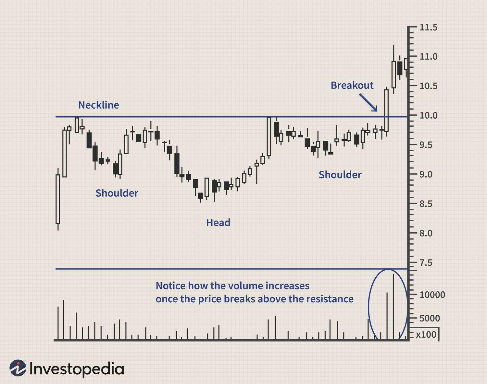

## Table of Contents

## What is the Inverse Head and Shoulders pattern?

The Inverse Head and Shoulders pattern is a chart pattern used in technical analysis to predict a bullish reversal in the price of a stock or other financial asset. It looks like an upside-down version of a person's head and shoulders. The pattern forms after a downtrend and signals that the price might start going up. It has three parts: two smaller troughs (the shoulders) and a deeper trough in the middle (the head). The pattern is confirmed when the price breaks above a resistance line, called the neckline, that connects the highs of the two shoulders.

When traders see this pattern, they often get ready to buy the stock because they think the price will go up. The pattern is considered complete when the price moves above the neckline. After breaking the neckline, traders expect the price to rise by about the same distance as the height of the pattern from the head to the neckline. This pattern is popular among traders because it can help them spot good times to buy stocks that might be about to increase in value.

## How does the Inverse Head and Shoulders pattern form?

The Inverse Head and Shoulders pattern starts forming when a stock or another financial asset has been going down for a while. During this downtrend, the price will drop to a low point, then rise a bit, and then drop again. This first low point is the left shoulder of the pattern. After the left shoulder, the price falls even lower to form the head, which is the lowest point of the pattern. Then, the price rises again before falling one more time, but not as low as the head. This last low point is the right shoulder. 

As the pattern develops, a line called the neckline is drawn to connect the high points between the left shoulder and the head, and between the head and the right shoulder. The neckline acts like a ceiling that the price has trouble breaking through. When the price finally breaks above this neckline, it's a signal that the downtrend might be over and that the price could start going up. Traders watch for this [breakout](/wiki/breakout-trading) because it tells them it might be a good time to buy the stock.

## What are the key components of an Inverse Head and Shoulders pattern?

The Inverse Head and Shoulders pattern has three main parts: the left shoulder, the head, and the right shoulder. The left shoulder is the first low point that forms after a downtrend. After the left shoulder, the price drops even lower to create the head, which is the lowest point of the pattern. Then, the price rises a bit before falling again to form the right shoulder, which is not as low as the head.

The neckline is another important part of this pattern. It is a line that connects the high points between the left shoulder and the head, and between the head and the right shoulder. The neckline acts like a barrier that the price has trouble breaking through. When the price finally breaks above the neckline, it's a sign that the downtrend might be ending and that the price could start going up. This breakout is what traders look for to decide when to buy the stock.

## How can you identify an Inverse Head and Shoulders pattern on a chart?

To identify an Inverse Head and Shoulders pattern on a chart, first look for a stock that has been going down for a while. During this downtrend, the price will drop to a low point, then rise a bit, and then drop again. This first low point is the left shoulder. After the left shoulder, the price falls even lower to form the head, which is the lowest point of the pattern. Then, the price rises again before falling one more time, but not as low as the head. This last low point is the right shoulder.

Next, draw a line called the neckline that connects the high points between the left shoulder and the head, and between the head and the right shoulder. The neckline is like a ceiling that the price has trouble breaking through. When the price finally breaks above this neckline, it's a signal that the downtrend might be over and that the price could start going up. Traders watch for this breakout because it tells them it might be a good time to buy the stock. By looking for these three parts—the left shoulder, the head, and the right shoulder—and the neckline, you can spot an Inverse Head and Shoulders pattern on a chart.

## What does the Inverse Head and Shoulders pattern indicate about market trends?

The Inverse Head and Shoulders pattern tells us that a stock or other financial asset might be about to change from going down to going up. This pattern shows up after a time when the price has been falling. It has three parts: the left shoulder, the head, and the right shoulder. The left shoulder is the first low point, the head is the lowest point, and the right shoulder is another low point that's not as low as the head. When you see this pattern, it means the price might stop going down and start going up instead.

The key thing to watch for in this pattern is the neckline. The neckline is a line that connects the high points between the left shoulder and the head, and between the head and the right shoulder. When the price breaks above this neckline, it's a strong sign that the trend is changing. Traders look for this breakout because it tells them it might be a good time to buy the stock. So, the Inverse Head and Shoulders pattern is a helpful sign that the market might be turning from a downtrend to an uptrend.

## How reliable is the Inverse Head and Shoulders pattern as a trading signal?

The Inverse Head and Shoulders pattern is seen by many traders as a good sign that a stock might start going up after going down for a while. It's not perfect, but a lot of people trust it because it has a clear shape and a specific point where you can see the trend change. When the price breaks above the neckline, which is the line between the shoulders and the head, it's a strong hint that the stock might keep going up. Studies show that this pattern can be right about 70% to 80% of the time, which is pretty good for trading signals.

But, like all patterns, it's not always right. Sometimes the price might go up a little after breaking the neckline but then start going down again. This can happen because of many things like news about the company, changes in the economy, or just the way the market feels that day. So, it's smart for traders to use the Inverse Head and Shoulders pattern along with other signs and tools to make better choices. By looking at more than just one pattern, traders can feel more sure about when to buy or sell a stock.

## What are the entry points for trading based on the Inverse Head and Shoulders pattern?

The main entry point for trading based on the Inverse Head and Shoulders pattern is when the price breaks above the neckline. The neckline is the line that connects the high points between the left shoulder and the head, and between the head and the right shoulder. When the price goes above this line, it's a strong sign that the stock might start going up. This is when traders often decide to buy the stock because they think the price will keep going up.

Some traders might also choose to enter the trade a bit earlier, right when the price starts to go up from the right shoulder. This can be riskier because the pattern isn't fully confirmed yet, but it might give them a chance to buy at a lower price. It's important for traders to be careful and maybe use other signs or tools to help them decide when to buy. By waiting for the price to break the neckline, they can feel more sure that the stock is really starting to go up.

## What risk management strategies should be used when trading the Inverse Head and Shoulders pattern?

When trading the Inverse Head and Shoulders pattern, one important risk management strategy is to set a stop-loss order. A stop-loss order is like a safety net that tells your broker to sell the stock if the price drops to a certain level. You can place the stop-loss just below the right shoulder or the head of the pattern. This way, if the price goes down instead of up like you expected, you won't lose too much money. It's a good idea to decide where to put your stop-loss before you even buy the stock, so you know your risk from the start.

Another strategy is to not put all your money into one trade. Instead of using all your money on one stock, you can split it up and trade several different stocks or patterns. This is called diversification, and it can help you not lose everything if one trade doesn't go well. Also, it's smart to only trade with money you can afford to lose. Don't use money you need for important things like bills or food. By being careful and using these strategies, you can manage your risks better when trading the Inverse Head and Shoulders pattern.

## How does volume play a role in confirming the Inverse Head and Shoulders pattern?

Volume is really important when you're looking at the Inverse Head and Shoulders pattern. It helps you know if the pattern is strong or not. When the price is making the left shoulder, head, and right shoulder, you usually want to see less [volume](/wiki/volume-trading-strategy). That means fewer people are trading, and the price is going down without much energy. But when the price starts to go up from the right shoulder and breaks above the neckline, you want to see a lot more volume. More volume means more people are buying the stock, and that's a good sign that the price might keep going up.

So, when you see the volume get bigger as the price breaks the neckline, it's a good hint that the pattern is working. If the volume stays low when the price breaks the neckline, the pattern might not be as strong, and the price might not go up as much as you hope. By watching the volume, you can feel more sure about when to buy the stock and if the Inverse Head and Shoulders pattern is a good sign to follow.

## Can the Inverse Head and Shoulders pattern be used in different time frames, and how does this affect its reliability?

The Inverse Head and Shoulders pattern can be used on different time frames, like daily, weekly, or even hourly charts. It works the same way no matter what time frame you use. You look for the left shoulder, the head, and the right shoulder, and then watch for the price to break above the neckline. But the time frame you choose can change how reliable the pattern is. On longer time frames, like weekly charts, the pattern might be more reliable because it takes more time to form and more people see it. On shorter time frames, like hourly charts, the pattern might be less reliable because the price can change quickly and the pattern might not last as long.

Using the Inverse Head and Shoulders pattern on different time frames can help you in different ways. If you're a long-term investor, looking at the pattern on a weekly chart can give you a good idea of where the stock might go over a longer period. But if you're a day trader, looking at the pattern on an hourly chart can help you make quick trades and take advantage of short-term price changes. No matter what time frame you use, it's always a good idea to check the pattern with other signs and tools to make sure you're making the best choice for your trading.

## What are common mistakes traders make when trading the Inverse Head and Shoulders pattern?

One common mistake traders make when trading the Inverse Head and Shoulders pattern is not waiting for the price to break above the neckline before buying the stock. They might get excited and buy the stock too early, right when the price starts to go up from the right shoulder. This can be risky because the pattern isn't confirmed yet, and the price might go back down. It's better to wait for the price to break the neckline because that's a stronger sign that the stock will keep going up.

Another mistake is not using a stop-loss order. A stop-loss order helps you limit your losses if the trade doesn't go as planned. Some traders forget to set a stop-loss, or they put it too far away from the current price. If the price drops a lot, they can lose more money than they planned. It's smart to decide where to put your stop-loss before you buy the stock, maybe just below the right shoulder or the head of the pattern. This way, you know your risk from the start and can protect your money.

## How can the Inverse Head and Shoulders pattern be integrated into a broader trading strategy?

The Inverse Head and Shoulders pattern can be a great part of a bigger trading plan. When you see this pattern, it's a good sign that a stock might start going up after going down for a while. But it's smart to use this pattern along with other tools and signs to make better choices. For example, you can look at things like moving averages, which show the average price of a stock over time, or the Relative Strength Index (RSI), which tells you if a stock is overbought or oversold. By checking these other signs, you can feel more sure about when to buy the stock and if the pattern is really working.

Also, it's important to think about how much money you're willing to risk and how long you want to hold the stock. You can use the Inverse Head and Shoulders pattern to decide when to buy, but then use other parts of your plan to decide when to sell. For example, you might set a target price to sell the stock when it goes up by a certain amount, or you might use a trailing stop-loss order that moves up as the price goes up. This way, you can make money if the price keeps going up, but you can also protect your money if the price starts to go down. By putting the Inverse Head and Shoulders pattern into a bigger plan, you can trade smarter and with less risk.

## What is Trading with the Inverse Head and Shoulders Pattern?

Trading with the inverse head and shoulders pattern involves strategic actions starting from the identification of the pattern on price charts. The process commences when traders observe the three distinct troughs in a downtrend, with the central trough - the head - being the lowest. The pattern gains validity upon a successful neckline breakout, signifying a potential shift from bearish to bullish market conditions.

Upon confirming the pattern with a neckline breakout, traders commonly enter long positions. The decision to buy is rooted in the expectation that the breakout marks the commencement of an upward trend. Accurate identification of the breakout is critical and often determined by a closure above the neckline, with increased trading volume acting as a confirming [factor](/wiki/factor-investing).

Risk management practices are crucial in trading this pattern. A strategically placed stop-loss order is recommended to mitigate potential losses if the market moves unfavorably. Typically, traders set stop-loss orders marginally below the right shoulder of the pattern. This positioning protects against false breakouts and abrupt reversals while allowing room for natural market fluctuations.

Profit targets are traditionally calculated by measuring the vertical distance from the neckline to the head of the pattern. This distance is then projected upwards from the point of breakout, providing a logical price target. Mathematically, this can be expressed as:

$$
\text{Profit Target} = \text{Breakout Price} + (\text{Neckline Price} - \text{Head Price})
$$

For practical implementation, these principles may be coded into a trading algorithm as illustrated in the following Python snippet:

```python
def determine_trade(prices, neckline, head):
    breakout_price = prices[-1]
    vertical_distance = neckline - head
    profit_target = breakout_price + vertical_distance

    if breakout_price > neckline:
        return {'action': 'buy', 'stop_loss': head, 'profit_target': profit_target}
    else:
        return {'action': 'hold'}

# Example values
prices = [102, 101, 103]  # Example price data; most recent price is 103
neckline = 105
head = 95

trade_decision = determine_trade(prices, neckline, head)
print(trade_decision)
```

This approach ensures a systematic entry and [exit](/wiki/exit-strategy) strategy, reducing subjective decision-making errors and enhancing trade execution precision. As with all trading strategies, constant evaluation and adjustment based on market dynamics are imperative for sustained success.

## References & Further Reading

[1]: Bulkowski, T. (2005). ["Encyclopedia of Chart Patterns."](https://books.google.com/books/about/Encyclopedia_of_Chart_Patterns.html?id=tIwlEAAAQBAJ) Wiley.

[2]: Edwards, R. D., Magee, J., & Bassetti, W. C. (2007). ["Technical Analysis of Stock Trends."](https://www.taylorfrancis.com/books/mono/10.4324/9781315115719/technical-analysis-stock-trends-bassetti-robert-edwards-john-magee) CRC Press.

[3]: Pring, M. J. (2002). ["Technical Analysis Explained."](https://www.amazon.com/Technical-Analysis-Explained-Fifth-Successful/dp/0071825177) McGraw-Hill Education.

[4]: Lo, A.W., & MacKinlay, A.C. (1999). ["A Non-Random Walk Down Wall Street."](https://www.jstor.org/stable/j.ctt7tccx) Princeton University Press.

[5]: Murphy, J. J. (1999). ["Technical Analysis of the Financial Markets."](https://drive.google.com/file/d/1OcDrGakDhaejT7J7xGEE3HHKy7xmrafy/preview) New York Institute of Finance.