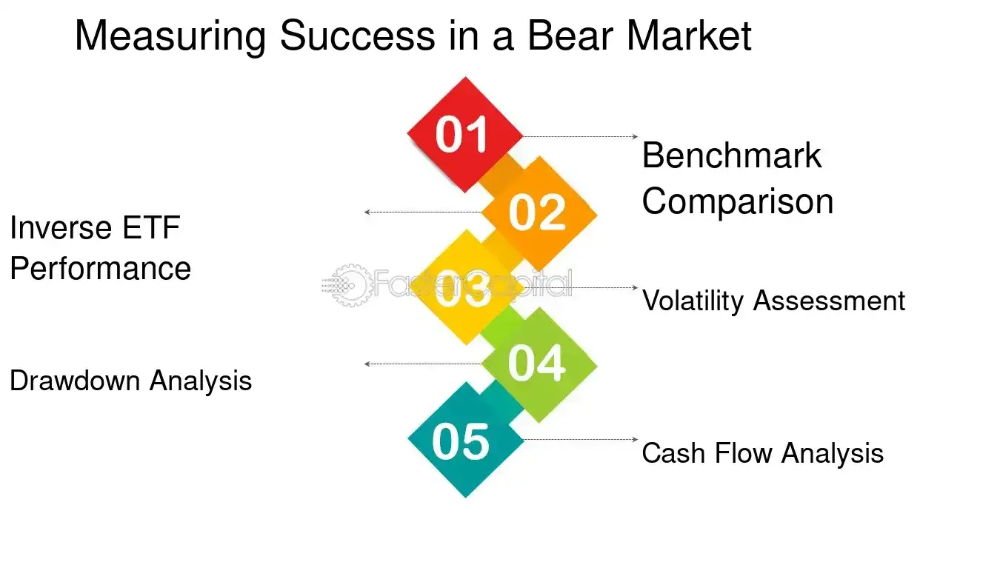

## Table of Contents

## What is an inverse index ETF?

An inverse index ETF is a type of exchange-traded fund that aims to give investors returns that are the opposite of the performance of a specific index, like the S&P 500. If the index goes down by 1%, the inverse ETF should go up by 1%. This can be useful for investors who want to make money when the market is falling or want to protect their investments from market downturns.

These ETFs use financial tools like derivatives to achieve their goals. They are often used for short-term trading because their performance can be affected by daily resets. This means that over longer periods, the returns might not exactly match the opposite of the index's performance. It's important for investors to understand these risks before investing in inverse ETFs.

## How do inverse index ETFs work?

Inverse index ETFs work by using financial tools like derivatives to bet against a specific index, like the S&P 500. When the index goes down, the ETF goes up. This is done by the fund managers who use things like futures contracts and swaps to make the ETF move in the opposite direction of the index. So, if the index drops by 1%, the inverse ETF should rise by about 1%.

These ETFs are often used for short-term trading because they reset their positions daily. This means that over longer periods, the returns might not perfectly match the opposite of the index's performance. For example, if the index goes up and down a lot in a week, the inverse [ETF](/wiki/etf-trading-strategies) might not end up exactly where you'd expect. This can make them tricky to use for long-term investing, so it's important to understand these risks before you start using them.

## What is a bear market and how does it affect investments?

A bear market is when the prices of stocks and other investments go down a lot, usually by 20% or more, and stay down for a while. It's called a bear market because it's like a bear swiping down with its paw. When this happens, people often feel worried about their money and might start selling their investments, which can make prices go down even more.

In a bear market, your investments can lose value. If you have stocks or funds that follow the market, they will likely go down in value too. But it's not all bad news. Some people see bear markets as a chance to buy investments at lower prices, hoping they will go up again when the market gets better. It's important to have a plan and not make quick decisions based on fear.

## Why would an investor use inverse index ETFs during a bear market?

An investor might use inverse index ETFs during a bear market to make money when the market is going down. Instead of losing money as stock prices fall, an inverse ETF goes up in value when the market drops. This can help investors earn profits during tough times when most other investments are losing value.

Inverse ETFs can also be used to protect other investments. If an investor thinks the market will go down, they can buy an inverse ETF to balance out the losses from their other investments. This way, even if their stocks go down, the gains from the inverse ETF can help reduce the overall impact on their portfolio.

## What are the risks associated with investing in inverse index ETFs?

Investing in inverse index ETFs can be risky. One big risk is that these ETFs are meant for short-term trading. They reset their positions every day, which means their performance over longer periods might not match the opposite of the index's performance. If the market goes up and down a lot, the ETF might not end up where you expect, and you could lose money.

Another risk is that inverse ETFs use complex financial tools like derivatives. These can be hard to understand and can add extra risk. If the market moves in unexpected ways, these tools might not work as planned, and the ETF could lose value quickly. It's important for investors to know these risks and be ready for big changes in the value of their investment.

Lastly, using inverse ETFs to protect other investments can be tricky. If you're wrong about the market going down, you could lose money on both your regular investments and the inverse ETF. It's not a sure way to make money or protect your portfolio, so it's important to think carefully before using them.

## How can inverse index ETFs be used as part of a broader investment strategy?

Inverse index ETFs can be a useful tool in a broader investment strategy, especially for investors who want to make money when the market goes down. They can be used to balance out losses from other investments during a bear market. For example, if an investor thinks the market will drop, they can buy an inverse ETF to earn profits while their other investments might be losing value. This way, the gains from the inverse ETF can help reduce the overall impact on their portfolio.

However, using inverse ETFs as part of a broader strategy requires careful planning. They are best used for short-term trading because their performance can be affected by daily resets. Over longer periods, the returns might not match the opposite of the index's performance exactly. Investors need to understand these risks and be ready for big changes in the value of their investment. It's important to use inverse ETFs wisely and not rely on them as the only way to protect or grow a portfolio.

## What are the key differences between inverse ETFs and traditional ETFs?

Inverse ETFs and traditional ETFs work differently. Traditional ETFs try to match the performance of an index, like the S&P 500. If the index goes up by 1%, the traditional ETF should also go up by about 1%. They are used to invest in the market and grow money over time. On the other hand, inverse ETFs aim to give returns that are the opposite of the index's performance. If the index goes down by 1%, the inverse ETF should go up by about 1%. They are used to make money when the market is falling or to protect other investments during a bear market.

Another big difference is how they work. Traditional ETFs usually hold the same stocks or assets as the index they follow. They are simple and easy to understand. Inverse ETFs use complex financial tools like derivatives to bet against the index. This makes them riskier and harder to understand. They also reset their positions every day, which means their performance over longer periods might not match the opposite of the index's performance exactly. This makes them better for short-term trading rather than long-term investing.

## How do leverage and daily rebalancing impact the performance of inverse index ETFs?

Leverage and daily rebalancing can really change how inverse index ETFs work. Leverage means that the ETF uses borrowed money to try to make bigger gains or losses. If an ETF is 2x leveraged, it tries to give you twice the opposite of the index's daily performance. So, if the index goes down by 1%, the ETF should go up by 2%. But leverage also makes the ETF riskier because it can lose money faster if the market goes the wrong way.

Daily rebalancing means that the ETF resets its position every day to make sure it keeps tracking the opposite of the index's daily performance. This can cause problems over time because the ETF's returns might not match the opposite of the index's performance over longer periods. If the market goes up and down a lot, the ETF might end up in a different place than you expect. So, it's important to know that inverse ETFs are better for short-term trading and not for holding onto for a long time.

## Can you provide examples of successful uses of inverse index ETFs in past bear markets?

During the 2008 financial crisis, many investors used inverse index ETFs to make money when the market was falling. For example, the S&P 500 dropped a lot during this time. Investors who bought inverse ETFs that tracked the S&P 500 saw their investments go up as the market went down. This helped them earn profits during a tough time when most other investments were losing value. It was a smart move for those who predicted the market would crash.

Another example is during the early months of the COVID-19 pandemic in 2020. When the stock market crashed in March, inverse ETFs like the ProShares Short S&P500 (SH) did really well. Investors who bought this ETF before the crash saw their investments grow as the market fell. These ETFs helped them make money during a scary time when many people were worried about their investments losing value. It showed how inverse ETFs can be a useful tool during bear markets if used at the right time.

## What are the tax implications of trading inverse index ETFs?

Trading inverse index ETFs can have some special tax rules. When you buy and sell these ETFs, you might have to pay capital gains tax. If you hold the ETF for less than a year, any profit you make is taxed as short-term capital gains, which are usually taxed at your regular income tax rate. But if you hold it for more than a year, the profit is taxed as long-term capital gains, which often have a lower tax rate. So, how long you keep the ETF can change how much tax you pay.

Inverse ETFs also use something called derivatives, like futures contracts, to work. These can make things a bit tricky for taxes. Sometimes, the income from these derivatives can be taxed differently than regular stock gains. It's important to keep good records of all your trades and maybe talk to a tax advisor to make sure you're doing everything right. They can help you understand the tax rules and make sure you're not paying more than you need to.

## How should an investor monitor and adjust their positions in inverse index ETFs?

An investor should keep a close eye on the market and their inverse index ETFs every day. These ETFs are meant for short-term trading, so it's important to check how they're doing often. Look at the news and any changes in the market that might affect the index the ETF is betting against. If the market starts to go up instead of down, you might need to sell your inverse ETF to avoid losing money. It's also a good idea to set clear goals for how much you want to make or lose, and stick to them.

Adjusting your positions in inverse index ETFs can help you manage risk. If the market moves a lot, you might want to buy or sell more of the ETF to balance out your other investments. But remember, these ETFs can be tricky because they reset every day. So, if you're holding onto them for a long time, their performance might not match what you expect. It's best to use them for short periods and be ready to change your strategy if the market doesn't go the way you thought it would.

## What advanced strategies can be employed with inverse index ETFs for expert investors?

Expert investors can use inverse index ETFs in a strategy called hedging. This means they buy inverse ETFs to protect their other investments from going down. For example, if they think the market will drop but they don't want to sell their stocks, they can buy an inverse ETF. This way, if the market does go down, the gains from the inverse ETF can help cover the losses from their stocks. It's like having an insurance policy for their portfolio. But it's tricky because if the market goes up instead, they could lose money on both their stocks and the inverse ETF.

Another strategy is called pairs trading. This is when an investor buys an inverse ETF and a regular ETF that track the same index at the same time. They do this when they think the market will be volatile, meaning it will go up and down a lot. The idea is that the gains from one ETF will balance out the losses from the other. This can help them make money no matter which way the market moves. But it's important to watch the market closely and be ready to change their strategy if things don't go as planned.

## References & Further Reading

[1]: ["Inverse ETFs: The Risks of Going Short in Volatile Markets"](https://www.investopedia.com/articles/investing/092815/risks-investing-inverse-etfs.asp) by Investopedia

[2]: Lhabitant, F. S. (2004). ["Hedge Funds: Quantitative Insights."](https://www.wiley.com/en-us/Hedge+Funds%3A+Quantitative+Insights-p-9780470687772) John Wiley & Sons.

[3]: ["Exchange-Traded Funds: A Comprehensive Guide to ETFs"](https://www.amazon.com/Comprehensive-Guide-Exchange-Traded-Funds-ETFs/dp/1934667854) by David Stevenson

[4]: Fabozzi, F. J., Focardi, S. M., & Rachev, S. T. (2007). ["Robust Portfolio Optimization and Management."](https://onlinelibrary.wiley.com/doi/book/10.1002/9781118856406) Wiley Finance.

[5]: ["Modern Portfolio Theory and Investment Analysis"](https://books.google.com/books/about/Modern_Portfolio_Theory_and_Investment_A.html?id=181CEAAAQBAJ) by Edwin J. Elton, Martin J. Gruber, Stephen J. Brown, and William N. Goetzmann