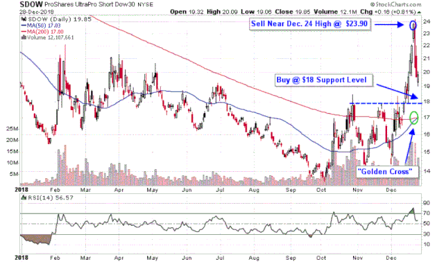

In challenging economic climates, particularly during bear markets, investors often seek strategies to protect and potentially enhance their portfolios. Inverse Exchange-Traded Funds (ETFs) and Index ETFs provide a tactical approach to leverage market downturns by moving in the opposite direction of their respective indices. These financial instruments enable investors to profit from declining market conditions by utilizing sophisticated derivatives strategies.

Inverse ETFs, in particular, are designed to yield returns that inverse the performance of a specific market index. By using financial derivatives, these ETFs facilitate a hedge against downward market trends. This feature is especially beneficial for short-term traders aiming to capitalize on periodic market declines without engaging in the complexities of short selling.



In this context, the use of algorithmic trading strategies becomes crucial. Algorithmic trading entails using computer algorithms to execute trading orders at optimal conditions, enhancing efficiency and precision in the trading process. These strategies systematically manage trades, taking into account variables such as market volatility, trading volume, and timing to optimize returns. By leveraging algorithms, traders can automate the rapid execution of trades, thereby reducing human error and emotion-driven decisions.

This article examines the multiple aspects of inverse and index ETFs, offering insights into effective strategies for managing portfolios during bear markets. Furthermore, it explores the intersection of these financial instruments with algorithmic trading, emphasizing their role in efficiently navigating complex market dynamics.

## Table of Contents

## Understanding Inverse ETFs

Inverse Exchange-Traded Funds (ETFs) are financial instruments designed to provide returns that are inversely proportional to the performance of a particular index or benchmark. Essentially, when the tracked index declines, the value of an inverse ETF increases proportionally. This characteristic makes inverse ETFs particularly attractive during bear markets, as they offer investors a means to profit from declining market conditions or to hedge their existing portfolios against potential losses.

Inverse ETFs achieve their inverse tracking through the use of financial derivatives, such as futures contracts and swaps. These derivatives are engineered to mirror the inverse performance of the target index on a day-to-day basis. This daily reset feature means that the calculations involved in inverse ETFs are recalibrated at the end of each trading day, ensuring that the price movements of the ETFs align inversely with their respective indices for that specific day.

The daily reset characteristic presents a unique dynamic. While it is effective for short-term trading, allowing investors to capitalize on daily market fluctuations, it introduces complexities for long-term holders due to the compounding effects over multiple days. When held for an extended period, inverse ETFs may not accurately reflect the cumulative inverse performance of the index due to path dependency. This is especially prevalent during volatile market conditions where frequent and significant daily movements can lead to discrepancies between expected and actual returns over time.

From a mathematical perspective, the performance of an inverse [ETF](/wiki/etf-trading-strategies) over a period longer than one day can be expressed in terms of geometric compounding. The relationship between daily returns and cumulative returns can result in significant variances, particularly when market [volatility](/wiki/volatility-trading-strategies) is high. For example, if an index loses 1% on one day and gains 1% the next, the cumulative return is not zero due to the effects of compounding, demonstrating how inverse ETFs can deviate from expected outcomes over time.

Due to these complexities, it is crucial for investors to carefully consider their investment strategies when utilizing inverse ETFs, focusing particularly on the intended investment horizon. Short-term traders can effectively leverage these instruments to hedge risk or capitalize on anticipated market declines, while long-term investors should remain cognizant of the potential for tracking errors and deviated returns.

## Leveraged Inverse ETFs: Pros and Cons

Leveraged inverse ETFs are financial instruments engineered to amplify the inverse returns of a particular index. By utilizing financial derivatives and debt, these ETFs magnify both potential returns and associated risks, primarily serving short-term traders who anticipate downward movements in market indices.

**Pros of Leveraged Inverse ETFs**

1. **Amplified Returns**: A key advantage of leveraged inverse ETFs is their ability to amplify returns. If the benchmark index drops by 1%, a 2x leveraged inverse ETF might aim for a 2% gain. This characteristic is particularly attractive to investors seeking heightened profits from market downturns without the direct use of derivatives or short-selling strategies.

2. **Liquidity**: These ETFs typically provide ample liquidity, allowing investors to enter and exit positions quickly without significant price disruptions. Liquidity is crucial in fast-moving markets where price swings can be sharp and sudden.

**Cons of Leveraged Inverse ETFs**

1. **Volatility Decay**: A significant downside is volatility decay. Leveraged ETFs reset their exposure daily, which can lead to "beta slippage" or the erosion of returns over time, especially in volatile markets. This decay occurs because the daily compounding effect can diverge from the intended multiple of the index's long-term returns, often resulting in lower returns than anticipated.

2. **Cost**: The expense ratios for leveraged inverse ETFs are generally higher than those of non-leveraged ETFs. These costs can erode profits, particularly when holding these instruments for an extended period.

3. **Leverage Risks**: The use of leverage increases exposure to risk, meaning any miscalculation in market direction can lead to substantial losses. The amplified nature of returns also applies to losses — a concept that requires careful consideration in risk management.

Given these pros and cons, investors are advised to exercise caution when trading leveraged inverse ETFs. These instruments are designed for short-term hedging rather than long-term holding. The potential for rapid loss, compounded by fees and volatility decay, makes them unsuitable for all but the most informed and risk-tolerant investors. Regular portfolio reviews and dynamic risk management strategies are essential when engaging with these complex financial products.

## Market Trends and Their Impact

Effective trading with inverse ETFs necessitates a comprehensive understanding of market trends and economic indicators. These financial instruments, which are designed to deliver inverse returns relative to a particular index, are highly sensitive to broad economic factors such as interest rates and geopolitical developments. Changes in these areas can significantly impact market sentiment, thereby affecting the performance of inverse ETFs.

Interest rates are a critical economic [factor](/wiki/factor-investing) influencing market dynamics. When central banks adjust interest rates, it can lead to shifts in investor behavior and overall market trends. For instance, rising interest rates often signal a tightening monetary policy, which might lead to declining stock prices as borrowing costs increase. In such scenarios, inverse ETFs could potentially benefit as their value tends to rise when the underlying index they track declines.

Geopolitical events are equally impactful as they can introduce uncertainty and increase market volatility. Events such as trade disputes, political instability, or military conflicts can lead to abrupt changes in market expectations and investor sentiment. Inverse ETFs, which are positioned to profit from market downturns, may be particularly advantageous in such volatile environments, offering a hedge against sharp declines in market indices.

To effectively utilize inverse ETFs, traders often rely on technical analysis tools to identify opportune moments for market entry and [exit](/wiki/exit-strategy). Moving averages, for example, are commonly used to smooth out price data to identify trends. A simple moving average (SMA) is calculated by adding closing prices over a specific period and dividing by the number of periods. A commonly used SMA is the 50-day or 200-day moving average, which helps traders confirm current trends and signals potential reversals. 

Momentum indicators are another valuable tool, measuring the rate of change in prices. They help traders gauge the strength of a trend, with widely used indicators including the Relative Strength Index (RSI) and Moving Average Convergence Divergence (MACD). The RSI, for instance, provides a numerical value between 0 and 100 to indicate overbought or oversold conditions, aiding traders in making data-driven decisions about holding or selling positions in inverse ETFs.

Here is a simple Python example demonstrating how to compute a moving average:

```python
import numpy as np

def moving_average(prices, window_size):
    weights = np.repeat(1.0, window_size) / window_size
    sma = np.convolve(prices, weights, 'valid')
    return sma

prices = [22, 23, 20, 21, 19, 17, 18, 20, 25, 22]
window_size = 3
sma = moving_average(prices, window_size)
print(sma)
```

This careful analysis of economic indicators and the application of technical analysis tools are integral for trading inverse ETFs effectively, allowing traders to align their strategies with prevailing market conditions and optimize their portfolio performance.

## Selecting the Right Inverse ETF for Your Strategy

When selecting an inverse ETF to fit your investment strategy, several critical factors must be taken into account to optimize outcomes and mitigate risks. 

Firstly, the underlying index of an inverse ETF is a primary consideration, as it determines the specific market or sector exposure you will be hedging against. Different indices have varying levels of volatility and may respond differently to economic conditions. Choosing an ETF with an underlying index that aligns with your predictions for the market is essential.

Fee structures also play a significant role in the cost-effectiveness of an inverse ETF. These fees can include the expense ratio, brokerage commissions, and potential tax implications. A lower expense ratio can contribute to greater net returns over time, particularly for investors who utilize these instruments frequently in their trading strategies.

Liquidity is another important aspect to consider. High [liquidity](/wiki/liquidity-risk-premium) in an inverse ETF ensures that investors can enter and exit positions with minimal price impact, which is vital in fast-moving markets. ETFs with larger trade volumes tend to offer better liquidity and tighter bid-ask spreads, reducing transaction costs.

Volatility is inherent in inverse ETFs, given their leverage and the fact that they move inversely to the market trends. Therefore, understanding the volatility of a specific inverse ETF is crucial. Some strategies might benefit from higher volatility, while risk-averse investors might prefer less volatile options.

Historical performance can provide insights into how an inverse ETF has behaved under various market conditions. This retrospective analysis can highlight consistency, responsiveness to market downturns, and any recurring tracking errors that could affect future performance.

Ultimately, the selection of an inverse ETF should align with your broader market outlook and risk tolerance. This alignment ensures that your investment strategy is both mindful of potential risks and positioned to capitalize on market opportunities. Evaluating these factors thoroughly will enhance the cost-effectiveness and performance potential of your chosen inverse ETF.

## Portfolio Diversification with Inverse ETFs

Inverse ETFs can play a pivotal role in portfolio diversification, particularly during bearish market conditions by potentially offsetting losses from long positions. This characteristic makes them an attractive tool for investors aiming to maintain a balanced portfolio amidst market volatility.

### Allocation and Optimization

When constructing a portfolio that includes inverse ETFs, several considerations should guide the allocation process. Foremost is the investor's risk tolerance, which dictates the proportion of assets allocated to inverse ETFs relative to more traditional investments. Investors with a higher risk tolerance may allocate a more significant portion of their portfolio to inverse ETFs, given their potential for higher returns and inherent volatility.

Quantitative methods can be employed to optimize portfolio construction, potentially enhancing the balance of risk and return. One common method is mean-variance optimization, which involves selecting a mix of assets to minimize variance for a given expected return. The presence of inverse ETFs in the optimization process requires careful consideration of their inverse relationship to market indices, requiring adjustments to traditional models: 

```python
import numpy as np
from scipy.optimize import minimize

# Expected returns, covariance matrix for assets
expected_returns = np.array([0.07, -0.03])  # positive for standard ETF, negative for inverse
cov_matrix = np.array([[0.001, -0.0001], [-0.0001, 0.002]])

# Mean-variance optimization function
def portfolio_variance(weights, cov_matrix):
    return np.dot(weights.T, np.dot(cov_matrix, weights))

# Constraints: sum of weights = 1
constraints = {'type': 'eq', 'fun': lambda weights: np.sum(weights) - 1}
bounds = ((0, 1), (0, 1))  # Weights for each ETF

# Initial guess: equal distribution
initial_weights = np.array([0.5, 0.5])

# Optimize portfolio variance
result = minimize(portfolio_variance, initial_weights, args=(cov_matrix,), 
                  constraints=constraints, bounds=bounds)

optimal_weights = result.x
```

### Weighing Risks and Benefits

While inverse ETFs can offer diversification benefits, they come with risks that require thorough evaluation. Tracking errors, which occur when an ETF's performance deviates from its benchmark, are a significant concern. This discrepancy may result from fund expenses, imperfect replication of the index, or other operational factors.

Moreover, the effects of compounding returns can also impact long-term performance. Inverse ETFs typically reset their exposure daily, which can lead to performance variations over extended periods, especially in volatile markets. As a result, the compounded daily returns might differ significantly from the inverse of the cumulative return of the index over the same period.

Investors must maintain a vigilant approach when integrating inverse ETFs within their portfolios, continuously reassessing both the potential diversification benefits and the inherent risks. This balance allows for more informed decision-making and strategic allocation, aligning portfolio performance with the investor's financial goals and market outlook.

## Timing and Execution in Inverse ETF Trading

In the trading of inverse ETFs, timing and execution are crucial factors that significantly affect the outcome of investment strategies. Successful timing relies on an astute analysis of economic indicators and market [momentum](/wiki/momentum) to make informed decisions. Traders often employ a variety of technical analysis tools to pinpoint optimal entry and exit points in the market, aligning their trades with established market trends.

Economic indicators such as Gross Domestic Product (GDP) growth rates, unemployment figures, inflation rates, and central bank [interest rate](/wiki/interest-rate-trading-strategies) policies provide foundational insights into the market's economic health. These indicators can signal potential shifts in market sentiment, prompting timely adjustments in trading strategies. For instance, a rise in interest rates might indicate a contracting economy, potentially leading to a decline in index values and creating an opportunity for inverse ETF trades.

Market momentum plays a complementary role by indicating the strength and direction of price trends. Technical analysis tools such as moving averages are frequently used by traders for their simplicity and effectiveness. A commonly used measure is the 50-day moving average crossing below the 200-day moving average, known as the "death cross," which often signals a potential bear market, thus advantageous for inverse ETF strategies.

Additionally, momentum indicators like the Relative Strength Index (RSI) and Moving Average Convergence Divergence (MACD) are vital for assessing whether an asset is overbought or oversold, providing additional clues for timing executions. For example, an RSI below 30 may indicate that the asset is oversold, potentially marking a good entry point for inverse ETF investments if a reversal is anticipated.

Traders may also utilize [algorithmic trading](/wiki/algorithmic-trading) platforms to enhance execution efficiency, reducing human error and exploiting market opportunities that arise from fleeting price movements. An example of a simple trading algorithm in Python could be:

```python
import pandas as pd
from ta.momentum import RSIIndicator
from ta.trend import MACD

# Load data
data = pd.read_csv('market_data.csv')
close_prices = data['Close']

# Calculate indicators
rsi = RSIIndicator(close=close_prices, window=14).rsi()
macd = MACD(close=close_prices).macd_diff()

# Define buying criteria
buy_signal = (rsi < 30) & (macd > 0)

# Execute trades
for i in range(len(close_prices)):
    if buy_signal[i]:
        print(f"Buy signal on day {data['Date'][i]}: RSI={rsi[i]}, MACD={macd[i]}")
```

This script calculates the RSI and MACD indicators for a series of closing prices to identify when to buy an inverse ETF. Such systematic approaches allow traders to act with the precision that manual trading might lack, especially in fast-moving markets.

Ultimately, precise timing and execution in inverse ETF trading necessitate a well-rounded understanding of both technical analysis and prevailing economic conditions. The integration of rigorous analysis and algorithmic tools enhances the trader's ability to navigate volatile markets successfully.

## Risk Management in Inverse ETF Trading

Inverse ETFs are inherently volatile financial instruments, making effective risk management crucial for investors aiming to protect their capital and capitalize on market downturns. One of the primary strategies for managing risk in inverse ETF trading is setting stop-loss limits. This involves establishing a price threshold at which an ETF position will be automatically sold to prevent further losses. For example, if an investor purchases an inverse ETF at $100 and sets a stop-loss limit at $95, the position will be liquidated if the ETF price falls to $95, thereby limiting the loss to 5%.

Diversification is another critical risk management tactic. By spreading investments across various asset classes or inverse ETFs that track different indices, investors can mitigate the impact of a poor-performing single position on the overall portfolio. While diversification does not eliminate risk entirely, it reduces the dependency on any one market or economic factor, making the portfolio better prepared to withstand volatility.

Regular market monitoring is imperative to adjust strategies in response to evolving conditions. This involves keeping abreast of economic indicators, geopolitical events, and technical analysis signals that may affect market sentiment and ETF pricing. Investors should be ready to alter their positions or stop-loss limits based on new information, such as significant changes in interest rates or unexpected market events.

To maintain a disciplined trading approach, investors can employ quantitative models that incorporate these variables. For instance, a simple Python script might monitor an inverse ETF's price relative to a moving average and adjust stop-loss limits or trigger trades based on predefined conditions:

```python
import pandas as pd
import numpy as np

# Sample data assuming 'data' is a DataFrame with historical 'Close' prices
data['Moving_Average'] = data['Close'].rolling(window=20).mean()

def update_stop_loss(price, current_stop_loss, threshold=0.02):
    potential_stop_loss = price * (1 - threshold)
    return max(current_stop_loss, potential_stop_loss)

stop_loss = 95  # Initial stop-loss price
for index, row in data.iterrows():
    current_price = row['Close']
    moving_average = row['Moving_Average']

    # Update stop-loss based on price movement
    stop_loss = update_stop_loss(current_price, stop_loss)

    if current_price < moving_average and current_price <= stop_loss:
        print(f"Sell position at {current_price} on {index}")
```
This approach leverages both technical indicators and predefined risk thresholds to inform trading decisions, helping investors maintain composure and discipline irrespective of market fluctuations.

By implementing these risk management strategies meticulously, investors can navigate the complexities and inherent volatility of inverse ETFs more effectively, safeguarding their portfolios and harnessing opportunities during bear markets.

## Backtesting Inverse ETF Strategies

Backtesting is a crucial step in evaluating the effectiveness of trading strategies for inverse ETFs, particularly in volatile markets. It involves using historical data to simulate trading scenarios, enabling investors to assess the potential profitability and risks of their strategies before actual capital is invested.

The [backtesting](/wiki/backtesting) process begins with data collection, acquiring historical price data of the inverse ETF and relevant benchmarks. Investors typically use data that spans various market cycles to evaluate how the strategy performs under different conditions. This comprehensive approach helps in identifying potential vulnerabilities in the strategy.

Once the data is collected, the next step involves simulating trades based on predetermined rules. These rules are often based on technical analysis indicators such as moving averages or momentum oscillators. For example, a simple moving average crossover strategy may involve buying an inverse ETF when a shorter-term moving average crosses above a longer-term moving average, and selling when the opposite occurs.

```python
import pandas as pd
import numpy as np

# Simulate a simple moving average crossover strategy for an inverse ETF
def moving_average_crossover(data, short_window=20, long_window=50):
    signals = pd.DataFrame(index=data.index)
    signals['price'] = data['price']
    # Generate the short and long moving averages
    signals['short_mavg'] = data['price'].rolling(window=short_window, min_periods=1, center=False).mean()
    signals['long_mavg'] = data['price'].rolling(window=long_window, min_periods=1, center=False).mean()
    # Create signals
    signals['signal'] = 0.0
    signals['signal'][short_window:] = np.where(signals['short_mavg'][short_window:] > signals['long_mavg'][short_window:], 1.0, 0.0)   
    signals['positions'] = signals['signal'].diff()
    return signals

# Sample data
data = pd.DataFrame({'price': [100, 102, 101, 105, 109, 108, 107, 106, 110, 112, 113, 115, 117, 116, 114, 112, 113, 115]})

# Run the strategy simulation
signals = moving_average_crossover(data)
print(signals)
```

In optimizing strategy parameters, traders adjust variables such as the length of the moving average windows to maximize performance metrics like Sharpe ratio, which accounts for risk-adjusted returns. It is important to avoid overfitting during this stage, as overly complex models may not perform well outside the training dataset.

Validation through out-of-sample testing is critical for assessing the robustness of the strategy. This involves applying the optimized strategy to data not used during the original backtesting period. Successful strategies should demonstrate consistent performance across both in-sample and out-of-sample data, indicating a genuine edge rather than results skewed by randomness or data mining.

In conclusion, backtesting provides a data-driven foundation for developing and refining inverse ETF trading strategies. By systematically simulating trades and adjusting parameters based on historical performance, investors can better gauge the strategy's potential effectiveness and adapt to evolving market conditions.

## Conclusion and Key Takeaways

Inverse ETFs offer a strategic avenue for investors seeking to profit from or hedge against market declines, making them particularly valuable during bear markets. These instruments, which provide returns that move inversely to their underlying indices, also [carry](/wiki/carry-trading) inherent risks requiring careful management. The key to leveraging inverse ETFs effectively lies in a strategic approach grounded in informed decision-making and rigorous analysis.

Staying informed is crucial for investors engaging with inverse ETFs. The economic environment, geopolitics, and market sentiment are ever-changing factors that can significantly influence market behaviors. Investors should consistently monitor these indicators to make timely and informed decisions. This vigilance allows for the dynamic adjustment of strategies to align with current market conditions, thereby optimizing potential returns while mitigating risks.

Strategic backtesting serves as a foundational tool in developing robust inverse ETF strategies. By evaluating historical data, investors can simulate various trading scenarios and refine their approaches based on past market performance. This process helps in identifying the strengths and weaknesses of a given strategy, ensuring its robustness across different market environments. Backtesting can also aid in optimizing parameters such as entry and exit points, leading to more precise and effective trades.

The success in trading inverse ETFs demands discipline, information, and agility. Investors must adopt a methodical approach to trading, maintaining strict adherence to pre-defined risk management protocols, such as setting stop-loss limits, to protect against unforeseen market movements. An informed perspective, coupled with agility to capitalize on swift market changes, can significantly enhance the ability to navigate the complexities and volatility inherent in bear markets effectively.

In conclusion, while inverse ETFs present significant opportunities for profit in bear markets, they also require meticulous risk management and strategic planning. Investors who stay informed, rigorously backtest their strategies, and maintain a disciplined approach stand a better chance of navigating bear markets successfully and capitalizing on the opportunities inverse ETFs offer.

## References & Further Reading

[1]: ["Inverse ETFs: The Risks of Going Short in Volatile Markets"](https://www.investopedia.com/articles/investing/092815/risks-investing-inverse-etfs.asp) by Investopedia

[2]: Lhabitant, F. S. (2004). ["Hedge Funds: Quantitative Insights."](https://www.wiley.com/en-us/Hedge+Funds%3A+Quantitative+Insights-p-9780470687772) John Wiley & Sons.

[3]: ["Exchange-Traded Funds: A Comprehensive Guide to ETFs"](https://www.amazon.com/Comprehensive-Guide-Exchange-Traded-Funds-ETFs/dp/1934667854) by David Stevenson

[4]: Fabozzi, F. J., Focardi, S. M., & Rachev, S. T. (2007). ["Robust Portfolio Optimization and Management."](https://onlinelibrary.wiley.com/doi/book/10.1002/9781118856406) Wiley Finance.

[5]: ["Modern Portfolio Theory and Investment Analysis"](https://books.google.com/books/about/Modern_Portfolio_Theory_and_Investment_A.html?id=181CEAAAQBAJ) by Edwin J. Elton, Martin J. Gruber, Stephen J. Brown, and William N. Goetzmann