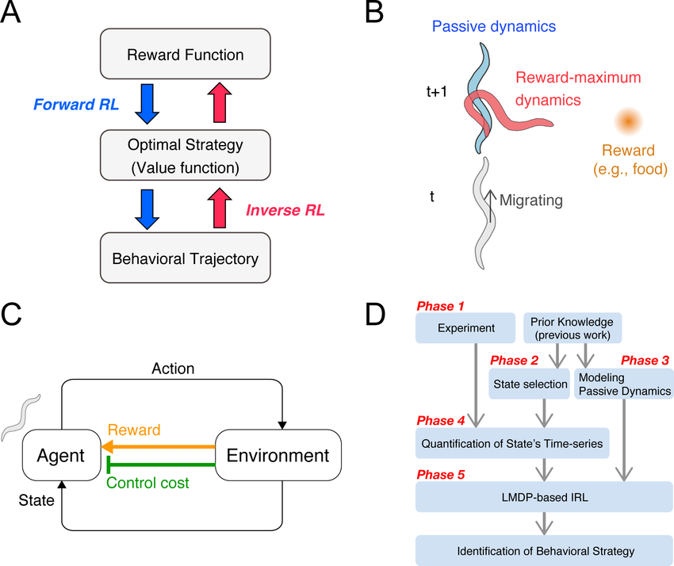

Inverse Reinforcement Learning (IRL) is an advanced method within artificial intelligence aimed at deducing reward systems from observed behaviors. Unlike traditional reinforcement learning, which seeks to find an optimal policy by maximizing cumulative rewards, IRL works inversely. It attempts to reason backward from decisions to infer the objectives guiding them. This approach is particularly powerful in complex environments where explicit modeling of goals is challenging. 

In finance, and more precisely in algorithmic trading, IRL presents innovative opportunities for developing trading strategies by deciphering and replicating the actions of successful market participants. While reinforcement learning traditionally involves training algorithms to make decisions based on specific reward functions, IRL focuses on understanding the underlying motivations and reward structures that are implicit in observed trading behaviors. By capturing these hidden incentives, IRL can facilitate the creation of algorithms that effectively mimic expert trading decisions.

This article investigates IRL's transformative potential in finance, particularly its capacity to revolutionize algorithmic trading. By harnessing the insights IRL provides, financial strategists can employ novel techniques to model and enhance trading behaviors. The adaptability and precision of IRL render it advantageous over standard reinforcement learning methods, which often require predefined reward functions and can struggle in the fluid, unpredictable landscape of financial markets. Here, we critically examine the principles underpinning IRL and identify how these offer distinct benefits over conventional techniques, such as improved generalization and the ability to handle scenarios with ambiguous or fast-changing dynamics.

## Table of Contents

## Understanding Inverse Reinforcement Learning

Inverse Reinforcement Learning (IRL) distinguishes itself from traditional reinforcement learning through its primary focus on identifying the reward function based on an observed optimal policy, rather than learning an optimal policy from a predefined reward structure. This approach is centered on the principle of deducing what reinforcement signals could lead an agent to exhibit the behavior observed.

The essential objective of IRL is to reverse-engineer the reward structure that an agent is likely optimizing, allowing one to infer the underlying motivations and drivers of decisions. To better understand this, consider a typical reinforcement learning scenario where an agent interacts with an environment, described by a state space $S$, a set of possible actions $A$, a transition model, and an unknown reward function $R: S \times A \rightarrow \mathbb{R}$. 

While traditional reinforcement learning methods seek to find a policy $\pi: S \rightarrow A$ that maximizes the expected cumulative reward, $\mathbb{E}[\sum_{t=0}^{\infty} \gamma^t R(s_t, a_t)]$, IRL works inversely by assuming a known or observed optimal policy and inferring the reward function $R$.

Given an optimal policy $\pi^*$, the task of IRL is to determine the reward function $R$ such that the observed policy is optimal with respect to this reward. One way to formalize this is by solving the following optimization problem:

$$
\max_{R} \; \sum_{\tau \sim \pi^*} \log P(\tau | R)
$$

Here, $\tau$ represents the trajectories or sequences of states and actions, and $P(\tau | R)$ denotes the probability of observing a trajectory under a specific reward function $R$.

In financial domains, understanding the hidden reward structures can unveil the motivations behind observed trading behaviors, thus enabling the creation of models that align with profitable strategies. For example, by observing successful traders' portfolios, IRL can decode the implicit criteria and factors these traders prioritize in decision-making processes.

The implementation of IRL involves identifying features that relate to the reward signals. A common approach is to assume that the reward function is a linear combination of predefined features $\phi(s, a)$, such that:

$$
R(s, a) = \theta^T \phi(s, a)
$$

where $\theta$ represents the weights assigned to each feature. The challenge lies in resolving $\theta$ that best explains the observed policy. Techniques such as the Maximum Entropy IRL method are often employed to ensure that the inferred policy not only complies with the observed trajectories but also generalizes well by maximizing the entropy of the policy under the inferred reward structure.

In finance, IRL's capacity to reveal the intent behind successful market maneuvers has vast implications. By reconstructing the functional reward space from past financial data, financial strategists can better understand market dynamics and enhance [algorithmic trading](/wiki/algorithmic-trading) models. This aspect of financial intelligence not only aids in crafting adaptive trading strategies but also in forecasting market movements and risks more effectively.

## Applications of IRL in Algorithmic Trading

Algorithmic trading has revolutionized financial markets by employing computer-driven algorithms to automate trading activities. The incorporation of Inverse Reinforcement Learning (IRL) into algorithmic trading systems has further advanced this field. By leveraging IRL, it becomes possible to model trading strategies based on historical market behavior, capturing the nuances of successful decision-making processes.

IRL focuses on deducing the reward function from observed optimal policy executions, making it particularly useful for modeling expert trading strategies. This process involves analyzing past trading behaviors to understand the underlying motivations driving successful trades. Once these reward structures are identified, they can be utilized to refine and adapt trading algorithms in real-time market conditions.

For example, consider a historical dataset containing successful trading decisions across various market scenarios. Using IRL, an algorithm can reverse-engineer the reward functions that led to those decisions. By inputting this information into a trading algorithm, traders can incorporate expert knowledge from past successful strategies directly into their automated systems. This leads to improved decision-making frameworks that are not only informed by historical success but also adaptable to current market conditions.

One concrete application can be observed in the [quantitative trading](/wiki/quantitative-trading) strategies where IRL models have been deployed to continuously learn from market data. By employing IRL, these models can recalibrate in response to shifts in market dynamics, thereby enhancing algorithm robustness and responsiveness. Traders have reported considerable improvements in strategy performance and risk management capabilities when integrating these IRL-driven insights.

Moreover, IRL's ability to handle non-linear and complex reward functions directly addresses the intricate and often unpredictable nature of financial markets. It efficiently identifies hidden patterns within market data that might not be apparent through traditional analysis. This identification is crucial for developing innovative trading strategies that leverage emerging market opportunities, ultimately contributing to optimized financial performance.

In conclusion, the application of IRL in algorithmic trading offers a significant advantage by bridging historical expertise with modern computational algorithms. This integration not only facilitates the creation of sophisticated trading systems but also empowers traders to remain agile amidst rapidly evolving market conditions. As IRL continues to evolve, its role in enhancing financial decision-making frameworks is expected to expand, underscoring its transformative potential in the realm of algorithmic trading.

## Advantages of IRL in Financial Markets

Inverse Reinforcement Learning (IRL) offers several notable advantages within financial markets, particularly in algorithmic trading. At its core, IRL's ability to learn from market data allows for the dynamic adaptation of strategies. This adaptability can lead to more informed decisions and potentially enhance profitability. By reverse-engineering the reward structures inherent in expert trading behaviors, IRL facilitates a more nuanced understanding of market dynamics.

Traditional [reinforcement learning](/wiki/reinforcement-learning) (RL) approaches typically rely on predefined reward functions to determine optimal policies. However, these preset functions may not effectively capture the complexity and unforeseen shifts present in financial markets, especially under rare and volatile conditions. In contrast, IRL excels in these environments, as it derives reward functions that mirror successful trading patterns. This generalization capability enables IRL to manage market anomalies more effectively than traditional RL methods.

Another significant advantage of IRL is its ability to uncover hidden patterns within financial data. By deciphering the implicit reward structures followed by proficient traders, IRL can generate innovative trading strategies that may not be initially apparent. These strategies exploit the underlying mechanics of market behavior, often leading to novel approaches that can significantly enhance trading performance.

From the perspective of trading efficiency, IRL streamlines decision-making processes by autonomously aligning strategies with successful market behaviors. This alignment not only increases trading precision but also optimizes resource allocation by reducing the reliance on labor-intensive strategy formulation. The adaptive nature of IRL ensures that trading algorithms remain relevant and effective in fluctuating market conditions.

In terms of risk management, IRL contributes to more robust strategies by accounting for a wider array of market scenarios, including those that are rare or unpredictable. By learning from the successes and failures embedded in historical data, IRL-equipped models can anticipate and mitigate potential risks more reliably than those relying solely on conventional RL.

Furthermore, the strategic innovation potential of IRL is substantial, as it allows for the constant evolution and refinement of trading strategies. By emulating the decision-making framework of market experts, IRL drives the development of strategies that not only meet current market demands but also anticipate future shifts.

In summary, IRL significantly enhances trading efficiency, risk management, and strategic innovation in financial markets. Its ability to adapt dynamically, generalize under uncertainty, and discover hidden patterns positions it as a powerful tool for developing cutting-edge algorithmic trading strategies.

## Challenges Faced by IRL in Finance

Inverse Reinforcement Learning (IRL) presents significant potential in enhancing financial trading strategies, yet it brings with it a set of challenges that require careful consideration. One of the primary issues is computational complexity. Implementing IRL effectively involves sophisticated mathematical models and algorithms that demand high computational power. The processes of feature extraction, policy evaluation, and optimization can be computationally intensive, thereby limiting the scalability and real-time applicability of IRL in dynamic market environments.

Another critical challenge is the necessity for substantial amounts of high-quality data. IRL seeks to infer reward functions from observed behaviors, necessitating large datasets that reflect a diverse range of market conditions. However, quality data can be sparse, noisy, or subject to biases, posing difficulties in obtaining accurate models. The complexity of financial markets implies that historical data may not always capture future market variations, necessitating robust validation and testing frameworks to ensure the inferred reward structures are reliable and robust.

Security and ethical considerations also play a pivotal role when deploying IRL in financial systems. Automated decision-making raises concerns around accountability and transparency. The opacity of [machine learning](/wiki/machine-learning) algorithms can make it difficult to understand the decision-making process, leading to hesitation in fully adopting such systems for critical financial operations. Furthermore, ethical concerns arise from the potential for these algorithms to behave unpredictably in unprecedented market conditions or to be exploited for manipulative purposes.

To address these challenges, several potential solutions can be considered. Enhancing computational efficiency can be achieved through the development of more streamlined algorithms and the application of parallel computing techniques. This can facilitate the processing of large datasets and enable real-time application of IRL solutions. Moreover, incorporating methods to validate and regularize the learning process can help mitigate issues with data quality and ensure the models generated are generalizable and robust.

Effectively addressing security and ethical issues involves implementing measures to increase the transparency and explainability of IRL models. By integrating explainable AI techniques, financial institutions can better understand and trust the decision-making processes of their trading models. This includes developing interpretability tools and frameworks that provide insights into how decisions are made and the factors influencing them.

Overall, overcoming the challenges associated with implementing IRL in finance involves a multidisciplinary approach that combines advances in computational techniques, data science, and ethical considerations to ensure these systems are both effective and trustworthy.

## Future Prospects of IRL in Finance

Inverse Reinforcement Learning (IRL) stands poised to significantly impact the financial sector, particularly in algorithmic trading. As research progresses, efforts focus on refining the efficiency and precision of IRL models. This includes enhancing algorithms to better capture and understand complex financial market behaviors and underlying reward structures that drive decision-making processes.

The integration of IRL with other [artificial intelligence](/wiki/ai-artificial-intelligence) technologies forms a pivotal aspect of its future prospects. By combining IRL with machine learning techniques such as [deep learning](/wiki/deep-learning) and neural networks, financial systems can achieve enhanced data processing capabilities. This synergy allows for improved pattern recognition and decision generalization, particularly useful in volatile and unpredictable market conditions. For instance, an IRL model could be combined with a [neural network](/wiki/neural-network) to better predict market shifts by analyzing vast datasets more effectively.

Advancements in computational power additionally play a critical role. As technology progresses, the computational limitations that currently hinder IRL applications in finance are expected to diminish. Enhanced computational resources facilitate the processing of larger datasets and the execution of more complex algorithms, contributing to the development of more accurate and robust financial models.

The potential of IRL to transform financial systems lies in its ability to create strategies that adapt fluidly to changing market environments. By learning from historical behaviors and updating models based on new data inputs, IRL can support the development of dynamic trading strategies. These strategies can mitigate risks associated with unforeseen market changes and optimize performance over time.

Additionally, emerging trends indicate a broader application of IRL in finance, beyond just trading, to include credit risk assessment, fraud detection, and portfolio management. The learning mechanism of IRL, which focuses on deducing reward functions from observed behaviors, can be deployed to improve decision-making frameworks across various financial contexts.

Ongoing research aims to further explore and exploit the synergies between IRL and blockchain technology, enabling secure and transparent financial transactions. Blockchain's decentralized nature could provide a robust framework for deploying IRL models, ensuring data integrity and traceability, essential for automated decision systems.

In conclusion, while IRL faces current challenges related to computational demands and data quality, its future in finance is underscored by the potential to establish more resilient and calculated financial ecosystems. The integration with other AI methodologies and advancements in computational power positions IRL as a transformative tool in building adaptive and intelligence-driven financial markets.

## Conclusion

Inverse Reinforcement Learning (IRL) has emerged as a transformative approach in the pursuit of optimized trading strategies and enhanced financial decision-making frameworks. As the financial markets continue to evolve and become increasingly complex, the ability to learn from and model successful market behaviors becomes invaluable for gaining competitive advantages. IRL facilitates this by offering a method to infer the underlying reward structures that drive optimal trading strategies, thus allowing for more adaptive and informed decision-making.

The potential advantages of IRL suggest a significant impact on the future of algorithmic trading. By identifying the reward functions that successful traders optimize, IRL can enable the design of algorithms that adapt to market shifts and complexities, ultimately leading to more robust and versatile trading systems. Moreover, IRL fosters the development of novel strategies capable of navigating rare and volatile market conditions, which traditional models often struggle to handle effectively.

Despite these promising prospects, challenges persist in the implementation of IRL within financial contexts. Computational complexity and the necessity for substantial amounts of high-quality data present ongoing hurdles. However, advancements in computational resources and AI technologies hold promise for overcoming these obstacles, making IRL a viable option for the next generation of trading systems.

The ongoing journey of integrating IRL into robust and efficient financial systems reflects a broader trend within the industry towards leveraging AI-driven insights for strategic innovation. The confluence of financial acumen and advanced computational techniques underscores the potential of IRL to reshape the landscape of financial trading and decision-making. As research and technology continue to advance, IRL is poised to play an increasingly pivotal role in the evolution of financial markets.

## References & Further Reading

[1]: Ng, A. Y., & Russell, S. J. (2000). ["Algorithms for Inverse Reinforcement Learning."](https://dl.acm.org/doi/10.5555/645529.657801) Advances in Neural Information Processing Systems, 13.

[2]: Arora, S., & Doshi, P. (2021). ["A Survey of Inverse Reinforcement Learning: Challenges, Methods and Progress."](https://www.sciencedirect.com/science/article/pii/S0004370221000515) Journal of Artificial Intelligence Research, 73, 377-428.

[3]: Levin, R. I., & Lo, A. W. (2011). ["A Non-Random Walk Down Wall Street."](https://books.google.com/books/about/A_Non_Random_Walk_Down_Wall_Street.html?id=AHNv1Pf3pQMC) Princeton University Press.

[4]: Abbeel, P., & Ng, A. Y. (2004). ["Apprenticeship Learning via Inverse Reinforcement Learning."](https://ai.stanford.edu/~ang/papers/icml04-apprentice.pdf) Proceedings of the Twenty-first International Conference on Machine Learning (ICML).

[5]: Silver, D., & Veness, J. (2010). ["Monte Carlo Planning in Large POMDPs."](https://proceedings.neurips.cc/paper/2010/file/edfbe1afcf9246bb0d40eb4d8027d90f-Paper.pdf) Advances in Neural Information Processing Systems, 23.

[6]: Russel, S., & Norvig, P. (2009). ["Artificial Intelligence: A Modern Approach,"](http://aima.cs.berkeley.edu/index.html) 3rd Edition, Prentice Hall.

[7]: Sutton, R. S., & Barto, A. G. (2018). ["Reinforcement Learning: An Introduction."](https://web.stanford.edu/class/psych209/Readings/SuttonBartoIPRLBook2ndEd.pdf) 2nd Edition, MIT Press.