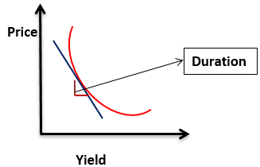

## Table of Contents

## What is an interest rate?

An interest rate is the amount of money a bank or lender charges you for borrowing money, usually shown as a percentage of the total amount you borrow. For example, if you take out a loan, the interest rate tells you how much extra you have to pay back on top of the money you borrowed. Interest rates can also be the amount of money you earn when you save money in a bank. Banks pay you interest for keeping your money with them, and the interest rate shows how much you will earn over time.

Interest rates are important because they affect how much it costs to borrow money and how much you can earn by saving. When interest rates are high, borrowing money becomes more expensive because you have to pay back more. This can make people think twice before taking out loans. On the other hand, high interest rates mean you can earn more money by saving, which might encourage people to save more. When interest rates are low, borrowing money is cheaper, which can help people buy things like houses or cars, but saving money might not be as rewarding.

## What is a bond?

A bond is like a special kind of loan that you give to a government or a company. When you buy a bond, you're lending them money. In return, they promise to pay you back the money you lent them after a certain amount of time, plus some extra money called interest. This interest is like a thank you for lending them the money. Bonds are often seen as a safer way to invest your money because you know exactly when you'll get your money back and how much extra you'll earn.

There are different types of bonds. Some are from governments, like U.S. Treasury bonds, which are considered very safe because the government is less likely to fail to pay you back. Others are from companies, called corporate bonds, and these can be riskier because companies can sometimes go bankrupt. The riskier the bond, the higher the interest rate they might offer to attract investors. People buy bonds to grow their savings slowly and steadily, and they can be a good choice if you want to keep your money safe while still [earning](/wiki/earning-announcement) a bit of extra money over time.

## How are interest rates and bond prices related?

Interest rates and bond prices have an opposite relationship. When interest rates go up, the prices of existing bonds go down. This happens because new bonds that are issued will have higher interest rates to match the new rates, making them more attractive to investors. If you have an old bond with a lower interest rate, you might have to sell it for less money because people would rather buy the new bonds with higher rates.

On the other hand, when interest rates go down, the prices of existing bonds go up. This is because the old bonds now have higher interest rates compared to the new ones being issued. So, if you own a bond with a higher interest rate, it becomes more valuable, and you can sell it for more money. This relationship is important for investors to understand because it helps them decide when to buy or sell bonds based on what they think interest rates will do in the future.

## Why does the price of a bond move inversely to interest rates?

When interest rates go up, new bonds that are sold will have higher interest rates. If you already own a bond with a lower interest rate, it becomes less attractive to other people because they can get a new bond with a better rate. So, if you want to sell your old bond, you have to lower its price to make it more appealing. That's why the price of your bond goes down when interest rates go up.

On the flip side, when interest rates go down, new bonds have lower interest rates. Your old bond, which has a higher interest rate, becomes more attractive because it pays more than the new bonds. People will be willing to pay more for your bond because it's a better deal. So, the price of your bond goes up when interest rates go down. This seesaw effect is why bond prices move in the opposite direction of interest rates.

## What is the yield of a bond and how does it relate to interest rates?

The yield of a bond is like the return you get on your money for buying that bond. It's usually shown as a percentage and tells you how much you'll earn from the bond's interest payments over time. The yield is important because it helps you see how good of a deal the bond is compared to other ways you could invest your money.

The yield of a bond is closely tied to interest rates. When interest rates go up, new bonds have higher interest rates, so the yield on your existing bond looks less attractive. To make your bond more appealing to others, you might have to sell it for a lower price, which means its yield goes up because the price went down. On the other hand, when interest rates go down, new bonds have lower interest rates, making your existing bond with its higher interest rate more valuable. You can sell it for a higher price, which means its yield goes down because the price went up. So, the yield moves in the opposite direction of the bond's price but in the same direction as interest rates.

## Can you explain the concept of duration and its impact on bond price sensitivity to interest rate changes?

Duration is a way to measure how sensitive a bond's price is to changes in interest rates. It's like a special number that tells you how much the price of a bond will go up or down when interest rates change. Think of duration as a time measure, usually in years, that shows how long it takes for you to get back the money you paid for the bond through its interest payments and the money you get when the bond matures. The longer the duration of a bond, the more its price will change when interest rates move.

Bonds with a longer duration are more sensitive to interest rate changes. This means if interest rates go up, the price of a long-duration bond will drop a lot more than the price of a short-duration bond. On the flip side, if interest rates go down, the price of a long-duration bond will go up a lot more than a short-duration bond. So, if you're thinking about buying bonds, knowing their duration can help you understand how much risk you're taking with interest rate changes.

## How do central bank policies affect the inverse relationship between interest rates and bond prices?

Central banks, like the Federal Reserve in the U.S., have a big impact on interest rates. They can raise or lower the rates to control things like inflation and keep the economy stable. When a central bank raises interest rates, it makes borrowing money more expensive. This causes the prices of existing bonds to go down because new bonds will have higher interest rates, making them more attractive to investors. On the other hand, when a central bank lowers interest rates, borrowing money becomes cheaper, and the prices of existing bonds go up because their interest rates are now higher than what's being offered on new bonds.

The actions of central banks can also affect how people and businesses feel about the economy. If people think that interest rates are going to go up soon, they might sell their bonds now to avoid losing money later. This can push bond prices down even before the central bank actually raises rates. If people think rates are going to stay low or go down, they might buy more bonds, which can push bond prices up. So, central bank policies not only change interest rates directly but also influence what people expect to happen in the future, which can make the inverse relationship between interest rates and bond prices even stronger.

## What role do inflation expectations play in this relationship?

Inflation expectations are what people think prices will do in the future. If people expect inflation to go up, they might think that central banks will raise interest rates to control it. When interest rates go up, the prices of bonds go down because new bonds will have higher interest rates, making them more attractive. So, if people expect more inflation, they might sell their bonds now to avoid losing money later, which can make bond prices drop even before interest rates actually go up.

On the other hand, if people expect inflation to stay low or go down, they might think that central banks will keep interest rates low or even lower them. When interest rates are low, the prices of existing bonds go up because their interest rates are better than what's being offered on new bonds. So, if people expect less inflation, they might buy more bonds, pushing their prices up. This shows how what people think about inflation can affect both interest rates and bond prices, making the relationship between them even stronger.

## How does the maturity of a bond influence its sensitivity to interest rate changes?

The maturity of a bond is how long it takes for the bond to reach the end of its life and give you your money back. Bonds with longer maturities are more sensitive to changes in interest rates. This is because you have to wait a long time to get your money back, so any change in interest rates during that time can make a big difference in what your bond is worth. If interest rates go up, the price of a long-term bond will drop more than a short-term bond because people can get a better deal with new bonds that have higher rates.

On the other hand, if interest rates go down, the price of a long-term bond will go up more than a short-term bond. This is because your long-term bond's interest rate is now better than what's being offered on new bonds, making it more valuable. So, when you're thinking about buying bonds, remember that the longer the time until the bond matures, the more its price can change if interest rates move around.

## What are some strategies investors can use to manage interest rate risk in their bond portfolios?

Investors can manage interest rate risk in their bond portfolios by diversifying the types of bonds they hold. This means having a mix of short-term and long-term bonds. Short-term bonds are less sensitive to interest rate changes, so they can help balance out the risk from long-term bonds, which can lose more value if rates go up. Another way is to use bond ladders, where you buy bonds that mature at different times. As each bond matures, you can reinvest the money in new bonds at current interest rates, which can help you take advantage of changes in rates over time.

Another strategy is to look at bonds with different kinds of interest rates, like floating-rate bonds. These bonds have interest rates that can change based on what's happening with market rates, so they can help protect your portfolio if interest rates go up. You can also use something called interest rate swaps, where you agree to exchange the interest payments on your bonds with someone else. This can help you manage the risk if you think interest rates will move in a way that could hurt your bond's value. By using these strategies, investors can try to keep their bond portfolios safer and maybe even make some extra money no matter what happens with interest rates.

## How do different types of bonds (e.g., government, corporate, municipal) react differently to interest rate changes?

Different types of bonds, like government, corporate, and municipal bonds, can react differently to changes in interest rates, but they all generally follow the rule that when interest rates go up, bond prices go down, and when interest rates go down, bond prices go up. Government bonds, such as U.S. Treasury bonds, are often seen as safer because the government is less likely to fail to pay back the money. Because they're safer, their prices might not change as much as other bonds when interest rates move. But if interest rates go up a lot, even these safe bonds can lose value, just not as much as riskier bonds.

Corporate bonds and municipal bonds can be more sensitive to interest rate changes because they're riskier. Corporate bonds are from companies, and if a company goes bankrupt, you might not get your money back. So, when interest rates go up, the prices of corporate bonds can drop more than government bonds because people might worry more about the company's ability to pay back the money. Municipal bonds are from local governments and can be a bit safer than corporate bonds but riskier than government bonds. Their prices can also move more than government bonds when interest rates change, but usually not as much as corporate bonds. Understanding these differences can help investors pick the right mix of bonds for their portfolios.

## Can you discuss historical examples where significant interest rate movements have impacted bond markets?

In the late 1970s and early 1980s, the United States saw a big change in interest rates. Back then, inflation was really high, and to fight it, the Federal Reserve, which is like the boss of interest rates in the U.S., decided to raise them a lot. This made borrowing money much more expensive. Because of this, the prices of bonds that were already out there went down a lot. People who owned these bonds lost money because new bonds were being sold with much higher interest rates. This time is remembered as a tough period for bond investors because the high interest rates really hurt the value of their bonds.

Another big event happened in the years after the 2008 financial crisis. Interest rates were very low because the economy was struggling, and the Federal Reserve wanted to help by making it cheaper for people and businesses to borrow money. This meant that the prices of bonds went up because their interest rates were better than what was being offered on new bonds. People who bought bonds during this time made money as bond prices rose. But when the economy started to get better and interest rates started to go up again, bond prices began to fall, showing how sensitive they are to changes in interest rates.

## How do bond prices and interest rates relate to each other?

Bonds are a form of debt security that represent a loan made by an investor to a borrower, typically corporate or governmental. These instruments involve the issuer providing periodic interest payments, known as coupon payments, and returning the principal at maturity. The market value of bonds is sensitive to fluctuations in interest rates, affecting their appeal compared to new offerings.

Interest rates have a direct impact on bond yields, which measure the annual return on a bond investment based on its coupon payment and current price. When market interest rates rise, newly issued bonds offer higher yields, rendering existing bonds with lower rates less attractive. Consequently, the prices of these older bonds decline to increase their yields and match the current market environment. Conversely, when interest rates decrease, existing bonds with higher coupon payments become more attractive, resulting in a price increase.

This inverse relationship between bond prices and interest rates can be illustrated mathematically. Consider a bond with a fixed annual coupon payment $C$, a face value $F$, and a time to maturity $n$. The bond's price $P$ is the present value of its future cash flows, given by the equation:

$$
P = \sum_{t=1}^{n} \frac{C}{(1+i)^t} + \frac{F}{(1+i)^n}
$$

where $i$ is the prevailing interest rate. As $i$ increases, the present value of both the coupon payments and the face value decreases, leading to a lower price $P$.

Economic theory supports this inverse relationship, primarily through the theoretical framework of opportunity cost and the time value of money. An increase in rates raises the opportunity cost of holding a bond with a fixed return, driving investors to seek other securities with better yields, thus pushing down the bond's price.

Real-world instances of this dynamic are evident during monetary policy shifts by central banks. For example, when the Federal Reserve increases interest rates, bonds issued at previous, lower rates often experience a decline in value. This was notably observed during the U.S. rate hikes between 2015-2018, where fluctuating bond prices visibly aligned with [interest rate](/wiki/interest-rate-trading-strategies) adjustments.

Understanding this interplay between bond prices and interest rates is crucial for investors, enabling informed decisions and optimal portfolio management. Special attention to this dynamic allows both individuals and institutions to better anticipate market movements and adjust their strategies accordingly.

## What are the mechanics of the inverse relationship?

Bond prices and interest rates are intrinsically connected through an inverse relationship. This connection can be elucidated using an analogy: imagine a seesaw where bond prices and interest rates sit on opposite ends. As one side goes up, the other comes down, reflecting the inverse relationship at play. This phenomenon is primarily because bonds are fixed-income securities, which means they offer predetermined payments to investors through their coupons or interest payments. When interest rates in the broader market increase, newly issued bonds offer higher yields to attract investors, making the older, lower-yielding bonds less attractive, thus reducing their prices. Conversely, when interest rates decrease, existing bonds with higher coupon rates become more appealing, driving their prices up.

### Numerical Examples and Mathematical Relationship

Consider a bond with a face value of $1,000 and a coupon rate of 5%, thus paying $50 annually. If the market interest rate rises to 6%, the bond's price must fall to offer an equivalent yield. Using the formula:

$$
P = \frac{C}{r}
$$

where $P$ is the price, $C$ is the annual coupon payment, and $r$ is the market interest rate, the new price of this bond ($P$) becomes:

$$
P = \frac{50}{0.06} = 833.33
$$

This demonstrates how the bond's price decreases to match the increased market yield requirements.

### Duration and Convexity

**Duration** measures a bond's sensitivity to interest rate changes, indicating the percentage change in a bond's price for a 1% change in interest rates. Mathematically, the Macaulay Duration is calculated by:

$$
D = \frac{\sum_{t=1}^{n} \frac{t \times C}{(1 + r)^t} + \frac{n \times F}{(1 + r)^n}} {P}
$$

where $C$ is the annual coupon, $r$ is the interest rate, $n$ is the total number of periods, $F$ is the face value, and $P$ is the bond price.

**Convexity** accounts for changes in duration as interest rates fluctuate, providing a more accurate measure of interest rate risk for bonds. It is expressed as the second derivative of the price-yield curve, showing how the duration changes as interest rates change.

### Market Expectations and Economic Indicators

Market participants form interest rate expectations based on economic indicators such as inflation rates, employment data, and GDP growth. These expectations impact bond pricing, as investors anticipate future interest rates and adjust their bond portfolios accordingly. For instance, high inflation expectations may lead to increased interest rates, compelling investors to shift towards bonds with shorter durations or higher yields.

### Central Bank Influence

Central banks, such as the Federal Reserve in the United States, play a significant role in setting monetary policy, which directly influences interest rates. By adjusting the federal funds rate, central banks can either encourage borrowing and investment through lower rates or control inflation and stabilize the currency by raising rates. These policy decisions ripple through the bond market, affecting both long-term and short-term bond yields and creating opportunities for investors to adjust their strategies based on anticipated rate changes. 

Understanding these mechanics is crucial for investors and traders who aim to navigate the bond market effectively, employing strategies that capitalize on anticipated movements in interest rates.

 to Algorithmic Trading

Algorithmic trading is defined as the use of computer algorithms to automate trading decisions and execute orders in financial markets. These algorithms are programmed to follow specific rules for entering and exiting trades, often at speeds and frequencies that exceed human capabilities. The rise of [algorithmic trading](/wiki/algorithmic-trading) revolutionized financial markets by improving [liquidity](/wiki/liquidity-risk-premium), reducing costs, and enhancing efficiency in the execution of trades.

Historically, algorithmic trading emerged in the late 20th century with the advent of electronic trading platforms. Initially utilized for basic tasks such as order routing and execution, it has significantly advanced over time, driven by technological progress. The 1980s saw the introduction of program trading, allowing simultaneous purchase or sale of large blocks of stocks, and by the 2000s, the rapid development of trading technologies enabled the emergence of high-frequency trading strategies.

The key advantages of algorithmic trading include speed, precision, and the ability to process complex datasets to identify trading opportunities. Algorithms can execute orders in milliseconds, reducing the impact of market [volatility](/wiki/volatility-trading-strategies) during execution. They also eliminate human error and biases, ensuring consistency in decision-making processes.

Algorithmic trading strategies can be broadly categorized into several types, including:

1. **Trend-Following Strategies**: These strategies identify and capitalize on market trends, aiming to buy assets exhibiting upward trends and sell those in downward trends.

2. **Arbitrage**: This strategy exploits price discrepancies across different markets or instruments to make risk-free profits.

3. **Market Making**: Algorithms provide liquidity by continuously buying and selling securities, earning a profit from the bid-ask spread.

4. **Mean Reversion**: This strategy is based on the idea that asset prices will return to their historical averages over time. Algorithms identify assets diverging from their averages and trade accordingly.

5. **High-Frequency Trading (HFT)**: A subset of strategies executed at extremely high speeds, often capturing small price movements by executing large volumes of trades.

In the bond market, algorithmic trading plays a significant role by enhancing the efficiency of trade execution and improving market liquidity. Bonds, unlike stocks, have typically traded in over-the-counter markets with less transparency. Algorithms help automate the complex and manual process of bond trading, which can be slow and prone to errors. They facilitate quicker reaction to news and market events, optimize pricing models, and provide institutional investors with critical tools for managing large portfolios.

The integration of algorithmic trading in the bond market has expanded access to fixed-income instruments, allowing traders to leverage large datasets and sophisticated models for more informed decision-making, ultimately democratizing bond trading.

## What are the challenges and risks in algo trading with bonds?

Algorithmic trading in bond markets presents a set of distinct challenges and risks that must be understood and managed by traders and financial institutions. These risks include market risks that are specific to bond trading, operational risks associated with the systems used, regulatory challenges, and the impact of sudden interest rate changes on trading algorithms.

### Market Risks Unique to Bond Trading

Bond trading is influenced heavily by interest rate movements, and the unique characteristics of bonds, such as duration and credit risk, introduce specific market risks. Interest rate risk arises because bond prices are inversely related to changes in interest rates. When interest rates rise, bond prices tend to fall, which can lead to significant valuation losses for bond portfolios.

Consider the formula for the price of a bond:

$$
P = \sum_{t=1}^{N} \frac{C}{(1 + r)^t} + \frac{F}{(1 + r)^N}
$$

Where:
- $P$ = price of the bond
- $C$ = coupon payment
- $r$ = discount rate (or yield)
- $F$ = face value
- $N$ = number of periods

Any fluctuations in the discount rate $r$, which is closely tied to interest rates, can have a pronounced impact on $P$, the bond price.

### Operational Risks

Operational risks in algorithmic trading stem from the technology and infrastructure used to implement trading strategies. These risks include software bugs, hardware failures, latency issues, and cybersecurity threats. The reliability and robustness of the trading algorithms are crucial, as malfunctions can lead to erroneous trades and financial losses.

### Regulatory Challenges

Algorithmic trading in bond markets is subject to strict regulatory oversight aimed at ensuring market stability and protecting investors. Compliance issues arise from regulations such as the Markets in Financial Instruments Directive (MiFID II) in Europe, which imposes transparency and reporting requirements. Traders must also adhere to guidelines from bodies like the Securities and Exchange Commission (SEC) in the United States, which require detailed records of trading algorithms and strategies.

### Impact of Interest Rate Changes

Sudden changes in interest rates can dramatically affect the performance of algorithmic strategies. Algorithms that fail to account for interest rate volatility or unexpected economic announcements can execute undesirable trades. This risk necessitates the incorporation of adaptive mechanisms within algorithms that can respond dynamically to changing interest rates.

### Risk Management Techniques

To manage these risks, traders employ a variety of risk management techniques. Diversification of strategies and asset classes can help mitigate specific risks associated with individual securities. Implementing stop-loss mechanisms and position limits are commonly used to control potential losses. Furthermore, [backtesting](/wiki/backtesting) and scenario analysis are essential for evaluating how algorithms perform under different market conditions. To safeguard against algorithmic failures, regular audits of code and infrastructure, as well as robust cybersecurity measures, are necessary.

Overall, understanding and addressing the challenges and risks of algorithmic trading in bond markets is critical for ensuring effective and sustainable trading practices. This requires a comprehensive approach that integrates market knowledge, technological acumen, and regulatory compliance.

## References & Further Reading

[1]: Fabozzi, Frank J. ["Bond Markets, Analysis, and Strategies."](https://books.google.com/books/about/Bond_Markets_Analysis_and_Strategies_ten.html?id=bQpNEAAAQBAJ) This book provides comprehensive coverage of the bond market, including detailed analyses of the relationship between bond prices and interest rates.

[2]: Chan, Ernest P. ["Algorithmic Trading: Winning Strategies and Their Rationale."](https://github.com/ftvision/quant_trading_echan_book) This book explores the mechanics of algorithmic trading and various strategies employed across markets, including fixed-income instruments.

[3]: Sundaresan, Suresh. ["Fixed Income Markets and Their Derivatives."](https://shop.elsevier.com/books/fixed-income-markets-and-their-derivatives/sundaresan/978-0-12-370471-9) This text offers insights into bond markets and interest rate movements, featuring advanced strategies in bond trading.

[4]: ["Federal Reserve Economic Data (FRED)."](https://fred.stlouisfed.org/) This platform provides extensive datasets on interest rates and other economic indicators which can affect bond markets.

[5]: ["The U.S. Department of the Treasury."](https://home.treasury.gov/) This source maintains current and historical data related to government bonds and interest rates.

[6]: ["Advances in Financial Machine Learning"](https://www.amazon.com/Advances-Financial-Machine-Learning-Marcos/dp/1119482089) by Marcos Lopez de Prado. This book provides insights on applying machine learning techniques to financial markets, including algorithmic trading.

[7]: Jansen, Stefan. ["Machine Learning for Algorithmic Trading."](https://github.com/stefan-jansen/machine-learning-for-trading) This book discusses using AI and machine learning to develop predictive models for trading.

[8]: Chan, Ernest P. ["Quantitative Trading: How to Build Your Own Algorithmic Trading Business."](https://github.com/ftvision/quant_trading_echan_book) A guide on starting a trading business, covering quantitative strategies in algorithmic trading.