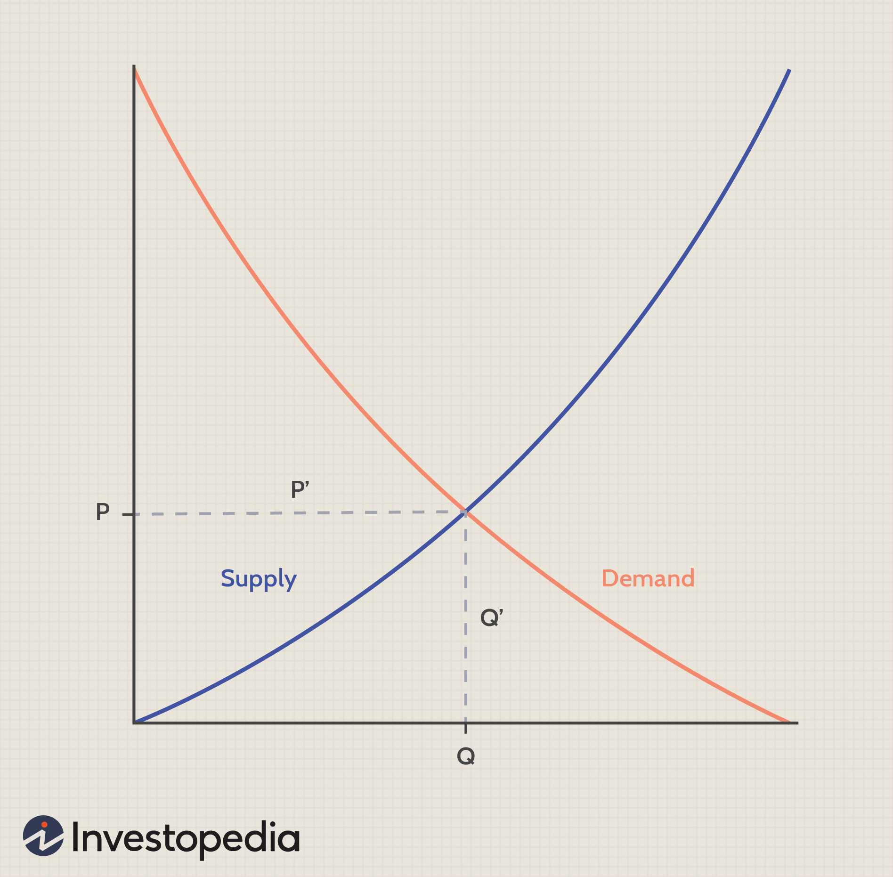

Understanding the law of demand is crucial for anyone involved in economic studies or the financial markets. At its core, the law of demand states that there is an inverse relationship between the price of a commodity and the quantity demanded. This fundamental principle of economics underscores consumer behavior, where generally, as prices decrease, the quantity demanded by consumers increases, and vice versa. This concept is visually represented through a downward-sloping demand curve on a graph with price on the vertical axis and quantity on the horizontal axis.

The law of demand is not only a foundational economic concept but also profoundly influences modern trading strategies, particularly in algorithmic trading. In the context of financial markets, understanding how alterations in price can impact demand can provide traders with a distinct advantage. Algorithmic trading, which involves using computer algorithms to execute trades automatically, frequently relies on understanding market principles like the law of demand to guide decision-making processes. By anticipating changes in demand, traders can optimize their strategies to better align with expected market movements, potentially enhancing their trading outcomes.



In this article, we will explore the intricacies of the law of demand, its application in financial markets, and the impact of this inverse relationship when developing algorithmic trading strategies. By examining the underlying principles of the law of demand and how they can be harnessed in trading environments, we aim to provide traders and investors with valuable insights. This knowledge can empower them to refine their approaches, potentially increasing their effectiveness in the marketplace.

## Table of Contents

## Understanding the Law of Demand

The law of demand is a cornerstone of economic theory, elucidating the mechanism by which consumer purchasing decisions are influenced by price changes. It is traditionally illustrated through a demand curve, which is downward-sloping. On this graph, the price is represented on the vertical axis and the quantity demanded on the horizontal axis. The essential premise of this principle, assuming all other factors remain constant (ceteris paribus), is that an increase in the price of a good or service leads to a decrease in the quantity demanded, whereas a price decrease results in an increase in demand.

The inverse relationship between price and quantity demanded can be attributed to two primary effects: the income effect and the substitution effect. The income effect occurs because a price increase effectively reduces consumer purchasing power, leading consumers to buy less of the good. Conversely, a price decrease increases purchasing power, enabling consumers to buy more. Mathematically, this effect can be summarized as follows:

$$
\text{Income Effect} = \frac{\Delta \text{Quantity Demanded}}{\Delta \text{Price}}
$$

where $\Delta$ represents the change in respective variables.

The substitution effect, on the other hand, arises when a price change for a product leads consumers to substitute it with other goods. When the price of a good rises, consumers may opt for cheaper alternatives, decreasing the quantity demanded. Conversely, when the price drops, the good becomes more attractive relative to other products, increasing demand.

Exceptions to the law of demand include Giffen goods and Veblen goods. Giffen goods defy the law of demand as they are inferior goods for which demand increases when the price increases, due to the dominant income effect over the substitution effect. This phenomenon was historically observed in staple foods like bread in times of financial distress.

Conversely, Veblen goods display an upward-sloping demand curve, as higher prices enhance their desirability due to their status symbol nature. For such goods, the perceived exclusivity and prestige associated with higher prices drive demand, contrary to the typical demand rationale.

Understanding these dynamics and exceptions provides a comprehensive view of consumer behavior vis-à-vis price changes, forming a fundamental basis for more advanced economic and financial analyses.

## Price and Quantity: The Inverse Relationship

The inverse relationship between price and quantity demanded is a fundamental aspect of microeconomic theory, offering insights into consumer behavior and market strategies. At the heart of this principle is the concept of diminishing marginal utility, which postulates that as a consumer consumes more units of a good, the additional satisfaction (or utility) derived from each additional unit decreases. Consequently, consumers are less inclined to pay the same price for additional units, leading to a decrease in quantity demanded as price rises.

This phenomenon is grounded in economic rationality, where consumers aim to maximize their utility subject to budget constraints. When prices increase, the opportunity cost of purchasing a particular good relative to others also rises. Consumers may then opt to substitute the good with cheaper alternatives or reduce overall consumption to avoid diminishing returns on their spending. This behavior underscores the inverse relationship, as rational consumers evaluate their purchases based on price changes.

In real-world markets, this inverse dynamic plays a pivotal role. Businesses must consider this relationship when setting prices to balance between maximizing revenue and maintaining customer demand. For example, luxury goods tend to be less sensitive to price changes due to their target market's specific consumer behavior, while everyday goods exhibit more pronounced elastic responses. Understanding these differences is crucial for pricing strategies.

The application of these principles can be seen in various pricing strategies employed by businesses. Companies often conduct price elasticity analyses to predict how changes in price could impact their sales [volume](/wiki/volume-trading-strategy). This data-driven approach allows firms to set optimal prices that align with their revenue goals while considering consumer sensitivity to price changes.

In summary, the inverse relationship between price and quantity demanded is essential for understanding consumer choices and effective pricing methodologies. By comprehending why consumers react to price changes through concepts like diminishing marginal utility and substitution effects, businesses can craft strategic pricing models that align with consumer behavior, ensuring both competitiveness and profitability in dynamic markets.

## Implications in Algorithmic Trading

Algorithmic trading, often referred to as algo trading, has reshaped the landscape of financial markets by enabling traders to automate their buying and selling decisions using predefined rules. At the core of developing effective trading algorithms lies a profound understanding of the law of demand, which is instrumental in predicting and responding to price movements.

The law of demand posits that, all else being equal, an increase in the price of a commodity results in a decrease in the quantity demanded, and vice versa. This inverse relationship between price and quantity is a fundamental concept in economics and serves as a foundation for constructing trading strategies. In algo trading, recognizing and anticipating these price-demand dynamics allows for more accurate predictions and efficient market entry or [exit](/wiki/exit-strategy) points.

Traders leverage the inverse relationship by designing algorithms that identify price trends and potential reversal points based on changes in demand. For instance, if an algorithm detects that a stock's price is rising beyond its usual pattern while demand metrics indicate a subsequent drop, it could trigger a sell order before the market corrects itself. This approach benefits from the classical demand curve's slope, which often reflects market sentiment and consumer behavior influences.

To integrate such economic principles into trading algorithms, [machine learning](/wiki/machine-learning) techniques are increasingly employed. These techniques help identify complex patterns and relationships within large datasets that might not be immediately apparent through traditional analysis. For example, supervised learning models can be trained on historical market data, allowing them to predict future demand shifts and guide trading decisions. An example of such a predictive model might involve training a [neural network](/wiki/neural-network) to recognize patterns of diminishing returns where increased production costs are not matched by equivalent rises in demand.

```python
import pandas as pd
from sklearn.model_selection import train_test_split
from sklearn.ensemble import RandomForestRegressor
from sklearn.metrics import mean_squared_error

# Load historical market data
data = pd.read_csv('market_data.csv')
X = data[['feature1', 'feature2', 'feature3']]  # select relevant features
y = data['target']  # the target price or demand metric

# Split the dataset into training and testing sets
X_train, X_test, y_train, y_test = train_test_split(X, y, test_size=0.2, random_state=42)

# Initialize and train the model
model = RandomForestRegressor(n_estimators=100, random_state=42)
model.fit(X_train, y_train)

# Evaluate the model
predictions = model.predict(X_test)
mse = mean_squared_error(y_test, predictions)
print(f"Mean Squared Error: {mse}")
```

The script above illustrates a basic implementation of a machine learning model using historical market data. Such a model could predict price movements, incorporating the law of demand to better time trades.

Moreover, machine learning can enhance [algorithmic trading](/wiki/algorithmic-trading) by adapting to market dynamics in real-time. Adaptive algorithms can detect sudden shifts in demand, driven by external factors such as economic news or geopolitical events, and adjust strategies accordingly. For instance, if the demand for a particular stock unexpectedly rises due to a new technological development, machine learning-enhanced algorithms can swiftly capitalize on these signals by adjusting bid-ask spreads or recalibrating buy/sell triggers.

In conclusion, the law of demand, with its intrinsic inverse relationship between price and quantity, provides a crucial framework for developing successful algorithmic trading strategies. By combining this economic principle with advanced data analysis and machine learning, traders can improve the precision and responsiveness of their algorithmic systems, ultimately leading to more informed and potentially profitable trading decisions.

## Practical Applications and Case Studies

Practical applications of the law of demand in algorithmic trading systems illustrate how traders effectively harness economic principles to enhance their trading strategies. Algorithmic trading, which involves using algorithms to automate trading decisions, relies on understanding the inverse relationship between price and quantity demanded to anticipate market movements and capitalize on price fluctuations.

One exemplar case study involves the deployment of algorithms within the framework of trend-following strategies. In these strategies, traders program algorithms to detect demand shifts when a market trend begins or ends. For instance, suppose an asset's price starts declining as demand decreases due to external economic factors. In that case, an algorithm can be designed to initiate a short position, predicting continued price declines as dictated by the law of demand.

A practical demonstration of this concept can be observed in a study conducted on high-frequency trading ([HFT](/wiki/high-frequency-trading-strategies)) systems, where traders set algorithms to react within milliseconds to price changes detected by consuming historical demand data and real-time market metrics. The algorithm calculates the expected quantity demanded at different price levels, enabling HFT systems to execute rapid trades that align with expected demand patterns. Research has shown these systems can significantly outperform traditional trading strategies, leading to improved risk-adjusted returns.

To further exemplify the application, consider a Python-based algorithm that integrates machine learning to predict demand elasticity. By training a model using historical price and demand data, traders can forecast future demand at various price points and automate trades accordingly. Below is a simplified example of such a modeling approach:

```python
import numpy as np
from sklearn.linear_model import LinearRegression

# Sample data: past prices and corresponding quantity demanded
prices = np.array([10, 9, 8, 7, 6]).reshape(-1, 1)
quantities = np.array([100, 120, 150, 180, 210])

# Fit linear regression model to estimate the demand curve
model = LinearRegression().fit(prices, quantities)
predicted_quantities = model.predict(prices)

price_to_forecast = np.array([[5]])
predicted_demand = model.predict(price_to_forecast)

print(f'Predicted Demand at price {price_to_forecast[0][0]}: {predicted_demand[0]}')
```

This script uses linear regression to model the demand curve based on historical data. By understanding the demand elasticity, traders can predict how quantity demanded will change with price fluctuations, enabling them to set trading algorithms that act on these predictions.

Furthermore, case studies reveal how algorithmic traders use the principles of the law of demand to execute [arbitrage](/wiki/arbitrage) strategies. When the price of an asset does not reflect its true demand level due to market inefficiencies, algorithms identify and exploit these discrepancies by simultaneously executing trades that lock in risk-free profits.

By understanding the mechanisms through which the law of demand affects market prices, algorithmic trading systems can be designed to exploit demand shifts for profitable opportunities. These examples showcase how the theoretical underpinnings of demand economics translate into advanced, actionable trading strategies, serving as powerful tools for both novice and experienced traders seeking to refine their trading systems.

## Conclusion

Reflecting on the law of demand, it becomes evident that its application reaches far beyond academic discourse, permeating practical trading strategies. The inverse relationship between price and quantity is fundamental to understanding market movements and consumer behavior. Consider the basic premise: as the price of a commodity rises, quantity demanded typically falls, and vice versa $Q_d = f(P)$ where $f$ denotes the demand function and $P$ the price level. This principle aids traders in predicting how shifts in price might affect demand, offering a strategic edge in various market scenarios.

For algorithmic traders, the integration of these economic principles into trading algorithms can significantly enhance decision-making precision. By encoding the law of demand into algorithmic models, traders can develop automated systems that react dynamically to market changes, optimizing buy and sell actions based on anticipated demand fluctuations. For instance, algorithms can be designed to monitor price changes continuously and adjust trading positions in response, maximizing returns and minimizing risks.

Incorporating these insights allows traders to improve their understanding of market dynamics. Utilizing tools like machine learning can further refine these strategies, as algorithms recognize complex patterns in demand data, allowing traders to anticipate market trends with greater accuracy. Through such enhancements, traders can potentially increase their trading profitability by aligning their strategies with foundational economic principles.

By considering the insights provided in this article, traders stand to gain a more nuanced view of market forces. Understanding and applying the law of demand equips traders with the knowledge necessary to navigate the complexities of financial markets more effectively, ultimately leading to improved trading outcomes.

## References & Further Reading

[1]: Bergstra, J., Bardenet, R., Bengio, Y., & Kégl, B. (2011). ["Algorithms for Hyper-Parameter Optimization."](https://papers.nips.cc/paper/4443-algorithms-for-hyper-parameter-optimization) Advances in Neural Information Processing Systems 24.

[2]: ["Advances in Financial Machine Learning"](https://www.amazon.com/Advances-Financial-Machine-Learning-Marcos/dp/1119482089) by Marcos Lopez de Prado

[3]: ["Evidence-Based Technical Analysis: Applying the Scientific Method and Statistical Inference to Trading Signals"](https://www.amazon.com/Evidence-Based-Technical-Analysis-Scientific-Statistical/dp/0470008741) by David Aronson

[4]: ["Machine Learning for Algorithmic Trading"](https://github.com/stefan-jansen/machine-learning-for-trading) by Stefan Jansen

[5]: ["Quantitative Trading: How to Build Your Own Algorithmic Trading Business"](https://www.amazon.com/Quantitative-Trading-Build-Algorithmic-Business/dp/1119800064) by Ernest P. Chan