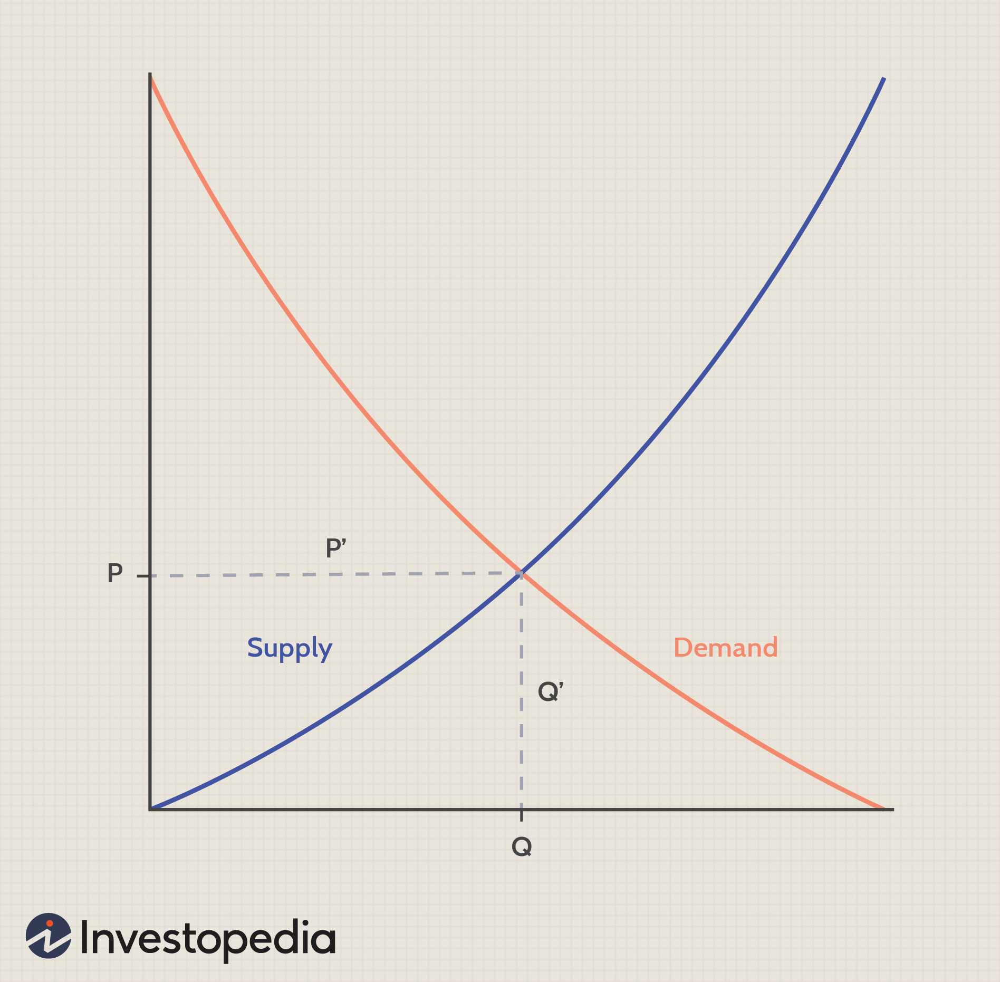

## Table of Contents

## What is an inverse relationship?

An inverse relationship is when two things change in opposite ways. For example, if one thing goes up, the other thing goes down. Imagine you have a seesaw. When one side goes up, the other side goes down. That's an inverse relationship.

You can see inverse relationships in everyday life. For instance, the more time you spend on one activity, like playing video games, the less time you have for another activity, like doing homework. In math and science, inverse relationships are often shown with graphs where one line goes up while the other goes down.

## How does the inverse relationship apply to quantity and price?

In economics, there's an inverse relationship between the quantity of a product and its price. This means that when the price of a product goes up, people usually buy less of it. It's like when your favorite candy gets more expensive, you might decide to buy less of it because it costs more money.

On the other hand, when the price of a product goes down, people tend to buy more of it. If that same candy gets cheaper, you might decide to buy more because it's a better deal. This relationship is shown on a graph called the demand curve, where the line slopes downward, showing that as price decreases, the quantity demanded increases.

## Can you explain the basic concept of supply and demand?

Supply and demand is a basic idea in economics that helps explain how prices are set for things we buy and sell. It's like a dance between how much of something is available (supply) and how much people want it (demand). When there's a lot of something, like apples, and not many people want them, the price goes down because sellers want to sell them before they go bad. But if there are not many apples and a lot of people want them, the price goes up because people are willing to pay more to get them.

This balance between supply and demand can change all the time. For example, if a new toy comes out and everyone wants it, the demand goes up. If the toy company can't make enough toys fast enough, the supply stays low. This makes the price of the toy go up. But if the toy company starts making a lot more toys, the supply goes up, and if people start losing interest, the demand goes down. Then the price might go down too. It's all about finding the right balance.

## What is the law of demand and how does it relate to the inverse relationship?

The law of demand says that if the price of something goes down, people will want to buy more of it. And if the price goes up, people will want to buy less of it. It's like when your favorite snack is on sale, you might buy a lot more than usual because it's cheaper. But if the price goes up a lot, you might decide to buy less or not buy it at all.

This law of demand shows an inverse relationship between price and quantity demanded. Inverse means opposite, so when one thing goes up, the other goes down. In this case, when the price of something goes up, the amount people want to buy goes down. And when the price goes down, the amount people want to buy goes up. It's like a seesaw: when one side goes up, the other side goes down.

## How does a change in price affect the quantity demanded?

When the price of something goes up, people usually want to buy less of it. This is because things that cost more money make people think twice before buying them. For example, if the price of a toy goes up, kids might ask their parents for it less often because it's more expensive. This means the quantity demanded, or how much people want to buy, goes down when the price goes up.

On the other hand, when the price of something goes down, people tend to want to buy more of it. If that same toy gets cheaper, more kids might ask their parents to buy it because it's a better deal. So, the quantity demanded goes up when the price goes down. This shows how changes in price can directly affect how much people want to buy something.

## What factors can shift the demand curve?

A demand curve shows how much people want to buy something at different prices. But sometimes, things happen that make people want more or less of something, no matter what the price is. These things can shift the whole demand curve to the left or right. For example, if people start liking a product more, like a new type of phone, they will want to buy more of it even if the price stays the same. This makes the demand curve shift to the right.

Other things can make people want less of a product, shifting the demand curve to the left. If a new study comes out saying that a popular drink is bad for your health, people might decide to buy less of it, even if the price doesn't change. Also, if people's income goes down, they might not be able to afford as much of certain things, so the demand for those things goes down. These shifts show how changes in people's tastes, income, or other factors can change how much they want to buy, no matter the price.

## How do elasticity of demand and the inverse relationship interact?

Elasticity of demand tells us how much the amount people want to buy changes when the price changes. It's like measuring how sensitive people are to price changes. When the price of something goes up or down, the inverse relationship says that the amount people want to buy will do the opposite. If something has high elasticity, a small change in price can make a big difference in how much people buy. For example, if the price of a certain brand of soda goes up a little bit, people might switch to a cheaper brand, so they buy a lot less of the first brand.

But if something has low elasticity, people might not change how much they buy even if the price changes a lot. Think about medicine that people need for their health. If the price goes up, they might still buy the same amount because they need it. The inverse relationship still works, but it's not as strong because the amount people buy doesn't change much. So, elasticity of demand shows how strong the inverse relationship between price and quantity demanded is for different things.

## What are some real-world examples of the inverse relationship between quantity and price?

One real-world example of the inverse relationship between quantity and price is with gasoline. When the price of gas goes up, people tend to drive less or look for cheaper alternatives like carpooling or public transport. They might also choose to buy less gas by filling up their tanks less often. On the other hand, when the price of gas goes down, people might drive more because it's cheaper, and they'll fill up their tanks more often.

Another example is with seasonal fruits and vegetables. When it's the peak season for strawberries, there are a lot of them available, so the price goes down. People buy more strawberries because they're cheaper and fresher. But when it's not strawberry season, there are fewer strawberries, so the price goes up. People might buy fewer strawberries because they're more expensive and not as fresh. This shows how the amount people buy changes with the price.

## How can businesses use the understanding of this relationship to set prices?

Businesses can use the inverse relationship between price and quantity demanded to help them decide how much to charge for their products. If a business wants to sell more of something, they might lower the price to make it more attractive to customers. For example, if a store has a lot of a certain type of toy that isn't selling well, they might put it on sale to get more people to buy it. By lowering the price, they hope to increase the quantity demanded and sell more toys.

On the other hand, if a business has a product that's really popular and in high demand, they might raise the price a little bit. Even though some people might buy less of it because it's more expensive, the business can still make more money because the product is so popular. For example, if a new video game comes out and everyone wants it, the store might charge a bit more because they know people will still buy it. This way, they can make more money even if they sell a bit less of the game.

## What are the limitations of applying the inverse relationship in economic models?

The inverse relationship between price and quantity demanded is a useful idea, but it doesn't always work perfectly in real life. Sometimes, other things can change how much people want to buy something, even if the price stays the same. For example, if a new study comes out saying a product is bad for you, people might buy less of it no matter what the price is. Also, some things like medicine that people need might not see a big change in how much people buy even if the price goes up a lot. This shows that the inverse relationship can be affected by other factors that aren't just about price.

Another limitation is that the inverse relationship assumes that people always act in predictable ways, but that's not always true. Sometimes, people might buy more of something when the price goes up because they think it's a better product or because it's trendy. For example, if a new phone comes out and the price is high, some people might want it more because it seems more valuable. So, businesses and economists need to think about these other factors and not just rely on the inverse relationship when they're making decisions about prices and how much to sell.

## How does the inverse relationship between quantity and price influence market equilibrium?

The inverse relationship between quantity and price helps find the market equilibrium, which is like the sweet spot where the amount people want to buy matches the amount that's available to sell. Imagine you have a seesaw where one side is the price and the other side is how much people want to buy. When the price goes up, people want to buy less, and when the price goes down, people want to buy more. The market equilibrium happens when the price is just right so that everyone who wants to buy can, and sellers are happy with how much they're selling.

At this equilibrium point, the market is balanced. If the price is too high, there will be more of the product left over because people aren't buying as much. This extra product is called a surplus. If the price is too low, there won't be enough of the product to go around, and this shortage makes people want to buy more than what's available. So, businesses and sellers keep adjusting the price until they find the equilibrium where the quantity people want to buy equals the quantity that's being sold.

## In what ways can government policies affect the inverse relationship between quantity and price?

Government policies can change how much people want to buy something even if the price stays the same. For example, if the government puts a new tax on sugary drinks, the price of those drinks might go up. But the tax might also make people want to buy less of those drinks because they're worried about their health. So, the government's tax can make the inverse relationship between price and quantity even stronger because people are buying less at a higher price.

Another way government policies can affect this relationship is by setting price controls. If the government decides to set a maximum price for something, like rent, it can make more people want to rent because it's cheaper. But if the price is too low, landlords might not want to rent out their places because they're not making enough money. This can lead to a shortage where more people want to rent than there are places available. So, the government's price control can mess with the natural balance of the inverse relationship between price and quantity demanded.

## What is the relationship between quantity and price in terms of negative correlation?

Negative correlation occurs when an increase in one variable results in a decrease in another, underscoring an inverse relationship. This concept is foundational in economics and is prominently illustrated through the demand curve. According to the law of demand, as prices rise, the quantity demanded of a good typically falls, and conversely, as prices fall, demand increases. This inverse relationship is mathematically expressed through the demand function: 

$$
Q_d = f(P)
$$

where $Q_d$ is the quantity demanded and $P$ is the price of the good. A negative slope in this function indicates the negative correlation between price and quantity demanded.

In financial markets, the notion of negative correlation plays a strategic role, particularly in predicting market behavior. Traders can utilize this principle to anticipate how fluctuations in market prices might impact the quantities traded. By understanding these relationships, traders can improve the accuracy of their decision-making processes. For instance, if two assets are negatively correlated, an increase in the price of one asset might suggest a decrease in the demand or price of the other. This understanding can inform the strategic planning of trades.

Moreover, the inverse relationship between quantity and price provides insights into consumer behavior and market dynamics. For example, when modeling market trends, understanding how consumers react to price changes can help in developing predictive models that traders use to foresee market movements. These models can be enhanced with statistical and computational tools such as regression analysis, where the relationship between price changes and quantities can be quantified and predicted.

In practice, algorithms in [algorithmic trading](/wiki/algorithmic-trading) often incorporate these economic principles. By leveraging historical price and quantity data, algorithmic strategies can detect patterns and predict future movements, thus capitalizing on negative correlations. This can be illustrated in a simple Python code snippet that predicts demand based on price using historical correlation data:

```python
import numpy as np
from sklearn.linear_model import LinearRegression

# Sample data: prices and corresponding demand
prices = np.array([[10], [8], [6], [7]])
quantities = np.array([100, 150, 200, 180])

# Create and train the model
model = LinearRegression()
model.fit(prices, quantities)

# Predict demand for a new price
new_price = np.array([[9]])
predicted_quantity = model.predict(new_price)

print(f"Predicted demand for price {new_price[0][0]} is {predicted_quantity[0]}")
```

Through an understanding of negative correlation, traders and economists alike can exploit these inverse relationships, facilitating better market predictions and optimized trading strategies.

## What is the Correlation Coefficient and How Does it Measure Inverse Relationships?

The correlation coefficient is a key statistical tool used in finance to evaluate the degree of linear relationship between two variables. Its value ranges from -1 to 1, where a coefficient of -1 indicates a perfect negative correlation, meaning that as one variable increases, the other decreases consistently. Conversely, a value of 1 represents a perfect positive correlation, while 0 denotes no linear correlation. 

One of the most commonly used measures of correlation is Pearson's correlation coefficient, denoted by $r$. The formula for calculating $r$ is:

$$
r = \frac{\sum (x_i - \bar{x})(y_i - \bar{y})}{\sqrt{\sum (x_i - \bar{x})^2 \sum (y_i - \bar{y})^2}}
$$

where $x_i$ and $y_i$ are the individual data points, and $\bar{x}$ and $\bar{y}$ are the means of the $x$ and $y$ data sets, respectively. This formula computes the covariance of the variables divided by the product of their standard deviations, thus normalizing the degree to which they move together.

In financial contexts, negative correlations are significant for trading strategies. A strong negative correlation between asset prices can highlight potential hedging opportunities. For instance, traders might invest in assets with negatively correlated returns to mitigate risk; when one asset underperforms, the other may overperform, thus balancing losses and gains.

To illustrate this application, consider the following Python example, which calculates the Pearson correlation coefficient between two asset price lists:

```python
import numpy as np

# Example asset price data
prices_asset1 = np.array([100, 102, 101, 105, 107])
prices_asset2 = np.array([210, 208, 212, 207, 204])

# Calculate Pearson correlation coefficient
correlation = np.corrcoef(prices_asset1, prices_asset2)[0, 1]
print(f"Pearson Correlation Coefficient: {correlation}")
```

In this code snippet, `np.corrcoef` computes the correlation matrix from which the Pearson correlation coefficient can be extracted. This type of analysis assists traders in identifying pairs of assets that can be combined to form a balanced portfolio, optimizing investment outcomes amidst fluctuating market conditions.

Overall, understanding and utilizing the correlation coefficient is fundamental for traders seeking to enhance strategies through informed decision-making, especially when it comes to detecting and exploiting inverse relationships in asset prices.

## References & Further Reading

Bergstra, J., et al. (2011). "Algorithms for Hyper-Parameter Optimization." Advances in Neural Information Processing Systems. This paper introduces innovative methodologies for optimizing hyper-parameters, which are crucial in tuning algorithmic trading models to enhance their predictive performance and computational efficiency.

Lopez de Prado, M. "Advances in Financial Machine Learning." Lopez de Prado's comprehensive guide explores cutting-edge techniques in financial [machine learning](/wiki/machine-learning), focusing on the practical applications of statistical models, including negative correlation strategies in trading.

Aronson, D. "Evidence-Based Technical Analysis." Aronson advocates for a scientific approach to technical analysis, emphasizing the importance of evidence-based strategies to improve the reliability of trading models and mitigate risks associated with negative correlations.

Jansen, S. "Machine Learning for Algorithmic Trading." Jansen's work provides an extensive look at the application of machine learning in trading, detailing how traders can utilize algorithms to detect and exploit negative correlations among market assets.

Chan, E. P. "Quantitative Trading: How to Build Your Own Algorithmic Trading Business." Chan offers insights into establishing a successful algorithmic trading business, with guidance on leveraging quantitative models and understanding market relationships, including negative correlations.

