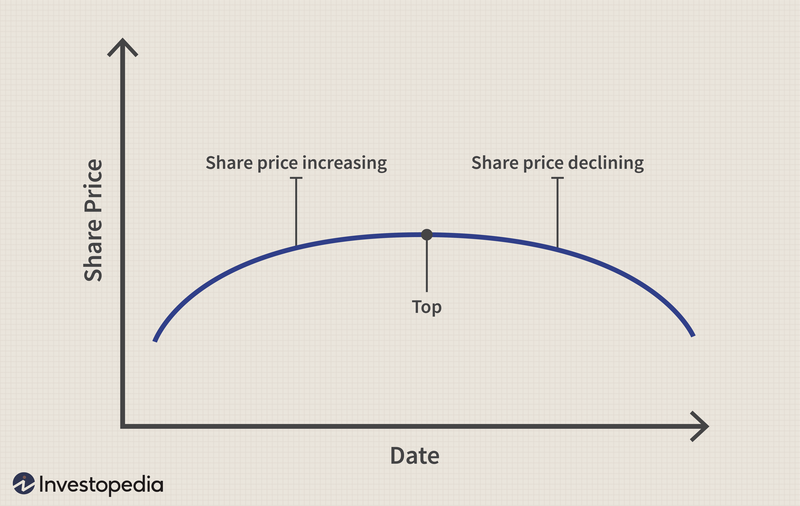

## Table of Contents

## What is an Inverse Saucer Pattern in technical analysis?

An Inverse Saucer Pattern, also known as a Rounding Bottom, is a chart pattern used in technical analysis to predict a bullish reversal in the price of a stock or other financial asset. It looks like a wide, shallow "U" shape on a price chart, indicating that the price has been gradually decreasing and then starts to slowly increase over time. This pattern suggests that after a period of selling, the market sentiment is starting to shift towards buying, as more investors see the asset as a good investment again.

The formation of an Inverse Saucer Pattern can take several months to complete, making it a long-term indicator. Traders and investors look for this pattern because it can signal the end of a downtrend and the beginning of a new uptrend. To confirm the pattern, traders often wait for the price to break above the resistance level, which is usually the highest point on the left side of the "U". Once this breakout occurs, it's seen as a strong buy signal, suggesting that the price is likely to continue rising.

## How does the Inverse Saucer Pattern differ from other chart patterns?

The Inverse Saucer Pattern is different from other chart patterns because it shows a slow and gradual change in price over a long time. Unlike patterns like the Head and Shoulders or Double Bottom, which can form quickly and have sharp turns, the Inverse Saucer takes months to develop. It looks like a wide, shallow "U" on the chart, showing that the price slowly goes down and then slowly goes up. This slow change makes it unique because it shows a gradual shift in how people feel about the stock, from selling to buying.

Another way the Inverse Saucer Pattern is different is how it signals a bullish reversal. Many patterns, like the Bullish Engulfing or Hammer, give quick signals that the price might go up soon. But the Inverse Saucer needs a clear [breakout](/wiki/breakout-trading) above a resistance level to confirm the reversal. This breakout is usually the highest point on the left side of the "U". Once the price breaks through this level, it's a strong sign that the price will keep going up. This makes the Inverse Saucer a more reliable but slower signal compared to other patterns.

## What are the key characteristics of an Inverse Saucer Pattern?

An Inverse Saucer Pattern is a chart pattern that looks like a wide, shallow "U" on a price chart. It shows that the price of a stock or asset has been slowly going down and then starts to slowly go up over a long time, usually several months. This pattern is a sign that the market is changing from a time of selling to a time of buying. The slow change in the price shows that more and more people are starting to think the stock is a good buy again.

To confirm that an Inverse Saucer Pattern is happening, traders look for the price to break above a certain level, called the resistance level. This level is usually the highest point on the left side of the "U". When the price goes above this level, it's a strong sign that the price will keep going up. This makes the Inverse Saucer a reliable but slow signal for traders and investors who are looking for a good time to buy the stock.

## How can beginners identify an Inverse Saucer Pattern on a chart?

To spot an Inverse Saucer Pattern on a chart, beginners should look for a shape that looks like a wide, shallow "U". This pattern shows that the price of a stock or asset has been slowly going down for a while and then starts to slowly go up. It can take several months for this pattern to form, so you need to look at a long-term chart. The left side of the "U" is where the price was highest before it started to drop, and the right side is where the price starts to rise again.

Once you see the "U" shape, the next step is to wait for the price to break above a certain level, called the resistance level. This level is usually the highest point on the left side of the "U". When the price goes above this level, it's a strong sign that the price will keep going up. This breakout confirms that the Inverse Saucer Pattern is complete and that it might be a good time to buy the stock. By watching for these signs, beginners can use the Inverse Saucer Pattern to make better trading decisions.

## What is the significance of volume in confirming an Inverse Saucer Pattern?

Volume is important when confirming an Inverse Saucer Pattern. As the price slowly goes down on the left side of the "U", the [volume](/wiki/volume-trading-strategy) usually gets lower. This shows that fewer people are selling the stock. When the price starts to go up on the right side of the "U", you want to see the volume start to get higher. This means more people are buying the stock, which is a good sign that the pattern is real.

When the price breaks above the resistance level at the top of the "U", it's even more important to look at the volume. If the volume is high when the price breaks out, it's a strong sign that the Inverse Saucer Pattern is confirmed. High volume at the breakout shows that a lot of people believe the price will keep going up, making it a good time to buy the stock. So, watching the volume can help you know if the pattern is really happening and if it's a good time to make a trade.

## Can you explain the psychology behind the formation of an Inverse Saucer Pattern?

The Inverse Saucer Pattern shows how people's feelings about a stock change over time. At first, the price slowly goes down because more people are selling than buying. This happens because they think the stock is not worth as much anymore. As the price keeps going down, fewer people want to sell, and the volume of trades gets lower. This is the left side of the "U" shape on the chart.

Then, something changes. Maybe the company does well, or the market gets better. Slowly, more people start to think the stock is a good buy again. The price starts to go up little by little, and the volume of trades starts to get higher. This is the right side of the "U". When the price breaks above the highest point on the left side, it shows that a lot of people now believe the stock will keep going up. This is why the Inverse Saucer Pattern is a sign that the stock might be a good investment.

## What are the typical time frames over which an Inverse Saucer Pattern develops?

An Inverse Saucer Pattern usually takes a long time to form, often several months. It's not like some other patterns that can appear in just a few days or weeks. Because it takes so long, you need to look at a chart that shows the price over a long time to see it clearly.

The slow change in the price over these months shows that people's feelings about the stock are changing slowly too. At first, more people are selling than buying, which makes the price go down. But then, as time goes on, more people start to think the stock is a good buy again, and the price starts to go up. This slow shift in how people feel about the stock is what makes the Inverse Saucer Pattern special.

## How should traders use the Inverse Saucer Pattern to make trading decisions?

Traders can use the Inverse Saucer Pattern to make smart choices about when to buy a stock. When they see the price slowly going down and then slowly going up, making a wide "U" shape on the chart, it's a sign that the stock might be a good buy soon. They should wait for the price to break above the highest point on the left side of the "U". This is called the resistance level. When the price goes above this level, it's a strong sign that the price will keep going up. Traders can then decide to buy the stock, hoping to make money as the price rises.

It's also important for traders to look at the volume of trades when using the Inverse Saucer Pattern. As the price goes down on the left side of the "U", the volume should get lower, showing that fewer people are selling. When the price starts to go up on the right side, the volume should get higher, showing that more people are buying. When the price breaks above the resistance level, if the volume is high, it's an even stronger sign that the pattern is real and that it's a good time to buy. By watching both the price and the volume, traders can use the Inverse Saucer Pattern to make better trading decisions.

## What are the common entry and exit strategies when trading an Inverse Saucer Pattern?

When trading an Inverse Saucer Pattern, a common entry strategy is to wait for the price to break above the resistance level, which is the highest point on the left side of the "U". This breakout confirms that the pattern is complete and signals a good time to buy the stock. Traders should also look for an increase in volume when the price breaks out, as high volume adds confidence that the price will keep going up. Once the breakout happens, traders can enter a long position, hoping to profit from the expected rise in the stock's price.

For the [exit](/wiki/exit-strategy) strategy, traders often set a target price based on the height of the "U". They measure the distance from the lowest point of the "U" to the resistance level and add that distance to the breakout point. This gives them a target price where they can sell the stock to take profits. Another common exit strategy is to use a trailing stop-loss, which moves up as the price rises. This helps traders lock in gains while still giving the stock room to grow. If the price starts to fall back below the breakout level, it might be a sign to exit the trade to limit losses.

## What are some real-world examples of stocks that have exhibited an Inverse Saucer Pattern?

One real-world example of a stock that showed an Inverse Saucer Pattern is Apple Inc. (AAPL). In 2003, Apple's stock price started to slowly go down from around $8 per share, forming the left side of the "U". It hit a low of about $6 in early 2004. Then, the price began to slowly rise, completing the right side of the "U" by late 2004 when it broke above the resistance level at around $8. This breakout, with increasing volume, signaled a strong bullish reversal, and Apple's stock price continued to rise significantly after that.

Another example is Netflix Inc. (NFLX). In 2011, Netflix's stock price fell from over $300 to around $60, forming the left side of the "U". The price then slowly started to recover over the next year, hitting a low of about $50 in 2012. By early 2013, the stock broke above the resistance level at around $100, completing the Inverse Saucer Pattern. The breakout was accompanied by high volume, confirming the pattern and leading to a sustained upward trend in the stock price.

## How can advanced traders enhance the accuracy of predicting an Inverse Saucer Pattern using additional indicators?

Advanced traders can use other tools called indicators to make their predictions about the Inverse Saucer Pattern more accurate. One popular indicator is the Moving Average Convergence Divergence (MACD). When the MACD line crosses above the signal line around the time the price is breaking out of the "U" shape, it can confirm that the pattern is real and that the price might keep going up. Another useful indicator is the Relative Strength Index (RSI). If the RSI moves from being oversold (below 30) to moving back towards neutral (around 50) as the price is forming the right side of the "U", it can show that the stock is gaining strength and that the pattern might be valid.

Traders can also look at volume indicators like the On-Balance Volume (OBV) to help confirm the Inverse Saucer Pattern. If the OBV starts to rise as the price is moving up on the right side of the "U", it shows that more people are buying the stock, which can make the pattern more reliable. By combining these indicators with the visual shape of the Inverse Saucer Pattern, advanced traders can get a clearer picture of when to buy a stock and feel more confident in their trading decisions.

## What are the potential pitfalls and limitations of relying on the Inverse Saucer Pattern for trading?

Using the Inverse Saucer Pattern for trading can be tricky because it takes a long time to form, usually several months. This means traders need to be patient and wait for the pattern to complete before making a move. If they jump in too early, they might end up buying the stock before it's ready to go up, which could lead to losses if the price keeps going down instead. Also, the pattern can be hard to spot correctly, especially for people who are new to trading. If they mistake another pattern for an Inverse Saucer, they could make the wrong trading decision.

Another limitation is that the Inverse Saucer Pattern doesn't work all the time. Even if the pattern looks right and the price breaks out above the resistance level, the stock might not keep going up like expected. Other things can affect the stock's price, like news about the company or changes in the market. Traders also need to be careful about false breakouts, where the price goes above the resistance level but then quickly falls back down. This can trick traders into buying the stock too soon, leading to losses. So, while the Inverse Saucer Pattern can be a helpful tool, it's important to use it along with other indicators and to be ready for surprises.

## References & Further Reading

[1]: Murphy, J.J. (1999). ["Technical Analysis of the Financial Markets: A Comprehensive Guide to Trading Methods and Applications."](https://archive.org/details/technicalanalysi0000murp) New York Institute of Finance.

[2]: Chan, E.P. (2013). ["Algorithmic Trading: Winning Strategies and Their Rationale."](https://github.com/ftvision/quant_trading_echan_book) Wiley.

[3]: Nison, S. (1991). ["Japanese Candlestick Charting Techniques: A Contemporary Guide to the Ancient Investment Techniques of the Far East."](https://archive.org/details/japanesecandlest0000niso) Penguin.

[4]: Aronson, D.R. (2006). ["Evidence-Based Technical Analysis: Applying the Scientific Method and Statistical Inference to Trading Signals."](https://www.amazon.com/Evidence-Based-Technical-Analysis-Scientific-Statistical/dp/0470008741) Wiley.

[5]: Jansen, S. (2020). ["Machine Learning for Algorithmic Trading: Predictive Models to Extract Signals from Market and Alternative Data for Systematic Trading Strategies with Python."](https://www.amazon.com/Machine-Learning-Algorithmic-Trading-alternative/dp/1839217715) Packt Publishing.