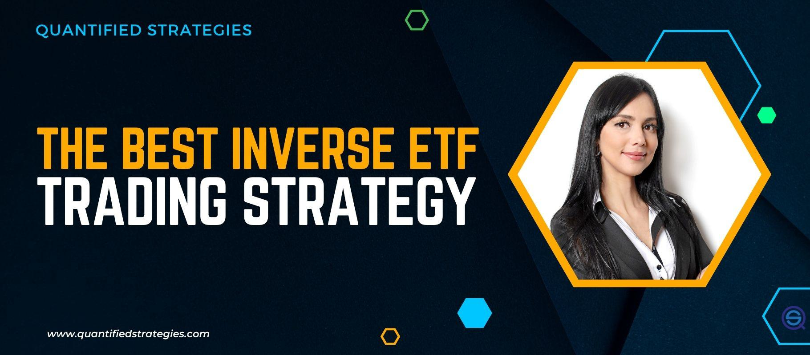

## Table of Contents

## What are inverse ETFs and how do they work?

Inverse ETFs, or exchange-traded funds, are a type of investment that aims to give returns that are the opposite of what a particular index or benchmark does. If the index goes down, the inverse ETF goes up, and if the index goes up, the inverse ETF goes down. This can be useful for investors who want to make money when the market is falling or want to protect their other investments from market downturns.

Inverse ETFs work by using financial instruments like futures contracts, options, and swaps to achieve their goals. These tools allow the fund to bet against the performance of the index it tracks. For example, if an inverse ETF is designed to perform the opposite of the S&P 500, it will use these financial instruments to gain when the S&P 500 loses value. It's important for investors to understand that these ETFs are often used for short-term trading because their performance can be affected by daily resets and compounding effects over time.

## How do sector ETFs differ from broad market ETFs?

Sector ETFs focus on specific parts of the economy, like technology, healthcare, or energy. They invest in companies that belong to one particular industry. This means if you think a certain sector will do well, you can invest in a sector ETF to try to make money from that sector's growth. For example, if you believe technology companies will grow a lot, you might buy a tech sector ETF.

Broad market ETFs, on the other hand, spread their investments across many different sectors and industries. They aim to represent the overall market, like the S&P 500 or the total stock market. This type of ETF is good if you want a simple way to invest in the whole economy without picking specific sectors. It's like buying a little bit of everything, which can be less risky than focusing on just one sector.

Both types of ETFs can be useful, depending on what you're trying to achieve with your investments. Sector ETFs can offer higher potential returns if you correctly predict which sector will do well, but they can also be riskier. Broad market ETFs are generally safer because they are more diversified, but they might not give you the big gains that a successful sector ETF could.

## What is a bearish investor and why might they use inverse ETFs?

A bearish investor is someone who thinks the stock market or a specific stock will go down in value. They might feel this way because of bad news about the economy, a company doing poorly, or other reasons. When a bearish investor expects prices to fall, they look for ways to make money even when the market is going down.

This is where inverse ETFs come in handy for bearish investors. Inverse ETFs are designed to go up in value when the market or a specific index goes down. So, if a bearish investor thinks the market will drop, they can buy an inverse ETF to make money from that drop. It's like betting against the market, and it can be a way for bearish investors to profit from their belief that prices will fall.

## Can you explain the mechanics of inverse sector ETFs?

Inverse sector ETFs work by betting against a specific part of the economy, like technology or energy. If you think a certain sector will go down, you can buy an inverse sector ETF to make money when that sector loses value. These ETFs use special tools like futures contracts, options, and swaps to do this. For example, if you believe the tech sector will fall, you might buy an inverse tech ETF. This ETF will use its tools to gain when tech stocks lose value.

These ETFs are often used for short-term trading because their performance can change a lot from day to day. They reset their positions daily, which means they adjust their bets each day based on how the sector performed. This daily reset can make their long-term performance different from what you might expect just by looking at the sector's overall performance. So, if you're thinking about using inverse sector ETFs, it's important to keep an eye on them and understand how they work over time.

## What are the common sectors targeted by inverse ETFs?

Inverse ETFs often focus on sectors that can be very up and down, like technology, energy, and finance. The technology sector is popular because it can change a lot, and if you think tech stocks will go down, you might buy an inverse tech ETF to make money when they do. Energy is another big one, especially when oil prices are not doing well. If you think oil prices will drop, you can buy an inverse energy ETF to bet against the energy sector.

The financial sector is also a common target for inverse ETFs. This is because banks and other financial companies can be affected a lot by economic changes. If you think the economy will have problems, you might buy an inverse financial ETF to make money when financial stocks go down. These sectors are often chosen because they can have big swings, making them good for people who want to bet against them.

## How do inverse sector ETFs perform in different market conditions?

Inverse sector ETFs do well when the specific sector they are betting against goes down. For example, if you buy an inverse tech ETF and the technology sector drops, your ETF will go up in value. This can be great for you if you guessed right about the sector going down. But, if the sector goes up instead, your inverse ETF will lose value. So, these ETFs are good for making money in bad times for a sector, but they can lose money if the sector does better than expected.

These ETFs can be tricky because they reset every day. This means they adjust their bets each day based on how the sector did. Because of this daily reset, the performance of inverse sector ETFs over a longer time can be different from what you might think just by looking at the sector's overall performance. If the market is very up and down, these ETFs might not do as well as you hoped, even if the sector ends up going down overall. So, it's important to watch them closely and understand how they work over time.

## What are the risks associated with investing in inverse sector ETFs?

Investing in inverse sector ETFs can be risky. One big risk is that these ETFs go down when the sector they are betting against goes up. So, if you guess wrong about a sector going down, you could lose a lot of money. Another risk is that these ETFs reset every day. This means they adjust their bets each day based on how the sector did. Because of this, the performance of inverse sector ETFs over time can be different from what you might expect just by looking at the sector's overall performance. If the market is very up and down, these ETFs might not do as well as you hoped, even if the sector ends up going down overall.

Also, inverse sector ETFs are often used for short-term trading, not long-term investing. This is because their performance can change a lot from day to day. If you hold onto them for a long time, you might end up losing money even if your guess about the sector was right. Plus, these ETFs can be complicated to understand, and if you don't know how they work, you might make mistakes with your investments. So, it's important to watch them closely and understand the risks before you invest.

## How can inverse sector ETFs be used as part of a broader investment strategy?

Inverse sector ETFs can be a helpful tool in a broader investment strategy, especially if you want to protect your money when you think a certain part of the economy will go down. If you have a lot of your money in tech stocks and you're worried that the tech sector might fall, you can buy an inverse tech ETF. This way, if the tech sector does go down, the inverse ETF will go up, and it can help balance out any losses you might have in your other tech investments. It's like having an insurance policy for your investments in a specific sector.

Using inverse sector ETFs can also be part of a short-term trading strategy. If you think a sector like energy or finance is going to drop soon, you can buy an inverse ETF to make money from that drop. But remember, these ETFs are tricky because they reset every day, so they're better for short-term moves rather than holding onto them for a long time. It's important to keep an eye on them and understand how they work so you can use them wisely in your overall investment plan.

## What are the tax implications of trading inverse ETFs?

Trading inverse ETFs can have different tax effects depending on how long you hold them and how you use them in your investment plan. If you hold an inverse ETF for less than a year and then sell it, any profit you make is considered a short-term capital gain. This is taxed at the same rate as your regular income, which can be higher than the tax rate for long-term investments. On the other hand, if you hold an inverse ETF for more than a year, any profit is a long-term capital gain, which usually has a lower tax rate.

Inverse ETFs can also create other tax issues because they often trade a lot inside the fund. This can lead to what's called "capital gains distributions," where the fund has to pay out any profits it made from selling investments. When you get these payouts, you have to pay taxes on them, even if you didn't sell your shares of the ETF. So, it's a good idea to talk to a tax advisor to understand all the tax rules and how they might affect your investment choices with inverse ETFs.

## How do fees and expenses impact the returns of inverse sector ETFs?

Fees and expenses can really eat into the money you make from inverse sector ETFs. These ETFs often have higher fees than regular ETFs because they use special tools like futures and options to bet against the market. These tools cost money to use, and the fund managers charge more to handle them. So, even if the ETF does well and the sector you're betting against goes down, the fees can take a big chunk out of your profits.

It's important to keep an eye on these fees because they can add up over time. If you're using inverse sector ETFs for short-term trading, the daily fees might not seem like a lot, but they can still make a difference in your returns. And if you hold onto the ETF for a longer time, those fees can really add up and lower your overall earnings. So, always check the expense ratio and other costs before you decide to invest in an inverse sector ETF.

## What are some examples of inverse sector ETFs currently available in the market?

Some examples of inverse sector ETFs include the ProShares Short QQQ (PSQ), which bets against the Nasdaq-100 Index. This means if tech stocks in the Nasdaq-100 go down, the PSQ ETF goes up. Another example is the ProShares UltraShort Oil & Gas (DUG), which is designed to give you double the opposite performance of the Dow Jones U.S. Oil & Gas Index. So, if oil and gas stocks drop, this ETF can make twice as much money from that drop.

There's also the ProShares Short Financials (SEF), which aims to go up when financial stocks go down. It tracks the opposite of the Dow Jones U.S. Financials Index. If you think banks and other financial companies will have a tough time, this ETF could be a way to make money from that. These ETFs are used by people who want to bet against certain parts of the economy and make money when those sectors do poorly.

## How can advanced investors use inverse sector ETFs for hedging purposes?

Advanced investors can use inverse sector ETFs to protect their money when they think a certain part of the economy will go down. If you have a lot of your money in tech stocks and you're worried that the tech sector might fall, you can buy an inverse tech ETF. This way, if the tech sector does go down, the inverse ETF will go up, and it can help balance out any losses you might have in your other tech investments. It's like having an insurance policy for your investments in a specific sector. By using inverse sector ETFs, you can reduce the risk of losing a lot of money if your guess about the sector going down is right.

These ETFs can also be part of a bigger plan to manage risk. If you think a sector like energy or finance is going to drop soon, you can buy an inverse ETF to make money from that drop. But remember, these ETFs are tricky because they reset every day, so they're better for short-term moves rather than holding onto them for a long time. It's important to keep an eye on them and understand how they work so you can use them wisely in your overall investment plan. By carefully using inverse sector ETFs, advanced investors can protect their money and maybe even make some extra money when certain parts of the economy do poorly.

## What is the understanding of Sector ETFs?

Sector Exchange-Traded Funds (ETFs) are investment vehicles that allow investors to gain exposure to specific industries or sectors of the economy, such as technology, healthcare, finance, or energy. These ETFs are composed of a collection of stocks that represent companies within a targeted sector. This targeted approach enables investors to customize their portfolios based on their economic outlook and sector-specific knowledge, providing a more focused investment strategy.

Sector ETFs play a crucial role in diversification within a broader investment strategy. While traditional diversification involves spreading investments across a variety of asset classes to minimize risk, sector-focused diversification aims to allocate investments across different industries. This approach can reduce risk associated with investing heavily in a single sector, as economic cycles may impact certain sectors differently.

Consider the following formula for understanding diversification within sector-focused strategies:

$$

\sigma_{\text{portfolio}} = \sqrt{\sum_{i=1}^{n} w_i^2 \sigma_i^2 + \sum_{i=1}^{n} \sum_{j \neq i} w_i w_j \sigma_i \sigma_j \rho_{ij}}
$$

where:
- $n$ is the number of sectors,
- $w_i$ and $w_j$ are the weights of sectors $i$ and $j$ in the portfolio,
- $\sigma_i$ and $\sigma_j$ are the standard deviations of returns of sectors $i$ and $j$,
- $\rho_{ij}$ is the correlation between the returns of sectors $i$ and $j$.

Sector ETFs offer ballast during market fluctuations by allowing investors to overweight or underweight certain sectors based on anticipated performance. For instance, during a technological boom, tech sector ETFs may provide substantial returns, whereas in a market downturn, defensively oriented sector ETFs such as utilities or consumer staples may perform more resiliently. This adaptability can potentially protect portfolios against systemic market declines or leverage growth during economic upswings.

In recent years, sector ETFs have gained popularity due to their flexibility, [liquidity](/wiki/liquidity-risk-premium), and cost-effectiveness relative to mutual funds. They are traded on major exchanges like individual stocks, providing intra-[day trading](/wiki/day-trading-spy) opportunities to investors. Additionally, sector ETFs typically have lower expense ratios compared to mutual funds, making them an attractive option for cost-conscious investors.

In summary, sector ETFs enable investors to fine-tune their investment strategies, balancing the potential for higher returns through sector-specific investments with the risks associated with market [volatility](/wiki/volatility-trading-strategies). By strategically selecting and allocating sector ETFs, investors can potentially achieve superior diversification, risk management, and alignment with economic trends.

## References & Further Reading

[1]: Chan, E. (2008). ["Quantitative Trading: How to Build Your Own Algorithmic Trading Business."](https://github.com/ftvision/quant_trading_echan_book) Wiley.

[2]: Jansen, S. (2020). ["Machine Learning for Algorithmic Trading."](https://github.com/stefan-jansen/machine-learning-for-trading) Packt Publishing.

[3]: Ullal, A. (2014). ["ETF Investment Strategies: Best Practices from Leading Experts on Constructing a Winning ETF Portfolio."](https://archive.org/details/etfinvestmentstr0000ulla) McGraw-Hill Education.

[4]: Bloomberg, J. (2020). ["Inverse ETFs: Strategies and Risks."](https://afriquire.com/understanding-leveraged-and-inverse-etfs/) Investopedia.

[5]: Elder, A. (2014). ["The New Trading for a Living."](https://www.amazon.com/New-Trading-Living-Psychology-Discipline/dp/1118443926) Wiley.