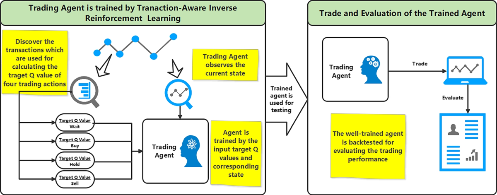

## Table of Contents

## What is an inverse transaction?

An inverse transaction is when you do the opposite of a previous action to cancel it out. For example, if you bought something, an inverse transaction would be selling it back. This helps to undo what was done before and can be useful in many situations, like fixing mistakes or returning items.

In finance, inverse transactions are often used to manage risk or correct errors. If someone made a wrong investment, they might do an inverse transaction to get out of it. This way, they can try to avoid losing more money or fix the mistake they made. It's like hitting a reset button to go back to how things were before the original action.

## How does an inverse transaction differ from a regular transaction?

An inverse transaction is like doing the opposite of what you did before. If you think of a regular transaction as buying something, an inverse transaction would be selling that same thing. It's a way to undo or cancel out what you did in the first transaction. For example, if you bought a toy, the inverse transaction would be returning the toy and getting your money back.

A regular transaction is just a normal action, like buying, selling, or trading something. It's what you do every day when you go shopping or pay for services. An inverse transaction, on the other hand, is specifically meant to reverse the effects of a regular transaction. So, while a regular transaction moves you forward in some way, an inverse transaction tries to bring you back to where you started.

## Can you explain the basic mechanism of an inverse transaction?

An inverse transaction is like hitting the undo button on a previous action. Imagine you bought a toy. To do an inverse transaction, you would return the toy and get your money back. This means you are doing the opposite of what you did before, which was buying the toy. The goal is to cancel out the first transaction and go back to how things were before you made the purchase.

In finance, an inverse transaction works the same way. If you invested in a stock, the inverse transaction would be selling that stock. This can help you manage risk or fix a mistake. For example, if you realize you made a bad investment, you can sell the stock to stop losing more money. By doing the opposite of your original action, you try to return to your starting point and undo what you did before.

## What are the primary purposes of using inverse transactions?

Inverse transactions are mainly used to undo what you did before. If you bought something and later want to take it back, an inverse transaction helps you return the item and get your money back. It's like pressing an undo button to go back to how things were before you made the purchase. This can be really helpful if you made a mistake or changed your mind about something you bought.

In finance, inverse transactions are also used to manage risk. If you invested in a stock and it's not doing well, you can sell it to stop losing more money. This is another way of undoing your original action, which was buying the stock. By doing the opposite, you try to go back to your starting point and avoid further losses. So, inverse transactions are useful for fixing mistakes and managing financial risks.

## In which industries or sectors are inverse transactions commonly used?

Inverse transactions are commonly used in the finance and banking industry. If someone buys a stock and it goes down in value, they can sell it to stop losing more money. This is like undoing the original purchase. Banks also use inverse transactions when they need to correct mistakes, like if they accidentally put money into the wrong account. They can take the money back out to fix the error.

Another sector where inverse transactions are common is retail. If you buy something from a store and later decide you don't want it, you can return it and get your money back. This is an inverse transaction because it undoes the purchase. Many stores have return policies that allow customers to do this, which helps keep shoppers happy and gives them a chance to fix any buying mistakes they made.

## What are the potential benefits of implementing inverse transactions?

Inverse transactions can be really helpful because they let you fix mistakes. If you bought something and later realized it was a bad choice, you can return it and get your money back. This is like hitting an undo button, which can save you from losing money or keeping things you don't need. In the finance world, if you invested in a stock that's not doing well, you can sell it to stop losing more money. This helps you manage your risks and try to get back to where you started.

Another benefit is that inverse transactions can make customers happier. In retail, if a store lets you return items easily, you feel more comfortable buying things. You know you can take something back if it's not right, which can make shopping less stressful. For businesses, offering inverse transactions can build trust with customers and make them more likely to come back and shop again. This can be good for the store's reputation and overall success.

## What are the risks or challenges associated with inverse transactions?

Inverse transactions can be tricky because they might cost you money. When you return something, the store might charge you a fee, or you might lose money if the item's value went down since you bought it. In finance, if you sell a stock to undo your investment, you might not get back all the money you put in, especially if the stock's price dropped. So, while inverse transactions can help fix mistakes, they can also lead to extra costs or losses.

Another challenge is that not all inverse transactions are easy to do. Some stores have strict return policies, which can make it hard to return items. In finance, selling certain investments might take time or have rules you need to follow. This means you can't always undo what you did right away. You might have to wait or deal with a lot of paperwork, which can be frustrating and slow down the process of fixing your mistake.

## How do regulatory frameworks impact the use of inverse transactions?

Regulatory frameworks can make inverse transactions more complicated. Governments and financial authorities set rules that businesses and people have to follow. For example, in finance, there might be rules about how quickly you can sell certain investments or what information you need to give when you do an inverse transaction. These rules are there to protect everyone and make sure things are fair, but they can also make it harder to undo what you did quickly or easily. If you want to return something you bought, the store's return policy might be affected by laws that say how long you have to return items or what condition they need to be in.

In some industries, like banking and finance, regulators might watch inverse transactions closely to stop fraud or other bad behavior. This means that if you want to do an inverse transaction, you might need to fill out more forms or wait longer for approval. This can be frustrating if you're trying to fix a mistake fast. But these rules help keep the system honest and safe for everyone. So, while regulatory frameworks can make inverse transactions more challenging, they are important for keeping things fair and protecting people from harm.

## Can you provide a case study or example of an inverse transaction in action?

Imagine Sarah bought a new smartphone from an electronics store. After a week, she realized the phone was too complicated for her needs. She decided to return it and get her money back. Sarah went to the store with her receipt and the phone, which was still in good condition. The store accepted the return, and Sarah got her money back. This is an example of an inverse transaction because Sarah undid her original purchase by returning the phone and getting a refund.

In another case, John invested in a stock that he thought would go up in value. But after a few months, the stock started to drop, and John was worried about losing more money. He decided to sell the stock to stop the losses. By selling the stock, John was doing an inverse transaction to undo his initial investment. Although he didn't get back all the money he put in because the stock's value had gone down, he managed to limit his losses and move on to other investments.

## What technological tools or platforms support the execution of inverse transactions?

Many technological tools and platforms help with inverse transactions. In retail, stores use point-of-sale (POS) systems to handle returns. When you want to return something, the store worker uses the POS system to scan the item and your receipt. The system then processes the return and gives you your money back. Online shopping websites also have easy ways to return items. You can go to your account, find the order, and start the return process. The website guides you through the steps, and you can print a return label to send the item back.

In finance, trading platforms and apps make it easy to do inverse transactions. If you want to sell a stock, you can log into your trading app, find the stock in your portfolio, and click "sell." The platform will handle the sale and put the money back into your account. Banks also use online banking systems to manage inverse transactions. If you need to reverse a payment or transfer, you can do it through the bank's website or app. These tools make it simple to undo what you did before and help you manage your money better.

## How do inverse transactions affect financial reporting and accounting practices?

Inverse transactions can change how businesses report their money. When a company does an inverse transaction, like returning a product or selling an investment, it needs to update its financial records. This means the company has to take the money or value of the returned item out of its sales or investment records. This can make the company's total sales or profits look different. For example, if a store returns a lot of items, its sales numbers will go down, which can affect how investors see the company.

Accounting practices also need to handle inverse transactions carefully. Accountants have to make sure they record these transactions correctly so the company's financial statements are accurate. This can be tricky because inverse transactions might involve fees or losses that need to be accounted for. For instance, if a company sells an investment at a loss, the accountants need to show this loss in the financial reports. This helps everyone understand the true financial health of the company and makes sure the numbers are right.

## What future trends or developments might influence the use of inverse transactions?

In the future, technology might make inverse transactions even easier and quicker. As more people shop online, websites and apps could get better at handling returns. They might use [artificial intelligence](/wiki/ai-artificial-intelligence) to make the return process smoother, so you can return items with just a few clicks. Also, blockchain technology could help make financial inverse transactions safer and more transparent. This means you could sell stocks or undo investments faster and with less risk of mistakes or fraud.

Another trend could be changes in rules and laws about inverse transactions. Governments might make new rules to protect consumers and make sure businesses handle returns fairly. This could mean easier returns for shoppers or stricter rules for companies to follow. In finance, regulators might update laws to make it simpler to undo investments or correct errors. These changes could make inverse transactions more common and easier to do, helping people fix mistakes and manage their money better.

## References & Further Reading

[1]: Bergstra, J., Bardenet, R., Bengio, Y., & Kégl, B. (2011). ["Algorithms for Hyper-Parameter Optimization."](https://dl.acm.org/doi/10.5555/2986459.2986743) Advances in Neural Information Processing Systems 24.

[2]: ["Advances in Financial Machine Learning"](https://www.amazon.com/Advances-Financial-Machine-Learning-Marcos/dp/1119482089) by Marcos Lopez de Prado

[3]: ["Evidence-Based Technical Analysis: Applying the Scientific Method and Statistical Inference to Trading Signals"](https://www.amazon.com/Evidence-Based-Technical-Analysis-Scientific-Statistical/dp/0470008741) by David Aronson

[4]: ["Machine Learning for Algorithmic Trading"](https://github.com/stefan-jansen/machine-learning-for-trading) by Stefan Jansen

[5]: ["Quantitative Trading: How to Build Your Own Algorithmic Trading Business"](https://www.amazon.com/Quantitative-Trading-Build-Algorithmic-Business/dp/1119800064) by Ernest P. Chan