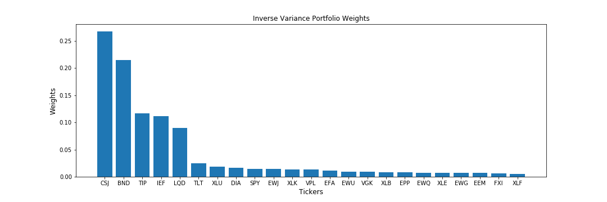

## Table of Contents

## What is an Inverse-Variance Portfolio (IVP)?

An Inverse-Variance Portfolio (IVP) is a type of investment strategy where you pick stocks or assets based on how much they move around, or their volatility. Instead of choosing assets that go up and down a lot, you pick ones that don't change much in price. The idea is to make a portfolio that is less risky because it uses assets that are more stable.

To build an IVP, you first figure out how much each asset's price changes over time. This is called its variance. Then, you do the opposite of what you might expect: you give more weight to the assets with lower variance. So, if one stock moves a lot and another doesn't move much, you'll put more money into the one that doesn't move much. This way, your overall portfolio should be steadier and less likely to lose a lot of value quickly.

## How does the IVP differ from other portfolio construction methods?

An Inverse-Variance Portfolio (IVP) is different from other portfolio construction methods because it focuses on how much the prices of assets change, or their volatility. Most other methods might look at how much money an asset can make or how it moves with other assets. For example, a method like the Modern Portfolio Theory (MPT) tries to find a balance between risk and reward by looking at how assets move together, or their correlation. But IVP doesn't care about how assets move together; it just wants to pick the ones that don't move much.

Another way IVP differs is in how it decides to put money into assets. In methods like the Capital Asset Pricing Model (CAPM), you might put more money into assets that are expected to make more money, even if they are riskier. But with IVP, you do the opposite. You put more money into the assets that don't change much in price, even if they might not make as much money. This means IVP is all about making your portfolio more stable and less risky, while other methods might be more focused on making more money, even if it means taking on more risk.

## What are the key steps to construct an IVP?

To construct an Inverse-Variance Portfolio (IVP), you first need to figure out how much each asset's price changes over time. This is called the variance of the asset. You can do this by looking at the historical price data of each asset and calculating how much the prices go up and down. Once you have the variance for each asset, you take the opposite of that number. This means if an asset has a high variance, you'll use a low number for it, and if it has a low variance, you'll use a high number. This step is important because it helps you decide how much of each asset to put in your portfolio.

After you have the inverse of the variances, you use these numbers to decide how much money to put into each asset. You give more money to the assets with lower variance because they don't change much in price. This makes your portfolio more stable. To do this, you add up all the inverse variances and then figure out what part of the total each asset's inverse variance is. That part is how much of your money you put into that asset. For example, if one asset's inverse variance is half of the total, you put half of your money into that asset. This way, your portfolio will be less risky because it's made up of assets that don't move around a lot.

## Why is variance important in the context of IVP?

Variance is really important in an Inverse-Variance Portfolio (IVP) because it tells you how much an asset's price changes over time. If an asset's price goes up and down a lot, it has high variance, which means it's risky. But if the price stays pretty steady, it has low variance, which means it's safer. In an IVP, you want to pick assets that don't change much in price, so you look at their variance to help you decide.

When you're building an IVP, you use the opposite of variance to decide how much money to put into each asset. This means you put more money into the assets with low variance because they're less risky. By doing this, you make your whole portfolio more stable and less likely to lose a lot of value quickly. So, variance is key because it helps you pick the right assets and figure out how much of each one to include in your portfolio.

## How do you calculate the inverse of variance for assets in an IVP?

To calculate the inverse of variance for assets in an Inverse-Variance Portfolio (IVP), you first need to find out the variance of each asset. Variance is a measure of how much an asset's price changes over time. You can calculate the variance by looking at the historical prices of the asset. For example, if you have daily price data, you can find the average price and then see how much each day's price differs from that average. You square these differences, add them up, and then divide by the number of days minus one. This gives you the variance of the asset.

Once you have the variance for each asset, you take the inverse of it. The inverse of a number is just one divided by that number. So, if an asset has a variance of 0.04, the inverse of that variance is 1 divided by 0.04, which equals 25. If another asset has a variance of 0.01, its inverse is 1 divided by 0.01, which equals 100. In an IVP, you use these inverse variances to decide how much money to put into each asset. The higher the inverse variance, the more money you put into that asset because it means the asset is less risky.

## Can you explain the mathematical formula used in IVP?

To build an Inverse-Variance Portfolio (IVP), you start by figuring out the variance of each asset. Variance shows how much an asset's price changes over time. You calculate it by looking at the historical prices of the asset. First, you find the average price, then you see how much each day's price differs from that average. You square these differences, add them up, and divide by the number of days minus one. This gives you the variance.

Once you have the variance for each asset, you take the inverse of it. The inverse of a number is just one divided by that number. So, if an asset has a variance of 0.04, the inverse is 1 divided by 0.04, which equals 25. After you have the inverses, you add them all up to get the total inverse variance. Then, you figure out what part of the total each asset's inverse variance is. That part is how much of your money you put into that asset. For example, if one asset's inverse variance is half of the total, you put half of your money into that asset. This way, your portfolio will be less risky because it's made up of assets that don't move around a lot.

## What are the advantages of using an IVP for asset allocation?

Using an Inverse-Variance Portfolio (IVP) for asset allocation has some big advantages. One of the main ones is that it helps make your investments less risky. IVP focuses on [picking](/wiki/asset-class-picking) assets that don't change much in price. This means your whole portfolio is more stable and less likely to lose a lot of value quickly. When the market goes up and down a lot, having a portfolio that doesn't move as much can be really helpful. It's like choosing a calm boat in a stormy sea.

Another advantage is that IVP is pretty simple to understand and use. You don't need to know a lot about how different investments move together or try to predict which ones will make the most money. You just need to look at how much each asset's price changes and then put more money into the ones that don't change much. This makes it easier for people who want a safer way to invest without having to do a lot of complicated work.

## What are the potential limitations or risks associated with IVP?

One of the main risks of using an Inverse-Variance Portfolio (IVP) is that it might not give you the best returns. IVP focuses on picking assets that don't change much in price, which makes your portfolio more stable but might also mean you miss out on making more money. If the market goes up a lot, the assets that don't change much might not go up as much, so your portfolio might not grow as fast as others that took more risk.

Another limitation is that IVP depends a lot on past data. It uses how much an asset's price changed in the past to decide how much of it to put in your portfolio. But, past performance doesn't always tell you what will happen in the future. If the market changes a lot, the assets that were stable before might not be stable anymore. This means your portfolio might not be as safe as you thought it would be.

Lastly, IVP doesn't take into account how different assets move together, or their correlation. Other methods like Modern Portfolio Theory look at this to help balance risk and reward. By not considering correlation, IVP might not be as good at reducing risk as it could be. If all the assets in your IVP start moving in the same way, your portfolio could still lose a lot of value, even though it's made up of assets that don't change much on their own.

## How does IVP perform in different market conditions?

An Inverse-Variance Portfolio (IVP) usually does well in markets that are going up and down a lot. Since IVP picks assets that don't change much in price, it can help keep your investments more stable when other parts of the market are moving around a lot. This means your portfolio might not lose as much value during times when the market is going down. So, if you're looking for a way to keep your investments safe during tough times, IVP can be a good choice.

However, IVP might not do as well when the market is going up a lot. Because IVP focuses on assets that don't change much, it might miss out on big gains that come from riskier assets. If the market keeps going up, a portfolio that takes more risks could grow faster than an IVP. So, while IVP can help protect your money when things are shaky, it might not be the best choice if you're looking to make a lot of money during good times.

## Can IVP be combined with other risk management strategies?

Yes, you can mix an Inverse-Variance Portfolio (IVP) with other ways to manage risk. One way is to use something called stop-loss orders. A stop-loss order is when you tell your broker to sell an asset if its price drops to a certain level. This can help you lose less money if the market goes down a lot. By using IVP to pick stable assets and stop-loss orders to limit your losses, you can make your portfolio even safer.

Another way to combine IVP with other risk management strategies is to use something called diversification. Diversification means spreading your money across different types of investments, like stocks, bonds, and real estate. Even though IVP focuses on assets that don't move much, adding different types of investments can help protect your portfolio from big losses. So, if you use IVP to pick stable assets and also diversify, you can have a more balanced and safer portfolio.

## What are some real-world examples of IVP implementation?

One real-world example of an Inverse-Variance Portfolio (IVP) being used is in the management of retirement funds. Some financial advisors and fund managers use IVP to help make sure the money in a retirement account stays safe. They pick investments like bonds or stable stocks that don't change much in price. This way, the retirement savings are less likely to lose a lot of value if the market goes down. It's all about keeping the money steady and safe for when people retire.

Another example is in the world of robo-advisors, which are online platforms that help people invest their money. Some robo-advisors use IVP as part of their strategy to build portfolios for their clients. They look at how much different assets move around and then put more money into the ones that are more stable. This helps the robo-advisor offer a safer investment option for people who don't want to take big risks. It's a simple way to help people keep their investments steady without needing to know a lot about the stock market.

## How can one optimize an IVP using advanced techniques or algorithms?

To make an Inverse-Variance Portfolio (IVP) even better, you can use something called [machine learning](/wiki/machine-learning). Machine learning is a way for computers to learn from data and make smart choices. You can use it to look at a lot of information about how assets have moved in the past and then guess how they might move in the future. This can help you pick the best stable assets for your IVP. Another way to optimize an IVP is by using something called optimization algorithms. These are special math formulas that help you find the best way to put your money into different assets. They can look at all the possible ways to mix your investments and then pick the one that makes your portfolio the most stable.

Another advanced technique you can use is called shrinkage estimation. This is a way to make your guesses about how much assets will move around more accurate. Shrinkage estimation helps you mix your data with other information to come up with better numbers for the variance of each asset. By using this, you can make your IVP even more stable. Also, you can use something called robust optimization. This is a way to make your portfolio strong against big changes in the market. It helps you plan for the worst-case scenarios so your IVP can handle surprises better. By using these advanced techniques, you can make your IVP smarter and safer.

## What is an Inverse-Variance Portfolio (IVP) and how does it work?

The Inverse-Variance Portfolio (IVP) represents a pragmatic approach to constructing investment portfolios by focusing on minimizing risk without extensive reliance on expected return estimates. In this methodology, asset weights are assigned inversely proportional to their variances. This simple yet effective technique exploits the low-[volatility](/wiki/volatility-trading-strategies) anomaly, which observes that lower volatility assets often yield better risk-adjusted returns compared to their higher volatility counterparts. 

In mathematical terms, given a set of assets $A_1, A_2, \ldots, A_n$, the weights $w_i$ for each asset $i$ in the portfolio can be calculated as follows:

$$

w_i = \frac{\frac{1}{\sigma_i^2}}{\sum_{j=1}^{n} \frac{1}{\sigma_j^2}} 
$$

where $\sigma_i^2$ is the variance of returns for asset $i$. This formula ensures that the sum of all weights equals one, distributing the investment capital across assets based on their individual risk profiles.

The IVP methodology offers significant benefits by focusing primarily on volatility data, making it less susceptible to the inaccuracies that often accompany return predictions. This stands in contrast to the Markowitz mean-variance optimization framework, which requires explicit estimates of expected returns and covariances. These estimates can introduce substantial errors, potentially destabilizing portfolio performance.

The practical advantages of IVP, including its computational simplicity and reduced data requirements, enhance its appeal to algorithmic traders. These traders, who often operate under fast-paced and data-rich environments, benefit from IVP's robustness against uncertainty in return forecasts. By prioritizing risk management through volatility minimization, IVP serves as a robust strategy for achieving optimal portfolios in varied market conditions while maintaining efficiency.

## References & Further Reading

[1]: Ang, A. (2014). ["Asset Management: A Systematic Approach to Factor Investing."](https://academic.oup.com/book/3342) Oxford University Press.

[2]: De Prado, M. L. (2018). ["Advances in Financial Machine Learning."](https://www.amazon.com/Advances-Financial-Machine-Learning-Marcos/dp/1119482089) Wiley.

[3]: Grinold, R. C., & Kahn, R. N. (1999). ["Active Portfolio Management: A Quantitative Approach for Producing Superior Returns and Controlling Risk."](https://books.google.com/books/about/Active_Portfolio_Management_A_Quantitati.html?id=a1yB8LTQnOEC) McGraw-Hill.

[4]: Aronson, D. R. (2007). ["Evidence-Based Technical Analysis: Applying the Scientific Method and Statistical Inference to Trading Signals."](https://onlinelibrary.wiley.com/doi/book/10.1002/9781118268315) John Wiley & Sons.

[5]: Clarke, R., de Silva, H., & Thorley, S. (2016). ["Minimum-Variance Portfolio Composition."](https://www.hillsdaleinv.com/uploads/Minimum-Variance_Portfolio_Composition,_Roger_Clarke,_Harindra_de_Silva,_Steven_Thorley.pdf) Financial Analysts Journal, 64(2), 48-63.

[6]: Jansen, S. (2020). ["Machine Learning for Algorithmic Trading."](https://github.com/stefan-jansen/machine-learning-for-trading) Packt Publishing.