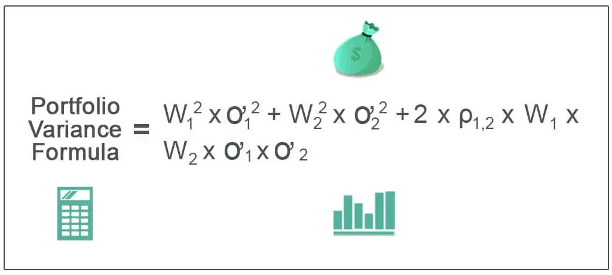

In quantitative finance, portfolio optimization is vital for enhancing returns while managing risk. The Inverse-Variance Portfolio (IVP) is an approach widely used in algorithmic trading for creating diversified portfolios. By allocating weights inversely proportional to the variance of asset returns, IVP seeks to maximize diversification and minimize volatility. This method is based on the low-volatility anomaly, which suggests that low-volatility assets tend to produce superior risk-adjusted returns compared to their high-volatility counterparts.

The focus of this article is to examine the concept of IVP, emphasizing its significance in contemporary trading strategies and its juxtaposition with other portfolio optimization techniques, such as Hierarchical Risk Parity (HRP) and the traditional Markowitz portfolio. While HRP uses techniques like hierarchical clustering to manage risk and enhance diversification, Markowitz optimization, also known as mean-variance optimization, aims to balance returns against risk but can suffer from estimation errors.



We will dissect the mathematics underlying IVP, discuss its implementation using Algorithmic systems such as Python, and highlight its practical applications in modern trading scenarios. Understanding these elements is crucial for algorithmic traders seeking robust and efficient portfolio strategies. Furthermore, the comparative analysis of IVP against HRP and Markowitz provides insight into the relative merits and limitations of each method, helping investors make informed decisions.

## Table of Contents

## Understanding Inverse-Variance Portfolio (IVP)

The Inverse-Variance Portfolio (IVP) represents a pragmatic approach to constructing investment portfolios by focusing on minimizing risk without extensive reliance on expected return estimates. In this methodology, asset weights are assigned inversely proportional to their variances. This simple yet effective technique exploits the low-[volatility](/wiki/volatility-trading-strategies) anomaly, which observes that lower volatility assets often yield better risk-adjusted returns compared to their higher volatility counterparts. 

In mathematical terms, given a set of assets $A_1, A_2, \ldots, A_n$, the weights $w_i$ for each asset $i$ in the portfolio can be calculated as follows:

$$

w_i = \frac{\frac{1}{\sigma_i^2}}{\sum_{j=1}^{n} \frac{1}{\sigma_j^2}} 
$$

where $\sigma_i^2$ is the variance of returns for asset $i$. This formula ensures that the sum of all weights equals one, distributing the investment capital across assets based on their individual risk profiles.

The IVP methodology offers significant benefits by focusing primarily on volatility data, making it less susceptible to the inaccuracies that often accompany return predictions. This stands in contrast to the Markowitz mean-variance optimization framework, which requires explicit estimates of expected returns and covariances. These estimates can introduce substantial errors, potentially destabilizing portfolio performance.

The practical advantages of IVP, including its computational simplicity and reduced data requirements, enhance its appeal to algorithmic traders. These traders, who often operate under fast-paced and data-rich environments, benefit from IVP's robustness against uncertainty in return forecasts. By prioritizing risk management through volatility minimization, IVP serves as a robust strategy for achieving optimal portfolios in varied market conditions while maintaining efficiency.

## Algorithmic Implementation of IVP

Implementing the Inverse-Variance Portfolio (IVP) in [algorithmic trading](/wiki/algorithmic-trading) requires a systematic approach involving the calculation of portfolio weights based on the inverse of each asset's variance. The process begins with the determination of the variance for each asset's returns within the portfolio. The inverse of these variances is then computed to assess the relative stability of each asset.

The subsequent step involves normalizing these inverted variance values to ensure the portfolio weights total to one. This normalization is essential for maintaining a coherent investment structure within the portfolio.

### Step-by-Step Implementation

**1. Calculate Asset Variance:**

The variance of each asset's returns can be calculated using Python, employing libraries such as NumPy and Pandas for efficient data manipulation.

```python
import pandas as pd
import numpy as np

# Assuming 'data' is a DataFrame containing historical return data for each asset
variances = data.var()
```

**2. Compute Inverse Variance:**

Once the variances are obtained, compute the inverse of each variance. This value serves as the input for determining the asset's weight within the IVP framework.

```python
inverse_variances = 1 / variances
```

**3. Normalize Inverse Variances:**

Normalize these inverted values so that they sum to one, thereby representing the proportionate allocation for each asset in the portfolio.

```python
weights = inverse_variances / inverse_variances.sum()
```

### Example Code Snippet

Here is a practical example illustrating the complete implementation in Python:

```python
import pandas as pd
import numpy as np

# Example DataFrame containing daily returns for three assets
data = pd.DataFrame({
    'Asset_A': [0.01, 0.02, -0.01, 0.03],
    'Asset_B': [-0.02, 0.01, 0.04, 0.01],
    'Asset_C': [0.03, -0.01, 0.02, 0.01]
})

# Calculate variance of each asset
variances = data.var()

# Compute inverse of variances
inverse_variances = 1 / variances

# Normalize the inverse variances to get the weights
weights = inverse_variances / inverse_variances.sum()

print("Portfolio Weights:")
print(weights)
```

### Integration Flexibility

The simplicity and computational efficiency of the IVP make it an adaptable option for integration into broader trading algorithms and automated investment platforms. Its reliance on historical volatility rather than expected returns allows for robust performance even when precise forecasting is challenging. As a result, IVP is well-suited for dynamic market environments where traditional predictive methods may fall short.

Overall, the Inverse-Variance Portfolio offers algorithmic traders a straightforward yet effective strategy for portfolio diversification and risk management. By leveraging commonly used programming libraries, traders can swiftly deploy this strategy within their trading infrastructure, enabling responsive and data-driven decision-making processes.

## Comparison with HRP and Markowitz Portfolio

The Hierarchical Risk Parity (HRP) method and Markowitz portfolio optimization represent advanced methodologies in portfolio allocation, each with distinct features, advantages, and limitations compared to the Inverse-Variance Portfolio (IVP).

Hierarchical Risk Parity (HRP) leverages [machine learning](/wiki/machine-learning) techniques such as hierarchical clustering and recursive bisection to establish a tree structure of assets. By doing so, HRP aims to enhance diversification and better manage risks, addressing typical limitations of traditional covariance-based models. The hierarchical clustering groups similar assets, enabling the effective allocation of capital based on similarities in asset behavior, reducing the risk of concentrated financial exposure.

Markowitz portfolio optimization, known for being a cornerstone in modern portfolio theory, emphasizes minimizing portfolio variance while ensuring a mean level of return. This method constructs the Efficient Frontier, allowing investors to select portfolios that optimize the trade-off between risk and return. However, the approach depends heavily on accurate parameter estimation—expected returns, variances, and covariances—making it vulnerable to estimation errors and instability, especially in dynamic markets where these parameters frequently change.

In contrast, the Inverse-Variance Portfolio (IVP) stands out due to its simplicity and the avoidance of reliance on expected returns. IVP assigns weights to assets inversely proportional to their variance, fundamentally relying on the presumption that low-volatility assets generally provide better risk-adjusted returns. This simplicity provides a key advantage over complex models, as it reduces the dependency on volatile and uncertain data inputs that can affect the Markowitz model's accuracy.

A comparison of these techniques often underscores IVP's strong performance out-of-sample, which refers to its ability to maintain efficiency when tested against new data outside of the initially used dataset. This performance is particularly relevant in unstable markets where predictive accuracy tends to be low. In essence, IVP can provide robust solutions without intricate computations, making it highly appealing for algorithmic trading strategies where computational efficiency and adaptability to changing data are crucial.

The strengths and weaknesses of each method shape their applicability to different scenarios. HRP's structure makes it well-suited for portfolios with a large number of assets, where diversification and risk management are prioritized. The Markowitz method is preferable when accurate estimation of expected returns and covariances is feasible, allowing it to fine-tune the balance of risk and return. IVP is advantageous for traders seeking straightforward implementation and reliable performance across varying market conditions, particularly when avoiding the pitfalls of overfitting is essential.

Ultimately, the choice among these methodologies depends on the specific investment goals, data availability, and computational resources of the trader or analyst.

## Advantages of Using IVP in Algo Trading

The Inverse-Variance Portfolio (IVP) is highly regarded in algorithmic trading due to its simplicity and effectiveness. One of the primary advantages of IVP is its ease of implementation, which stems from its reliance on the calculation of asset variances instead of expected returns. This approach significantly reduces the complexity involved in modeling asset behaviors. Unlike more elaborate methods, IVP sidesteps the challenge of estimating expected returns, which are often subject to considerable uncertainty and estimation error.

Focusing on volatility rather than expected returns offers a distinct advantage: it reduces the risk of model overfitting. Overfitting occurs when a model captures noise instead of the underlying signal, often leading to poor performance on new data. By using variance as the primary input for asset weight allocation, IVP avoids the pitfalls associated with volatile and possibly unreliable return estimates, thereby promoting more stable portfolio performance.

IVP is especially effective in volatile markets where the predictability of returns is low. In such environments, accurately forecasting future returns is challenging, making IVP's reliance on historical volatility a pragmatic choice. The methodology inherently adapts to changing market conditions, adjusting asset weights based on observed volatility patterns. This adaptability allows IVP to maintain balanced risk allocations without necessitating complex forecasting models.

The robustness of IVP makes it applicable across various investment horizons and asset classes. Whether employed in short-term trading strategies or long-term investment plans, IVP provides a flexible framework for risk management. Its simplicity does not detract from its capability to handle diverse asset classes, from equities to fixed income and beyond, enabling traders and investors to construct diversified portfolios with a focus on minimizing risk.

Empirical studies have suggested that, under certain market conditions, IVP can outperform more complex strategies. This outperformance is often attributed to IVP's focus on volatility, which captures a core aspect of risk without relying heavily on potentially unstable parameters like expected returns or correlations. In scenarios where market dynamics cause traditional optimization methods to falter due to estimation errors, IVP can maintain its reliability and effectiveness, offering a competitive edge in strategy performance.

## Real-World Applications and Case Studies

The Inverse-Variance Portfolio (IVP) approach has been successfully applied in diverse algorithmic trading systems, providing a robust framework for managing risk and optimizing returns across various asset classes. Several case studies highlight its effective deployment in equity trading, commodity investments, and fixed-income portfolios.

In equity trading, the IVP strategy is particularly advantageous due to its capacity to enhance portfolio stability during volatile market conditions. By allocating higher weights to lower-volatility stocks, IVP naturally dampens the volatility of the entire portfolio. Historical data analyses reveal that during market upheavals, such as the financial crises of 2008 and 2020, portfolios using IVP demonstrated superior resilience, maintaining more stable returns compared to those using traditional optimization techniques.

Commodity investments also benefit from the IVP methodology. The commodities market, known for its inherent volatility, poses significant challenges for traders. Here, IVP's focus on variance helps in constructing portfolios that mitigate exposure to high-risk assets while reaping returns from more stable commodities. By utilizing IVP, traders can achieve a balance, leveraging predictable asset performance amidst unpredictable market dynamics.

In the context of fixed-income portfolios, IVP's relevance is underscored by its ability to handle different [interest rate](/wiki/interest-rate-trading-strategies) environments. Fixed-income assets, such as bonds, often experience fluctuations in yield and risk based on changes in economic conditions and monetary policies. The IVP approach, focusing on minimizing portfolio variance, can adapt to varying levels of interest rate risk. This adaptability has shown to enhance performance metrics during periods of interest rate hikes and cuts.

The practical adaptability of IVP to different market environments and asset types further solidifies its value. Beyond asset-specific applications, IVP's robustness makes it suitable for different economic cycles, helping investors navigate both bull and bear markets effectively. Whether during periods of growth or recession, the strategy's focus on minimizing volatility while retaining reasonable returns is invaluable.

Interviews with industry professionals provide additional insights into the strategy's implementation and benefits. Experts often praise IVP for its simplicity and efficiency, noting its ability to integrate seamlessly with existing trading systems. Financial analysts emphasize that while IVP may not capture the highest possible returns during aggressive market rallies, its utility in preserving capital and providing stable returns outweighs such concerns in the broader scope of risk management.

Overall, case studies and practitioner insights consistently demonstrate the success and practicality of IVP in real-world trading scenarios, highlighting its contribution to building resilient and diversified portfolios.

## Conclusion

The Inverse-Variance Portfolio (IVP) continues to stand as a significant choice for algorithmic traders who prioritize simplicity combined with effectiveness. IVP's fundamental approach of allocating weights inversely proportional to the variance of asset returns provides an intuitive yet robust method for portfolio optimization. This strategy allows traders to construct portfolios without the need for complex calculations or extensive data requirements, making it particularly appealing in ever-changing markets.

Although IVP is not devoid of limitations, it effectively serves as a straightforward alternative to more intricate models, such as the Markowitz mean-variance optimization and Hierarchical Risk Parity (HRP). Its reliance on volatility rather than volatile return predictions helps mitigate the risks of model overfitting and estimation errors, issues that more complex methods often face.

The trading landscape is continually evolving, with technological advances pushing the boundaries of traditional methods. Ongoing research is focusing on enhancing IVP's effectiveness, ensuring it can adapt to modern computational finance's rapid developments. This progression may see the integration of IVP with sophisticated machine learning techniques, potentially improving its predictive capabilities and making it even more adaptable to market oscillations.

Traders and investors are encouraged to evaluate IVP in conjunction with other strategies, leveraging its unique advantages to build resilient and diversified portfolios. By comparing the simplicity and empirical effectiveness of IVP with alternative strategies, traders can optimize their approach to risk management and returns.

As IVP evolves, future innovations may unlock new potential by incorporating advanced machine learning algorithms, further increasing predictive power and adaptability to diverse market conditions. This future-oriented development ensures that IVP remains a relevant and efficient tool for traders aiming to navigate the complexities of contemporary financial markets.

## References

1. Building Diversified Portfolios that Outperform Out-of-Sample provides significant insights into advanced techniques for constructing portfolios that excel beyond sample data. This paper is frequently cited in discussions regarding improving portfolio diversifications and optimizing them for real-world applications.

2. Hierarchical Risk Parity: An Introduction offers a detailed exploration of the Hierarchical Risk Parity (HRP) method. It illustrates how HRP employs hierarchical clustering and recursive bisection, thereby enabling superior asset allocation compared to traditional models, including comparisons with the Inverse-Variance Portfolio (IVP).

3. The Quantitative Finance Stack Exchange hosts a variety of user discussions which explore the effectiveness of the Inverse-Variance Portfolio, particularly focusing on its performance across different market conditions. These discussions often compare IVP against more complex models, highlighting its robustness and simplicity.

4. Publications by analytics and financial research organizations underscore the significance of IVP in contemporary trading strategies. These publications emphasize its utility in algorithmic trading, pointing to numerous studies and reports that document the strategy's adaptability and performance metrics.

5. Documentation and case studies from financial technology platforms reveal the real-world deployment of IVP. These sources provide practical examples of how IVP is integrated into both equity and fixed-income portfolios, offering evidence of enhanced performance during market disruptions and varying economic cycles.

## References & Further Reading

[1]: Ang, A. (2014). ["Asset Management: A Systematic Approach to Factor Investing."](https://academic.oup.com/book/3342) Oxford University Press.

[2]: De Prado, M. L. (2018). ["Advances in Financial Machine Learning."](https://www.amazon.com/Advances-Financial-Machine-Learning-Marcos/dp/1119482089) Wiley.

[3]: Grinold, R. C., & Kahn, R. N. (1999). ["Active Portfolio Management: A Quantitative Approach for Producing Superior Returns and Controlling Risk."](https://books.google.com/books/about/Active_Portfolio_Management_A_Quantitati.html?id=a1yB8LTQnOEC) McGraw-Hill.

[4]: Aronson, D. R. (2007). ["Evidence-Based Technical Analysis: Applying the Scientific Method and Statistical Inference to Trading Signals."](https://onlinelibrary.wiley.com/doi/book/10.1002/9781118268315) John Wiley & Sons.

[5]: Clarke, R., de Silva, H., & Thorley, S. (2016). ["Minimum-Variance Portfolio Composition."](https://www.hillsdaleinv.com/uploads/Minimum-Variance_Portfolio_Composition,_Roger_Clarke,_Harindra_de_Silva,_Steven_Thorley.pdf) Financial Analysts Journal, 64(2), 48-63.

[6]: Jansen, S. (2020). ["Machine Learning for Algorithmic Trading."](https://github.com/stefan-jansen/machine-learning-for-trading) Packt Publishing.