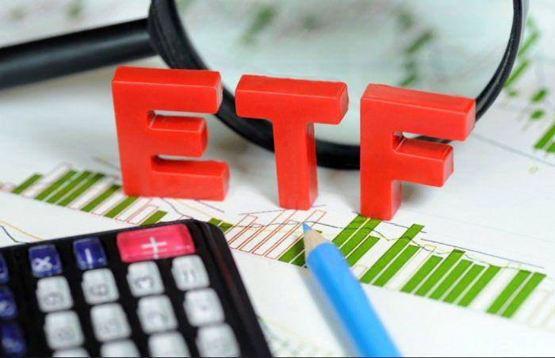

Exchange-Traded Funds (ETFs) are a widely utilized investment tool in today's financial markets. They offer a diverse range of assets, including stocks, bonds, and commodities, and are often lauded for their affordability and liquidity, making them an attractive option for both individual and institutional investors. ETFs function by tracking the performance of specific indices, allowing investors to gain exposure to a broad spectrum of market segments without purchasing each underlying security individually. This passively managed approach helps reduce costs and simplifies portfolio management while providing opportunities for diversification and risk management.

Inverse volatility ETFs are a specific subset of ETFs designed to manage market volatility. Unlike conventional ETFs that track an index's performance, inverse volatility ETFs are structured to profit from declines in market volatility. They achieve this by taking positions that benefit when volatility, typically measured by indices such as the VIX, decreases. This creates a mechanism for investors to potentially capitalize on periods of market calm.



In recent years, there has been a notable increase in interest surrounding inverse volatility ETFs. Investors are increasingly considering these complex financial instruments for their ability to diversify portfolios and manage risk, especially during volatile market conditions. The appeal lies in their unique approach to hedging against market downturns and offering potential returns when conventional equity investments underperform.

The themes examined in this article include financial history, investment criticism, and algorithmic trading. By analyzing the historical development of inverse volatility ETFs, we gain insight into their evolution and the events shaping their market presence. Investment criticism addresses the concerns and debates regarding their market impact and suitability for retail investors. Finally, algorithmic trading is discussed in light of technological advancements and its influence on the pricing and dynamics of these financial products.

The objective of this article is to explore the complexities and debates surrounding inverse volatility ETFs. By understanding their mechanism and role in modern portfolios, investors can make informed decisions about incorporating these instruments into their investment strategies. This analysis aims to provide a comprehensive overview of the benefits, risks, and controversies associated with inverse volatility ETFs, encouraging ongoing education and awareness among investors engaging with complex financial products.

## Table of Contents

## Understanding Inverse Volatility ETFs

Exchange-Traded Funds (ETFs) have become a significant fixture in modern investment strategies, offering diverse options such as inverse volatility ETFs, which have garnered interest for their unique approach to risk and reward. An inverse volatility ETF is a financial instrument designed to gain value when market volatility decreases, essentially betting against volatility movements.

### Definition and Mechanics

Inverse [volatility](/wiki/volatility-trading-strategies) ETFs are crafted to deliver the inverse performance of a given volatility index, most commonly the Cboe Volatility Index (VIX). These funds use derivatives, like futures contracts, options, and swaps, to achieve their objectives. If the underlying volatility index falls by 1%, the inverse volatility [ETF](/wiki/etf-trading-strategies) typically seeks a 1% gain, minus fees. This functionality is often achieved through daily rebalancing mechanisms, which align the fund's exposure to match its inverse target on a day-to-day basis.

### Profit from Decreases in Market Volatility

These ETFs are appealing in periods of declining volatility, offering potential profits when market calmness prevails. For example, during a stable economic environment with moderate growth, traditional market volatility decreases. In such scenarios, inverse volatility ETFs may appreciate as fear-induced reactions in the market wane. Investors using these ETFs are essentially making a directional bet that volatility will continue to diminish.

### Popular Inverse Volatility ETFs

Some well-known inverse volatility ETFs include the ProShares Short VIX Short-Term Futures ETF (SVXY) and the VelocityShares Daily Inverse VIX Short-Term ETN (XIV) — though the latter was liquidated after severe market disruption in early 2018. These funds typically invest in short-term futures contracts on the VIX to achieve their inverse exposure, and their structures are crafted to cater to sophisticated investors seeking to hedge or speculate on volatility movements.

### Comparison with Traditional Volatility ETFs

Inverse volatility ETFs contrast sharply with traditional volatility ETFs, like the iPath Series B S&P 500 VIX Short-Term Futures ETN (VXX), which aim to gain from increases in market volatility. Traditional volatility ETFs are generally perceived as protective measures against market downturns, while inverse variants are more speculative, catering to short-term tactical allocations. The risks associated with inverse volatility ETFs are pronounced, primarily due to their leveraging effect and exposure to derivative instruments, which can lead to amplified losses if volatility moves unexpectedly upward.

### Unique Risks and Hedging

The unique risks of inverse volatility ETFs derive from their complexity and leverage. Daily rebalancing can lead to significant compounding effects, making these products most suitable for short-term trading rather than long-term holding. Furthermore, during turbulent markets, the value of an inverse volatility ETF can suffer rapid declines, as evidenced by historical events where volatility spikes led to precipitous drops in fund values.

In terms of hedging, inverse volatility ETFs provide an unconventional tool. They can be part of a broader strategy to offset potential losses from other portfolio components expected to react negatively in low-volatility environments. However, their use in hedging involves understanding and accepting their inherent risks, necessitating carefully monitored exposures.

In summary, inverse volatility ETFs are complex instruments intended for investors who possess a rigorous understanding of market dynamics and the intricate nature of volatility trading. They offer opportunities during periods of decreasing volatility but expose investors to significant risks, particularly during abrupt market changes.

## Financial History of Inverse Volatility ETFs

Inverse volatility exchange-traded funds (ETFs) have a relatively brief yet significant history. These financial products are designed to offer investors returns that are inversely correlated with the changes in market volatility, typically measured by indices like the CBOE Volatility Index (VIX). The inception and evolution of inverse volatility ETFs can be traced alongside the broader adoption of volatility as a key investment [factor](/wiki/factor-investing).

### Origins and Development

Inverse volatility ETFs emerged in response to the increasing demand for more sophisticated risk management tools and speculative strategies. The pioneering of volatility-linked securities began with the introduction of VIX futures in 2004 by the Chicago Board Options Exchange (CBOE). This laid the groundwork for a variety of volatility-based products, including inverse volatility ETFs, which were first launched in the early 2010s.

### Key Milestones

A notable milestone in the development of inverse volatility ETFs was the introduction of the first products like the ProShares Short VIX Short-Term Futures ETF (SVXY) and the VelocityShares Daily Inverse VIX Short-Term ETN (XIV), which presented investors and traders with a new method to capitalize on declining volatility. These products gained quick popularity due to their ability to generate substantial returns during periods of market calm, contrasting with the performance of traditional long volatility products.

### Market Performance and Volatility Trends

Inverse volatility ETFs have been highly sensitive to market conditions, thriving during periods of low volatility. Their performance, however, significantly deteriorates during abrupt market upheavals when volatility spikes. The correlation between inverse volatility ETF performance and volatility indices can often be expressed mathematically as a negative Beta relative to the VIX.

Consider the relationship $R_{IV} = \alpha - \beta \cdot VIX$, where $R_{IV}$ is the return on the inverse volatility ETF, $\alpha$ is the intercept, and $\beta$ is the slope coefficient representing sensitivity to volatility changes. A higher negative $\beta$ reflects greater inverse sensitivity to volatility.

### Case Studies of Market Events

A defining event in the history of inverse volatility ETFs occurred in February 2018, often referred to as "Volmageddon." During this market event, the VIX experienced an unprecedented spike, causing massive losses for products like the XIV, which saw its value plummet, leading to its eventual liquidation. This catastrophe highlighted the risks intrinsic to inverse volatility strategies and prompted a reevaluation of their place in investment portfolios.

### Historical Performance Analysis

Over time, the historical performance of inverse volatility ETFs has shown distinctive patterns. These funds have delivered impressive returns during extended periods of market stability but have incurred significant losses during brief volatility spikes. Historical data analysis indicates that, while the potential for high returns exists, so too does the risk of rapid capital erosion.

The pattern of returns can be effectively modeled using historical return data and volatility estimates. By employing statistical tools and programming languages like Python, one can simulate and analyze the performance of inverse volatility ETFs under various market conditions.

```python
import numpy as np
import matplotlib.pyplot as plt

# Simulate VIX values and inverse ETF returns
np.random.seed(42)
vix = np.random.normal(15, 5, 100)  # Simulated VIX values
iv_returns = -0.1 * vix + np.random.normal(0, 2, 100)  # Inverse relationship

plt.plot(vix, iv_returns, 'o')
plt.title('Simulated Inverse Volatility ETF Returns vs VIX')
plt.xlabel('VIX Index Value')
plt.ylabel('Inverse Volatility ETF Returns')
plt.show()
```

This code snippet illustrates a simplified simulation of the relationship between VIX values and inverse volatility ETF returns, showcasing the inverse correlation typical of these products. This helps conceptualize how the performance of these ETFs is tied directly to market volatility trends. 

The financial journey of inverse volatility ETFs underscores both their potential utility in a diversified portfolio and the complexities inherent in their risk profiles.

## Investment Criticism of Inverse Volatility ETFs

Inverse volatility ETFs, which aim to profit from decreases in market volatility, have increasingly come under scrutiny. A primary criticism is their potential impact on market stability. These financial products can amplify market swings due to their inherent design targeted at exploiting volatility movements. When volatility declines, inverse volatility ETFs generate profits; however, unexpected spikes in volatility can lead to rapid and substantial losses, compounding market stress during turbulent periods.

Investment professionals argue that inverse volatility ETFs might inadvertently contribute to volatility by exacerbating feedback loops. For instance, during periods of heightened market stress, the mechanisms embedded within these ETFs necessitate the purchase of declining assets, further driving down their prices and increasing market instability. This dynamic can potentially enhance sharp market movements, particularly during events characterized by sudden volatility, such as the infamous "Volmageddon" on February 5, 2018, where the Cboe Volatility Index (VIX) experienced a dramatic surge, leading to a significant sell-off in related ETFs [^1^].

Regulatory bodies have expressed concerns regarding the proliferation of complex financial instruments like inverse volatility ETFs. The Securities and Exchange Commission (SEC), among others, has scrutinized these products under the pretext of investor protection and systemic risk management. The rapid expansion of these ETFs has prompted discussions around the need for enhanced disclosure requirements and tighter regulation to mitigate potential adverse impacts on financial markets.

Ethically, the promotion of inverse volatility ETFs to retail investors raises significant issues. Critics point out the challenges many investors face in fully understanding the sophisticated strategies and risks associated with these products. Despite efforts to educate investors, the complexity and unpredictable nature of inverse volatility ETFs mean that retail participants may unwittingly expose themselves to substantial financial risks.

High-profile failures have aggravated concerns about inverse volatility ETFs, underscoring their volatile nature. For example, after the 2018 volatility spike, several inverse volatility products incurred massive losses, leading to their eventual closure. These events highlight the inherent risks and raise questions about the sustainability and prudence of offering such products to a broad investing public, especially those without significant financial acumen.

Overall, while inverse volatility ETFs offer unique opportunities for hedging and profit, they simultaneously pose challenges and risks. The concerns surrounding market stability, regulatory requirements, ethical considerations, and historical failures emphasize the need for cautious engagement with these complex financial instruments.

[^1^]: Motskin, A., & Benz, F. (2018). Volmageddon: Understanding the 2018 Volatility Eruption. CFA Institute.

## The Role of Algorithmic Trading in Inverse Volatility ETFs

Algorithmic trading has significantly influenced the Exchange-Traded Funds (ETF) market, introducing high-speed, data-driven decision-making processes that optimize trading efficiency and execution. With inverse volatility ETFs, [algorithmic trading](/wiki/algorithmic-trading) plays a crucial role given the complex nature and inherent risks of these financial products. 

Inverse volatility ETFs are engineered to increase in value as market volatility decreases. They typically track the inverse of volatility indices like the VIX, allowing investors to profit from periods of market calm. Algorithmic trading exploits these characteristics by rapidly assessing market conditions and executing trades based on programmed strategies, often utilizing historical volatility data and real-time analytics to inform trading decisions.

Algorithmic strategies can leverage inverse volatility ETFs for profit by employing statistical [arbitrage](/wiki/arbitrage), [momentum](/wiki/momentum) trading, and other quantitative methods. For example, algorithms may identify statistical discrepancies between the current volatility forecasts and the ETF's pricing, enabling traders to capitalize on these disparities. Additionally, algorithms can execute trades in milliseconds, swiftly responding to market changes and optimizing entry and [exit](/wiki/exit-strategy) points.

One pertinent aspect of algorithmic trading in inverse volatility ETFs is its influence on price volatility. Given the fast-paced nature of algorithmic trading, these strategies can amplify movements by executing large volumes of trades in short timeframes, potentially affecting the ETF's price stability. This becomes particularly evident during market stress when rapid trading exacerbates price swings, sometimes leading to increased market turbulence.

Technological advancements, such as [machine learning](/wiki/machine-learning) and big data analytics, have further bolstered trading strategies. These technologies enable more sophisticated analysis of market behaviors and enhanced predictive capabilities. For instance, machine learning models can identify subtle patterns in vast datasets, offering a competitive edge in forecasting volatility trends, which is crucial for trading inverse volatility ETFs effectively.

Despite the advantages, relying on algorithmic trading in this context involves certain risks. High-frequency trading can lead to flash crashes, where rapidly executed trades precipitate sharp price declines. Furthermore, the complexities of algorithmic systems may obscure underlying strategies, posing challenges in transparency and risk assessment for investors.

In conclusion, while algorithmic trading offers numerous benefits, including enhanced precision and efficiency, it also demands a cautious approach due to potential market destabilization risks. For investors contemplating inverse volatility ETFs, understanding the interplay between algorithmic strategies and these products is vital for informed decision-making. Continued technological innovations will undoubtedly shape the future landscape, necessitating ongoing vigilance and adaptability.

## Conclusion

Inverse volatility Exchange-Traded Funds (ETFs) represent a sophisticated financial instrument intended to capitalize on decreasing market volatility. Throughout this article, we explored their mechanism, historical context, and the debates they inspire within the financial community. 

The evolving financial landscape presents both opportunities and challenges for inverse volatility ETFs. As market conditions shift unpredictably, these ETFs may offer potential for high returns, but they come with significant risk. Increased market volatility or sudden financial downturns can quickly erode their value, highlighting the necessity for investors to thoroughly understand these instruments.

For investors considering inverse volatility ETFs, it is crucial to evaluate them within a diversified portfolio. Incorporating these ETFs should be aligned with an investor's risk tolerance and investment horizon. Given their speculative nature, a cautious approach is advisable—consider allocating only a small, manageable portion of the portfolio to these funds.

Innovation within the ETF market, underpinned by technological advances and algorithmic trading strategies, continues to transform investment practices. However, this innovation must be tempered by caution. Investors and financial professionals alike should remain vigilant, recognizing the complexities and potential systemic impacts of heavily leveraging such volatile instruments.

A commitment to ongoing education and awareness is essential for anyone involved with complex financial products like inverse volatility ETFs. Engaging with these products without fully understanding their operational and risk aspects can lead to significant financial losses. Consequently, investors are encouraged to seek comprehensive knowledge and stay informed about market trends, regulatory developments, and technological changes affecting these funds. This proactive approach will aid in making informed, balanced decisions in the ever-evolving world of finance.

## References & Further Reading

[1]: Motskin, A., & Benz, F. (2018). ["Volmageddon: Understanding the 2018 Volatility Eruption."](https://www.sixfigureinvesting.com/2019/02/what-caused-the-february-5th-2018-volatility-spike-xiv-termination/) CFA Institute.

[2]: ProShares. ["ProShares Short VIX Short-Term Futures ETF (SVXY)."](https://www.proshares.com/our-etfs/strategic/svxy) ProShares Official Website.

[3]: Securities and Exchange Commission. ["Investor Bulletin: Leveraged and Inverse ETFs: Specialized Products with Extra Risks for Buy-and-Hold Investors."](https://www.investor.gov/introduction-investing/general-resources/news-alerts/alerts-bulletins/investor-bulletins/leveraged-investing-strategies-know-risks-using-these-advanced-investment-tools) U.S. Securities and Exchange Commission.

[4]: Whaley, R. E. (2013). ["Understanding the VIX."](https://www.researchgate.net/publication/277429711_Understanding_the_VIX) The Journal of Portfolio Management, 39(3), 98-105.

[5]: Hill, J., Nadig, D., & Hougan, M. (2015). ["A Comprehensive Guide to Exchange-Traded Funds (ETFs)."](https://papers.ssrn.com/sol3/papers.cfm?abstract_id=2616223) CFA Institute Research Foundation.

[6]: Lopez de Prado, M. (2018). ["Advances in Financial Machine Learning."](https://www.amazon.com/Advances-Financial-Machine-Learning-Marcos/dp/1119482089) Wiley.

[7]: Chan, E. P. (2009). ["Quantitative Trading: How to Build Your Own Algorithmic Trading Business."](https://github.com/ftvision/quant_trading_echan_book) Wiley.

[8]: Jansen, S. (2020). ["Machine Learning for Algorithmic Trading."](https://github.com/stefan-jansen/machine-learning-for-trading) Packt Publishing.