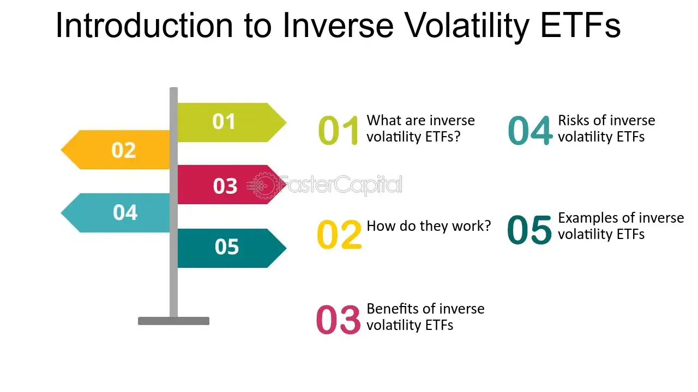

## Table of Contents

## What are Inverse Volatility ETFs?

Inverse Volatility ETFs are a type of exchange-traded fund that aims to profit from decreases in market volatility. These ETFs work by taking a short position on volatility, meaning they benefit when the market's volatility goes down. Volatility is a measure of how much the price of an asset moves up and down, and it's often seen as a sign of uncertainty or risk in the market. So, if the market becomes more stable and less volatile, the value of an Inverse Volatility ETF would typically increase.

These ETFs are often used by investors who want to hedge against or bet on a decrease in market turbulence. For example, if an investor believes that the market will become calmer in the near future, they might invest in an Inverse Volatility ETF to potentially make money from that prediction. However, these ETFs can be risky because they are based on complex financial instruments and the market can be unpredictable. It's important for investors to understand the risks involved and to consider their overall investment strategy before putting money into Inverse Volatility ETFs.

## How do Inverse Volatility ETFs work?

Inverse Volatility ETFs work by betting against market volatility. They do this by taking a short position on volatility, which means they make money when the market becomes less volatile. Volatility is like how much the price of stocks goes up and down. If the market is calm and prices don't change much, these ETFs can go up in value. They use special financial tools, like futures contracts on the VIX index, which measures market volatility, to make their bets.

These ETFs are popular with investors who think the market will become more stable. If someone believes that the ups and downs in the market will calm down, they might buy shares in an Inverse Volatility [ETF](/wiki/etf-trading-strategies) to make money from that prediction. But, these ETFs can be risky. The market can be hard to predict, and if it suddenly becomes more volatile, the value of the ETF can drop quickly. So, it's important for investors to understand the risks and think carefully before investing in them.

## What is the history behind the creation of Inverse Volatility ETFs?

Inverse Volatility ETFs were created as a way for investors to bet on or protect against changes in market [volatility](/wiki/volatility-trading-strategies). The idea behind them started to grow in the early 2000s, when financial markets were becoming more complex and investors were looking for new ways to manage risk. The first ETFs that focused on volatility were launched around 2009, following the global financial crisis. This crisis showed how important it was to have tools that could help manage the ups and downs of the market.

The creation of Inverse Volatility ETFs was also driven by the popularity of the VIX index, which measures the market's expectation of volatility. The VIX, often called the "fear gauge," became a key tool for investors. By using futures contracts based on the VIX, these ETFs could offer a way to profit from a decrease in volatility. Over time, as more investors became interested in these products, the number of Inverse Volatility ETFs grew, giving investors more options to manage their portfolios in response to changing market conditions.

## What are the key events that have influenced the development of Inverse Volatility ETFs?

The development of Inverse Volatility ETFs was greatly influenced by the global financial crisis of 2008-2009. During this time, markets were very unstable, and investors were looking for ways to protect their money from big swings in prices. This led to the creation of the first ETFs that focused on volatility, including Inverse Volatility ETFs. These ETFs allowed investors to bet on the market becoming calmer, which was something many people hoped for after the crisis.

Another key event was the growing popularity of the VIX index, which measures how much people expect the market to move up and down. The VIX became a very important tool for investors, and it helped make Inverse Volatility ETFs possible. By using futures contracts based on the VIX, these ETFs could offer a way to make money if the market's volatility went down. As more investors learned about and used these products, the number of Inverse Volatility ETFs grew, giving people more choices to manage their investments.

## What are the main criticisms of Inverse Volatility ETFs?

One of the main criticisms of Inverse Volatility ETFs is that they can be very risky. These ETFs bet that the market will become less volatile, but the market can be hard to predict. If the market suddenly becomes more volatile, the value of these ETFs can drop quickly. This happened in February 2018 when a sudden spike in volatility caused some Inverse Volatility ETFs to lose almost all their value in just one day. This event showed how risky these ETFs can be and made many investors wary of them.

Another criticism is that Inverse Volatility ETFs can be hard to understand. They use complex financial tools like futures contracts on the VIX index, which can be confusing for many investors. This complexity can lead to people not fully understanding the risks they are taking. Some critics also worry that these ETFs might make the market more unstable. If a lot of investors are betting on less volatility and then the market suddenly becomes more volatile, it could cause big swings in prices, which is the opposite of what these ETFs are supposed to help with.

## How do Inverse Volatility ETFs impact the overall market?

Inverse Volatility ETFs can affect the overall market in a few ways. When a lot of people invest in these ETFs, it means they are betting that the market will become less volatile. This can sometimes push the market to be more stable because so many people are expecting it. But, if everyone is betting on less volatility and then the market suddenly becomes more volatile, it can cause big swings in prices. This happened in February 2018 when a sudden spike in volatility caused some Inverse Volatility ETFs to lose almost all their value in just one day, which made the market more unstable.

Another way Inverse Volatility ETFs can impact the market is by making it more complex. These ETFs use special financial tools like futures contracts on the VIX index, which can be hard for many investors to understand. When a lot of people are using these complex products, it can make the market harder to predict and more risky. This complexity can lead to unexpected events that affect the whole market, making it more challenging for everyone to make good investment decisions.

## What are the risks associated with investing in Inverse Volatility ETFs?

Investing in Inverse Volatility ETFs can be very risky. These ETFs bet that the market will become less volatile, but the market can be hard to predict. If the market suddenly becomes more volatile, the value of these ETFs can drop quickly. This happened in February 2018 when a sudden spike in volatility caused some Inverse Volatility ETFs to lose almost all their value in just one day. This shows how risky these ETFs can be and why many investors are careful about them.

Another risk is that Inverse Volatility ETFs can be hard to understand. They use complex financial tools like futures contracts on the VIX index, which can be confusing for many investors. This complexity can lead to people not fully understanding the risks they are taking. If a lot of investors are betting on less volatility and then the market suddenly becomes more volatile, it could cause big swings in prices, which is the opposite of what these ETFs are supposed to help with. So, it's important for investors to think carefully before putting money into Inverse Volatility ETFs.

## Can you explain the mechanics of shorting volatility through ETFs?

Shorting volatility through ETFs means betting that the market will become less wild. These ETFs use special financial tools called futures contracts on the VIX index, which measures how much people expect the market to move up and down. If the market becomes calmer, the value of the ETF goes up because it's betting against big price swings. So, if an investor thinks the market will be more stable soon, they might buy shares in an Inverse Volatility ETF to make money from that prediction.

But, shorting volatility can be risky. If the market suddenly becomes more wild, the value of the ETF can drop quickly. This happened in February 2018 when a sudden spike in volatility caused some Inverse Volatility ETFs to lose almost all their value in just one day. It's like betting against a storm, and if the storm comes anyway, you can lose a lot of money. So, it's important for investors to understand these risks before they decide to short volatility through ETFs.

## What are some notable examples of Inverse Volatility ETFs?

One well-known example of an Inverse Volatility ETF is the ProShares Short VIX Short-Term Futures ETF (SVXY). This ETF aims to make money when the market becomes less volatile. It does this by betting against the VIX index, which measures how much people expect the market to move up and down. If the market stays calm, the value of SVXY goes up. But, if the market suddenly becomes more wild, the value of SVXY can drop quickly.

Another example is the VelocityShares Daily Inverse VIX Short-Term ETN (XIV). This ETF also bets against the VIX index, hoping to profit from a decrease in market volatility. Like SVXY, it can be a good choice for investors who think the market will become more stable. However, it's important to remember that these ETFs can be very risky. In February 2018, a sudden spike in volatility caused XIV to lose almost all its value in just one day, showing how unpredictable and risky these investments can be.

## How have regulatory bodies responded to the issues surrounding Inverse Volatility ETFs?

Regulatory bodies have been keeping a close eye on Inverse Volatility ETFs because of the risks they can bring to investors. After the big drop in value of some of these ETFs in February 2018, regulators started to look more carefully at how these products work. They wanted to make sure that investors understand the risks before they put their money into them. The U.S. Securities and Exchange Commission (SEC) and the Financial Industry Regulatory Authority (FINRA) have both warned investors about the dangers of these ETFs. They've said that these products can be very risky and that people should think carefully before investing in them.

Regulators have also been working to make sure that the information about Inverse Volatility ETFs is clear and easy to understand. They want to make sure that the risks are explained well in the documents that investors read before they buy these ETFs. This way, people can make better choices about whether these investments are right for them. While there haven't been big changes to the rules about these ETFs yet, regulators are still watching them closely to make sure they don't cause too much trouble in the market.

## What strategies can investors use to mitigate the risks of Inverse Volatility ETFs?

Investors can use a few strategies to make the risks of Inverse Volatility ETFs smaller. One way is to only put a little bit of their money into these ETFs. By not putting all their eggs in one basket, investors can protect themselves if the market suddenly becomes more wild. Another strategy is to keep an eye on the market and be ready to sell their shares in the ETF if things start to look risky. This means watching the VIX index, which measures how much people expect the market to move up and down, and being ready to act if it starts to go up a lot.

Another way to lower the risks is to understand how these ETFs work and what they are betting on. Investors should read the information about the ETF carefully and make sure they know what they are getting into. It can also help to talk to a financial advisor who can explain the risks and help make a plan that fits the investor's goals. By being smart and careful, investors can use Inverse Volatility ETFs without taking on too much risk.

## What is the future outlook for Inverse Volatility ETFs in the financial markets?

The future of Inverse Volatility ETFs in the financial markets is hard to predict, but they will likely keep being popular with some investors. These ETFs let people bet on the market becoming less wild, which can be a good way to make money if things go as expected. But, because they can be very risky, investors will need to be careful and think about how much they are willing to lose. As more people learn about these ETFs and how they work, we might see more of them being created, giving investors more choices to manage their money.

Regulators will probably keep a close eye on Inverse Volatility ETFs to make sure they don't cause too much trouble in the market. They want to make sure that people understand the risks before they invest in these products. This means that the rules about these ETFs might change to make them safer for everyone. Even with these changes, Inverse Volatility ETFs will still be a tool that some investors use to try to make money from a calmer market, but they will need to stay smart and ready for anything that might happen.

## References & Further Reading

[1]: Motskin, A., & Benz, F. (2018). ["Volmageddon: Understanding the 2018 Volatility Eruption."](https://www.sixfigureinvesting.com/2019/02/what-caused-the-february-5th-2018-volatility-spike-xiv-termination/) CFA Institute.

[2]: ProShares. ["ProShares Short VIX Short-Term Futures ETF (SVXY)."](https://www.proshares.com/our-etfs/strategic/svxy) ProShares Official Website.

[3]: Securities and Exchange Commission. ["Investor Bulletin: Leveraged and Inverse ETFs: Specialized Products with Extra Risks for Buy-and-Hold Investors."](https://www.investor.gov/introduction-investing/general-resources/news-alerts/alerts-bulletins/investor-bulletins/leveraged-investing-strategies-know-risks-using-these-advanced-investment-tools) U.S. Securities and Exchange Commission.

[4]: Whaley, R. E. (2013). ["Understanding the VIX."](https://www.researchgate.net/publication/277429711_Understanding_the_VIX) The Journal of Portfolio Management, 39(3), 98-105.

[5]: Hill, J., Nadig, D., & Hougan, M. (2015). ["A Comprehensive Guide to Exchange-Traded Funds (ETFs)."](https://papers.ssrn.com/sol3/papers.cfm?abstract_id=2616223) CFA Institute Research Foundation.

[6]: Lopez de Prado, M. (2018). ["Advances in Financial Machine Learning."](https://www.amazon.com/Advances-Financial-Machine-Learning-Marcos/dp/1119482089) Wiley.

[7]: Chan, E. P. (2009). ["Quantitative Trading: How to Build Your Own Algorithmic Trading Business."](https://github.com/ftvision/quant_trading_echan_book) Wiley.

[8]: Jansen, S. (2020). ["Machine Learning for Algorithmic Trading."](https://github.com/stefan-jansen/machine-learning-for-trading) Packt Publishing.