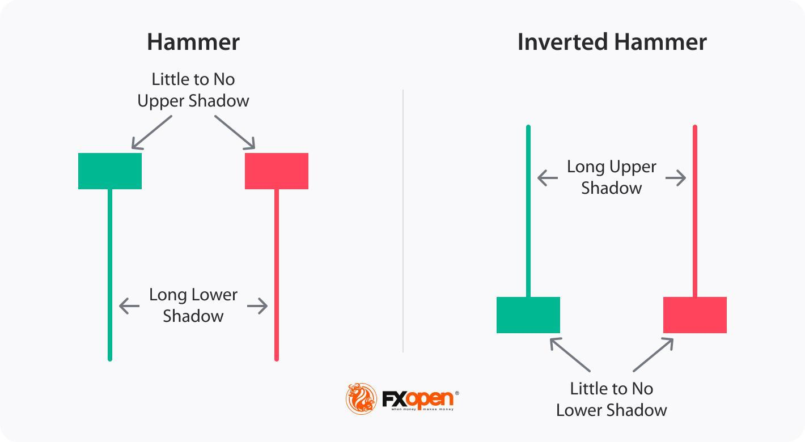

## Table of Contents

## What is an Inverted Hammer candlestick pattern?

An Inverted Hammer is a type of candlestick pattern that you might see on a price chart. It looks like a hammer turned upside down. This pattern forms when the price of a stock or another asset goes up a lot during the day but then falls back down near where it started. The candlestick has a small body at the bottom and a long upper wick or shadow.

This pattern can be a sign that the price might start going up soon. It shows that buyers tried to push the price higher during the day, but sellers pushed it back down. If you see an Inverted Hammer after a period where the price has been going down, it could mean that the sellers are losing control and buyers might take over. Traders often look for other signs to confirm that the price will go up before making a decision.

## How does an Inverted Hammer differ from a regular Hammer pattern?

An Inverted Hammer and a regular Hammer are both candlestick patterns that can signal a potential reversal in the price of a stock or asset. The main difference between them is their shape. An Inverted Hammer looks like a hammer turned upside down, with a small body at the bottom and a long upper wick. On the other hand, a regular Hammer has a small body at the top and a long lower wick, resembling a traditional hammer.

Both patterns indicate that there was a significant price movement during the trading day, but they show it in opposite ways. An Inverted Hammer shows that the price went up a lot during the day but then fell back near the opening price. This suggests that buyers tried to push the price higher but were not strong enough to keep it there. A regular Hammer, however, shows that the price dropped a lot during the day but then recovered to close near the opening price. This indicates that sellers tried to push the price down but buyers were able to bring it back up. Both patterns can be signs of a coming price increase, but they appear differently on the chart.

## What does an Inverted Hammer indicate about market sentiment?

An Inverted Hammer shows that the market might be getting ready to change direction. It appears when the price of a stock or asset goes up a lot during the day but then falls back down near where it started. This tells us that buyers tried to push the price higher, but sellers were able to bring it back down. When you see an Inverted Hammer after a time when the price has been going down, it can mean that the sellers are starting to lose control and the buyers might take over soon.

This pattern can give us a clue about what people in the market are feeling. If the price has been falling and then you see an Inverted Hammer, it might mean that some people are starting to think the price has gone down enough and it's time to buy. But, it's important to look at other signs too, because one pattern by itself isn't always enough to be sure about what will happen next.

## In which types of markets can an Inverted Hammer be observed?

An Inverted Hammer can be seen in many different kinds of markets where people trade things like stocks, [forex](/wiki/forex-system), commodities, and even cryptocurrencies. This pattern shows up on price charts and can tell us something about what buyers and sellers are doing. If you are looking at a chart for any of these markets, you might spot an Inverted Hammer and it could mean that the price might start going up soon.

The pattern is most useful when it appears after a time when the price has been going down. It doesn't matter if you are looking at a daily chart for a stock, an hourly chart for a currency pair, or a weekly chart for a commodity like gold. An Inverted Hammer can give you a hint that the market might be ready to change direction, no matter what kind of market you are looking at.

## How can you identify an Inverted Hammer on a price chart?

To spot an Inverted Hammer on a price chart, look for a candlestick that has a small body at the bottom and a long upper wick or shadow. The small body means the opening and closing prices were close together, and the long upper wick shows that the price went up a lot during the day but then came back down near where it started. The color of the body doesn't matter much, but it's usually seen as more bullish if the body is green or white, meaning the closing price was higher than the opening price.

When you see this pattern, it's important to check where it shows up on the chart. An Inverted Hammer is most meaningful when it appears after a period where the price has been going down. This could mean that the sellers are losing their grip and buyers might start to take over, pushing the price up. Always look at other signs on the chart too, because one pattern by itself isn't enough to be sure about what will happen next.

## What are the key components that make up an Inverted Hammer?

An Inverted Hammer is a candlestick pattern that you can see on a price chart. It has a small body at the bottom and a long upper wick or shadow. The small body shows that the opening and closing prices were close to each other. The long upper wick means the price went up a lot during the day but then came back down near where it started. The color of the body can be green or white if the closing price was higher than the opening price, or red or black if it was lower, but the color isn't as important as the shape.

This pattern is most useful when it appears after a time when the price has been going down. It can be a sign that the sellers are losing control and the buyers might start to take over, which could push the price up. But, it's important to look at other things on the chart too, because one pattern by itself isn't enough to be sure about what will happen next.

## What is the significance of the Inverted Hammer's position within a trend?

The position of an Inverted Hammer within a trend is very important. When you see an Inverted Hammer after a time when the price has been going down, it can be a sign that the price might start going up soon. This is because the pattern shows that buyers tried to push the price higher during the day, even though it fell back down by the end. It means the sellers might be losing control and the buyers could start to take over.

But, if you see an Inverted Hammer when the price has been going up, it might not mean as much. In this case, it could just be a pause in the upward trend and not a sign that the price will start going down. So, the Inverted Hammer is most useful and meaningful when it appears at the bottom of a downtrend, as it can signal a possible change in direction.

## How reliable is the Inverted Hammer as a reversal signal?

The Inverted Hammer can be a good sign that the price might start going up, but it's not always right. It's most useful when you see it after the price has been going down for a while. This pattern shows that buyers tried to push the price higher during the day, even if it fell back down by the end. It can mean that the sellers are losing control and the buyers might take over soon. But, it's important to look at other things on the chart too, because one pattern by itself isn't enough to be sure about what will happen next.

The reliability of the Inverted Hammer can change depending on other signs in the market. If you see other patterns or signals that also suggest the price might go up, then the Inverted Hammer becomes more trustworthy. But if the market is still showing strong signs of going down, the Inverted Hammer might not be as reliable. So, it's a good idea to use the Inverted Hammer along with other tools and not just rely on it alone to make decisions about trading.

## What are the best practices for trading based on an Inverted Hammer?

When you see an Inverted Hammer on a price chart, it can be a sign that the price might start going up soon, especially if it shows up after the price has been going down for a while. The best thing to do is to wait for more signs that the price is really going to go up before you decide to buy. Look for other patterns or signals on the chart that also suggest the price might increase. For example, if the price goes above the top of the Inverted Hammer's long upper wick, that can be a good sign that the buyers are taking over.

It's also a good idea to use other tools to help you make decisions. Things like moving averages, [volume](/wiki/volume-trading-strategy), and other indicators can give you more information about what the market is doing. Don't just rely on the Inverted Hammer by itself, because it's not always right. Make sure you have a plan for how much you're willing to lose if the trade doesn't work out, and stick to that plan. Trading based on the Inverted Hammer can be helpful, but it works best when you use it along with other tools and signs to make smart choices.

## Can an Inverted Hammer be confirmed by other technical indicators?

Yes, an Inverted Hammer can be confirmed by other technical indicators to increase its reliability as a signal for a potential price increase. One way to confirm an Inverted Hammer is to look for a bullish candlestick pattern that follows it, like a bullish engulfing pattern or a strong green candle that closes above the Inverted Hammer's high. This shows that the buyers are taking control and pushing the price up, making the Inverted Hammer's signal more trustworthy.

Another way to confirm an Inverted Hammer is by using other technical indicators like moving averages, the Relative Strength Index (RSI), or volume. If the price breaks above a key moving average, like the 50-day or 200-day moving average, after an Inverted Hammer appears, it can be a strong sign that the price is going to go up. Also, if the RSI is moving up from an oversold level or if there is a big increase in trading volume when the price goes above the Inverted Hammer's high, these are good signs that the Inverted Hammer's signal is more likely to be correct.

## How does the volume affect the validity of an Inverted Hammer?

Volume can really help tell if an Inverted Hammer is a good sign that the price might go up. When you see an Inverted Hammer and the volume is high, it means a lot of people were trading that day. This can show that the buyers were trying hard to push the price up, even if it fell back down by the end of the day. High volume can make the Inverted Hammer more trustworthy because it shows strong interest from buyers.

But if the volume is low when you see an Inverted Hammer, it might not mean as much. Low volume can show that not many people were trading, so the pattern might not be as strong. It's a good idea to look at the volume along with the Inverted Hammer to get a better idea of whether the price is really going to go up or not.

## What are some common mistakes traders make when interpreting an Inverted Hammer?

One common mistake traders make when looking at an Inverted Hammer is thinking it always means the price will go up right away. An Inverted Hammer can be a sign that the price might start going up, but it's not always right. Traders might see the pattern and buy too quickly without waiting for more signs that the price is really going to go up. It's important to wait for other patterns or signals that also suggest the price might increase, like a bullish candlestick that follows the Inverted Hammer or the price going above the top of the Inverted Hammer's long upper wick.

Another mistake is not looking at the bigger picture of what the market is doing. Traders might focus too much on just the Inverted Hammer and not pay attention to other things like moving averages, volume, or other indicators. For example, if the volume is low when the Inverted Hammer appears, it might not be as strong a signal. Also, if the Inverted Hammer shows up during a time when the price has been going up, it might not mean as much as if it appeared after the price had been going down. So, it's a good idea to use the Inverted Hammer along with other tools to make better trading choices.

## References & Further Reading

[1]: Bergstra, J., Bardenet, R., Bengio, Y., & Kégl, B. (2011). ["Algorithms for Hyper-Parameter Optimization."](https://papers.nips.cc/paper/4443-algorithms-for-hyper-parameter-optimization) Advances in Neural Information Processing Systems 24.

[2]: ["Advances in Financial Machine Learning"](https://www.amazon.com/Advances-Financial-Machine-Learning-Marcos/dp/1119482089) by Marcos Lopez de Prado

[3]: ["Evidence-Based Technical Analysis: Applying the Scientific Method and Statistical Inference to Trading Signals"](https://www.amazon.com/Evidence-Based-Technical-Analysis-Scientific-Statistical/dp/0470008741) by David Aronson

[4]: ["Machine Learning for Algorithmic Trading"](https://github.com/stefan-jansen/machine-learning-for-trading) by Stefan Jansen

[5]: ["Quantitative Trading: How to Build Your Own Algorithmic Trading Business"](https://books.google.com/books/about/Quantitative_Trading.html?id=j70yEAAAQBAJ) by Ernest P. Chan