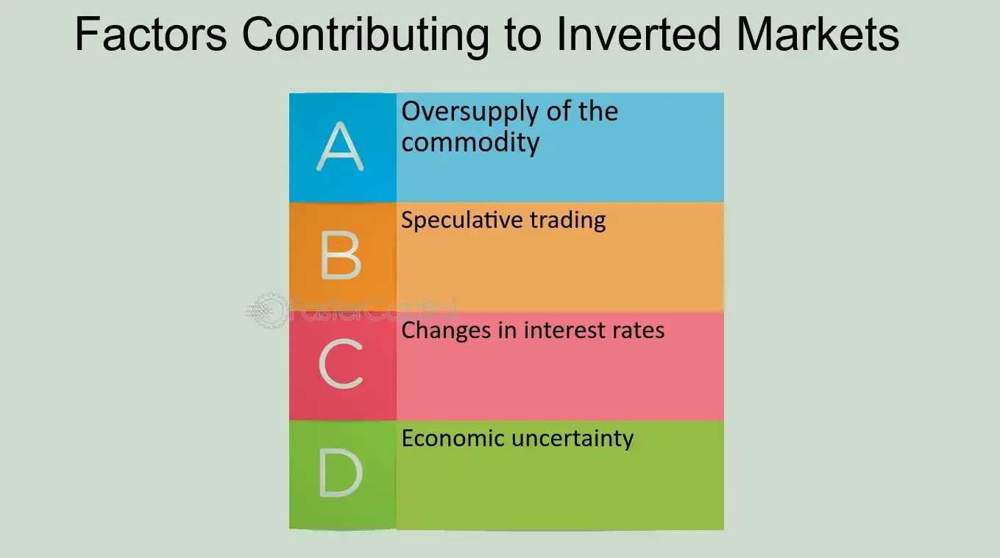

## Table of Contents

## What is an inverted market?

An inverted market is when the prices of things that will be delivered in the future are lower than the prices of things that can be bought right now. This is strange because usually, people expect to pay more for things they get later, not less. This situation often happens with things like oil or grains, where people can agree to buy them at a certain price before they are even produced.

When the market is inverted, it can mean that people think there will be a lot of that thing available in the future, so the price goes down. Or, it can mean that people are worried about the economy and want to hold onto their money now, instead of spending it on things they don't need right away. This can be confusing for people who trade these items because it goes against what they usually expect to happen in the market.

## What are the basic characteristics of an inverted market?

An inverted market happens when the price for something that you can get in the future is less than the price for the same thing right now. Normally, people expect to pay more for things they will get later, but in an inverted market, it's the opposite. This can happen with things like oil, corn, or other items that people can agree to buy before they are made or harvested.

This kind of market can show that people think there will be a lot of that thing available in the future, so the price goes down. It can also mean that people are worried about money and want to save it instead of spending it on things they don't need right away. When the market is inverted, it can be confusing for people who buy and sell these items because it doesn't follow the usual pattern they expect.

## How does an inverted market differ from a normal market?

In a normal market, the price of something you can get in the future is usually higher than the price of the same thing you can get right now. This makes sense because people expect to pay more for waiting. For example, if you want to buy corn that will be harvested next year, you might pay more for it now than if you were buying corn that is already in the store.

An inverted market is different because the price for future goods is lower than the price for goods available now. This can happen if people think there will be a lot of that thing available in the future, so they are willing to pay less for it. It can also happen if people are worried about their money and want to save it instead of spending it on things they don't need right away. This situation can be confusing for people who buy and sell these items because it goes against what they usually expect in the market.

## What are the common causes of an inverted market?

An inverted market happens when people think there will be a lot of something in the future, so they are willing to pay less for it now. For example, if farmers expect a big harvest of corn next year, the price for corn that will be delivered in the future might go down. This is because everyone knows there will be plenty of corn, so they don't want to pay as much for it.

Another reason for an inverted market is when people are worried about money. If people are scared about the economy, they might want to save their money instead of spending it on things they don't need right away. This can make the price for things that will be delivered in the future go down, because people are not willing to pay as much for them.

These two reasons can make the market behave in a way that is different from what people usually expect. In a normal market, people pay more for things they will get later, but in an inverted market, it's the opposite. This can be confusing for people who buy and sell these items because it goes against the usual pattern.

## Can you explain the role of supply and demand in creating an inverted market?

Supply and demand play a big role in creating an inverted market. When there is a lot of something expected in the future, the supply goes up. If people think there will be a lot of corn next year, for example, they might not want to pay as much for corn that will be delivered in the future. This makes the price for future corn go down, which can create an inverted market. The high supply of future goods means people are willing to pay less for them, even if the price for goods right now stays the same or goes up.

Demand also affects an inverted market. If people are worried about money and want to save it, they might not want to buy things they don't need right away. This means the demand for goods that will be delivered in the future goes down. When demand is low, prices go down too. So, if people are not willing to pay much for future goods because they are saving money, this can help create an inverted market. Both high supply and low demand can make the price for future goods lower than the price for goods available now.

## What economic indicators should one watch to predict an inverted market?

To predict an inverted market, you should keep an eye on indicators that show how much of something will be available in the future. For example, if you're looking at agricultural products like corn or wheat, pay attention to weather forecasts and crop reports. If these reports suggest a big harvest is coming, it might mean there will be a lot of that product available later, which could lead to an inverted market. Also, watch industry news and production forecasts for commodities like oil. If new oil fields are discovered or if production is expected to increase, this could increase future supply and contribute to an inverted market.

Another set of indicators to watch are those related to the economy and consumer behavior. If economic reports show that people are worried about money and are saving more, this could lower the demand for goods that will be delivered in the future. Look at things like consumer confidence indexes and unemployment rates. If these indicators suggest that people are feeling uncertain about their finances, they might be less willing to buy things they don't need right away, which can help create an inverted market. Keeping an eye on these economic indicators can give you clues about whether an inverted market might be on the horizon.

## How do inverted markets affect different sectors of the economy?

Inverted markets can have a big impact on the farming sector. When farmers see that the price for their crops in the future is lower than the price right now, they might decide to sell their crops earlier to get a better price. This can lead to more crops being sold at once, which might make the price go down even more. Also, if farmers think they will get less money for their crops in the future, they might plant less next year. This can affect how much food is available and can change the prices people pay at the grocery store.

Inverted markets can also affect the energy sector, especially oil and gas. If the price for oil that will be delivered in the future is lower than the price for oil right now, companies might slow down their drilling and production. They might want to wait until the price goes up again before they start producing more. This can lead to less oil being available, which can affect the price people pay at the gas station. It can also make it harder for companies to plan and invest in new projects because they are not sure what the price will be in the future.

In other parts of the economy, like manufacturing and retail, an inverted market can make businesses more cautious. If they see that the price for materials they need in the future is going down, they might delay buying those materials. This can slow down production and affect how much they can sell. Also, if people are worried about money and are saving more, they might not buy as many things, which can hurt businesses that rely on people spending money. Overall, an inverted market can make the economy less predictable and can lead to changes in how businesses and people behave.

## What are some historical examples of inverted markets?

One famous example of an inverted market happened in the oil industry in April 2020. At that time, the price for oil that people could get right away was much higher than the price for oil that would be delivered in the future. This happened because the world was dealing with the COVID-19 pandemic, and many countries told people to stay home. This meant fewer people were driving cars, so they didn't need as much gas. Oil companies had a lot of oil they couldn't sell, so they were willing to pay less for oil they would get later.

Another example of an inverted market was in the U.S. Treasury bond market in 2019. Usually, people expect to get more money for lending their money for a longer time. But in 2019, the interest rates for short-term bonds were higher than the rates for long-term bonds. This was strange because it meant people were willing to lend their money for a shorter time and get less money in the future. This happened because people were worried about the economy and wanted to keep their money safe, so they were willing to accept lower returns on long-term investments.

## How do investors typically respond to an inverted market?

When investors see an inverted market, they often get worried and start to be more careful with their money. They might sell things they own that will be delivered in the future because the price for those things is going down. They might also move their money into safer places, like savings accounts or bonds that they can get their money back from quickly. This is because they are not sure what will happen next and want to keep their money safe.

Some investors might see an inverted market as a chance to make money. They might buy things that other people are selling because they think the prices will go back up later. These investors are willing to take a risk because they believe the market will change and they can make a profit. But, most investors are more likely to be cautious and protect their money until the market goes back to normal.

## What strategies can businesses employ to navigate an inverted market?

When businesses see an inverted market, they need to be smart about how they handle it. One way they can do this is by changing when they buy things. If the price for something they need will be lower in the future, they might wait to buy it until later. This can help them save money. They can also look for other places to buy things from, to see if they can find a better price. This way, they can keep their costs down and still make money, even when the market is strange.

Another strategy is to be careful about how much they produce. If businesses think that people will not want to buy as much in the future, they might make less of their product. This can help them avoid having too much stuff that they can't sell. They can also talk to their customers and try to understand what they need. By doing this, they can make sure they are making things that people will still want to buy, even when the market is inverted.

## How does government policy influence the occurrence and impact of inverted markets?

Government policies can make inverted markets more likely to happen or affect how bad they are. If the government puts rules on how much of something can be made or sold, it can change how much of that thing is available. For example, if the government says that oil companies can't drill in certain places, there might be less oil available in the future. This can make the price for future oil go down and create an inverted market. Also, if the government gives money to farmers to grow more crops, there might be a lot of those crops available later, which can also lead to an inverted market.

Government policies can also help to fix problems caused by inverted markets. If the government sees that people are worried about money and are not spending as much, they might try to help by giving people more money or making it easier to borrow money. This can make people feel better about spending money now, which can help to balance out the market. By changing rules and giving support, the government can help to make the market less confusing and help businesses and people deal with the problems that come from an inverted market.

## What advanced analytical tools are used to study and predict inverted market conditions?

To study and predict inverted market conditions, experts use advanced computer programs that look at a lot of data. These programs can find patterns in how prices change over time and can guess what might happen next. For example, they might use something called machine learning, which is like teaching a computer to learn from past information. This can help the computer see signs of an inverted market before it happens. Another tool is called econometric modeling, which uses math to understand how different parts of the economy affect each other. By putting in data about things like how much of a product is available and how much people want to buy, these models can predict when the market might become inverted.

Another important tool is called technical analysis, which looks at charts and graphs of prices to find patterns. People who use this tool believe that past price movements can give clues about what will happen in the future. They might look for signs like when the price for something in the future starts to go down compared to the price now. Also, experts use something called sentiment analysis, which looks at what people are saying on the internet and in the news. If a lot of people are worried about the economy, this can be a sign that an inverted market might be coming. By using these tools together, experts can get a better idea of when and why an inverted market might happen.

## What is the impact on investors and traders?

Inverted markets present distinct challenges and opportunities for traders and investors, fundamentally altering traditional approaches to market analysis and decision-making. These market conditions, characterized by near-term futures contracts priced higher than those maturing later, require a nuanced understanding of futures pricing relative to spot prices.

Futures prices are influenced by factors such as interest rates, storage costs, and dividends, described by the cost-of-[carry](/wiki/carry-trading) model:

$$
F_t = S_t \times e^{(r + u - q) \times T}
$$

where $F_t$ is the futures price, $S_t$ is the spot price, $r$ is the risk-free interest rate, $u$ is the storage cost, $q$ is the dividend yield, and $T$ is the time to maturity. In an inverted market, the immediate demand or supply dynamics overshadow these factors, leading to unique pricing strategies.

Traders can exploit these discrepancies by understanding the underlying causes of price inversion, such as short-term supply chain disruptions or speculative activities, allowing them to make informed decisions about buying or selling futures or spot contracts. For instance, an investor anticipating the resolution of a temporary supply shock might short near-term futures, expecting prices to decrease as the market normalizes.

Algorithmic trading offers powerful tools in managing risks and identifying opportunities in such volatile environments. With algorithms handling large data sets and executing strategies swiftly, investors can react promptly to market shifts. Python, a popular programming language among traders, can be used to create algorithms that monitor signals and execute trades. An example might involve detecting profitable [arbitrage](/wiki/arbitrage) opportunities:

```python
import numpy as np
import pandas as pd

def find_arbitrage_opportunities(futures_data, spot_price):
    futures_data['Arbitrage'] = futures_data['Futures Price'] - spot_price
    opportunities = futures_data[futures_data['Arbitrage'] > 0]
    return opportunities

futures_data = pd.DataFrame({'Futures Price': [105, 103, 110], 'Expiration': ['2023-11-01', '2023-12-01', '2024-01-01']})
spot_price = 102
arbitrage_opps = find_arbitrage_opportunities(futures_data, spot_price)
print(arbitrage_opps)
```

This script identifies futures priced higher than the spot price, potentially uncovering arbitrage scenarios.

In summary, adequately navigating inverted markets involves a combination of keen market insight and sophisticated technology. Traders and investors must stay vigilant, leveraging their understanding of futures and spot prices alongside algorithmic tools to manage risks and capitalize on opportunities. As market dynamics continue to evolve, adaptability remains crucial for success.

## References & Further Reading

[1]: Bergstra, J., Bardenet, R., Bengio, Y., & Kégl, B. (2011). ["Algorithms for Hyper-Parameter Optimization."](https://papers.nips.cc/paper/4443-algorithms-for-hyper-parameter-optimization) Advances in Neural Information Processing Systems 24.

[2]: ["Advances in Financial Machine Learning"](https://www.amazon.com/Advances-Financial-Machine-Learning-Marcos/dp/1119482089) by Marcos Lopez de Prado

[3]: ["Evidence-Based Technical Analysis: Applying the Scientific Method and Statistical Inference to Trading Signals"](https://www.amazon.com/Evidence-Based-Technical-Analysis-Scientific-Statistical/dp/0470008741) by David Aronson

[4]: ["Machine Learning for Algorithmic Trading"](https://github.com/stefan-jansen/machine-learning-for-trading) by Stefan Jansen

[5]: ["Quantitative Trading: How to Build Your Own Algorithmic Trading Business"](https://www.amazon.com/Quantitative-Trading-Build-Algorithmic-Business/dp/1119800064) by Ernest P. Chan