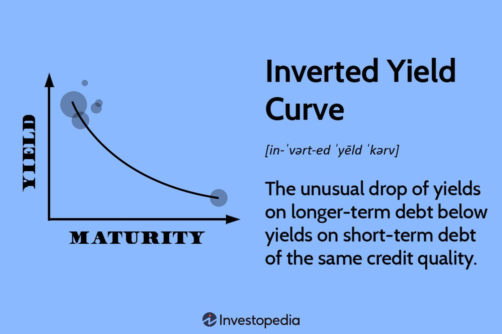

## Table of Contents

## What is a yield curve?

A yield curve is a graph that shows the interest rates on bonds of different lengths of time, usually from the same issuer, like the government. It helps people see how much they can earn from bonds that last for different periods, like 2 years, 5 years, or 10 years. The shape of the yield curve can tell us a lot about what people think will happen with the economy in the future.

Usually, the yield curve slopes upward, meaning longer-term bonds have higher interest rates than shorter-term ones. This happens because people want more money to lend it for a longer time, as there's more risk involved. But sometimes, the yield curve can be flat or even inverted, which means short-term rates are higher than long-term rates. An inverted yield curve can be a sign that people expect the economy to slow down or go into a recession.

## What does an inverted yield curve indicate?

An inverted yield curve happens when the interest rates for short-term bonds are higher than the interest rates for long-term bonds. This is unusual because normally, you would expect to get more interest if you lend your money for a longer time. When the yield curve inverts, it means that people think the economy might not do well in the future. They believe that the central bank, like the Federal Reserve, might lower interest rates soon to help the economy.

This situation can be a warning sign for a possible recession. A recession is when the economy shrinks and people might lose their jobs or have less money to spend. Historically, an inverted yield curve has often happened before a recession starts. So, when people see an inverted yield curve, they start to worry and might change how they invest their money or spend it.

## How is an inverted yield curve different from a normal yield curve?

A normal yield curve is what you usually see. It goes up as you look at bonds that last longer. This means if you buy a bond that lasts for 10 years, you get more interest than if you buy one that lasts for 2 years. People expect more money for lending it for a longer time because there's more risk. It's like if you lend your friend $100 for a week, you might not ask for any extra money, but if you lend it for a year, you might want some interest because more could go wrong in that time.

An inverted yield curve is the opposite. It goes down as you look at longer bonds. This means you get less interest for lending your money for a longer time. It's strange because usually, you want more money for waiting longer. When this happens, it often means people think the economy might have problems soon. They think the people in charge of money, like the Federal Reserve, might lower interest rates to help the economy, so they're okay with less interest now for longer bonds.

## What are the historical examples of an inverted yield curve?

One big example of an inverted yield curve was before the 2007-2008 financial crisis. In 2006, the yield curve inverted, which meant people could get more interest from short-term bonds than from long-term ones. This was a sign that people were worried about the economy. And they were right to worry because soon after, the housing market crashed, and it led to a big economic problem all over the world.

Another time the yield curve inverted was before the recession in the early 2000s. In 2000, the yield curve flipped, and it was a warning sign. Not long after, the dot-com bubble burst, and the economy went into a recession. People lost jobs, and companies struggled. The inverted yield curve was a clue that tough times were coming.

There was also an inversion before the recession in the early 1990s. In 1989, the yield curve inverted, and it was a signal that the economy was going to slow down. Sure enough, a recession hit in 1990. These examples show that when the yield curve inverts, it's often a sign that people are expecting economic trouble ahead.

## How does an inverted yield curve affect the economy?

An inverted yield curve can make people worried about the economy. When people see that short-term bonds have higher interest rates than long-term bonds, they start thinking that bad times might be coming. This worry can make businesses and people more careful with their money. They might decide to save more and spend less, which can slow down the economy. If businesses see that people are not spending as much, they might not want to invest in new projects or hire more workers. This can lead to less growth and even job losses.

The inverted yield curve also affects banks. Banks usually borrow money at short-term rates and lend it out at long-term rates. When the yield curve inverts, the short-term rates are higher, so banks make less money on the difference between what they pay for money and what they charge for loans. This can make banks more cautious about lending money. If banks lend less, it's harder for businesses and people to get loans to buy things or start new projects. This can make the economic slowdown even worse. So, an inverted yield curve can be a signal that the economy might be heading into a tough time.

## What are the implications of an inverted yield curve for investors?

When the yield curve inverts, it can be a warning sign for investors. It means that short-term bonds are giving more interest than long-term bonds, which is unusual. Investors might start to worry that the economy could slow down or go into a recession. Because of this, they might decide to change their investment plans. They might move their money from stocks to safer investments like government bonds or cash. This is because stocks can lose value quickly if the economy gets worse, but bonds and cash are usually safer.

Investors also need to think about what the inverted yield curve means for their long-term plans. If they believe a recession is coming, they might want to be more careful with their money. They might choose to invest in things that can still make money even if the economy is not doing well. For example, some companies that provide essential services, like utilities or healthcare, might still do okay during a recession. By being ready for tough times, investors can try to protect their money and maybe even find good opportunities when others are worried.

## How can investors prepare for an inverted yield curve?

When investors see an inverted yield curve, it's a good idea for them to start thinking about how to protect their money. They might want to move some of their money from stocks to safer places like government bonds or cash. Stocks can go down a lot if the economy gets worse, but bonds and cash are usually safer. Investors might also want to look at companies that do well even when the economy is not doing great. For example, companies that provide things people always need, like electricity or medicine, might still make money during a recession.

Another thing investors can do is to make sure their investments are spread out. This means not putting all their money in one place. If they have money in different types of investments, it can help them not lose everything if one type of investment does badly. They might also want to keep some money ready to use if good opportunities come up when other people are worried. By being ready and careful, investors can try to keep their money safe and maybe even find good chances to make more money when times are tough.

## What investment strategies are effective during an inverted yield curve?

When the yield curve inverts, it's a good idea for investors to move some of their money into safer investments. This means they might want to buy more government bonds or keep some money in cash. These are safer because they don't lose value as quickly as stocks if the economy gets worse. Investors should also look at companies that do well even when the economy is not doing great. These might be companies that provide things people always need, like electricity or medicine. By focusing on these kinds of investments, investors can protect their money better during tough times.

Another good strategy is to make sure investments are spread out. This means not putting all the money in one type of investment. If an investor has money in different places, it can help them not lose everything if one type of investment does badly. They might also want to keep some money ready to use if good opportunities come up when other people are worried. By being ready and careful, investors can try to keep their money safe and maybe even find good chances to make more money when times are tough.

## How reliable is an inverted yield curve as a predictor of economic recessions?

An inverted yield curve has been a pretty good sign that a recession might be coming. Over the years, when the yield curve has flipped, it has often been followed by a recession. For example, before the big financial crisis in 2007-2008, the yield curve inverted in 2006. It was a warning that tough times were ahead, and sure enough, the economy did go into a recession. The same thing happened before the early 2000s recession and the early 1990s recession. So, many people pay attention to the yield curve because it has a good track record of predicting economic trouble.

But, it's not perfect. Sometimes the yield curve inverts, and a recession doesn't happen right away or at all. It's more like a warning sign than a sure thing. The time between when the yield curve inverts and when a recession starts can be different each time. It might take a few months or even a couple of years. So, while an inverted yield curve is a strong signal that investors and economists watch closely, it's not a guarantee that a recession will happen. It's just one piece of the puzzle when trying to figure out what might happen with the economy.

## What are the limitations of using an inverted yield curve as an economic indicator?

An inverted yield curve is a good sign that a recession might be coming, but it's not perfect. Sometimes the yield curve inverts, and a recession doesn't happen right away or at all. It's more like a warning sign than a sure thing. The time between when the yield curve inverts and when a recession starts can be different each time. It might take a few months or even a couple of years. So, while an inverted yield curve is a strong signal that investors and economists watch closely, it's not a guarantee that a recession will happen.

There are other things that can affect the economy too, not just the yield curve. For example, things like government policies, international events, or big changes in technology can also make a big difference. The yield curve might invert because of these other factors, but they might not lead to a recession. So, it's important to look at the whole picture and not just rely on one sign. An inverted yield curve is just one piece of the puzzle when trying to figure out what might happen with the economy.

## How do different sectors of the economy respond to an inverted yield curve?

When the yield curve inverts, it can affect different parts of the economy in different ways. For banks, it can be tough because they usually borrow money at short-term rates and lend it out at long-term rates. When short-term rates are higher, banks make less money on the difference between what they pay for money and what they charge for loans. This can make banks more careful about lending money. If banks lend less, it's harder for businesses and people to get loans to buy things or start new projects. This can slow down the economy.

Other sectors might also feel the effects. Companies that depend a lot on borrowing money, like real estate and construction, might find it harder to get loans when the yield curve inverts. This can lead to fewer new buildings and projects. On the other hand, sectors like utilities and healthcare, which provide things people always need, might not be affected as much. People still need electricity and medicine even if the economy is not doing well. So, while an inverted yield curve can be a warning sign for many parts of the economy, some sectors might be more protected than others.

## What advanced metrics or models can investors use to analyze the impact of an inverted yield curve?

Investors can use different advanced metrics and models to understand how an inverted yield curve might affect the economy. One popular model is the term structure model, which looks at how interest rates for different lengths of time are related. This model can help investors predict how interest rates might change in the future and what that could mean for the economy. Another useful tool is the yield curve spread, which is the difference between short-term and long-term interest rates. By watching this spread, investors can see how the yield curve is changing and get a sense of when it might invert.

Another metric that investors might use is the Federal Funds Futures, which can show what people expect the Federal Reserve to do with interest rates. If the yield curve inverts, investors might look at these futures to see if the Fed is likely to lower rates to help the economy. Also, economic indicators like the Leading Economic Index (LEI) can be helpful. The LEI combines different signs of economic health, like manufacturing orders and consumer confidence, to give a broader picture of where the economy might be headed. By using these advanced metrics and models, investors can get a better idea of how an inverted yield curve might impact different parts of the economy and make smarter investment choices.

## References & Further Reading

[1]: Aldridge, I. (2013). ["High-frequency trading: A practical guide to algorithmic strategies and trading systems."](https://www.amazon.com/High-Frequency-Trading-Practical-Algorithmic-Strategies/dp/1118343506) John Wiley & Sons.

[2]: Campbell, J.Y. (1995). ["Some lessons from the yield curve."](https://pubs.aeaweb.org/doi/pdfplus/10.1257/jep.9.3.129) National Bureau of Economic Research.

[3]: Estrella, A., & Mishkin, F.S. (1996). ["The Yield Curve as a Predictor of U.S. Recessions."](https://www.newyorkfed.org/medialibrary/media/research/current_issues/ci2-7.pdf) Current Issues in Economics and Finance, Federal Reserve Bank of New York.

[4]: Lopez de Prado, M. (2018). ["Advances in Financial Machine Learning."](https://www.amazon.com/Advances-Financial-Machine-Learning-Marcos/dp/1119482089) Wiley.

[5]: Litterman, R., & Scheinkman, J. (1991). ["Common factors affecting bond returns."](https://www.pm-research.com/content/iijfixinc/1/1/54) Journal of Fixed Income.