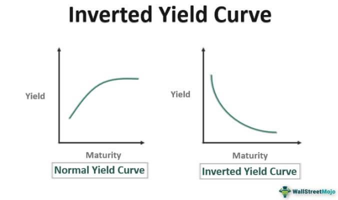

The concept of interest rate yield curves is foundational in economics and finance, succinctly illustrating the relationship between interest rates and the maturity of debt instruments. A yield curve typically slopes upward, indicating higher returns for longer-term investments due to the increased risk over time. However, an inverted yield curve is a notable anomaly where short-term interest rates surpass long-term rates. This inversion has historically been a reliable indicator of impending economic downturns, such as recessions. Investors pay close attention to these inversions as they often signal a reduction in confidence about future economic growth.

Algorithmic trading, which utilizes sophisticated computer algorithms to execute trades, has become increasingly integral in managing investments, particularly during periods characterized by yield curve inversions. The automation and speed inherent in algorithmic trading allow investors to swiftly adapt to changing market conditions and capitalize on market inefficiencies. 



This article examines the dynamic relationship between inverted yield curves and economic indicators, highlighting how algorithmic trading can be effectively used to optimize trading strategies during such periods of financial uncertainty. Through exploring these intersections, the article aims to provide insights into how modern trading technologies can enhance traditional economic analysis, offering investors improved risk management and potential opportunities in economically volatile times.

## Table of Contents

## Understanding the Inverted Yield Curve

An inverted yield curve occurs when the yield on short-term debt instruments surpasses the yield on long-term debt instruments. This deviation from the normal upward-sloping yield curve signals an atypical financial environment. Normally, lenders require a higher return for long-term investments due to the inherent risks associated with time. However, during an inversion, the expectation flips, suggesting a nuanced economic forecast.

The phenomenon of an inverted yield curve is often interpreted as an indicator of impending economic recession. Historically, yield curve inversions have preceded recessions in several major economies, serving as a barometer of investor sentiment and confidence in future economic growth. Investors, in this scenario, may anticipate a downturn, thus demanding higher returns on short-term securities to compensate for the imminent uncertainty.

Inverted yield curves [carry](/wiki/carry-trading) significant implications for investment strategies. Their historical reliability in predicting economic slowdowns underscores their importance for investors seeking to adjust their portfolios smartly. For instance, during an inversion, investors may consider reallocating assets into more conservative investments like government bonds or sectors that traditionally perform well in recessionary periods. The securitization of future expectations through an inverted yield curve provides a proactive stance for aligning investments to prevailing economic conditions. This predictive capability further stresses the necessity of continuous yield curve analysis for informed investment decision-making.

Thus, understanding and recognizing the signals of an inverted yield curve is crucial for financial strategists and economists. It necessitates a forward-looking approach to manage potential risks while exploring the avenues for optimized portfolio management amid economic uncertainties.

## Key Financial Indicators and Their Roles

Assessing the economic climate necessitates a comprehensive understanding of key financial indicators, which serve as essential tools for evaluating macroeconomic conditions. Among these, Gross Domestic Product (GDP) growth, unemployment rates, the Consumer Price Index (CPI), and manufacturing indexes stand out as pivotal barometers.

### GDP Growth
GDP growth is a critical indicator of overall economic health. It measures the change in the value of goods and services produced by an economy over a given period. A positive GDP growth rate generally indicates economic expansion, while negative growth may signal contraction. During yield curve inversions, monitoring GDP growth offers insight into the potential for an impending recession, as historically, recessions often align with periods of inverted yield curves.

### Unemployment Rates
Unemployment rates provide a snapshot of labor market conditions. High unemployment typically suggests economic distress, as a greater proportion of the workforce is unable to find jobs. Conversely, low unemployment can signify robust economic activity. Analyzing unemployment trends during yield curve inversions can help identify shifts in economic [momentum](/wiki/momentum), as rising unemployment often correlates with reduced consumer spending and slower economic growth.

### Consumer Price Index (CPI)
The Consumer Price Index tracks changes in the price level of a basket of consumer goods and services. It is a key indicator of inflationary pressures within an economy. During yield curve inversions, understanding CPI trends is crucial, as unexpected inflation or deflation can have significant repercussions on interest rates and economic stability. Inflation can erode purchasing power, impacting both consumer confidence and spending behaviors.

### Manufacturing Indexes
Manufacturing indexes, such as the Purchasing Managers’ Index (PMI), are vital for gauging industrial sector performance. They assess variables like new orders, production levels, and employment within the manufacturing industry. Declining manufacturing indexes during a yield curve inversion may indicate reduced economic activity and lower demand, which are consistent with recessionary conditions. These indexes provide timely evidence of the industry's health, often preceding broader economic shifts.

### The Role of Financial Indicators During Yield Curve Inversions
In the context of yield curve inversions, these financial indicators can provide critical confirmation of potential economic downturns. For instance, an inverted yield curve combined with declining GDP growth, rising unemployment, increasing CPI, and shrinking manufacturing indexes often solidifies the expectation of an economic recession. Such comprehensive analysis allows investors to make informed decisions and adjust strategies appropriately. 

By employing sophisticated monitoring and analysis of these indicators, financial professionals can anticipate shifts and align their strategies to mitigate risks associated with economic downturns, further leveraging [algorithmic trading](/wiki/algorithmic-trading) systems to respond swiftly to market dynamics.

## Integrating Algo Trading in Yield Curve Analysis

Algorithmic trading, or algo trading, involves the use of computer algorithms to automate trading decisions based on pre-defined criteria. This method is invaluable in financial markets, particularly during periods of yield curve inversions, which can indicate future economic downturns. These algorithms process information at speeds and efficiencies unattainable by human traders, allowing for rapid adaptation to market changes.

Yield curve analysis plays a crucial role in this automated approach. Typically, the yield curve, which plots interest rates of bonds having equal credit quality but differing maturity dates, takes an upward slope—indicating higher returns for longer maturities. An inversion, where short-term rates exceed long-term rates, suggests market anomalies and potential economic slowdowns. Algo trading systems leverage this yield curve data to enhance trading strategies by identifying market inefficiencies and opportunities that arise from these anomalies.

For example, consider a simple Python script utilizing historical yield data to automate trading decisions. By scanning datasets for inverted yield curves, the algorithm can evaluate market trends and predict future [interest rate](/wiki/interest-rate-trading-strategies) movements. Using pandas to handle time-series data, an algorithm could be crafted to trigger trades when specific indicators suggest an inversion:

```python
import pandas as pd

# Load historical yield data
data = pd.read_csv('yield_data.csv')
data['Date'] = pd.to_datetime(data['Date'])
data.set_index('Date', inplace=True)

# Calculate yield spread (10-year minus 2-year yields)
data['Spread'] = data['10Y'] - data['2Y']

# Define trading strategy: Buy when spread is negative
data['Signal'] = 0
data.loc[data['Spread'] < 0, 'Signal'] = 1  # Inversion detected

# Simulate returns
data['Returns'] = data['Signal'].shift(1) * data['Market_returns']

# Calculate cumulative returns
data['Cumulative Returns'] = (1 + data['Returns']).cumprod()

# Output results
print(data[['Spread', 'Signal', 'Cumulative Returns']].tail())
```

This example highlights how algo trading systems can be set up to identify and exploit yield curve inversions. Historical case studies show that during periods of inversion, algorithms have successfully navigated market stresses by reallocating resources towards safer investment options or short-selling overvalued assets. 

Moreover, algo trading can utilize [machine learning](/wiki/machine-learning) models to improve the prediction accuracy concerning yield curve movements. These models analyze vast datasets to uncover patterns and anomalies that signal market shifts, honing in on the nuances that might escape blunt human analysis.

Algorithmic systems, by integrating yield curve analysis, not only enhance traditional trading strategies but also contribute to more stable and profitable trading outcomes during tumultuous economic periods. This technology thus serves as a powerful tool for modern investors, offering a competitive edge in managing risks and capitalizing on potential growth opportunities.

## Developing a Comprehensive Investment Strategy

Developing an effective investment strategy in the context of inverted yield curves demands a multifaceted approach. It requires the integration of yield curve analysis, economic indicators, and algorithmic trading insights to optimize decision-making and respond proactively to shifts in the financial landscape.

Yield curve analysis remains a cornerstone in the formulation of such strategies. Traditionally, the yield curve plots the interest rates of bonds with equal credit quality but differing maturity dates. An inverted yield curve, where short-term rates surpass long-term rates, often signals macroeconomic instability. By closely monitoring the yield curve, investors can anticipate potential downturns and adjust asset allocations to minimize exposure to volatile sectors.

Economic indicators further contextualize the yield curve data. Metrics such as Gross Domestic Product (GDP) growth rates, unemployment [statistics](/wiki/bayesian-statistics), the Consumer Price Index (CPI), and manufacturing indexes offer insights into the broader economic environment. These indicators can validate the signals from the yield curve, thereby allowing investors to corroborate potential recession signs and adjust their strategies appropriately. For instance, rising unemployment in conjunction with an inverted yield curve might prompt a reassessment of equity-heavy portfolios towards more stable fixed-income securities.

Algorithmic trading enhances the precision and efficacy of these strategies. By using sophisticated algorithms, traders can process vast arrays of data promptly, identifying market inefficiencies and [arbitrage](/wiki/arbitrage) opportunities during periods of yield curve inversion. Algorithms can be programmed to execute trades based on predefined parameters, such as changes in economic indicators or anomalies detected in the yield curve, thereby removing the emotional bias and human error from trading decisions.

A practical application of these concepts involves constructing a diversified portfolio that incorporates both defensive and opportunistic elements. Defensive strategies may include increasing allocations to bonds or other fixed-income instruments, traditionally perceived as safer during economic downturns. Additionally, options trading can be utilized to hedge potential risks. For instance, employing put options can safeguard against significant declines in equity prices.

Conversely, opportunistic strategies harness the [volatility](/wiki/volatility-trading-strategies) introduced by economic uncertainties. Equities in sectors that historically perform well during recessions—such as utilities or consumer staples—can be emphasized. Moreover, leveraging algorithmic insights to capitalize on short-term price movements and inefficiencies in the market can provide added value.

Ultimately, the adaptability of investment strategies to market conditions remains paramount. By incorporating robust data analysis and maintaining diversified investment options, investors can mitigate risks. This comprehensive approach enables a dynamic response to economic changes, ensuring the preservation and growth of investment capital even amidst financial turbulence.

## Conclusion

The inverted yield curve remains an important indicator for investors, signaling potential shifts in economic conditions that require strategic adjustments. Historically, inversions often precede economic downturns, prompting investors to reevaluate their portfolios and prepare for increased market volatility. As such, the yield curve serves as a critical metric that necessitates attention and understanding.

In the current era of advanced financial technologies, integrating traditional economic indicators with algorithmic trading can significantly enhance investment strategies. Traditional indicators, such as GDP growth rates, unemployment statistics, and consumer price indices, provide foundational insights into economic health. However, their predictive power might not always suffice for timely decision-making in rapidly changing markets. 

Algorithmic trading offers a dynamic tool to complement these indicators by processing vast amounts of data at high speeds, identifying patterns and correlations that might be missed by human traders. Algorithms can swiftly adjust strategies in response to yield curve changes, optimizing portfolios by reallocating assets, adjusting risk exposure, and capitalizing on emerging market opportunities. For instance, during periods of yield curve inversion, traders can program algorithms to go long on short-term bonds or equities that typically perform well in uncertain economic environments.

Moreover, the synergy between economic indicators and algorithmic trading allows for a multi-faceted approach to risk management. By employing both historical data analysis and real-time trading executions, investors can navigate economic uncertainties more effectively. This approach helps mitigate potential losses during downturns while positioning portfolios to take advantage of recovery phases once economic stability resumes.

In conclusion, the strategic blending of traditional economic analysis with modern algorithmic methodologies empowers investors to respond to yield curve signals with a comprehensive framework designed to manage risks and leverage opportunities effectively. This integration not only enhances the precision of investments during uncertain economic periods but also positions investors to achieve more robust financial outcomes.

## References & Further Reading

1. Campbell, J. Y. & Shiller, R. J. (1991). Yield Spreads and Interest Rate Movements: A Bird's Eye View. In this seminal work, Campbell and Shiller examine the predictive power of yield curve spreads for future interest rate movements, laying a foundation for understanding their role as economic indicators. 

2. Estrella, A. & Mishkin, F. S. (1998). Predicting U.S. Recessions: Financial Variables as Leading Indicators. The review of Economics and Statistics, 80(1), 45-61. This study explores the relationship between financial variables, like the yield curve, and their effectiveness in predicting U.S. recessions, providing empirical support for the thesis that inverted yield curves often signal economic downturns.

3. Fabozzi, F. J. (1996). Bond Markets, Analysis, and Strategies. This book offers a comprehensive overview of bond markets and the dynamics of interest rates, crucial for understanding how yield curves are utilized in investment strategies.

4. Litterman, R. & Scheinkman, J. (1991). Common Factors Affecting Bond Returns. The Journal of Fixed Income, 1(1), 54-61. This article addresses key factors influencing bond returns, designed to help investors navigate changes in the yield curve context.

5. Lopez de Prado, M. (2018). Advances in Financial Machine Learning. Lopez de Prado's work is essential for understanding how algorithmic trading and machine learning can be applied to interpret financial indicators and incorporate them into trading strategies.

6. Ang, A., Piazzesi, M., & Wei, M. (2006). What Does the Yield Curve Tell Us about GDP Growth? This research paper links the yield curve’s shape to GDP growth, offering insights into how economic growth forecasts can be made using yield curve data.

7. Chincarini, L. & Kim, D. (2006). Quantitative Equity Portfolio Management: An Active Approach to Portfolio Construction and Management. This book discusses quantitative methods, including algorithmic trading techniques, that can optimize investment strategies in varying economic scenarios, including periods of yield curve inversions. 

8. Rogers, L. C. G. & Talay, D. (2002). Numerical Methods in Finance. The authors provide models and numerical methods for finance, instrumental in developing robust algorithmic trading systems that can capitalize on signals from yield curve analysis.

These references provide a comprehensive foundation for understanding the dynamics and implications of inverted yield curves, as well as integrating algorithmic trading strategies to enhance investment performance during economic uncertainties.